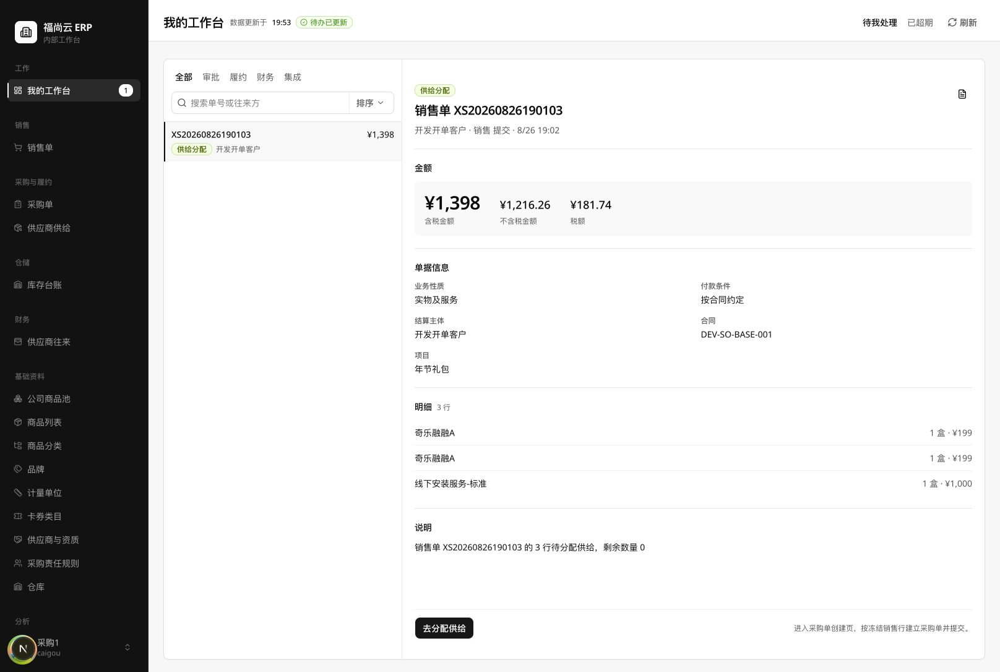
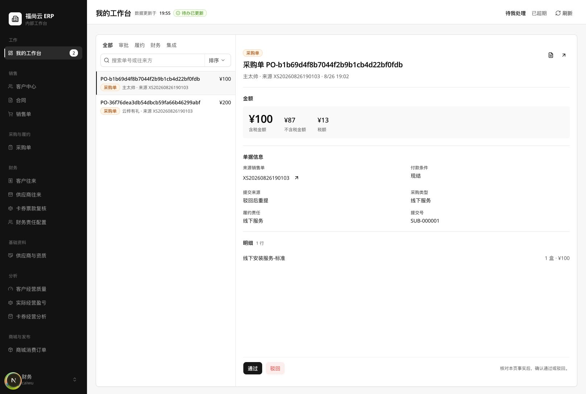
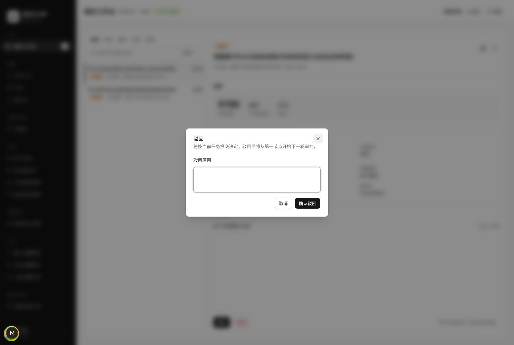
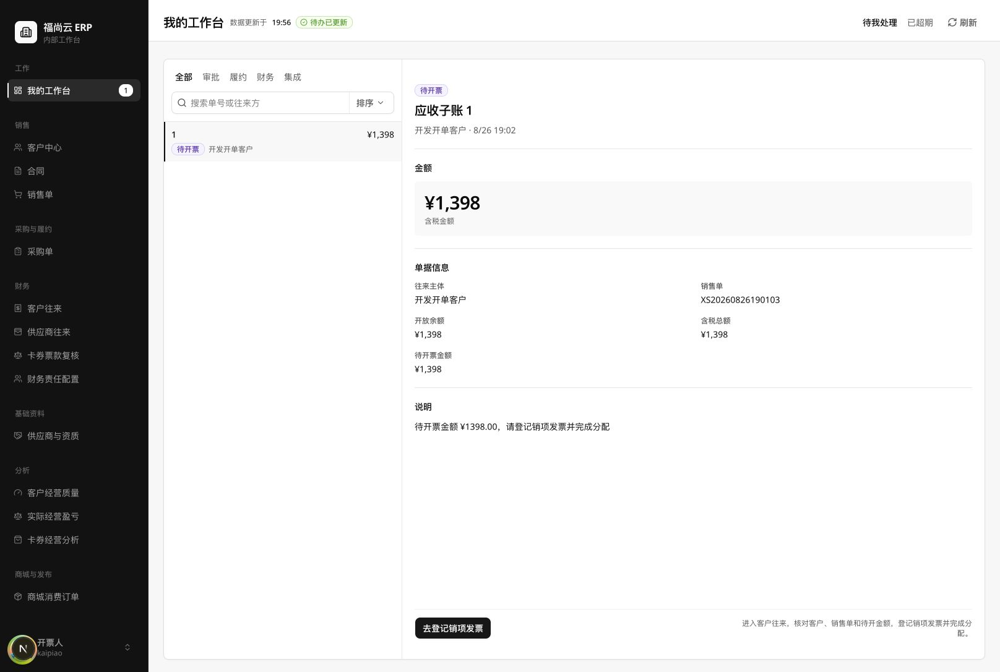
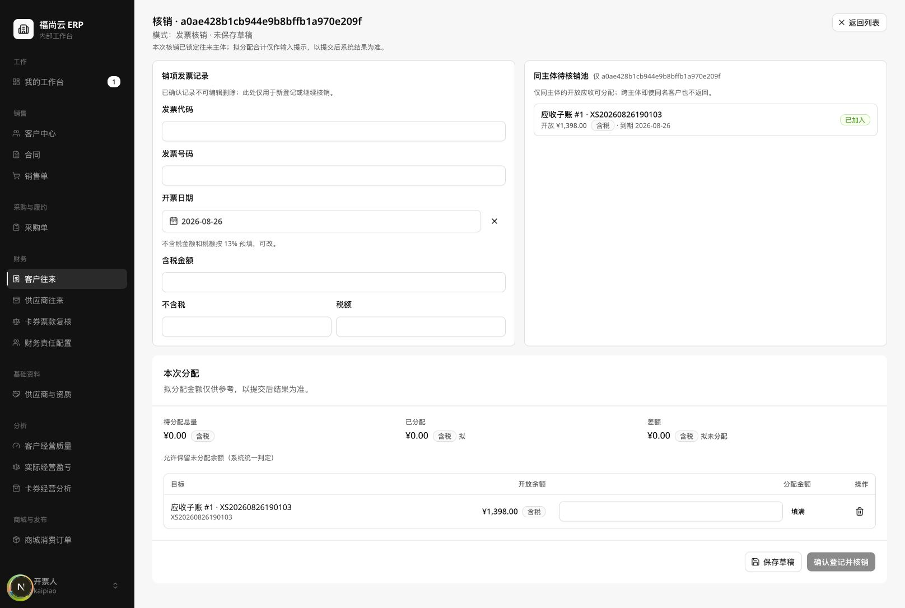

# 工作台页面体验审计与整改执行约定

> 生效规则：第 14 节为 2026-08-27 整改后的现行交付与上线验收合同；第 1—13 节保留为整改基线、问题证据和字段判定依据。两者冲突时，以第 14 节为准。

## 1. 审计结论

本工作台应继续采用“左侧待办队列、右侧对象作业面、移动端抽屉详情”的总体结构。该结构层级清楚、视觉克制、金额与主操作突出，桌面端已经具备较好的专业感。

当前版本不得判定为“数据足够、操作清晰”。整体结论如下：

| 审计项 | 结论 | 判定 |
| --- | --- | --- |
| 数据是否足够 | 仅销售单、采购单、应收开票三类当前样本具备基本上下文；变更、退款、冲正、库存、卡券、异常类普遍缺少决策证据 | 不足 |
| 布局是否好看 | 桌面端留白、层级、金额区和固定动作区表现良好；队列稀疏、长单号、移动端入口提示仍需收敛 | 较好 |
| 操作是否清晰 | “去分配供给”“去登记销项发票”“驳回原因”均清楚；“通过”一点即提交，属于高风险不清晰操作 | 不通过 |
| 响应式表现 | 390×844 下队列可用，点击任务后以右侧抽屉打开详情；任务行缺少明显的“可打开”提示 | 基本可用 |
| 可访问性 | 语义、标签、对话框标题和实时状态具备基础；选中态、目标尺寸、键盘与对比度仍需专项验证 | 中风险 |

## 2. 数据变更告知

审计期间点击采购审批的“通过”按钮以核验是否存在二次确认。页面未显示确认步骤，直接提交了审批。

- 涉及单据：`PO-b1b69d4f8b7044f2b9b1cb4d22bf0fdb`
- 涉及金额：¥100
- 涉及供应商：主太帅
- 可见结果：采购审批待办数量由 2 项变为 1 项
- 当前处理：未擅自回滚、未继续触发任何提交操作

该事实同时构成“高风险操作缺少确认”的直接证据。若需恢复该测试数据，必须由数据所有者明确授权后另行执行。

## 3. 审计范围与判定口径

审计对象包括后端正式注册的 20 类单据、18 类任务，以及前端工作台的任务类型、分组、详情展示、审批动作、目标页面衔接和移动端重排。

本报告采用以下判定：

- **足够**：当前信息能够支持用户识别对象、理解原因、判断影响并安全完成下一动作。
- **部分足够**：能够开始处理，但仍需打开对象页或依靠经验补齐关键判断证据。
- **不足**：缺少金额、差异、来源、对象、期限或错误证据，无法可靠判断。
- **不适用**：该单据按当前正式流程不产生工作台待办，不应强制出现在工作台。
- **不可用**：类型虽已注册或展示，但缺少授权简报关系、生产路径或安全处理合同。

当前运行数据在变更前共有 4 项待办，覆盖 3 类任务：供给分配 1 项、采购单审批 2 项、销项开票 1 项。变更后剩余 3 项。未出现运行样本的类型仅按当前代码合同判定，不作视觉完成度结论。

## 4. 截图步骤与健康度

### Step 1：桌面端供给分配 — 需整改

正向表现：对象、客户、金额、税额、付款条件、合同、项目和三行明细均在一个作业面展开；“去分配供给”位置明确。

必须整改：说明同时出现“3 行待分配供给”和“剩余数量 0”，但主按钮仍可执行。系统必须只保留一个权威剩余量口径；剩余量为 0 时任务必须自动关闭或禁用动作，并解释已完成原因。

### Step 2：桌面端采购审批 — 高风险

正向表现：供应商、来源销售单、含税/不含税/税额、付款条件、采购类型、履约责任、提交来源和明细结构清楚，金额层级突出。

必须整改：页面显示“驳回后重提”，但没有上次驳回原因和本次修改差异；审批人无法确认问题是否已经修正。采购单号采用超长原始标识，降低扫描效率并挤压布局。

### Step 3：采购驳回对话框 — 清晰但不一致

正向表现：对话框明确说明驳回结果、下一轮从首节点重新开始，并强制填写原因；标题、说明、输入区和主次按钮层级清楚。

必须整改：驳回有确认和原因，通过却一点即提交。通过与驳回必须采用一致的风险确认标准。

### Step 4：桌面端销项开票任务 — 基本可用

正向表现：客户、来源销售单、开放余额、含税总额和待开票金额足以支持进入登记；“去登记销项发票”的动作和结果方向清楚。

必须整改：任务只以“应收子账 1”识别，跨页面和跨人员沟通时识别力弱；三个相同金额重复占用空间。队列应优先展示客户、销售单号、待开金额和开票期限。

### Step 5：销项发票目标作业面 — 衔接顺畅但存在内部标识泄漏

正向表现：从工作台直接进入登记与核销作业面，目标应收已预先限制；发票号码、日期、含税/不含税/税额、分配和提交动作完整。

必须整改：标题“核销 · a0ae…”和“仅 a0ae…”把往来主体内部 ID 当作名称展示，违反用户可见标识要求。名称缺失时必须回退为“往来主体名称待补全”，并同时给出销售单号，不得回退内部 ID。

### Step 6：390×844 移动端队列 — 基本可用

正向表现：标题、范围切换、类型筛选、搜索、排序和任务行在窄屏下均未横向溢出。

必须整改：任务行虽然是按钮，但视觉上更像静态表格行。应增加右箭头、明确按压态或“查看详情”辅助提示，使用户能预期点击后打开抽屉。

### Step 7：390×844 移动端详情抽屉 — 可用但需收敛底部动作

正向表现：任务详情以全宽抽屉打开，阅读顺序与桌面端一致，关闭按钮明确，信息未发生横向截断。

必须整改：底部主按钮和说明在窄屏仍采用横排，信息密度偏高。应改为主按钮独占一行，下一步说明置于按钮上方或折叠为短句。截图左下角浮层为开发环境调试入口，不计入产品缺陷，但正式验收必须在无调试浮层环境复测。

## 5. 20 类单据的数据充分性

| 序号 | 单据 | 当前工作台关系 | 数据判定 | 必须补齐或保持的内容 |
| ---: | --- | --- | --- | --- |
| 1 | 销售单 | 通用审批、供给分配、导入确认 | 部分足够 | 保持客户、金额、税额、付款条件、合同、项目、明细；审批场景补毛利/价格异常、关键交期、当前节点和决策影响 |
| 2 | 卡券销售单 | 通用审批，复用销售单简报 | 不足 | 必须补面值、张数、有效期、发行/兑付主体、票款与开票规则；不得只复用实物销售信息 |
| 3 | 销售变更单 | 通用审批、履约影响复核、财务影响复核 | 不足 | 必须展示变更前后数量、金额、税额、交期、履约状态和已发生事实影响 |
| 4 | 采购单 | 通用审批、采购财务审核、应付付款来源 | 部分足够 | 保持供应商、来源销售单、金额三元组、付款、采购类型、明细；补上次驳回原因、重提差异、当前审批节点和短可读单号 |
| 5 | 采购变更单 | 通用审批 | 不足 | 必须展示原采购单、变更前后数量/价格/税额/交期/付款条件及对已收货、已付款的影响 |
| 6 | 采购收货单 | 履约处理，不走审批 | 部分足够，待运行验证 | 队列简报目前只有作业类型和来源采购单；嵌入作业面必须展示待收数量、已收数量、仓库、批次和差异 |
| 7 | 仓发单 | 履约处理，不走审批 | 部分足够，待运行验证 | 嵌入作业面必须展示销售单、客户、仓库、待发/已发数量、收货信息和库存阻断 |
| 8 | 电子交付单 | 履约处理，不走审批 | 部分足够，待运行验证 | 嵌入作业面必须展示交付对象、内容、账号/载体、交付时间和确认凭证 |
| 9 | 服务履约单 | 履约处理，不走审批 | 部分足够，待运行验证 | 嵌入作业面必须展示服务项目、对象、计划时间、负责人、完成证据和验收要求 |
| 10 | 客户验收单 | 当前无工作台任务关系，不走审批 | 不适用 | 不应伪装为待办；如未来需要人工确认，必须先定义责任人、动作和关闭条件 |
| 11 | 库存调整单 | 通用审批、库存调整复核 | 不足 | 当前明细只有“增加/减少 + 数量”；必须补商品/SKU、仓库、库位、调整前库存、调整后库存和原因证据 |
| 12 | 客户回款单 | 通用审批 | 部分足够 | 已有往来主体、金额、到账日、银行流水和待核销销售单；补付款方账户、收款账户和未分配余额 |
| 13 | 供应商付款单 | 通用审批 | 部分足够 | 已有供应商、金额、付款日、凭证和待核销笔数；补来源应付/采购单、收款账户掩码、付款方式和剩余应付 |
| 14 | 发票 | 不走审批；销项开票任务以应收子账为对象 | 部分足够 | 工作台需给出客户、销售单、待开金额、开票期限；登记页需给出发票抬头、税号、票种和开票约束 |
| 15 | 销售退货单 | 当前无工作台任务关系，不走审批 | 不适用 | 如退货执行另有责任任务，必须独立建模；不得借用通用审批标签 |
| 16 | 采购退货单 | 当前无工作台任务关系，不走审批 | 不适用 | 如退货执行另有责任任务，必须独立建模并给出待退数量、物流和退款关联 |
| 17 | 客户退款单 | 通用审批 | 不足 | 当前只有金额、原因、发生日；必须补客户、原回款/销售单、可退余额、退款账户和核销影响 |
| 18 | 供应商退款单 | 通用审批 | 不足 | 当前有供应商、金额、原因、发生日；必须补原付款/采购单、应付影响和退款账户/流水 |
| 19 | 回款冲正单 | 通用审批 | 不足 | 当前只有金额、原因、发生日；必须补原回款单、银行流水、已核销对象和冲正后的应收影响 |
| 20 | 付款冲正单 | 通用审批 | 不足 | 当前只有金额、原因、发生日；必须补原付款单、供应商、银行流水、已核销对象和冲正后的应付影响 |

## 6. 18 类任务的数据充分性

| 序号 | 任务类型 | 当前判定 | 必须补齐或保持的内容 |
| ---: | --- | --- | --- |
| 1 | `PROCUREMENT_ORDER_CREATION` 供给分配 | 不足 | 必须按销售行给出需求量、已占库存、已采购、缺口和剩余量；总剩余为 0 时不得继续处理 |
| 2 | `FULFILLMENT_OPERATION` 履约处理 | 部分足够，待运行验证 | 通用简报只有来源单号；实际嵌入作业面必须覆盖对象、数量、仓位/交付方式、证据和阻断原因 |
| 3 | `SUPPLIER_PAYMENT_EXECUTION` 供应商付款处理 | 部分足够 | 已有供应商、采购单、未付/已付、计划付款日；补付款账户、方式、审批来源和本次可付上限 |
| 4 | `SALES_INVOICE_EXECUTION` 销项开票处理 | 部分足够 | 已有客户、销售单、开放余额和待开金额；补开票期限、票种与抬头资格，并禁止内部主体 ID 回退上屏 |
| 5 | `PURCHASE_ORDER_REVIEW` 采购单财务审核 | 部分足够 | 信息结构较完整；必须补重提差异、上次驳回原因，并为“通过”增加确认 |
| 6 | `SALES_CHANGE_IMPACT_REVIEW` 销售变更履约影响复核 | 不足 | 必须展示履约前后差异、已发/已采/已交付事实和处理建议 |
| 7 | `SALES_CHANGE_FINANCE_REVIEW` 销售变更财务影响复核 | 不足 | 必须展示含税/不含税/税额、应收、已回款、已开票和调整差额 |
| 8 | `CARD_FUNDS_REVIEW` 卡券票款复核 | 不足 | 当前复用通用应收子账；必须给出卡券批次、面值、张数、到账、开票、兑付和差异 |
| 9 | `CARD_FUNDS_DELTA_REVIEW` 卡券票款差异复核 | 不足 | 必须给出差异前后、差异来源、金额、凭证和推荐处理，不得只展示开放余额 |
| 10 | `OWNERSHIP_MIGRATION_SALES_CONFIRMATION` 归属迁移销售确认 | 不可用 | 已有枚举和展示文案，但没有简报关系，岗位分离策略为失败关闭；正式启用前必须补生产者、对象关系、权限和处理合同 |
| 11 | `OWNERSHIP_MIGRATION_FINANCE_CONFIRMATION` 归属迁移财务确认 | 不可用 | 同上；不得作为已支持类型宣传或计入工作台覆盖率 |
| 12 | `INVENTORY_ADJUSTMENT_REVIEW` 库存调整复核 | 不足 | 必须补 SKU、仓库/库位、调整前后库存、成本影响和证据 |
| 13 | `FINANCE_CORRECTION_REVIEW` 财务纠错复核 | 不可用 | 已有枚举和文案但失败关闭，缺少简报关系和生产者；启用前必须完成正式合同 |
| 14 | `SUPPLIER_SETTLEMENT_REVIEW` 供应商结算复核 | 部分足够 | 已有期间、ERP 金额、供应商金额和差异；补差异分解、附件/对账证据和责任建议 |
| 15 | `IMPORT_BUSINESS_CONFIRMATION` 导入业务确认 | 不足且不一致 | 销售单子型可复用销售简报；旧导入批次只有标题；采购确认装载器已删除。必须拆分子型合同并清理已删除对象 |
| 16 | `INTEGRATION_RESULT_UNKNOWN` 集成结果未知 | 不足 | 当前多为通用标题；必须补外部单号、最后成功步骤、发生时间、错误摘要、重试记录和安全下一步 |
| 17 | `BUSINESS_EXCEPTION` 业务异常 | 不足 | 必须补异常对象、业务影响、错误摘要、负责人、可执行动作和关闭证据 |
| 18 | `DOCUMENT_APPROVAL` 单据审批 | 取决于单据，整体不足 | 销售单和采购单部分足够；变更、库存、退款、冲正类不足。所有通过动作必须统一进入确认步骤 |

`APPROVAL_INSTANCE` 仅是前端“我发起的审批”投影视图，不属于第 19 类任务，不得与待我处理的工作项混为一类。

## 7. 前后端任务合同漂移

前端 `TYPE_META` 声明 22 类展示类型，后端正式 `WorkItemType` 只有 18 类。以下 4 类不得继续按“已支持任务”保留：

| 前端类型 | 当前事实 | 执行要求 |
| --- | --- | --- |
| `PROCUREMENT_CONFIRMATION` | 后端采购二次确认装载器已删除并恒返回空 | 删除前端元数据及遗留路由，或重新建立完整后端合同；不得半保留 |
| `LOW_MARGIN_MANAGER_CONFIRMATION` | 不在后端正式任务枚举 | 若低毛利已并入单据审批，应删除旧类型；若仍独立，必须正式注册 |
| `CARD_SALES_MANAGER_APPROVAL` | 不在后端正式任务枚举，后端适配器把它视为旧类型 | 删除旧展示元数据，不得继续产生新任务 |
| `CARD_SALES_OPERATION_APPROVAL` | 不在后端正式任务枚举，后端适配器把它视为旧类型 | 删除旧展示元数据，不得继续产生新任务 |

另外，后端把供给分配归为“采购”，前端没有采购分组并将其归入“履约”；前端“集成”分组实际包含导入确认、数据治理和业务异常。分组名称必须与用户职责一致，推荐固定为：审批、采购、履约、财务、异常，并在每组显示数量。

## 8. 布局与视觉执行要求

### 8.1 应保持

- 保持桌面端主从布局，右侧详情继续承担“对象中心”职责。
- 保持金额为第一视觉层级，主金额使用大字号，税额和净额降级展示。
- 保持固定底部动作区和“下一步说明”，但说明必须短于两行。
- 保持白底、细边框、克制徽章色和当前间距体系，不新增装饰性卡片或渐变。
- 保持移动端任务详情使用抽屉，不把完整详情强塞进队列行。

### 8.2 必须调整

- 队列行必须增加截止时间、优先级或超期标识；没有截止时间时明确显示“未设截止时间”。
- “待我处理 / 已超期”和任务分组必须显示数量，不能只靠字重表达状态。
- 选中态除字重外必须增加可见下划线、左边线或背景变化；不得只依赖颜色。
- 超长采购单号必须改为面向人的短单号；内部主键只能作为路由键，不得承担识别任务。
- 队列不足 3 项时，右侧不应出现大片无意义空白；可保留固定列宽，但详情应承担更多高度或展示工作量摘要。
- 移动端任务行必须有可打开提示；详情底部主按钮独占一行，提示文字置于其上。

## 9. 操作与安全执行要求

### P0：发布前必须完成

1. **审批确认**：点击“通过”只能打开确认对话框，不能调用提交接口；对话框必须显示单据、金额、当前节点和结果影响；只有点击“确认通过”才允许提交一次。
2. **供给一致性**：任务总缺口、行缺口和按钮状态必须来自同一权威计算；剩余为 0 时任务自动关闭或显示“已完成”。
3. **内部 ID 隔离**：任何名称缺失都不得回退内部 ID；必须使用业务单号、名称待补全提示或明确空态。
4. **任务合同收口**：删除 4 个前端遗留类型；对 3 个失败关闭类型，在生产者、简报关系、权限和测试完整前保持不可见。

### P1：下一迭代必须完成

1. 为销售变更、采购变更增加前后差异表。
2. 为客户退款、供应商退款、回款冲正、付款冲正补原始资金单据和核销影响。
3. 为库存调整补 SKU、仓库、调整前后库存与成本影响。
4. 为卡券票款任务建立卡券专属简报，不再复用通用应收简报。
5. 为集成未知和业务异常补外部参考号、错误摘要、时间、重试证据和处理结果。
6. 统一前后端任务分组，并为范围与分组显示数量。

### P2：体验优化

1. 采购单采用短可读单号，完整技术标识仅用于复制或诊断区域。
2. 合并销项开票页重复金额，仅突出“待开票金额”，其余折叠到单据信息。
3. 增加任务选择、抽屉打开、审批提交成功后的焦点管理和屏幕阅读器状态播报。
4. 在 320、390、768、1024、1440 像素宽度完成响应式复测。

## 10. 可访问性验收条款

- 所有任务行、筛选、排序、关闭、查看和处理动作必须可用键盘到达，并显示可见焦点。
- 选中态、超期态和受阻态不得只使用颜色；必须同时提供文字或形状变化。
- 主要点击目标不得小于 24×24 CSS 像素；高频移动端动作推荐达到 44×44。
- 对话框打开后焦点必须进入标题或首个输入项；关闭后焦点返回触发按钮。
- 审批成功、失败、任务被移出队列等异步变化必须通过实时区域播报。
- 正文、次要文字、徽章和按钮必须完成实际色值对比度测试；截图不得作为 WCAG 合规证明。

## 11. 验收标准

工作台整改只有同时满足以下条件才可判定通过：

1. 18 类正式任务均具有明确状态：已支持、明确不启用或已删除；不得存在“前端可显示、后端无法形成安全简报”的中间态。
2. 每个启用任务均能回答：这是什么、为什么到我、何时完成、影响什么、下一步做什么。
3. 每个审批对象均能在工作台直接看到足以判断的关键事实；变更类必须提供前后差异，资金类必须提供原始单据和核销影响。
4. 所有会改变审批、付款、开票、库存或履约事实的动作均具有与风险相称的确认和结果反馈。
5. 桌面端和移动端均能完成任务选择、详情查看、返回、确认和错误恢复，不出现内部 ID、横向溢出或被遮挡的主操作。

## 12. 证据边界

- 视觉运行证据仅覆盖供给分配、采购单审批和销项开票 3 类任务；其余类型没有当前运行数据，结论来自正式枚举、简报关系和装载字段。
- 未执行完整键盘遍历、屏幕阅读器、200% 缩放、实际色值对比度、弱网、失败重试和并发冲突测试。
- 移动端仅验证 390×844；截图中的开发调试浮层不代表生产环境。
- 审计使用当前本地测试数据，不代表生产数据质量与任务分布。

## 13. 代码合同依据

- 正式 20 类单据：[`backend/entities/src/document_registry/business_document.rs`](../../backend/entities/src/document_registry/business_document.rs)
- 正式 18 类任务、简报关系和失败关闭策略：[`backend/entities/src/work_item/entity.rs`](../../backend/entities/src/work_item/entity.rs)
- 单据审批策略：[`backend/services/src/approval/policy.rs`](../../backend/services/src/approval/policy.rs)
- 销售单简报：[`backend/services/src/work_item/sales_order_brief.rs`](../../backend/services/src/work_item/sales_order_brief.rs)
- 采购单简报：[`backend/services/src/work_item/purchase_review_brief.rs`](../../backend/services/src/work_item/purchase_review_brief.rs)
- 变更单简报：[`backend/services/src/work_item/change_order_brief.rs`](../../backend/services/src/work_item/change_order_brief.rs)
- 资金单据简报：[`backend/services/src/work_item/funds_document_brief.rs`](../../backend/services/src/work_item/funds_document_brief.rs)
- 库存与结算简报：[`backend/services/src/work_item/inventory_settlement_brief.rs`](../../backend/services/src/work_item/inventory_settlement_brief.rs)
- 前端任务与单据展示元数据：[`erp-client/features/workspace/api/work-item-meta.ts`](../../erp-client/features/workspace/api/work-item-meta.ts)
- 工作台审批动作：[`erp-client/features/workspace/components/workspace-task-detail.tsx`](../../erp-client/features/workspace/components/workspace-task-detail.tsx)
- 审批动作栏：[`erp-client/features/approval-workflow/components/approval-action-bar.tsx`](../../erp-client/features/approval-workflow/components/approval-action-bar.tsx)
- 工作台响应式主从布局：[`erp-client/features/workspace/pages/workspace-home-page.tsx`](../../erp-client/features/workspace/pages/workspace-home-page.tsx)

## 14. 整改交付与上线验收合同（2026-08-27）

### 14.1 代码交付状态

下列事项已经形成代码合同，发布时不得删减：

| 级别 | 交付项 | 生效要求 |
| --- | --- | --- |
| P0 | 审批通过二次确认 | “通过”只能打开确认对话框；确认页必须显示单据、金额、当前节点、影响和结果；只有“确认通过”可提交 |
| P0 | 审批运行上下文 | 当前节点、轮次、处理人、最近驳回原因和流程版本必须由 BPM 执行事实批量提供；上下文缺失时移除通过/驳回动作并显示受阻原因 |
| P0 | 供给剩余量一致性 | 销售单正式化及后续生命周期变化必须在同一后端事务内同步采购任务；任务数量和可处理状态只认后端权威剩余量 |
| P0 | 内部 ID 隔离 | 往来主体和对象名称不得回退内部 ID；名称缺失时显示业务提示，内部 ID 只作路由键 |
| P0 | 任务合同收口 | 前端只保留 15 类可安全投影任务；3 类失败关闭任务继续隐藏；不得重新加入 4 类后端不存在的遗留类型 |
| P1 | 队列职责分组 | 固定采用审批、采购、履约、财务、异常五组；数量由后端授权后统计，前端在滚动发布期间允许字段缺失但不得伪造数量 |
| P1 | 变更差异 | 销售变更和采购变更按稳定行身份展示表头及行级前后差异；采购再次提交以前一次正式提交为基线，草稿不得作为基线 |
| P1 | 资金来源与影响 | 客户退款、供应商退款、回款冲正、付款冲正必须展示原资金单据、原金额、核销关联、证据和通过后的反向影响 |
| P1 | 卡券票款 | 必须展示有效期、面值结构、张数、成交/配赠、到账、待到账、已开票、待开票和复核证据；不得只显示通用应收余额 |
| P1 | 集成与业务异常 | 必须展示安全错误摘要、外部参考、发生时间、重试事实、两侧不可变证据和安全下一步；技术堆栈不得上屏 |
| P1 | 供应商结算 | 必须展示供应商、期间、外部账单版本、水位、双方金额、差异金额、待处理/已解决数量、逐项差异与证据；未解决差异存在时不得提示确认结算 |
| P1 | 销项开票上下文 | 必须展示客户、销售单、开票类型、税点、当前有效税务资料、应收最早到期日和待开票金额；应收到期日不得命名为开票截止日 |
| P2 | 工作台交互 | 队列显示数量、选中下划线、可见焦点、截止状态和打开箭头；移动端主操作独占一行，下一步说明置于操作上方；任务完成后播报结果，并在弹窗及抽屉完全关闭后聚焦下一条任务 |

### 14.2 18 类任务现行判定

| 任务类型 | 发布状态 | 当前数据判定 | 发布约束 |
| --- | --- | --- | --- |
| `PROCUREMENT_ORDER_CREATION` | 已支持 | 足够 | 权威剩余量为 0 时不得保留可处理动作 |
| `FULFILLMENT_OPERATION` | 已支持但需补合同 | 部分足够 | 各履约子型的数量、仓位/载体、完成证据和阻断事实必须在目标作业面验收 |
| `SUPPLIER_PAYMENT_EXECUTION` | 已支持但需补字段 | 部分足够 | 付款账户、付款方式、当前审批来源和本次可付上限未形成正式数据合同 |
| `SALES_INVOICE_EXECUTION` | 已支持但需补字段 | 部分足够 | 已补票种、税点、抬头税务资格和应收到期日；正式开票截止日仍无来源字段 |
| `PURCHASE_ORDER_REVIEW` | 已支持 | 足够，待真实重提样本验收 | 必须保留正式提交基线、前后差异、审批运行上下文和二次确认 |
| `SALES_CHANGE_IMPACT_REVIEW` | 已支持但需补聚合 | 部分足够 | 已有冻结版本差异；已采购、已发货、已交付等已发生事实影响仍需正式聚合 |
| `SALES_CHANGE_FINANCE_REVIEW` | 已支持但需补聚合 | 部分足够 | 已有金额税额差异；应收、回款、开票和退款的已执行影响仍需正式聚合 |
| `CARD_FUNDS_REVIEW` | 已支持 | 部分足够 | 已补卡券专属票款事实；发行主体、批次和兑付进度尚无完整合同 |
| `CARD_FUNDS_DELTA_REVIEW` | 已支持但需补差异源 | 部分足够 | 必须继续补差异前后值、差异来源和推荐处理结果 |
| `OWNERSHIP_MIGRATION_SALES_CONFIRMATION` | 不启用 | 不适用 | 继续失败关闭并从工作台隐藏，直至生产者、权限、简报和关闭条件齐备 |
| `OWNERSHIP_MIGRATION_FINANCE_CONFIRMATION` | 不启用 | 不适用 | 同上 |
| `INVENTORY_ADJUSTMENT_REVIEW` | 已支持但需补字段 | 部分足够 | 已补商品、SKU、仓库和证据；库位、调整前后库存及成本影响仍缺正式事实 |
| `FINANCE_CORRECTION_REVIEW` | 不启用 | 不适用 | 继续失败关闭并隐藏 |
| `SUPPLIER_SETTLEMENT_REVIEW` | 已支持 | 足够，待真实差异样本验收 | 未解决差异必须失败关闭，不得用汇总金额代替逐项证据 |
| `IMPORT_BUSINESS_CONFIRMATION` | 已支持但需分子型 | 部分足够 | 销售类可复用销售简报；其他导入子型必须补独立对象、差异和关闭合同 |
| `INTEGRATION_RESULT_UNKNOWN` | 已支持 | 足够，待真实错误样本验收 | 重试必须复用原幂等身份，错误内容必须脱敏 |
| `BUSINESS_EXCEPTION` | 已支持 | 足够，待真实异常样本验收 | 关闭前必须具备结果和证据，不得只填文字说明 |
| `DOCUMENT_APPROVAL` | 已支持 | 取决于单据 | 所有对象统一使用 BPM 上下文和二次确认；对象专属字段仍按 14.3 补齐 |

### 14.3 尚未完成的数据合同

以下字段不得由前端推断、拼接或以相近字段冒充，必须由对应业务 Service 形成正式事实后再判定“数据足够”：

1. 销项发票：正式开票截止日及其计算规则。
2. 供应商付款：付款账户掩码、付款方式、当前审批来源和本次可付上限。
3. 履约任务：收货、仓发、电子交付、服务履约四个子型的数量、位置/载体、完成证据和阻断原因。
4. 销售及采购变更：已采购、已收货、已发货、已交付、应收、应付、回款、付款和开票的已执行影响聚合。
5. 库存调整：库位、调整前库存、调整后库存和成本影响。
6. 客户及供应商退款：可退余额和退款目标账户；账户只允许显示脱敏值。
7. 卡券票款：发行主体、业务批次和兑付进度；差异复核需独立保存前后值和差异来源。
8. 导入确认：除销售类以外各导入子型的对象身份、字段差异、责任人和关闭条件。

### 14.4 发布顺序与运行验收

1. 发布必须先使审批确认版前端生效，并要求存量会话刷新；不得让旧前端继续提供一点即通过的入口。
2. 后端发布并重启后，必须确认 `approval_context`、`family_counts`、结算差异和新增简报字段已由新进程返回。
3. 生产前验收必须使用隔离测试单据，不得使用真实待审批单据执行点击验证；审批、付款、开票、库存和履约提交均需预置可回收测试数据。
4. 必须至少覆盖采购首次提交、采购驳回后重提、销售变更、采购变更、退款、冲正、库存调整、卡券票款、供应商结算差异、集成未知和业务异常真实样本。
5. 必须在 320、390、768、1024、1440 像素宽度完成任务选择、详情、对话框、提交反馈和返回焦点验收。
6. 必须完成键盘遍历、对话框焦点回归、屏幕阅读器播报、200% 缩放和实际色值对比度测试；完成前不得声明 WCAG 验收通过。

当前浏览器进程仍连接整改前启动的后端实例。现有浏览器证据只证明旧数据下的销项开票样本在 320、390、768、1024、1440 像素宽度没有布局回归，并完成移动端键盘开关抽屉与回焦；新增后端简报、审批运行上下文、分组统计及其他任务类型必须在后端重启后重新取证。

### 14.5 质量门禁

本次源码已满足以下静态及自动化门禁：

- 后端工作台单元测试：84 项通过。
- 后端全工作区测试：通过；依赖 `ERP_TEST_MONGO_URI` MongoDB 副本集的集成用例保持忽略，未计为运行验收。
- 后端 `cargo fmt --all --check`、全工作区全目标全特性 Clippy `-D warnings`、BPM 边界检查：通过。
- 前端 Vitest：23 个文件、87 项通过；Node 测试：57 项通过；TypeScript：通过；生产构建：通过。
- 前端 Lint：无错误；仓库既有可访问性警告仍存在，不得据此宣称可访问性完成。
- 本次直接修改的工作台、审批、应收展示文件定向格式检查：通过；全仓前端格式门禁仍受无关既有文件影响，不得将定向通过表述为全仓格式通过。
- 浏览器布局复测：320、390、768、1024、1440 像素宽度均无页面级横向溢出；320 像素下 Enter 可打开详情、Escape 可关闭详情，关闭后焦点返回原任务。该证据只覆盖销项开票样本，不替代其他任务和新后端字段的运行验收。
- `git diff --check`：通过。

### 14.6 交付判定

代码整改达到“可发布候选”状态，不得判定为“18 类任务数据全部足够”或“生产验收完成”。只有 14.3 的业务数据合同按需补齐、14.4 的新后端运行实例验收完成，并且实际样本未出现内部 ID、缺失动作上下文或误导性日期后，相关任务才可分别升级为“足够”。
