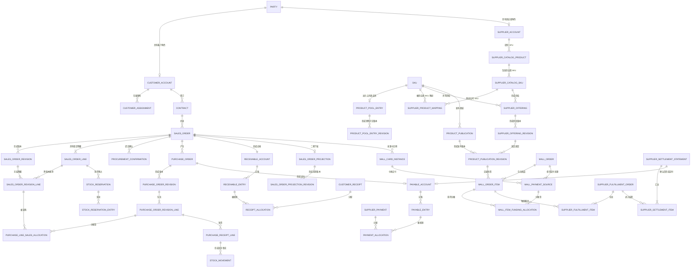

# 员工福利 ERP 两期统一数据模型

本文定义第一期与第二期共用的关系数据模型。模型以 `erp-phase-1.md` 和
`erp-phase-2.md` 的业务规则为依据，用于后续物理表、接口、页面和测试设计。

本文不绑定具体数据库产品，不包含特定数据库方言 DDL。

---

## 1. 设计结论

1. 两期只建设一套业务模型。Excel、API、手工录入统一进入供应商商品库；第二期在
   第一期稳定身份和正式事实之上增加 API 来源、商城执行投影、商城消费、供应商订单
   和结算，不复制客户、商品、销售单、应收或应付。
2. 卡券销售单与实物及服务销售单共用 `sales_order` 聚合。`business_type`
   表示卖什么，`owner_system` 表示谁有商业字段写权，两个维度不得合并。
3. `sales_order.owner_system` 保存当前值。第一期商城主责卡券单取 `MALL`，
   第二期迁移后改为 `ERP`；迁移历史只写
   `sales_order_owner_migration_item`，不再建立当前主责副表。
4. 业务基础资料采用“稳定身份 + 不可变修订”；正式单据采用“稳定单号 +
   不可变生效版本 + 结构化业务快照”。
5. 已发生的收付款、发票、出入库、消费、退款、余额恢复、成本和结算事实只追加，
   不删除、不覆盖。错误通过变更、退货、退款、冲正、红票、库存调整或差额记录纠正。
6. 应收、应付分别建子账，回款、付款和发票通过独立分配明细实现同一往来主体内的
   多对多核销。收付款核销与发票核销互不替代。
7. 库存以追加式库存流水为事实源，`stock_balance` 是事务内同步维护的当前余额。
   合格采购入库自动形成销售预占；可用库存不得为负。
8. 第二期商城只回流已经成功发生的关键事实，不复制商城的处理中状态。
   商城事件消息幂等与业务事实幂等分层处理。
9. 第二期商品发布版本固定绑定一条供应商供给修订。已支付订单保存发布版本、
   供应商和成本快照，后续商品或供给变化不得反写历史订单。
10. 不建立 `benefit_plan`、卡号、卡密、卡券激活、卡券绑定手机号、福利账户、
    多公司或多币种模型。卡券玩法规则继续由商城管理，不进入 ERP。
11. 当前两期均为单公司、单账套、人民币。旧商城表中的 `tenant_id` 不构成 ERP
    多租户依据；金额字段固定表达人民币，不增加无业务含义的公司或币种维度。
12. 正式事实与待发送消息使用同事务 outbox；工作台、经营分析和预警是可重建投影，
    不得反向改写正式事实。

---

## 2. 聚合边界

| 聚合 | 聚合根 | 内部对象 | 主要外部引用 |
| --- | --- | --- | --- |
| 业务伙伴 | `party` | 客户角色、供应商角色、联系人、地址、税务资料、银行账户、历史修订 | 用户、合同、销售单、采购单 |
| 客户归属 | `customer_assignment` | 主负责销售、协作销售、有效期 | 客户、用户、团队 |
| 供应商能力 | `supplier_capability` | 能力修订、适用区域、有效期 | 供应商、资质 |
| 供应商资质 | `supplier_qualification` | 资质修订、附件、适用能力 | 供应商能力 |
| 商品 | `product` / `sku` | 商品修订、SKU 修订、卡券类目扩展 | 公司商品池、供应商供给、发布版本 |
| 公司商品池 | `product_pool_entry` | 销售可见价、区域、交期、允许履约方式及历史修订 | 公司 SKU |
| 合同 | `contract` | 合同版本、附件、结算快照 | 客户、销售单 |
| 销售单 | `sales_order` | 生效版本、稳定明细、版本明细、审批、参与人 | 客户、合同、采购、应收 |
| 采购二次确认 | `procurement_confirmation` | 分行供货确认 | 销售单提交快照、供应商 |
| 销售变更 | `sales_change_order` | 变更内容、运营/采购影响确认、财务复核 | 原销售单版本 |
| 采购单 | `purchase_order` | 采购版本、采购明细、销售分配 | 销售单、供应商、应付 |
| 采购变更 | `purchase_change_order` | 变更内容、仓储影响确认、财务复核 | 原采购单版本 |
| 库存 | `stock_movement` | 当前余额、预占及预占流水 | 仓库、SKU、收发货单 |
| 履约 | 各类履约单据 | 入库、仓发、代发、电子交付、服务履约、验收 | 销售明细、采购明细 |
| 应收 | `receivable_account` | 应收分录、回款及核销、销项发票核销 | 销售单、客户 |
| 应付 | `payable_account` | 应付分录、付款及核销、进项发票核销 | 采购单/供应商结算单、供应商 |
| 退拒与纠错 | 对应处理单 | 退货、拒收、退款、冲正、红票、库存调整 | 原业务单据和原事实 |
| 一期商城销售同步 | `mall_sales_sync_job` | 水位、原始快照、映射差异 | 来源商城、统一销售单 |
| 供应商商品库 | `supplier_catalog_product` / `supplier_catalog_sku` | SPU/SKU 来源修订、映射、导入/同步批次 | 供应商、可选 API 连接、公司 SKU |
| 供应商供给 | `supplier_offering` | 不可变供给修订 | 公司 SKU、供应商 SKU |
| 商品发布 | `product_publication` | 不可变发布修订、商城投递 | SKU、供给修订、目标商城 |
| 销售执行投影 | `sales_order_projection` | 投影修订、投递和接收确认 | 销售单版本、目标商城 |
| 主责迁移 | `sales_order_owner_migration_batch` | 迁移项、最终基线确认 | 存量卡券销售单 |
| 商城消费 | `mall_order` | 商品明细、支付来源、明细分摊、关键事实 | 卡实例、发布版本、销售单 |
| 商城售后 | `mall_after_sales_request` | 取消/退款动作、结果事实、余额恢复 | 商城订单、供应商订单 |
| 供应商履约 | `supplier_fulfillment_order` | 子订单明细、动作、状态历史、退款事实 | 商城商品明细、固定供给 |
| 供应商结算 | `supplier_settlement_statement` | 结算明细、差异、确认 | 供应商订单、应付 |
| 集成治理 | `outbox_message` / `inbox_message` | 尝试、错误任务、对账批次和差异 | 所有跨系统聚合 |

聚合间只能通过稳定主键或明确的分配表关联。不得用名称、面额、手机号、
当前价格或来源表自增 ID 推断同一业务对象。

---

## 3. 跨期 ER 总览



图中第二期对象均引用第一期稳定身份。主责迁移不复制 `SALES_ORDER`，
历史消费回填也不复制 `MALL_ORDER` 或关键事实。

---

## 4. 公共数据约定

### 4.1 标识与编号

- `id`：ERP 内部稳定主键。主键值不承载公司、时间、来源或业务含义。
- `*_no`：可展示业务编号。编号一经形成正式事实不得复用。
- `source_system_id + object_type + external_id`：外部对象身份，统一写入
  `external_identity_map`。外部 ID 不直接作为 ERP 主键。
- `revision_no`：同一稳定对象内从 1 递增的版本号。
- `event_id`：消息投递身份；`business_fact_key`：跨实时与回填的业务事实身份。
  两者不得混用。

### 4.2 数值和时间

| 语义 | 逻辑类型 | 规则 |
| --- | --- | --- |
| 含税/不含税金额、税额 | 定点小数，2 位小数 | 人民币元；不得使用浮点数 |
| 单价 | 定点小数，最多 4 位小数 | 行金额计算后舍入到分 |
| 数量 | 定点小数，最多 6 位小数 | 统一使用 SKU 基础单位 |
| 卡张数 | 非负整数 | 卡券唯一明细专用 |
| 税率、配赠率 | 定点小数，最多 6 位小数 | 显式记录，不以百分号字符串保存 |
| 业务日期 | 日期 | 到期日、结算期间等只关心自然日的字段 |
| 业务时间 | 带统一时区语义的时间点 | 持久化统一时基，页面按业务时区展示 |
| 记录时间 | 时间点 | `recorded_at` 与业务发生时间 `occurred_at` 分开 |

金额规则：

1. 每行分别计算并舍入 `gross_amount`、`net_amount` 和 `tax_amount`；
2. 表头合计只汇总已经舍入的行金额；
3. 发票尾差写 `rounding_adjustment_amount` 和原因，不反改销售或采购单价；
4. 含税、不含税和税额必须满足同一行的舍入约束；
5. 收付款、合同、应收和应付使用含税金额；利润类指标使用不含税金额；
6. 进项税率与销项税率分别保存，禁止互相替代。

### 4.3 公共字段

稳定基础资料和可编辑草稿至少包含：

| 字段 | 说明 |
| --- | --- |
| `id` | 稳定主键 |
| `status` | 当前业务状态或启停状态 |
| `current_revision_id` | 当前生效修订；没有版本对象时省略 |
| `lock_version` | 乐观并发版本 |
| `created_at` / `created_by` | 创建时间和创建人 |
| `updated_at` / `updated_by` | 最后更新时间和更新人 |

不可变修订和正式事实至少包含：

| 字段 | 说明 |
| --- | --- |
| `id` | 事实主键 |
| `revision_no` 或 `fact_no` | 聚合内稳定序号 |
| `occurred_at` | 业务实际发生时间 |
| `recorded_at` | ERP 记录时间 |
| `recorded_by` | ERP 记录人或系统身份 |
| `source_type` | ERP、商城同步、历史回填、供应商回调或人工导入 |
| `source_reference` | 可追溯的来源单据或消息 |
| `reason_code` / `reason_text` | 变更、纠错或人工处理原因；适用时必填 |

### 4.4 版本与快照

- `party`、`supplier_capability`、`supplier_qualification`、`product`、`sku`、
  `product_pool_entry`、`warehouse` 使用稳定主表和不可变修订表。
- `sales_order` 和 `purchase_order` 保存当前状态与当前版本指针；生效内容写不可变
  `*_revision` 及结构化 `*_revision_line`。
- 正式单据版本保存当时的客户名称、合同编号、结算主体、税务、付款条件、
  商品名称、规格、单位和供应商名称等结构化快照。后续基础资料修改不改变历史单据。
- 原始外部报文可作为加密归档或规范化文本保存，但不得替代结构化业务字段。
- JSON 或其他半结构化字段仅用于原始报文、外部扩展属性和显示快照，
  不得保存核心金额、状态、主外键、核销关系或库存关系。

### 4.5 审计、敏感数据与软删除

1. 正式单据、正式版本、收付款、发票、库存流水、预占流水、商城事实、
   供应商事实和核销记录不设置业务软删除；使用作废、冲正或反向事实。
2. 已提交前且未形成任何正式事实的草稿允许逻辑删除，记录
   `deleted_at`、`deleted_by` 和原因；逻辑删除草稿不进入编号连续性、待办和经营统计。
3. 基础资料不以删除表示退出业务，使用 `DISABLED` 和有效期。已被历史单据引用的
   基础资料身份及修订永久保留。
4. `audit_event` 记录操作者、动作、对象、请求追踪号、时间和变更字段名。
   敏感字段只记录“已变更”和摘要，不记录完整旧值或新值。
5. 银行账号、联系人手机号、履约地址等敏感值加密保存；低熵敏感值的精确查询使用
   带密钥的规范化 HMAC 及密钥版本，禁止使用可离线枚举的裸摘要。
   页面是否展示完整值由权限决定，接口日志和操作日志始终不记录完整值。
6. ERP 不保存卡号、卡密、卡实例绑定手机号及其可逆映射。
7. 成功形成正式数据的导入文件经过文件安全检查、字段白名单和敏感内容清理后，
   成功白名单包、manifest、规则版本、成功结果及映射审计长期保留。失败合规包和
   行列诊断明细保留 30 天；失败批次元数据、汇总计数、脱敏错误码及操作审计长期
   保留。成功资产与失败诊断资产必须拆成不同 `file_asset`，不得混用保留期；导出文件
   保留 7 天。
8. 数据库连接头、主机地址、账号密钥、卡密、绑定验证答案及本模型范围外的商城玩法秘密
   不得进入长期导入归档。包含这些内容的原始 SQL 导出只能在受控临时区解析，
   生成白名单导入包后按安全策略销毁。

### 4.6 固定状态与配置化权限

- 单据状态机、关键事实类型和纠错类型是固定业务代码，不由管理员配置状态流转。
- 角色、用户、团队、权限和数据范围配置化。流程步骤可以绑定“销售领导”“运营”
  等责任角色，但不能把具体用户硬编码在业务表。
- 客户历史参与者查看权写入 `document_participant`，不依赖当前客户负责人反推。

---

## 5. 分域表目录

### 5.1 基础、权限与审计

| 表 | 阶段 | 用途 |
| --- | --- | --- |
| `source_system` | 一期 | 商城、ERP、供应商等来源系统 |
| `external_identity_map` / `external_identity_target` | 一期 | 外部身份及其到 ERP 规范对象的可审计谱系 |
| `business_document` | 一期 | 跨域单据稳定注册表，仅保存类型和编号，不承载业务字段 |
| `document_relation` | 一期 | 原单与变更、退货、退款、冲正、红票的关系 |
| `document_participant` | 一期 | 单据历史参与人及查看依据 |
| `workflow_action` | 一期 | 提交、审批、驳回、确认、完成等追加式动作 |
| `work_item` | 一期 | 正式待办及处理结果 |
| `bulk_selection_snapshot` / `bulk_selection_item` | 一期 | 批量预览时冻结目标、截止水位和逐项版本 |
| `background_job` / `background_job_item` | 一期 | 导入、导出、批量、同步等后台执行注册与逐项结果 |
| `audit_event` | 一期 | 安全审计和变更留痕 |
| `file_asset` / `document_attachment` | 一期 | 文件元数据、保留策略及业务关联 |
| `role` / `permission` / `user_role` / `data_scope` | 一期 | 配置化权限 |

`business_document` 是跨域关联注册表，不是万能单据表。销售、采购、库存、
资金和售后仍使用各自的强类型业务表，禁止以 EAV 代替领域表。

### 5.2 基础资料

| 表 | 阶段 | 用途 |
| --- | --- | --- |
| `party` / `party_revision` | 一期 | 企业主体稳定身份和历史名称资料 |
| `customer_account` | 一期 | 客户角色、客户编号和启停状态 |
| `supplier_account` | 一期 | 供应商角色、供应商编号和结算属性 |
| `party_contact` / `party_address` | 一期 | 联系人与地址，支持有效期 |
| `party_tax_profile` | 一期 | 税号及税务资料 |
| `party_bank_account` | 一期 | 加密银行账户及带密钥查询指纹 |
| `customer_assignment` | 一期 | 主负责销售与协作销售的有效期归属 |
| `supplier_commercial_profile_revision` | 一期 | 供应商结算方式、对账周期、付款条件、发票类型/税点及签约/付款主体历史 |
| `supplier_capability` / `supplier_capability_revision` | 一期 | 供应商能力与区域、有效期 |
| `supplier_qualification` / `supplier_qualification_revision` | 一期 | 供应商资质、合同、授权书、食品经营许可证和法人身份证等证照文档历史 |
| `supplier_qualification_capability` | 一期 | 资质适用能力 |
| `supplier_rating_revision` | 一期 | 供应商期初评分、评级和合作中评分历史 |
| `contract` / `contract_revision` | 一期 | 客户合同和不可变版本 |
| `product_category` / `product_brand` / `unit_of_measure` | 一期 | 商品分类、品牌和唯一基础单位字典 |
| `sku_attribute` / `sku_attribute_value` / `product_category_attribute` | 一期 | SKU 规格属性、值及分类适用关系 |
| `product` / `product_revision` / `product_revision_media` | 一期 | 商品 SPU 稳定身份、历史和版本化媒体 |
| `sku` / `sku_revision` | 一期 | 商品、虚拟商品、服务、卡券类目的销售项身份 |
| `sku_revision_attribute_value` | 一期 | SKU 修订的结构化规格取值 |
| `voucher_category_profile_revision` | 一期 | 卡券类目最小 ERP 扩展，不含玩法规则 |
| `product_pool_entry` / `product_pool_entry_revision` | 一期 | 采购维护的公司商品池 |
| `warehouse` / `warehouse_revision` | 一期 | 自有仓库基础资料 |
| `warehouse_sku_policy` | 一期 | 仓库级 SKU 最低可用量预警策略，不承载库存余额 |

### 5.3 一期业务单据、台账、供应商商品库与供给

| 表组 | 主要表 |
| --- | --- |
| 销售 | `sales_order`、`sales_order_line`、`sales_order_working_copy`、`sales_order_working_copy_line`、`sales_order_submission`、`sales_order_submission_line`、`sales_order_revision`、`sales_order_revision_line`、`sales_order_goods_service_line_revision`、`sales_order_voucher_line_revision` |
| 审批与变更 | `sales_order_review`、`procurement_confirmation`、`procurement_confirmation_line`、`sales_change_order`、`sales_change_submission`、`sales_change_submission_line`、`sales_change_review` |
| 采购 | `purchase_order`、`purchase_order_submission`、`purchase_order_submission_line`、`purchase_order_revision`、`purchase_order_revision_line`、`purchase_line_sales_allocation`、`purchase_change_order`、`purchase_change_submission`、`purchase_change_submission_line` |
| 履约 | `purchase_receipt`、`purchase_receipt_line`、`delivery`、`delivery_line`、`electronic_delivery`、`service_fulfillment`、`customer_acceptance`、`customer_acceptance_line`、`acceptance_fulfillment_allocation` |
| 库存 | `stock_movement`、`stock_balance`、`stock_reservation`、`stock_reservation_entry`、`stock_adjustment`、`stock_adjustment_line` |
| 往来 | `receivable_account`、`receivable_entry`、`receivable_funds_review`、`receivable_entry_offset`、`payable_account`、`payable_entry`、`payable_entry_offset`、`customer_receipt`、`receipt_allocation`、`supplier_payment`、`payment_allocation` |
| 发票 | `invoice`、`sales_invoice_allocation`、`purchase_invoice_allocation` |
| 成本 | `cost_entry`、`cost_allocation` |
| 退拒纠错 | `sales_return_case`、`sales_return_line`、`purchase_return_order`、`purchase_return_line`、`customer_refund`、`supplier_refund`、`receipt_reversal`、`payment_reversal` |
| 旧数据导入 | `legacy_import_batch`、`legacy_import_row` |
| 商城拉取 | `mall_sales_sync_job`、`mall_sales_sync_cursor`、`mall_sales_sync_cursor_tie`、`mall_sales_order_snapshot`、`mall_sales_reconciliation_job`、`mall_sales_reconciliation_item`、`master_mapping_task` |
| 供应商商品库 | `supplier_catalog_product`、`supplier_catalog_product_revision`、`supplier_catalog_product_revision_media`、`supplier_catalog_sku`、`supplier_catalog_sku_revision`、`supplier_product_mapping`、`supplier_catalog_intake_batch`、`supplier_catalog_intake_item` |
| 多供应商供给 | `supplier_offering`、`supplier_offering_revision` |

供应商商品库、供应商 SKU 映射和多供应商供给全部在第一期启用。第一期来源仅开放
`MANUAL` / `EXCEL`；API 连接、自动同步和 API 变化处理在第二期启用，但继续写入上述同一套
稳定身份、修订、映射与供给表，不建立 API 专属目录或第二套供给表。

### 5.4 二期扩展

| 表组 | 主要表 |
| --- | --- |
| 供应商 API | `supplier_api_connection`、`supplier_api_capability` |
| 商品发布 | `product_publication`、`product_publication_revision`、`product_publication_revision_media`、`product_publication_delivery` |
| 主责迁移 | `sales_order_owner_migration_batch`、`sales_order_owner_migration_item` |
| 执行投影 | `sales_order_projection`、`sales_order_projection_revision`、`sales_order_projection_delivery` |
| 卡实例与余额 | `mall_consumption_cutover`、`mall_consumption_cutover_check`、`mall_consumption_cutover_migration_batch`、`mall_card_instance`、`mall_card_instance_correction`、`mall_balance_snapshot` |
| 商城关键事实 | `mall_consumption_cutover`、`mall_order_fact`、`mall_order_cancel_fact`、`mall_order_completion_fact`、`mall_order`、`mall_order_item`、`mall_payment_source`、`mall_item_funding_allocation`、`mall_consumption_entry`、`mall_consumption_cost_assessment` |
| 商城售后 | `mall_after_sales_request`、`mall_after_sales_request_line`、`mall_refund`、`mall_refund_line`、`mall_refund_allocation`、`mall_balance_restoration`、`mall_balance_restoration_allocation` |
| 历史回填 | `mall_consumption_backfill_job`、`mall_consumption_backfill_item` |
| 供应商履约 | `supplier_fulfillment_order`、`supplier_fulfillment_item`、`supplier_order_action`、`supplier_order_action_line`、`supplier_order_status_history`、`supplier_refund_fact`、`supplier_refund_allocation` |
| 供应商结算 | `supplier_settlement_statement`、`supplier_settlement_item`、`supplier_settlement_difference` |
| 集成治理 | `outbox_message`、`inbox_message`、`integration_attempt`、`integration_error_task`、`reconciliation_job`、`reconciliation_difference`、`reconciliation_difference_resolution` |

---

## 6. 核心表字段字典与必需索引

字段表只列领域关键字段。第 4.3 节公共字段默认存在，不在每张表重复。

### 6.1 来源、单据注册与审计

#### `source_system`

| 字段 | 说明 |
| --- | --- |
| `code` | 稳定代码，如 ERP、目标商城或供应商连接所属系统 |
| `system_type` | `ERP`、`MALL`、`SUPPLIER` |
| `name` | 显示名称 |
| `status` | 启用/停用 |

必需约束与索引：

- `code` 唯一；
- `system_type + status` 查询索引。

#### `external_identity_map`

| 字段 | 说明 |
| --- | --- |
| `source_system_id` | 来源系统 |
| `object_type` | 客户、供应商、销售单、商品、SKU、卡券类目、商城用户等 |
| `external_id` | 来源稳定 ID 或单号原值 |
| `external_id_key` | 按该来源协议生成的二进制比较键；区分大小写且不受数据库默认排序规则影响 |
| `mapping_status` | 已映射、待确认、冲突、停用 |
| `mapped_at` / `mapped_by` | 映射时间和责任人 |

`external_identity_target`：

| 字段 | 说明 |
| --- | --- |
| `external_identity_map_id` | 来源稳定身份 |
| `internal_object_type` / `internal_object_id` | ERP 规范对象 |
| `relation_role` | `PRIMARY`、`COMPONENT`、`MERGED_INTO`、`REVISION_SOURCE` |
| `valid_from` / `valid_to` | 映射有效期 |
| `status` | 待确认、有效、失效、冲突 |
| `approved_at` / `approved_by` | 业务确认 |

必需约束与索引：

- `(source_system_id, object_type, external_id_key)` 唯一；
- `external_id_key` 使用规范化 UTF-8 字节或等价二进制列，不使用数据库默认的
  大小写不敏感排序规则；`external_id` 始终保留来源原值；
- 来源卡券销售单号只移除协议明确禁止的首尾空白，不做大小写折叠、Unicode
  兼容折叠或数值化；`ABC` 与 `abc` 是两个合法的不同来源身份；
- `(external_identity_map_id, internal_object_type, internal_object_id, relation_role, valid_from)` 唯一；
- `(internal_object_type, internal_object_id, status)` 反向谱系索引；
- 待确认和冲突状态索引。
- 客户、供应商、销售单等根业务身份同一时点只允许一个有效 `PRIMARY` 目标；
- 来源 SPU/SKU 拆成多个规范对象时使用多个 `COMPONENT` 目标；
- 多个来源对象合并为同一 ERP 对象时，各来源身份分别使用 `MERGED_INTO`；
- 来源版本追溯使用 `REVISION_SOURCE`，不得通过覆盖旧目标丢失映射历史；
- 业务关系必须引用目标表，不能只凭 `relation_role` 推断对象类型。

#### `business_document`

| 字段 | 说明 |
| --- | --- |
| `document_type` | 强类型业务表类型 |
| `document_no` | 全局可查询业务编号 |
| `formalized_at` | 首次成为正式事实的时间 |

必需约束与索引：

- `(document_type, document_no)` 唯一；
- `document_no` 全局搜索索引。
- 每张正式强类型单据表保存唯一 `document_id` 外键；注册表与强类型表一对一；
- 注册表不允许脱离强类型业务表单独创建“空单据”。

#### `document_relation`

| 字段 | 说明 |
| --- | --- |
| `from_document_id` | 变更、退货、退款、冲正或红票单 |
| `to_document_id` | 被纠正或被引用的原单 |
| `relation_type` | `CHANGES`、`RETURNS`、`REFUNDS`、`REVERSES`、`RED_OF`、`DERIVED_FROM` |

必需约束与索引：

- `(from_document_id, to_document_id, relation_type)` 唯一；
- `to_document_id + relation_type` 反向查询索引。

#### `workflow_action`

| 字段 | 说明 |
| --- | --- |
| `document_id` | 业务单据 |
| `action_type` | 提交、通过、驳回、确认、作废、完成等 |
| `from_status` / `to_status` | 状态变化 |
| `actor_id` / `actor_role` | 实际操作者和责任角色 |
| `comment` | 意见或驳回原因 |
| `subject_hash` | 审批所针对的内容指纹 |

必需约束与索引：

- `document_id + recorded_at` 历史索引；
- `actor_id + recorded_at` 审计索引；
- 审批通过记录的 `subject_hash` 必须等于当次提交快照指纹。

#### `work_item`

当前两期固定 `work_item_type` 至少包括：

`PROCUREMENT_CONFIRMATION`、`LOW_MARGIN_MANAGER_CONFIRMATION`、
`PURCHASE_ORDER_REVIEW`、`CARD_FUNDS_REVIEW`、
`CARD_FUNDS_DELTA_REVIEW`、`CARD_SALES_MANAGER_APPROVAL`、
`CARD_SALES_OPERATION_APPROVAL`、`OWNERSHIP_MIGRATION_SALES_CONFIRMATION`、
`OWNERSHIP_MIGRATION_FINANCE_CONFIRMATION`、`INVENTORY_ADJUSTMENT_REVIEW`、
`FINANCE_CORRECTION_REVIEW`、`SUPPLIER_SETTLEMENT_REVIEW`、
`INTEGRATION_RESULT_UNKNOWN` 和 `BUSINESS_EXCEPTION`。页面、接口和后台任务不得
临时创造同义代码。

| 字段 | 说明 |
| --- | --- |
| `work_item_type` | 采购确认、低毛利上级确认、审批、迁移确认、复核、异常等固定类型 |
| `business_object_type` / `business_object_id` | 任务对应的稳定业务对象 |
| `subject_version` / `subject_hash` | 任务针对的对象版本和内容指纹 |
| `status` | 待领取、待处理、处理中、已完成、已转交、已关闭 |
| `owner_role` / `owner_user_id` | 责任角色和当前责任人 |
| `priority` / `due_at` | 优先级和时限 |
| `reason_code` / `impact_summary` | 产生原因和业务影响 |
| `completion_action` | 该任务唯一允许的完成动作 |
| `claimed_by` / `claim_token_hash` | 原子领取人和不可逆租约令牌摘要 |
| `lease_expires_at` / `lease_version` | 领取租约及续期版本 |
| `completed_at` / `completed_by` | 正式完成审计 |
| `transferred_from_work_item_id` / `transferred_to_work_item_id` | 转交前后任务链 |
| `closed_reason_code` / `replacement_work_item_id` | 人工关闭原因及替代正式任务 |
| `closure_evidence_document_id` / `closure_evidence_reference` | 关闭所依据的正式单据或受控证据 |

必需约束与索引：

- 同一业务对象、任务类型和 `subject_hash` 同时最多一个有效任务；
- `owner_role + owner_user_id + status + due_at` 工作队列索引；
- 领取使用条件更新并返回租约令牌；已被有效租约领取的任务不能被另一用户同时处理；
- 正式处理同时校验领取人、租约、对象版本、内容指纹和岗位分离；
- 转交在同一事务把原任务标记为已转交、失效原租约并创建一个继承业务对象和
  `subject_hash` 的待领取后继任务；不得只改责任人而丢失转交历史；
- 审批、确认、结果未知和未完成补偿任务不得人工关闭；
- 只有重复、误派或已有替代正式任务时允许关闭，必须记录结构化原因和替代证据；
- 完成或关闭任务本身不修改正式业务事实；业务状态变化由对应强类型事务完成。

#### `bulk_selection_snapshot` 与 `bulk_selection_item`

`bulk_selection_snapshot`：

| 字段 | 说明 |
| --- | --- |
| `selection_type` | 导出、责任人分配、导入应用、映射、补拉等 |
| `filter_digest` / `sort_digest` | 预览时业务筛选与排序摘要 |
| `data_cutoff_at` | 选择范围的数据截止水位 |
| `item_count` | 冻结目标数 |
| `created_by` / `created_at` / `expires_at` | 创建与有效期 |
| `status` | 待确认、已确认、执行中、完成、失效 |

`bulk_selection_item`：

| 字段 | 说明 |
| --- | --- |
| `selection_snapshot_id` | 选择快照 |
| `object_type` / `object_id` | 目标稳定身份 |
| `expected_version` / `expected_hash` | 预览时版本和内容摘要 |
| `authorization_scope_digest` | 预览时责任域摘要，只用于审计，不替代执行时鉴权 |
| `result_status` / `result_code` | 成功、跳过、失败及原因 |

必需约束与索引：

- `(selection_snapshot_id, object_type, object_id)` 唯一；
- 快照确认后目标集合、截止水位和预期版本不可修改；
- 执行逐项重验当前权限、数据范围、状态和版本；预览后新增对象不自动纳入；
- 本结构只冻结普通批量作用域，不用于绕过正式审批或主责迁移的原子批次规则。

#### `background_job` 与 `background_job_item`

`background_job` 是后台任务中心的统一注册表。同步、回填、对账等领域任务仍使用各自
强类型表，本表只登记统一进度、发起人、输入输出和安全边界，不替代领域任务。

| 字段 | 说明 |
| --- | --- |
| `job_no` / `job_type` | 任务编号和导入、导出、批量、同步、回填、对账等固定类型 |
| `domain_job_type` / `domain_job_id` | 适用时关联强类型领域任务 |
| `selection_snapshot_id` | 批量或导出使用的不可变选择快照 |
| `requested_by` / `request_id` | 发起人和请求幂等身份 |
| `authorization_scope_digest` | 发起时权限范围摘要，只用于审计 |
| `input_file_asset_id` / `result_file_asset_id` | 合规输入包和结果文件 |
| `status` | 等待执行、执行中、部分成功、成功、失败、已取消 |
| `total_count` / `processed_count` / `success_count` / `skipped_count` / `failed_count` | 进度 |
| `started_at` / `finished_at` / `last_progress_at` | 执行时间 |
| `result_expires_at` | 结果下载到期时间 |
| `error_summary` | 脱敏任务级错误 |

`background_job_item`：

| 字段 | 说明 |
| --- | --- |
| `background_job_id` / `item_no` | 任务和稳定逐项序号 |
| `object_type` / `object_id` | 已有对象，可空 |
| `expected_version` / `expected_hash` | 执行前必须重验的预览版本 |
| `worksheet_name` / `source_row_no` / `source_column_name` | 导入错误定位，适用时保存 |
| `status` / `result_code` / `result_summary` | 成功、跳过、失败及脱敏原因 |
| `result_object_type` / `result_object_id` | 成功形成的对象 |

必需约束与索引：

- `job_no`、`request_id` 分别唯一；`(background_job_id, item_no)` 唯一；
- 普通任务允许逐项提交并显示部分成功；主责迁移批次不得使用本表的部分成功语义；
- 任务执行逐项重验当前权限、数据范围、状态和版本；发起时权限摘要不能替代当前鉴权；
- 导出必须保存选择快照、字段清单和遮罩规则；下载时再次校验当前用户对每类业务对象
  和敏感字段的权限，使用短时链接并记录下载审计；
- 导出结果保留 7 天。成功导入长期保留独立的成功白名单包、manifest、规则版本、
  成功结果和映射审计；失败合规包及行列诊断明细保留 30 天，失败任务元数据、汇总
  计数、脱敏错误码和操作审计长期保留。两类资产不得使用同一个 `file_asset_id`；
- 原始 SQL、数据库连接头和含禁止字段的商城导出只允许在隔离临时区处理，不得作为
  `input_file_asset_id` 或结果附件长期保存；
- 任务取消只停止尚未开始的项目；已经提交的正式事实不回滚、不删除。

#### `file_asset`

| 字段 | 说明 |
| --- | --- |
| `storage_object_key` | 加密受控对象存储中的不可猜测对象键 |
| `file_name` / `content_type` / `byte_size` | 展示元数据 |
| `content_hmac` / `hmac_key_version` | keyed HMAC 和密钥版本，不保存可被离线枚举的裸敏感摘要 |
| `security_scan_status` | 待扫描、通过、拒绝、隔离 |
| `sensitivity_class` / `retention_class` | 敏感级别和保留策略 |
| `expires_at` / `destroyed_at` | 到期和销毁审计 |
| `created_by` / `created_at` | 创建审计 |

只有安全检查通过且属于允许保留类别的文件才能关联正式业务对象。下载授权按当前业务
对象、当前角色和当前数据范围重验；对象存储地址、签名 URL 和密钥正文不得写业务日志。

### 6.2 业务伙伴、客户归属和供应商资料

#### `party` 与 `party_revision`

`party`：

| 字段 | 说明 |
| --- | --- |
| `party_no` | ERP 主体编号 |
| `party_kind` | 当前只使用企业组织 |
| `unified_credit_code` | 统一社会信用代码，允许历史数据为空 |
| `status` | 启用/停用 |
| `current_revision_id` | 当前生效版本 |

`party_revision`：

| 字段 | 说明 |
| --- | --- |
| `party_id` / `revision_no` | 稳定主体和版本 |
| `legal_name` / `short_name` | 法定名称和简称 |
| `effective_from` / `effective_to` | 生效区间 |
| `change_reason` | 变更原因 |

必需约束与索引：

- `party_no` 唯一；
- 非空统一信用代码规范化后唯一；
- `(party_id, revision_no)` 唯一；
- 同一主体的生效区间不得重叠；
- 法定名称和简称搜索索引。

#### `party_bank_account`

| 字段 | 说明 |
| --- | --- |
| `bank_account_no` | ERP 内部稳定账户编号 |
| `party_id` | 所属企业主体 |
| `account_name` / `bank_name` / `bank_branch_name` | 户名、银行及支行 |
| `account_number_ciphertext` / `encryption_key_version` | 账号密文和加密密钥版本 |
| `account_number_query_hmac` / `hmac_key_version` | 规范化账号的 keyed HMAC 和密钥版本 |
| `valid_from` / `valid_to` / `status` | 有效期和启停状态 |
| `is_default` | 是否为当前默认账户 |

必需约束与索引：

- `bank_account_no` 唯一；同一 HMAC 密钥版本下
  `(party_id, account_number_query_hmac, hmac_key_version)` 唯一；
- 查询和重复校验只能使用 keyed HMAC；密钥轮换期间同时计算新旧版本并完成后台迁移，
  不得回退为明文或裸哈希；
- 同一主体同一时点最多一个默认有效账户；历史单据保存使用时账户快照，不受后续停用
  或密钥轮换影响。

#### `customer_account`、`supplier_account`

| 字段 | 说明 |
| --- | --- |
| `party_id` | 共用企业主体 |
| `customer_no` / `supplier_no` | 对应角色编号 |
| `default_payment_term_id` | 默认客户付款条件或供应商结算条件 |
| `current_commercial_profile_revision_id` | 供应商当前商务结算版本；客户角色不适用 |
| `status` | 启用/停用 |

必需约束与索引：

- 一个 `party` 最多一个有效客户角色、一个有效供应商角色；
- 客户编号、供应商编号分别唯一；
- 停用角色仍可被历史单据引用。

#### `supplier_commercial_profile_revision`

| 字段 | 说明 |
| --- | --- |
| `supplier_id` / `revision_no` | 供应商及商务版本 |
| `settlement_mode` | 预付款、先用后付、现结等受控代码 |
| `reconciliation_cycle` | 日、周、月、季、年或无需周期对账 |
| `payment_term_snapshot` | 结构化付款条件 |
| `invoice_type` | 增值税专用发票、增值税普通发票、电子发票等受控代码 |
| `invoice_tax_rate` | 发票税点（如 13%） |
| `signing_entity_party_id` | 与我司签约的公司主体（内部 `party` 引用） |
| `payment_entity_party_id` | 付款时的公司主体（内部 `party` 引用） |
| `valid_from` / `valid_to` | 生效区间 |
| `change_reason` | 变更原因 |

必需约束与索引：

- `(supplier_id, revision_no)` 唯一；
- 同一供应商商务版本有效期不得重叠；
- `supplier_id + valid_from + valid_to` 历史查询索引；
- 采购单和供应商结算单保存使用时的商务版本及结构化快照；
- 旧系统预付款余额、授信余额和累计统计不写本表，必须有独立基准余额确认才能迁移。

#### `customer_assignment`

| 字段 | 说明 |
| --- | --- |
| `customer_id` | 客户角色 |
| `user_id` | 销售人员 |
| `assignment_role` | `OWNER` 或 `COLLABORATOR` |
| `valid_from` / `valid_to` | 归属有效期 |
| `change_reason` | 调整原因 |

必需约束与索引：

- 同一客户同一时点恰好一个 `OWNER`；
- 同一客户、用户、角色的有效期不得重叠；
- `user_id + valid_to` 用于“我的客户”查询；
- 新单据把当时负责人和协作销售写入 `document_participant`；
- 负责人变化后只影响新增单据权限，不删除历史参与权。

#### `supplier_capability` 与 `supplier_capability_revision`

| 字段 | 说明 |
| --- | --- |
| `supplier_id` | 供应商角色 |
| `capability_code` | 实物、虚拟、线下服务、API、印刷 |
| `revision_no` | 能力版本 |
| `service_region` | 服务区域结构化引用 |
| `owner_user_id` | 负责人 |
| `fulfillment_note` | 履约说明 |
| `valid_from` / `valid_to` | 有效期 |
| `status` | 启用/停用 |

必需约束与索引：

- `(supplier_id, capability_code, revision_no)` 唯一；
- 同一能力的有效区间不得重叠；
- `capability_code + status + valid_to` 用于选品和到期预警。

#### `supplier_qualification` 与修订

| 字段 | 说明 |
| --- | --- |
| `supplier_id` | 供应商 |
| `qualification_type` | 资质类型：资质证照、合同、授权书、食品经营许可证、法人身份证等 |
| `certificate_no` | 证书编号；合同 / 授权书使用合同编号或授权编号 |
| `issuer` | 发证机构 |
| `valid_from` / `valid_to` | 生效、失效日期 |
| `attachment_id` | 资质附件；合同文件、授权书文件等文档附件 |
| `status` | 有效、失效、停用 |

必需约束与索引：

- 供应商、资质类型、证书编号组合唯一；
- `valid_to + status` 到期预警索引；
- `supplier_qualification_capability` 明确适用能力；
- 新建公司商品池、采购单和供给关系时必须校验适用能力存在有效资质；
- 合同、授权书、食品经营许可证和法人身份证以受控 `qualification_type` 表达，附件走受控下载并记录访问审计。

#### `supplier_rating_revision`

| 字段 | 说明 |
| --- | --- |
| `supplier_id` / `revision_no` | 供应商及评估版本 |
| `initial_score` | 合作期初评分（合作开始时记录） |
| `rating` | 供应商评级（A–D 级） |
| `current_score` | 合作中评分（随合作过程定期更新） |
| `valid_from` / `valid_to` | 生效区间 |
| `change_reason` | 变更原因 |

必需约束与索引：

- `(supplier_id, revision_no)` 唯一；
- 同一供应商评估版本有效期不得重叠；
- 期初评分只在首次合作版本填写；合作中评分与评级按周期追加新版本，不原位覆盖。

### 6.3 商品、SKU、卡券类目与公司商品池

#### 商品分类、品牌、单位与规格字典

`product_category`：

| 字段 | 说明 |
| --- | --- |
| `category_code` | 稳定分类代码 |
| `parent_category_id` | 父分类，可空（空表示根分类） |
| `name` | 分类名称 |
| `product_kind` | 分类允许的实物、虚拟、服务或卡券类型；只用于兼容性校验和筛选，不是公司商品类型的事实来源 |
| `status` | 启用/停用 |

W14 以**树形维护页**管理分类：父子关系不得成环；停用后仍可被历史 SKU 修订引用，新建/选品 Combobox 仅返回当前启用节点并展示根到叶路径。

`product_brand`：

| 字段 | 说明 |
| --- | --- |
| `brand_code` | 稳定品牌代码 |
| `name` | 品牌名称 |
| `status` | 启用/停用 |

`unit_of_measure`：

| 字段 | 说明 |
| --- | --- |
| `unit_code` | 稳定单位代码 |
| `name` / `symbol` | 名称和符号 |
| `quantity_scale` | 允许数量小数位 |
| `status` | 启用/停用 |

`sku_attribute` 与 `sku_attribute_value`：

| 字段 | 说明 |
| --- | --- |
| `attribute_code` / `name` | 属性代码和名称 |
| `value_type` | 当前用于受控枚举或规范文本 |
| `value_code` / `display_value` | 属性值代码和展示值 |
| `sort_order` | 仅影响展示，不参与身份 |
| `status` | 启用/停用 |

必需约束与索引：

- 分类代码、品牌代码、单位代码、属性代码分别唯一；
- 同一属性下 `value_code` 唯一；
- 分类父子关系不得形成环；
- `product_category_attribute(category_id, attribute_id, required_flag, sort_order)`
  保存多对多适用关系，组合唯一；
- 停用字典值仍可被历史 SKU 修订引用；
- 当前两期一个 SKU 只有一个基础单位，不建设单位换算表；
- SKU 使用属性必须适用于其商品分类；
- 名称可变时通过显示修订或审计留痕，稳定代码不得复用。

#### `product`、`product_revision`、`sku`、`sku_revision`

`product` 保存 SPU 稳定身份；`sku` 保存真正被销售、采购、库存和发布引用的稳定销售项。

| 字段 | 所属表 | 说明 |
| --- | --- | --- |
| `product_no` | `product` | 商品编号 |
| `product_kind` | `product` | 必填的独立稳定业务属性：`PHYSICAL`、`VIRTUAL`、`OFFLINE_SERVICE`、`VOUCHER`；决定商品业务作用，创建后不可变 |
| `current_revision_id` | 两者 | 当前版本 |
| `sku_no` | `sku` | SKU 编号 |
| `product_id` | `sku` | 所属 SPU |
| `base_unit_id` | `sku` | 唯一基础单位 |
| `specification_signature` | `sku` | 规范化规格签名，创建后不可变 |
| `name` / `description` / `specification` | 修订表 | 公司审核后的名称、描述、规格或服务内容 |
| `category_id` / `brand_id` | 修订表 | ERP 分类和品牌 |
| `barcode` | `sku_revision` | 条码原值；冲突时进入人工差异，不据此自动合并 SKU |
| `weight_kg` / `volume_m3` | `sku_revision` | 定点数物流属性，单位固定为千克和立方米 |
| `market_price` | `sku_revision` | 市场展示参考价；非正式发布价 |
| `status` | 稳定表/修订表 | 启用、停用 |
| `effective_from` / `effective_to` | 修订表 | 生效区间 |

`sku_no` 对应采购「产品编码」：系统按规格组合默认生成，允许业务手动覆盖；仍须全局唯一。

W14 不维护默认供应商，也不在 `product_revision` / `sku_revision` 中保存一件代发或集采价格。供应商、一件代发/集采两项供给价、快递、进项税率、费用、集采起订量、区域、能力和有效期全部由 W21 的 `supplier_offering` 及其不可变修订维护；系统不设置 `supply_mode`，每条供给默认同时支持一件代发与集采。W14 仅按稳定 `sku_id` 提供关联摘要和进入 W21 的链接。这样同一 SKU 才能同时拥有多个供应商商品及多条独立供给，不会被 SKU 上的一组字段覆盖。W14 SKU 表格中的“销售可见价”是 `product_pool_entry_revision` 的编辑投影，命令处理器必须拆分写入商品池修订，不得复制到 `sku_revision`。

食品产品有效期、生产批次不进入 `product` / `sku` 主数据（批次事实走入库/库存域，本期不做）。

必需约束与索引：

- `product_no`、`sku_no` 分别唯一；
- `product.product_kind` 必须由创建命令显式提交并永久保持不变，不得根据 `category_id`
  自动派生或随分类修订变化；分类的 `product_kind` 仅校验所选分类是否允许该商品类型；
- `(product_id, specification_signature)` 唯一；
- `(product_id, revision_no)`、`(sku_id, revision_no)` 唯一；
- 已被正式单据使用的 SKU 不得修改基础单位；停用旧 SKU 后新建；
- 规格签名按属性代码、属性值代码排序后的规范化序列计算，不受显示顺序、名称或
  旧系统 JSON 字段顺序影响；
- 无规格 SKU 使用固定空规格签名，确保同一 SPU 最多一个无规格 SKU；
- 规格属性变化代表另一个 SKU，不得通过修改同一 SKU 修订改变身份；
- SKU 名称、规格、类型和状态搜索索引；
- 非空条码使用规范化精确查询索引；同一条码出现多个在用 SKU 时阻断正式启用并转人工，
  不把来源条码当内部稳定身份；
- `weight_kg`、`volume_m3` 必须使用定点小数且非负，禁止把旧 `double` 原样复制；
- 公司商品池价格、正式商城销售价、供应商供给字段、库存、销量、利润标记不写入 `product` 或 `sku` 当前主表；`market_price` 仅为展示参考，不替代 W21 供给成本、商品池销售可见价或 W22 渠道发布价。
- 普通 W14 建品可按其场景规则决定市场价是否暂缺；但
  `CreateCompanySkuAndPromoteSupplierCatalogSku` 表示立即创建并入池，因此
  `market_price` 与商品池 `sales_visible_price_gross` 均必填、均为非负定点金额，且不得
  从来源底价、正式供给价或彼此自动计算。
- W14 商品与 SKU 表单的基础单位、分类、品牌必须分别引用 `unit_of_measure`、`product_category`、`product_brand` 的启用字典项（下拉），不得自由文本冒充字典身份。

`product_revision_media`（SPU 级媒体）与 SKU 主图：

| 字段 | 说明 |
| --- | --- |
| `product_revision_id` / `file_asset_id` | 商品（SPU）版本和合规媒体文件 |
| `media_role` | **轮播图**、**详情图**、附件等受控用途（**主图不在 SPU**） |
| `sort_order` | 版本内展示顺序 |
| `alt_text` | 无障碍替代文本 |

`(product_revision_id, media_role, sort_order)` 唯一。轮播图与详情图允许为空且支持多张。  
**主图归属 `sku_revision`（单张）**，随 SKU 维护。媒体变化形成新的商品/SKU 修订；外部 URL
只能先安全抓取并形成 `file_asset`，不得把短期签名 URL 作为长期业务值。

`specification_signature` 由规格属性组合系统派生，创建后不可变；**业务 UI 不展示、不手填「规格标识」**。

卡券类目使用 `product_kind = VOUCHER` 的 SKU 身份。
`voucher_category_profile_revision` 只保存 ERP 必需的卡券类目描述和启停信息，
不保存限额、限购、绑定验证、补差限制、充值、过期展示等商城玩法。

#### `sku_revision_attribute_value`

| 字段 | 说明 |
| --- | --- |
| `sku_revision_id` | SKU 修订 |
| `sku_attribute_id` / `sku_attribute_value_id` | 规格属性和值 |
| `normalized_text_value` | 规范文本属性值；使用枚举值时为空 |
| `identity_position` | 规范化排序位置 |

必需约束与索引：

- `(sku_revision_id, sku_attribute_id)` 唯一；
- 枚举值必须属于对应属性；枚举值与文本值只能使用一种；
- 一个稳定 SKU 的所有修订必须计算出相同 `specification_signature`；
- `(sku_attribute_value_id, sku_revision_id)` 反向查询索引；
- 旧 `properties` 无法解析、属性重复或值不存在时进入导入差异，不把原 JSON
  直接写成正式规格关系。

#### `product_pool_entry` 与 `product_pool_entry_revision`

`product_pool_entry` 是公司 SKU 面向销售选品的稳定身份。一个公司 SKU 最多有一个
商品池条目，但可以有多条供应商供给。商品池不得保存“默认/参考供应商”或成本。

| 字段 | 说明 |
| --- | --- |
| `sku_id` | 对应正式销售项 |
| `current_revision_id` | 当前商品池修订 |
| `sales_visible_price_gross` | 采购发布给销售的含税价格；与供应商成本独立 |
| `service_region` | 可供区域 |
| `expected_lead_time` | 预计交期 |
| `allowed_fulfillment_modes` | 通过关联明细保存允许模式 |
| `valid_from` / `valid_to` | 可销售有效期 |
| `status` | 启用/停用 |

必需约束与索引：

- `sku_id` 唯一；
- `(product_pool_entry_id, revision_no)` 唯一；
- `sku_id + status + valid_to` 选品索引；
- 销售提交时引用具体 `product_pool_entry_revision_id`，不能只引用当前主表；
- 销售提交时必须再次校验启用状态、有效期和允许履约方式。
- `sales_visible_price_gross >= 0`；不得从最低采购成本实时计算或自动覆盖。
- 可用供应商数量、最低/最高成本只允许从有效 `supplier_offering_revision` 聚合；
  其中成本聚合仅返回给有成本字段权限的采购/财务角色，不能固化回商品池。
- W21 的 `KEEP_EXISTING` 必须复用当前 `product_pool_entry_revision_id`；只有显式
  `SET_PRICE` 且 `expected_pool_entry_revision_id` 命中当前版本时才追加商品池修订。

#### `warehouse`、`warehouse_revision` 与 `warehouse_sku_policy`

`warehouse` 保存自有仓稳定身份和 `current_revision_id`：

| 字段 | 说明 |
| --- | --- |
| `warehouse_code` | ERP 仓库稳定代码 |
| `status` | 启用、停用 |
| `current_revision_id` | 当前修订 |

`warehouse_revision` 保存 `warehouse_id`、`revision_no`、仓库名称、加密地址和联系人、
有效期及变更原因。`warehouse_code` 唯一，`(warehouse_id, revision_no)` 唯一，同一仓库
有效期不得重叠；停用仓库仍保留历史流水，且有库存或有效预占时不得停用。

`warehouse_sku_policy`：

| 字段 | 说明 |
| --- | --- |
| `warehouse_id` / `sku_id` | 仓库与 SKU |
| `minimum_available_quantity` | 最低可用量预警阈值，定点数且非负 |
| `status` | 启用、停用 |
| `effective_from` / `effective_to` | 策略有效期 |

同一仓库和 SKU 的启用区间不得重叠。该表只生成预警，不是库存事实，不得写
`on_hand`、`reserved` 或商城缓存库存。旧 `product_sku.stock_warning` 只有在仓库、
SKU 和数量单位均经业务确认后才能成为本策略；否则仅留在暂存差异。

### 6.4 合同与统一销售单

#### `contract` 与 `contract_revision`

| 字段 | 说明 |
| --- | --- |
| `contract_no` | 合同编号 |
| `customer_id` | 客户 |
| `status` | 生效、终止、到期；ERP 不产生空合同草稿 |
| `current_revision_id` | 当前合同版本 |
| `revision_no` | 合同版本 |
| `contract_pdf_file_id` | 本版本已签署合同 PDF；每个版本恰好一份正文 PDF |
| `archive_source` | `CONTRACT_CENTER` 或 `SALES_ORDER_CREATE` |
| `settlement_party_id` | 结算主体 |
| `payment_term_snapshot` | 结构化付款条件快照 |
| `invoice_requirement_snapshot` | 结构化开票要求快照 |
| `valid_from` / `valid_to` | 合同有效期 |
| `signed_at` | 签订日期 |

必需约束与索引：

- `contract_no` 唯一；
- `(contract_id, revision_no)` 唯一；
- `customer_id + status + valid_to` 查询索引；
- 合同只能通过上传已签署 PDF 归档，不提供正文新建、编辑、空草稿或提交生效；
- PDF 扩展名、MIME、内容签名、20 MB 上限和安全扫描由服务端复验，正式版本不得关联非 PDF 正文；
- 合同上传（W04 或 W05 建单页共用 Dialog）独立形成合同身份、首个不可变版本与 PDF 关联；W05 建单命令只引用已有 `contract_id` + `contract_revision_id`，不再内嵌随单上传；
- 销售单保存具体 `contract_revision_id` 和关键结构化快照；
- 一个合同允许关联多张销售单。

#### `sales_order`

| 字段 | 说明 |
| --- | --- |
| `order_no` | 两期统一销售单号；一期商城来源单不另立一张业务副本 |
| `business_type` | `VOUCHER` 或 `GOODS_SERVICE`，创建后永久不变 |
| `origin_system` | 最初创建入口：商城或 ERP |
| `owner_system` | 当前商业字段主责：`MALL` 或 `ERP` |
| `source_identity_id` | 一期商城来源键映射；ERP 新建单可空 |
| `customer_id` | 客户稳定身份 |
| `contract_id` | 合同稳定身份 |
| `settlement_party_id` | 结算主体 |
| `commercial_status` | 草稿、审核中、已生效、已作废 |
| `review_status` | 未提交、待采购确认、待低毛利上级确认、待销售领导、待运营、已通过、已驳回 |
| `fulfillment_progress` | 未开始、部分履约、已完成 |
| `collection_progress` | 未收、部分回款、已结清 |
| `invoice_progress` | 未开、部分开票、已完成 |
| `close_status` | 未满足关闭、可关闭、已关闭 |
| `source_status_code` | 一期商城原始状态，只用于追溯 |
| `current_revision_id` | 当前生效版本 |
| `effective_at` / `closed_at` | 生效、ERP 关闭时间 |
| `lock_version` | 并发控制 |

必需约束与索引：

- `order_no` 按二进制比较语义唯一；一期来源单号保留来源大小写，不受数据库默认排序规则影响；
- 一期来源单的 `(source_system_id, external_order_no)` 通过
  `external_identity_map` 唯一且不得复用；
- `business_type` 不允许更新；
- `owner_system` 只允许商城主责存量卡券单在第二期迁移时从 `MALL` 变为 `ERP`
  一次，其他方向和第二次变化均拒绝；
- `customer_id + commercial_status + created_at`、负责人参与人 + 状态、
  履约期限、应收进度分别建立业务查询索引；
- 卡券销售单和实物及服务销售单必须使用本表，不得增加平行销售单主表。

`source_status_code` 与 ERP 状态必须分开。第一期卡券单由商城推进商业状态，
但 ERP 是否关闭仍按“履约期限到期且应收结清”判断，不能用一个 `status`
同时表达两个事实。

#### `sales_order_line`

| 字段 | 说明 |
| --- | --- |
| `sales_order_id` | 所属销售单 |
| `line_no` | 单内稳定行号 |
| `line_status` | 有效、被后续版本移除 |

必需约束与索引：

- `(sales_order_id, line_no)` 唯一；
- 卡券销售单在整个生命周期内恰好一个稳定明细身份；
- 实物及服务销售单的变更可以新增或停用稳定明细，但不复用历史行号。

#### `sales_order_revision`

| 字段 | 说明 |
| --- | --- |
| `sales_order_id` / `revision_no` | 销售单及版本 |
| `revision_source` | `MALL_SYNC`、`ERP_APPROVAL`、`SALES_CHANGE` |
| `source_snapshot_id` | 一期商城快照，ERP 版本可空 |
| `previous_revision_id` | 前一生效版本 |
| `content_hash` | 本版全部商业字段的规范化指纹 |
| `customer_revision_id` / `contract_revision_id` | 生效时基础资料版本 |
| `customer_snapshot` / `contract_snapshot` | 结构化显示快照 |
| `settlement_party_snapshot` | 结算主体快照 |
| `payment_term_snapshot` | 付款条件快照 |
| `invoice_requirement_snapshot` | 开票要求快照 |
| `project_name` | 客户项目名称；一期来源 `entry_name` 的正式落点 |
| `business_remark` | 对客户交易有意义的业务备注 |
| `voucher_category_sku_id` | 卡券单必填，非卡券单为空 |
| `voucher_expiry_at` | 卡券履约期限，保留来源精确到期时间；卡券单必填 |
| `gross_amount` / `net_amount` / `tax_amount` | 已舍入行汇总 |
| `effective_at` / `recorded_at` | 生效时间与入账时间 |

必需约束与索引：

- `(sales_order_id, revision_no)` 唯一；
- `(sales_order_id, content_hash)` 用于幂等和历史查询；
- `previous_revision_id` 必须属于同一销售单；
- 卡券单要求 `voucher_category_sku_id` 和 `voucher_expiry_at` 非空；
- 非卡券单要求上述两个字段为空，履约期限写在各明细版本；
- 一期同步版本只表示 ERP 实际观察到的快照，不宣称是商城完整变更历史；
- 生效版本业务字段不可更新，只允许修复非业务性元数据并留审计。
- `project_name` 和 `business_remark` 纳入内容指纹。一期来源备注按固定规则归一：
  `sell_msg` 非空时作为“销售备注”，`project_remark` 非空时作为“项目备注”，
  两者同时存在时按“销售备注 + 换行 + 项目备注”合并并保留字段标签；
  原始两值仍在来源快照保留。

#### `sales_order_revision_line` 及两个子类型

公共行版本：

| 字段 | 说明 |
| --- | --- |
| `sales_order_revision_id` | 所属销售版本 |
| `sales_order_line_id` | 稳定明细身份 |
| `line_no` | 本版展示顺序 |
| `line_type` | `GOODS_SERVICE` 或 `VOUCHER` |
| `gross_amount` / `net_amount` / `tax_amount` | 行金额 |
| `sales_tax_rate` | 销项税率 |
| `item_name_snapshot` / `spec_snapshot` / `unit_snapshot` | 销售项快照 |

`sales_order_goods_service_line_revision`：

| 字段 | 说明 |
| --- | --- |
| `revision_line_id` | 与公共行一对一 |
| `sku_id` / `sku_revision_id` | 正式销售项及版本 |
| `product_pool_entry_revision_id` | 销售选品时版本 |
| `welfare_scenario` | 年节礼包、餐补、慰问品、消费金、其他 |
| `fulfillment_mode` | 公司仓发、供应商直发、电子交付、线下服务 |
| `fulfillment_due_at` | 本明细履约期限 |
| `quantity` / `base_unit_code` | 基础单位数量 |
| `unit_price_gross` | 含税成交单价 |

`sales_order_voucher_line_revision`：

| 字段 | 说明 |
| --- | --- |
| `revision_line_id` | 与公共行一对一 |
| `face_value` | 单卡面额 |
| `card_count` | 卡张数 |
| `unit_price_gross` | 单卡含税成交单价；一期来源 `sell_price` 的结构化落点 |
| `face_value_total` | 面额乘张数 |
| `transaction_amount` | 最终成交金额 |
| `gift_amount` / `gift_rate` | 配赠金额和配赠率 |
| `card_form` | 电子卡或实体卡 |

必需约束与索引：

- `(sales_order_revision_id, sales_order_line_id)` 唯一；
- 每个公共行恰好存在一个匹配 `line_type` 的子类型行；
- `GOODS_SERVICE` 销售版本只能有实物及服务行，至少一行；
- `VOUCHER` 销售版本只能有卡券行，且**恰好一行**；
- 卡券行 `card_count` 为正整数，`face_value_total = face_value × card_count`；
- `gift_amount = face_value_total - transaction_amount`；
- `transaction_amount` 必须等于按约定舍入规则计算的
  `unit_price_gross × card_count`；来源同时提供单价和合计但不一致时进入差异；
- 卡券公共行 `gross_amount` 必须等于子类型行 `transaction_amount`，表头
  `gross_amount` 必须等于该唯一公共行金额；
- `gift_rate` 以成交金额为分母；成交金额为零时拒绝生效，不保存无定义比率；
- 卡券行不保存明细履约期限，统一取版本表头 `voucher_expiry_at`；
- 唯一卡券明细的稳定身份跨版本不变，面额、数量、类目和卡形态都不是身份键；
- 需要多类目、多面额、多配赠条件、多卡形态或多履约期限时必须拆销售单。

“恰好一行”属于跨行断言。若目标数据库不能直接声明该约束，应用事务必须在
销售单提交、生效、同步应用和变更生效四个入口统一校验，并由每日一致性任务复核。

### 6.5 销售审批、采购二次确认与销售变更

#### `sales_order_working_copy` 与 `sales_order_working_copy_line`

工作副本承载页面自动保存的可编辑草稿，不是提交快照或正式版本。

| 字段 | 说明 |
| --- | --- |
| `sales_order_id` | 稳定销售单 |
| `working_purpose` / `sales_change_order_id` | 首次提交或销售变更；变更时关联变更单 |
| `base_revision_id` | 已生效单变更时的基准版本；首次创建为空 |
| `draft_version` / `content_hash` | 每次服务端保存递增版本及完整内容指纹 |
| `editor_user_id` | 当前草稿责任人 |
| `status` | 编辑中、已提交、已放弃、冲突 |
| 客户、合同、结算、付款、开票及卡券表头字段组 | 与正式版本相同的结构化列和快照 |
| `gross_amount` / `net_amount` / `tax_amount` | 草稿行汇总 |

`sales_order_working_copy_line` 保存 `working_copy_id`、稳定
`sales_order_line_id`、`line_no`、`line_type` 以及与正式行子类型相同的结构化字段。

必需约束与索引：

- 同一销售单和编辑目的同时最多一个有效工作副本；
- `(working_copy_id, sales_order_line_id)` 唯一；
- 自动保存使用 `draft_version` 条件更新，成功后返回新版本和 `content_hash`；
- 基础资料变化不静默改写已保存草稿；提交时重新校验并由用户确认差异；
- 提交事务锁定工作副本，将其头、行原样复制成不可变 `sales_order_submission`，
  再把工作副本标记已提交；禁止审批直接读取仍可变的工作副本；
- 驳回后以原提交复制出新的工作副本，用户修改后生成新的提交号；旧提交不复用。

#### `sales_order_submission` 与 `sales_order_submission_line`

提交快照用于冻结审批对象，不等同于正式销售版本。被驳回的提交永久保留，
但不进入经营台账。

`sales_order_submission`：

| 字段 | 说明 |
| --- | --- |
| `sales_order_id` / `submission_no` | 销售单及提交序号 |
| `working_copy_id` / `working_copy_version` | 形成提交的草稿及其服务端确认版本 |
| `subject_hash` | 完整提交内容指纹 |
| `business_type` | 与销售单一致 |
| `customer_id` / `contract_revision_id` / `settlement_party_id` | 提交时业务对象 |
| 客户、结算、付款、开票及卡券表头字段组 | 使用正式版本相同的结构化列和基础资料快照 |
| `gross_amount` / `net_amount` / `tax_amount` | 提交行汇总 |
| `status` | 审核中、已通过、已驳回、因重新提交失效 |
| `submitted_at` / `submitted_by` | 提交审计 |

`sales_order_submission_line`：

| 字段 | 说明 |
| --- | --- |
| `submission_id` / `sales_order_line_id` | 提交及稳定明细 |
| `line_type` | 实物及服务或卡券 |
| `line_no` | 提交顺序 |
| 商品、数量、价格、履约或卡券字段组 | 使用第 6.4 节两个正式行子类型相同的结构化列 |
| `gross_amount` / `net_amount` / `tax_amount` | 行金额 |

必需约束与索引：

- `(sales_order_id, submission_no)` 唯一；
- `(submission_id, sales_order_line_id)` 唯一；
- 提交头、明细和指纹形成后不可修改；
- 每次销售修改后重新提交必须新建 `submission_no`；
- 卡券提交同样执行恰好一条卡券明细断言；
- 全部审批和采购二次确认引用具体 `submission_id`；
- 最终通过时，事务把该提交的结构化字段原样写为正式
  `sales_order_revision` 和版本明细，并再次比较 `subject_hash`。

#### `sales_order_review`

| 字段 | 说明 |
| --- | --- |
| `sales_order_id` | 销售单 |
| `submission_id` | 被审批的不可变提交快照 |
| `review_stage` | 销售领导审批、运营审批、低毛利上级确认 |
| `subject_hash` | 提交内容指纹 |
| `status` | 待处理、通过、驳回、因内容变化失效 |
| `reviewer_id` / `reviewed_at` | 审批人和时间 |
| `decision_reason` | 意见或驳回原因 |

必需约束与索引：

- `(submission_id, review_stage)` 唯一；
- 待处理状态按责任角色、创建时间索引；
- 销售修改被驳回内容后，旧审批记录改为“因内容变化失效”，新提交从第一步开始；
- 审批人不得在审批动作中修改销售单内容。

采购二次确认的唯一状态源是下述 `procurement_confirmation`。它不再重复写成
`sales_order_review.review_stage`；通用审计由 `workflow_action` 和对应 `work_item` 记录。

#### `procurement_confirmation` 与明细

`procurement_confirmation` 是处理记录，不注册为正式业务单据。

| 字段 | 说明 |
| --- | --- |
| `sales_order_id` / `submission_id` | 被确认的销售提交 |
| `status` | 待处理、通过、驳回 |
| `handled_by` / `handled_at` | 采购处理人和时间 |
| `reject_reason_code` | 无法履约、成本上涨、交期不满足、资质失效等 |
| `comment` | 补充说明 |

`procurement_confirmation_line`：

| 字段 | 说明 |
| --- | --- |
| `procurement_confirmation_id` / `line_no` | 确认批次及分行序号 |
| `sales_order_submission_line_id` | 被确认的提交快照明细 |
| `supplier_id` | 确认供应商 |
| `confirmed_quantity` | 确认可供数量 |
| `latest_cost_gross` / `input_tax_rate` | 最新含税成本和进项税率 |
| `expected_delivery_date` | 预计交期 |
| `fulfillment_mode` | 确认履约方式 |
| `supplier_capability_revision_id` | 使用的能力版本 |

必需约束与索引：

- 同一销售提交仅一个有效确认批次；
- `(procurement_confirmation_id, line_no)` 唯一；
- 同一销售提交明细允许按多个供应商拆分确认，每条分行明确供应商和数量；
- 需要外采的销售明细确认数量合计必须覆盖承诺数量才可整单通过；
- 资质失效或能力不匹配不得通过；
- 采购确认通过与销售单生效在同一事务完成；
- 驳回只改变确认和审核状态，销售单回到销售处理，不把“驳回”混入已生效状态。

#### `sales_change_order`、`sales_change_submission` 与 `sales_change_review`

| 字段 | 说明 |
| --- | --- |
| `sales_order_id` | 原销售单 |
| `base_revision_id` | 发起时当前版本 |
| `change_type` | 商品、数量、金额、卡券类目、面额、期限等 |
| `reason` | 变更原因 |
| `current_submission_id` / `target_content_hash` | 当前不可变目标提交及完整指纹 |
| `status` | 草稿、待影响确认、待财务复核、已生效、已驳回、已作废 |
| `effective_revision_id` | 生效后生成的新销售版本 |

`sales_change_submission` 及 `sales_change_submission_line` 保存拟变更后的**完整目标头和行**，
字段与 `sales_order_submission` 相同，并增加 `sales_change_order_id`、
`submission_no`、`base_revision_id` 和 `subject_hash`。草稿自动保存仍使用
`sales_order_working_copy`；发起影响确认时才形成不可变变更提交。

`sales_change_review` 保存 `sales_change_submission_id`、`review_stage`、`subject_hash`、
采购或运营的履约影响确认、财务金额影响复核和审批意见。

必需约束与索引：

- 同一销售单同一 `base_revision_id` 同时只能有一个进行中变更；
- `(sales_change_order_id, submission_no)` 唯一，提交头行形成后不可更新；
- 生效前校验 `base_revision_id` 仍是当前版本，防止并发覆盖；
- 每次修改拟变更内容都形成新的变更提交并使旧复核失效；所有复核必须引用同一个
  `sales_change_submission_id` 和 `subject_hash`；
- 实物及服务变更走采购影响确认；卡券变更走运营人工确认商城可执行性；
- 卡券变更完成运营确认后再做财务影响复核；
- 变更生效事务把通过复核的结构化目标提交原样复制成新
  `sales_order_revision` 及版本明细，新增应收差额和必要 outbox，
  不改写旧版本、既有回款、发票或履约事实。

### 6.6 采购单、采购分配与采购变更

#### `purchase_order` 与 `purchase_order_revision`

`purchase_order`：

| 字段 | 说明 |
| --- | --- |
| `purchase_no` | 采购单号 |
| `sales_order_id` | 来源实物及服务销售单 |
| `supplier_id` | 唯一供应商 |
| `purchase_type` | 实物、虚拟、线下服务 |
| `payment_term_code` | 付款条件 |
| `fulfillment_responsibility` | 入仓、供应商直发、电子交付、线下服务 |
| `status` | 草稿、待财务审核、已生效、部分执行、已完成、已作废 |
| `review_status` | 待审核、通过、驳回 |
| `payment_progress` / `invoice_progress` / `fulfillment_progress` | 三条独立进度 |
| `current_submission_id` | 当前待财务审核的不可变提交，可空 |
| `current_revision_id` | 当前生效版本 |

`purchase_order_submission`：

| 字段 | 说明 |
| --- | --- |
| `purchase_order_id` / `submission_no` | 采购单和提交序号 |
| `subject_hash` | 完整采购头、行和销售分配指纹 |
| `supplier_id` / `purchase_type` / `fulfillment_responsibility` | 拆单维度 |
| `supplier_revision_id` / `supplier_snapshot` | 提交时供应商版本和快照 |
| `payment_term_snapshot` | 付款条件和先款后货门禁快照 |
| `gross_amount` / `net_amount` / `tax_amount` | 行汇总 |
| `status` | 草稿、待审核、已通过、已驳回、因重新提交失效 |
| `lock_version` | 草稿自动保存并发版本 |
| `submitted_at` / `submitted_by` | 提交审计 |

`purchase_order_submission_line`：

| 字段 | 说明 |
| --- | --- |
| `purchase_order_submission_id` / `line_no` | 提交及行号 |
| `procurement_confirmation_line_id` | 商品/服务行对应的采购二次确认分行；物流费用行为空 |
| `line_type` | 商品/服务成本或物流费用 |
| 商品、数量、单位、成本、进项税、预计交期字段组 | 与正式采购版本行相同 |
| `sales_order_submission_line_id` / `allocated_quantity` | 商品行对应的销售提交和数量 |

草稿状态允许使用 `lock_version` 自动保存；进入待审核时头、行和 `subject_hash` 冻结。
财务审批、工作任务及 `workflow_action` 必须引用具体 `purchase_order_submission_id` 和
`subject_hash`，不得审批可变采购主表。

`purchase_order_revision`：

| 字段 | 说明 |
| --- | --- |
| `purchase_order_id` / `revision_no` | 采购单和版本 |
| `supplier_revision_id` / `supplier_snapshot` | 供应商版本和快照 |
| `payment_term_snapshot` | 付款条件、是否先款后货及履约前最低有效付款金额/比例快照 |
| `gross_amount` / `net_amount` / `tax_amount` | 行汇总 |
| `effective_at` | 生效时间 |

必需约束与索引：

- `purchase_no` 唯一；
- `(purchase_order_id, submission_no)` 唯一；待审核提交形成后不可更新；
- `(purchase_order_id, revision_no)` 唯一；
- 一张采购单只属于一张销售单和一个供应商；
- 同一销售单内供应商、采购类型、付款条件、履约责任任一不同必须拆单；
- `supplier_id + status + expected_date`、`sales_order_id + status` 查询索引；
- 财务审核通过事务锁定提交及指纹，把结构化提交原样复制为采购生效版本和版本行，
  同时形成应付原始分录；
- 财务审核与实际付款是独立事实。

#### `purchase_order_revision_line`

| 字段 | 说明 |
| --- | --- |
| `purchase_order_revision_id` | 采购版本 |
| `line_no` | 版本内行号 |
| `line_type` | 商品/服务成本或物流费用 |
| `procurement_confirmation_line_id` | 首次商品/服务采购行对应的二次确认分行；物流费行为空 |
| `sku_id` / `sku_revision_id` | 商品行引用，物流费行可空 |
| `quantity` / `base_unit_code` | 基础单位数量 |
| `unit_cost_gross` | 含税采购单价 |
| `gross_amount` / `net_amount` / `tax_amount` | 行金额 |
| `input_tax_rate` | 进项税率 |
| `expected_delivery_date` | 预计交期 |

必需约束与索引：

- `(purchase_order_revision_id, line_no)` 唯一；
- 首次采购商品/服务行必须引用同一销售提交的采购确认分行，并校验供应商、数量、成本、
  进项税率、交期和履约方式；后续采购变更行引用原行及变更提交，不伪造新的采购确认；
- 物流费用必须作为独立行并与商品成本分开计税；
- 一件代发采购价已含包装、发货等费用时不得重复增加物流费用行；
- 物流费用收款方必须等于采购单供应商；
- 商品/服务行数量为正并参与销售数量分配；物流费用行数量为空，不参与数量守恒，
  但其含税、不含税、税额必须分别计入采购表头金额守恒。

#### `purchase_line_sales_allocation`

| 字段 | 说明 |
| --- | --- |
| `purchase_order_revision_line_id` | 采购版本明细 |
| `sales_order_revision_line_id` | 被满足的销售版本明细 |
| `allocated_quantity` | 分配数量 |
| `allocated_cost_gross` / `allocated_cost_net` | 采购成本分配 |

必需约束与索引：

- `(purchase_order_revision_line_id, sales_order_revision_line_id)` 唯一；
- 两端必须属于同一 `purchase_order.sales_order_id`；
- 采购行分配数量不得超过采购数量；
- 同一销售明细的有效采购分配不得超过销售承诺数量，生效销售变更明确追加时除外；
- 采购行和销售行双向查询索引；
- 入库预占必须沿本分配关系回到原销售明细，禁止按 SKU 猜测归属。

#### `purchase_change_order`、`purchase_change_submission` 与明细

| 字段 | 说明 |
| --- | --- |
| `purchase_order_id` / `base_revision_id` | 原采购单及基准版本 |
| `reason` | 采购变化原因 |
| `current_submission_id` / `target_content_hash` | 当前不可变目标提交和指纹 |
| `status` | 草稿、待仓储影响确认、待财务复核、已生效、驳回、作废 |
| `effective_revision_id` | 新采购版本 |

`purchase_change_submission` 和 `purchase_change_submission_line` 保存拟变更后的**完整采购
头、行及销售分配**，字段分别与 `purchase_order_submission` 及其明细相同，并增加
`purchase_change_order_id`、`submission_no`、`base_revision_id` 和 `subject_hash`。
仓储影响确认与财务复核均引用该不可变提交及同一指纹。

必需约束与索引：

- 只允许基于当前采购版本生效；
- `(purchase_change_order_id, submission_no)` 唯一；修改内容必须新建提交并使旧复核失效；
- 生效事务把已通过复核的目标提交原样复制为新采购版本、版本行和销售分配，并追加
  应付及成本差额；
- 已入库、已付款和已形成发票的事实不回退；
- 供应商、商品、数量或金额变化均通过变更单及新版本表达；
- 已发生差异使用采购退货、付款冲正、供应商退款或成本调整追加纠正。

### 6.7 履约、库存流水与销售预占

所有采购履约入口共用付款门禁。采购版本的 `payment_term_snapshot` 固定保存
`fulfillment_payment_gate`（`PREPAY` 或 `POSTPAY`）及 `required_paid_amount` 或
`required_paid_ratio`：

- `PREPAY` 时，采购入库、供应商直发、电子交付和线下服务确认前必须锁定采购应付，
  按**有效已过账付款的净核销金额**复核已达到门槛；仅有付款申请、银行附件或未核销
  付款不算完成；
- `POSTPAY` 用于账期、货到付款或到票付款，财务审核通过后允许履约，后续仍按快照条件
  生成付款待办；
- 销售变更、采购变更、付款冲正或反核销导致门槛不再满足时，不回退既有履约事实，
  但阻断新的履约过账并生成财务异常任务；
- 四类履约服务必须调用同一门禁，不得只在页面隐藏按钮。

#### `purchase_receipt` 与 `purchase_receipt_line`

`purchase_receipt` 表头：

| 字段 | 说明 |
| --- | --- |
| `receipt_no` | 采购入库单号 |
| `purchase_order_id` / `warehouse_id` | 来源采购单和入库仓 |
| `status` | 草稿、已过账、已冲正 |
| `posted_at` / `posted_by` | 入库过账时间和仓储经办人 |

`purchase_receipt_line`：

| 字段 | 说明 |
| --- | --- |
| `purchase_receipt_id` / `line_no` | 入库单及稳定行号 |
| `purchase_order_revision_line_id` | 采购明细 |
| `received_quantity` | 到货数量 |
| `qualified_quantity` / `rejected_quantity` | 合格、不合格数量 |
| `quality_result` | 质量结果 |

必需约束与索引：

- `receipt_no` 唯一；
- `(purchase_receipt_id, line_no)` 唯一；
- `(purchase_order_id, status, posted_at)` 查询索引；
- 行的合格与不合格数量合计不得超过到货数量；
- 累计有效收货不得超过当前有效采购数量，超收必须走明确审批和采购变更；
- 仅合格数量形成库存入账和销售预占；
- 已过账入库单不可编辑，只能冲正或采购退货。

#### `delivery` 与 `delivery_line`

`delivery` 表头：

| 字段 | 说明 |
| --- | --- |
| `delivery_no` | 履约发货单号 |
| `delivery_type` | `WAREHOUSE_SHIP` 或 `SUPPLIER_DIRECT` |
| `sales_order_id` | 销售单 |
| `purchase_order_id` | 供应商直发时的采购来源 |
| `warehouse_id` | 仓发必填，直发为空 |
| `status` | 草稿、已发货、已签收、已冲正 |
| `carrier` / `tracking_no` | 物流信息 |
| `shipped_at` | 发货时间 |

`delivery_line`：

| 字段 | 说明 |
| --- | --- |
| `delivery_id` / `line_no` | 发货单及稳定行号 |
| `sales_order_line_id` | 销售稳定明细 |
| `quantity` | 发货数量 |
| `stock_reservation_id` | 仓发消耗的预占；直发为空 |
| `purchase_line_sales_allocation_id` | 供应商直发必填的采购到销售分配；仓发为空 |

必需约束与索引：

- `delivery_no` 唯一；
- `(delivery_id, line_no)` 唯一；
- `sales_order_id + status`、`tracking_no` 查询索引；
- 仓发必须消耗本销售明细的有效预占并形成出库流水；
- 供应商直发不得写自有库存流水；
- 供应商直发必须引用与本销售明细、采购单和当前有效数量一致的
  `purchase_line_sales_allocation_id`，不得只凭采购单头或 SKU 推断来源；
- 累计有效发货不得超过变更后有效销售数量；
- 已发货事实不因销售或采购变更被删除。

#### `electronic_delivery` 与 `service_fulfillment`

公共关键字段：

| 字段 | 说明 |
| --- | --- |
| `fulfillment_no` | 履约记录号 |
| `sales_order_line_id` / `purchase_order_id` | 销售责任和采购单 |
| `purchase_line_sales_allocation_id` | 对应采购行到销售行的明确分配 |
| `recipient_snapshot` | 必要交付对象的加密快照 |
| `quantity` | 交付数量或服务数量 |
| `occurred_at` | 实际交付/服务时间 |
| `result` | 成功、部分成功、失败 |
| `evidence_attachment_id` | 业务凭证 |
| `status` | 草稿、已确认、已冲正 |

服务记录另保存服务地点、开始时间、结束时间和完成说明。

必需约束与索引：

- 履约编号唯一；
- `sales_order_line_id + occurred_at` 查询索引；
- 已确认记录必须引用同一销售明细和采购单的有效采购销售分配；
- 已确认记录不可覆盖；失败后重做形成新记录；
- 敏感交付信息加密，日志只保留摘要。

#### `customer_acceptance` 与 `customer_acceptance_line`

`customer_acceptance` 表头：

| 字段 | 说明 |
| --- | --- |
| `acceptance_no` | 客户验收单号 |
| `sales_order_id` | 销售单 |
| `accepted_at` | 验收时间 |
| `result` | 通过、短少、拒收、服务不通过 |
| `status` | 草稿、已过账、已冲正 |
| `reversal_of_acceptance_id` | 误录验收的反向事实，可空 |

`customer_acceptance_line`：

| 字段 | 说明 |
| --- | --- |
| `customer_acceptance_id` / `line_no` | 验收单及稳定行号 |
| `sales_order_line_id` | 验收明细 |
| `accepted_quantity` / `short_quantity` / `rejected_quantity` | 结果数量 |
| `reason` / `evidence_attachment_id` | 依据 |

必需约束与索引：

- `acceptance_no` 唯一；
- `(customer_acceptance_id, line_no)` 唯一；
- `sales_order_id + accepted_at` 查询索引；
- 已过账验收不可编辑；误录时新增反向验收及反向分配，不覆盖原行；
- 非卡券明细只有累计净有效验收通过数量达到当前有效履约数量时才算履约完成；
- 短少、拒收和服务不通过只记录结果，不直接改库存、应收或采购；
- 需要后续处理时创建 `sales_return_case` 或补履约记录。

`acceptance_fulfillment_allocation`：

| 字段 | 说明 |
| --- | --- |
| `customer_acceptance_line_id` | 验收结果行 |
| `fulfillment_fact_type` / `fulfillment_line_id` | 发货、电子交付或服务履约事实 |
| `allocation_action` | `APPLY` 或 `REVERSE` |
| `allocated_quantity` | 正数验收数量 |
| `reverses_allocation_id` | 反向分配引用的原分配 |

- 同一验收行可以对应多批履约，同一履约事实可以分批验收；
- 每个履约事实的净验收数量不得超过其净成功履约数量；
- 验收行的通过、短少、拒收数量必须由其有效分配覆盖且合计守恒；
- 关单只使用有效履约事实和净 `APPLY - REVERSE` 验收分配，不能只看验收表头状态。

#### `stock_movement`

| 字段 | 说明 |
| --- | --- |
| `warehouse_id` / `sku_id` | 库存维度 |
| `movement_type` | 期初、采购入库、仓发出库、销售退回入库、采购退货出库、盘盈、盘亏、损坏、冲正 |
| `direction` | 增加或减少 |
| `quantity` | 正数数量，方向单独表达 |
| `source_document_id` / `source_line_id` | 唯一来源 |
| `reversal_of_movement_id` | 冲正原流水，可空 |
| `occurred_at` / `recorded_at` | 发生与记录时间 |

必需约束与索引：

- `(source_document_id, source_line_id, movement_type)` 对同一业务动作唯一；
- 期初流水另以 `(baseline_date, warehouse_id, sku_id, legacy_import_batch_id)` 唯一，
  数量来自基准日实盘确认；不得从旧商城 `stock` 或 `total_stock` 推导；
- `warehouse_id + sku_id + occurred_at + id` 台账索引；
- `reversal_of_movement_id` 最多被一个有效全额冲正事实引用；部分冲正明确记录数量；
- 库存流水不可更新或删除；
- 卡券实体卡不进入本库存流水。

#### `stock_balance`

| 字段 | 说明 |
| --- | --- |
| `warehouse_id` / `sku_id` | 唯一库存维度 |
| `on_hand_quantity` | 账面现存 |
| `reserved_quantity` | 有效预占 |
| `available_quantity` | 可用数量 |
| `lock_version` | 并发控制 |
| `last_movement_id` | 已应用最后流水 |

必需约束与索引：

- `(warehouse_id, sku_id)` 唯一；
- `available_quantity = on_hand_quantity - reserved_quantity`；
- 三个数量均不得为负；
- 库存过账事务锁定对应余额行或使用等价并发控制；
- `stock_movement` 是事实源，余额可从流水重建，但日常提交后必须立即可见。

#### `stock_reservation` 与 `stock_reservation_entry`

`stock_reservation`：

| 字段 | 说明 |
| --- | --- |
| `warehouse_id` / `sku_id` | 预占库存 |
| `sales_order_line_id` | 唯一归属销售明细 |
| `purchase_line_sales_allocation_id` | 来源采购分配 |
| `source_receipt_line_id` | 合格入库来源 |
| `reserved_quantity` | 当前有效预占 |
| `consumed_quantity` / `released_quantity` | 已消耗、已释放 |
| `status` | 有效、部分消耗、已消耗、已释放 |

`stock_reservation_entry`：

| 字段 | 说明 |
| --- | --- |
| `reservation_id` | 预占 |
| `entry_type` | 建立、消耗、释放、冲正 |
| `quantity` | 正数数量 |
| `source_document_id` | 入库、仓发、销售变更、销售作废、采购退货或库存调整 |

必需约束与索引：

- 每个合格入库来源和采购分配的预占建立动作唯一；
- `reserved_quantity + consumed_quantity + released_quantity` 不得超过原建立数量；
- `warehouse_id + sku_id + status`、`sales_order_line_id + status` 查询索引；
- 预占不设自动过期；
- 只有审核生效的销售变更、销售单作废、采购退货、库存调整或仓发消耗可以改变预占；
- 其他销售单不得消耗本预占。

#### `stock_adjustment` 与明细

| 字段 | 说明 |
| --- | --- |
| `adjustment_no` | 调整单号 |
| `warehouse_id` | 仓库 |
| `reason_type` | 盘盈、盘亏、损坏 |
| `status` | 草稿、待仓储复核、待财务确认、已过账、驳回 |
| `prepared_by` / `reviewed_by` | 仓储经办与复核 |
| `finance_reviewed_by` | 成本影响确认人 |
| `sku_id` / `quantity` / `direction` | 明细调整 |

必需约束与索引：

- `adjustment_no` 唯一；
- 经办人与仓储复核人不得相同；
- 盘盈、盘亏和损坏一律经过财务成本影响确认后才能过账；允许结论为零成本影响，
  但不得跳过财务确认；
- 过账在同一事务写库存流水、余额和必要预占释放；
- 原出入库流水不改写。

### 6.8 应收、回款与销项发票

#### `receivable_account` 与 `receivable_entry`

`receivable_account`：

| 字段 | 说明 |
| --- | --- |
| `sales_order_id` / `account_seq` | 来源销售单及往来子账序号 |
| `customer_id` | 企业客户经营归属，不作为资金核销相等键 |
| `counterparty_party_id` | 收款和开票往来主体，取生效销售版本 `settlement_party_id` |
| `source_sales_order_revision_id` | 本子账开始适用的销售版本 |
| `status` | 未结、部分结清、已结清 |
| `review_status` | 不适用、卡券期初待复核、已复核、同步差额待复核 |
| `reviewed_by` / `reviewed_at` / `review_evidence_reference` | 最近一次正式复核证据 |
| `gross_total` / `settled_total` / `open_total` | 事务内同步汇总 |
| `invoiceable_total` / `invoiced_total` / `open_invoiceable_total` | 可开票、净已开和剩余可开票汇总 |

`receivable_entry`：

| 字段 | 说明 |
| --- | --- |
| `receivable_account_id` | 应收账户 |
| `entry_type` | 原始应收、销售变更差额、作废冲减、退款、冲正 |
| `direction` | 增加或减少 |
| `amount` | 正数含税金额 |
| `due_date` | 到期日 |
| `source_fact_type` / `source_document_id` / `source_revision_id` / `source_sequence` | 唯一业务来源 |
| `posted_at` | 入账时间 |

必需约束与索引：

- `(sales_order_id, account_seq)` 唯一；同一时点同一销售单只有一个当前往来子账；
- `(receivable_account_id, source_fact_type, source_document_id, source_revision_id,
  entry_type, source_sequence)` 业务幂等唯一；
- `counterparty_party_id + status + due_date` 应收账龄索引；
- 销售单生效后才形成原始应收；
- 商城同步或销售变更导致金额变化时追加差额分录，不修改原应收和既有回款/发票；
- 生效后更换结算主体不得静默改原子账。确属业务纠错时，先在旧子账追加冲减和必要
  反向核销，再以新 `account_seq` 建立新往来子账；历史票款仍保留原主体；
- 期初卡券应收建立时已收、已开票净额固定初始化为 0，并创建
  `CARD_FUNDS_REVIEW`；财务逐单登记真实回款和发票后完成任务，事务同时记录复核人、
  时间和证据。后续商城同步金额差额创建 `CARD_FUNDS_DELTA_REVIEW`，不得沿用旧复核；
- `open_total` 和 `open_invoiceable_total` 均不得为负；
- 映射未完成的商城快照不得形成应收。

`receivable_funds_review` 保存卡券期初票款及后续金额差额的每次正式复核，不只在账户
上保留“最近一次”字段：

| 字段 | 说明 |
| --- | --- |
| `receivable_account_id` / `review_no` | 往来子账和递增复核号 |
| `review_type` | `OPENING` 或 `SYNC_DELTA` |
| `work_item_id` | 对应 `CARD_FUNDS_REVIEW` 或 `CARD_FUNDS_DELTA_REVIEW` |
| `subject_hash` | 当前销售版本、应收分录、净回款分配和净发票分配的规范化指纹 |
| `evidence_document_id` / `evidence_reference` | 银行、发票或正式核对证据 |
| `review_result` | 通过或驳回 |
| `reviewed_by` / `reviewed_at` | 财务复核审计 |
| `supersedes_review_id` | 同子账被本次复核替代的上一记录，可空 |

必需约束与索引：

- `(receivable_account_id, review_no)` 唯一，`work_item_id` 唯一；非空
  `supersedes_review_id` 唯一且必须属于同一子账；
- `review_no = 1` 时前驱为空；后续复核必须锁定当前链尾，递增一号并引用链尾，
  禁止多根或分叉；
- 完成任务时重新计算 `subject_hash`，必须与任务和复核记录三方一致；证据不能为空；
- 后续同步差额、回款/分配或发票/分配变化会使旧指纹自然失效，并创建新的
  `CARD_FUNDS_DELTA_REVIEW`；不得把旧通过记录复制为新复核；
- 当前有效复核由“链尾通过且其 `subject_hash` 等于当前重算值”派生，历史复核不可
  更新或删除。
- `receivable_account.review_status` 及最近复核人/时间/证据仅为事务内同步的查询缓存，
  权威记录是本表链；缓存必须可重建且不得覆盖历史。

`receivable_entry_offset` 显式表达一笔减少分录对一笔或多笔增加分录的冲减：

| 字段 | 说明 |
| --- | --- |
| `decrease_entry_id` / `increase_entry_id` | 同一往来子账内的减少、增加分录 |
| `offset_sequence` | 减少分录内序号 |
| `offset_amount` | 正数冲减金额 |

- `(decrease_entry_id, offset_sequence)` 唯一；
- 减少分录分配合计等于其金额，每笔增加分录累计净冲减不超过原增加金额；
- 过账减少分录前锁定两端余额；若原增加分录已有资金或发票核销，必须在同一事务先
  追加超出新有效余额部分的反向核销，不能产生负开放余额。

#### `customer_receipt` 与 `receipt_allocation`

`customer_receipt`：

| 字段 | 说明 |
| --- | --- |
| `receipt_no` | 回款单号 |
| `counterparty_party_id` | 实际付款往来主体 |
| `customer_id` | 可选经营归属提示，不参与核销相等判断 |
| `received_at` | 实际到账时间 |
| `amount` | 含税到账金额 |
| `bank_reference` | 银行流水或凭证引用 |
| `status` | 草稿、已过账、已冲正 |

`receipt_allocation`：

| 字段 | 说明 |
| --- | --- |
| `customer_receipt_id` | 回款单 |
| `receivable_entry_id` | 被核销应收分录 |
| `allocation_seq` | 回款单内追加序号 |
| `allocation_action` | `APPLY` 或 `REVERSE` |
| `allocated_amount` | 本次核销金额 |
| `allocated_at` | 核销时间 |
| `reverses_allocation_id` | `REVERSE` 必填的原 `APPLY` 分配 |

必需约束与索引：

- `receipt_no` 唯一；
- 回款单 `counterparty_party_id` 必须等于应收子账往来主体；
- 一张回款可核销多张销售单，一张销售单应收可由多张回款核销；
- `(customer_receipt_id, allocation_seq)` 唯一；全部金额存正数，方向只由动作表达；
- `REVERSE` 必须引用同一回款的有效 `APPLY`，累计反向不超过原分配；
- 回款净分配合计不得超过已过账回款金额；单笔应收净分配不得超过冲减后的开放余额；
- `receivable_entry_id + allocated_at` 反向索引；
- 已过账回款不删除；`receipt_reversal` 过账时锁定回款和子账，追加全部必要的
  `REVERSE` 分配及反向资金事实。

#### `invoice` 与 `sales_invoice_allocation`

`invoice`：

| 字段 | 说明 |
| --- | --- |
| `invoice_direction` | 销项或进项 |
| `invoice_kind` | `BLUE` 或 `RED` |
| `accounting_direction` | 由发票方向与蓝红类型确定的增加或减少 |
| `party_id` | 客户或供应商 |
| `invoice_code` / `invoice_no` | 发票代码和号码 |
| `invoice_date` | 开票日期 |
| `gross_amount` / `net_amount` / `tax_amount` | 发票金额 |
| `rounding_adjustment_amount` / `rounding_reason` | 发票尾差 |
| `original_invoice_id` | 红票必填的原蓝票 |
| `status` | 草稿、已登记、已红冲 |

`sales_invoice_allocation`：

| 字段 | 说明 |
| --- | --- |
| `invoice_id` | 销项发票 |
| `receivable_account_id` | 销售单可开票对象 |
| `allocation_seq` / `allocation_action` | 追加序号及 `APPLY` 或 `REVERSE` |
| `allocated_gross_amount` | 分配含税金额 |
| `allocated_net_amount` / `allocated_tax_amount` | 分配不含税和税额 |
| `reverses_allocation_id` | 红票反向分配引用的原蓝票分配 |

必需约束与索引：

- 有代码发票按 `(invoice_direction, normalized_code, normalized_no)` 唯一；
- 无代码数电票按 `(invoice_direction, normalized_no)` 唯一；
- 发票金额一律存正数；销项蓝票增加净已开金额，销项红票减少净已开金额，
  进项蓝票增加净收票金额，进项红票减少净收票金额；
- 销项发票 `party_id` 必须等于应收子账 `counterparty_party_id`；
- `(invoice_id, allocation_seq)` 唯一；
- 蓝票 `APPLY` 的净分配不得超过发票有效余额，也不得超过目标子账
  `open_invoiceable_total`；事务同时锁定发票和全部目标子账；
- 红票只允许 `REVERSE` 原蓝票分配，必须引用 `reverses_allocation_id`，累计红冲金额
  不得超过原蓝票有效分配；部分红冲保留原蓝票及剩余有效金额；
- 一张销项发票允许分配多张销售单，一张销售单允许多张销项发票；
- 红票新建独立 `invoice` 并关联原发票，不覆盖原票；
- 普通收据、银行回单和付款凭证只作为附件，不写发票表。

### 6.9 应付、付款与进项发票

#### `payable_account` 与 `payable_entry`

`payable_account`：

| 字段 | 说明 |
| --- | --- |
| `source_document_id` | 采购单或第二期供应商结算单 |
| `supplier_id` | 往来供应商 |
| `source_type` | `PURCHASE_ORDER` 或 `SUPPLIER_SETTLEMENT` |
| `status` | 未结、部分结清、已结清 |
| `gross_total` / `settled_total` / `open_total` | 事务内同步汇总 |
| `invoiceable_total` / `invoiced_total` / `open_invoiceable_total` | 可收票、净已收票和剩余可收票 |

`payable_entry`：

| 字段 | 说明 |
| --- | --- |
| `payable_account_id` | 应付账户 |
| `entry_type` | 原始应付、变更差额、供应商退款、冲正、结算差额 |
| `direction` | 增加或减少 |
| `amount` | 正数含税金额 |
| `due_date` | 到期日 |
| `source_fact_type` / `source_document_id` / `source_revision_id` / `source_sequence` | 唯一业务来源 |

必需约束与索引：

- `(source_type, source_document_id)` 唯一；
- `(payable_account_id, source_fact_type, source_document_id, source_revision_id,
  entry_type, source_sequence)` 业务幂等唯一；
- `supplier_id + status + due_date` 应付账龄索引；
- 采购单财务审核通过或供应商结算单确认后才能形成原始应付；
- 供应商结算差额和退款追加分录，不改写已确认应付；
- `open_total` 和 `open_invoiceable_total` 均不得为负。

`payable_entry_offset` 与 `receivable_entry_offset` 同构，显式分配减少应付到一笔或多笔
增加应付；累计冲减不得超额。已经付款或收票的应付被冲减时，过账事务先追加必要的
付款或进项票反向分配，不能把开放余额变成负数。

#### `supplier_payment` 与 `payment_allocation`

`supplier_payment`：

| 字段 | 说明 |
| --- | --- |
| `payment_no` | 付款单号 |
| `supplier_id` | 收款供应商 |
| `paid_at` | 实际付款时间 |
| `amount` | 含税付款金额 |
| `bank_reference` | 付款凭证 |
| `status` | 草稿、已过账、已冲正 |

`payment_allocation`：

| 字段 | 说明 |
| --- | --- |
| `supplier_payment_id` | 分配表中的付款 |
| `payable_entry_id` | 被核销应付分录 |
| `allocation_seq` / `allocation_action` | 追加序号及 `APPLY` 或 `REVERSE` |
| `allocated_amount` | 核销金额 |
| `allocated_at` | 核销发生时间 |
| `reverses_allocation_id` | 反向分配引用的原 `APPLY` |

必需约束与索引：

- `payment_no` 唯一；
- 付款与应付供应商必须相同；
- 同一付款可同时核销该供应商的采购单应付和结算单应付；
- 一张采购单或结算单应付可由同一供应商多张付款核销；
- `(supplier_payment_id, allocation_seq)` 唯一；
- `REVERSE` 累计不得超过原 `APPLY`；净分配不得超过付款金额和应付开放余额；
- 付款分配和应付分录双向索引；
- 错付款使用 `payment_reversal` 或 `supplier_refund`；过账时追加必要反向分配，
  不删除原付款。

#### `purchase_invoice_allocation`

| 字段 | 说明 |
| --- | --- |
| `invoice_id` | 进项发票 |
| `payable_account_id` | 采购单或供应商结算单应付 |
| `allocation_seq` / `allocation_action` | 追加序号及 `APPLY` 或 `REVERSE` |
| `allocated_gross_amount` | 分配含税金额 |
| `allocated_net_amount` / `allocated_tax_amount` | 分配不含税和税额 |
| `reverses_allocation_id` | 进项红票反向原蓝票分配 |

必需约束与索引：

- 进项发票只能分配同一供应商的应付；
- `(invoice_id, allocation_seq)` 唯一；
- 一张进项发票可同时核销该供应商的采购单与结算单可收票金额；
- 一张应付对象允许多张进项发票；
- 进项蓝票同时受发票有效余额和目标 `open_invoiceable_total` 双侧上限约束；
- 进项红票只反向原蓝票分配，累计不得超过原有效分配；
- 与收付款核销完全独立。

应收、应付、资金和发票的所有“已核销/已开票”汇总都按
`APPLY - REVERSE` 的净有效分配计算。分配行过账后不可更新或删除；任何冲正、
退款或红票都追加反向行并引用原行。并发过账必须按稳定顺序锁定资金/发票、子账和
目标分录，重算双侧开放余额后才提交。

### 6.10 成本与经营事实

#### `cost_entry`

| 字段 | 说明 |
| --- | --- |
| `cost_type` | 商品、物流、印刷、仓储、配送、平台技术、线下服务、返点、其他 |
| `cost_stage` | `EXPECTED`、`CONFIRMED`、`ACTUAL`、`REDUCTION` |
| `cost_scope` | `NON_VOUCHER_FULFILLMENT`、`CARD_DIRECT_FULFILLMENT`、`MALL_CONSUMPTION`、`WECHAT_COST` |
| `cost_basis` | 第二期消费使用 `ACTUAL`、`STANDARD`、`NONE`；其他成本可空 |
| `supplier_id` | 成本供应商，可空 |
| `gross_amount` / `net_amount` / `tax_amount` | 成本金额 |
| `tax_inclusion` / `input_tax_rate` | 含税标识和进项税率 |
| `occurred_at` | 成本发生时间 |
| `source_fact_type` / `source_document_id` / `source_line_id` / `source_version` | 采购、履约、供应商订单、结算或人工凭证的唯一来源 |
| `adjusts_cost_entry_id` | 后续差额或冲减所调整的原成本 |
| `evidence_attachment_id` | 凭证 |

必需约束与索引：

- `(source_fact_type, source_document_id, source_line_id, source_version, cost_stage,
  cost_type)` 业务幂等唯一；
- `sales_order_id + cost_stage + occurred_at` 通过分配表查询；
- 后续更权威成本只追加相对当前累计成本的差额；
- `NONE` 不保存伪造的零成本金额，只在消费归集对象上标记无成本；
- 实际利润只使用“实际发生”和“冲减”；
- 一期卡券直接履约费用可以记录，但不把缺失供货成本当零成本利润；
- 二期利润类指标必须同时展示成本覆盖率。

第一期成本阶段按下表确定生成，不能由页面自由选择：

| 成本阶段 | 生成事实 | 金额和归属 | 是否进入一期实际盈亏 |
| --- | --- | --- | --- |
| `EXPECTED` | 实物及服务销售提交冻结时 | 已正式选定供给时按 `supplier_offering_revision` 采购确认成本分配；尚未选定则不伪造预计成本 | 否，仅预计盈亏 |
| `CONFIRMED` | 采购财务审核通过时 | 按采购生效版本商品/服务行和独立物流费行分配；与应付同事务 | 否，仅执行期预计盈亏 |
| `ACTUAL` | 合格采购入库、供应商直发、电子交付或线下服务成功确认时 | 按本次净成功数量和采购版本成本，经 `purchase_line_sales_allocation` 分配到销售明细 | 是 |
| `ACTUAL` | 财务登记并复核有凭证的印刷、仓储、配送、平台或其他直接费用时 | 直接归属销售单/明细；不得用付款或发票附件自动猜费用 | 非卡券进入；卡券直接履约费用仅留费用台账 |
| `REDUCTION` | 采购退货、供应商退款或经复核成本调整实际发生时 | 引用原 `cost_entry`，按实际冲减额追加反向成本 | 是，以负向效果计入 |

同一采购成本从预计、确认到实际是不同阶段事实，不覆盖前阶段。部分入库、部分直发或
部分服务按每次履约事实分别形成 `ACTUAL`；后续更权威实际价只追加相对当前累计
`ACTUAL` 的差额。采购退货和供应商退款若描述同一经济冲减，必须通过原成本引用和
业务幂等键保证只产生一次净冲减，不得双减。

一期“订单实际经营盈亏”只汇总 `cost_scope = NON_VOUCHER_FULFILLMENT` 且
`cost_stage IN (ACTUAL, REDUCTION)` 的不含税净额。`CARD_DIRECT_FULFILLMENT`
可以保存实际费用，但第一期不得进入卡券实际盈亏，也不得把缺失供货成本当零。

第二期消费成本取值顺序：

1. `T` 后 ERP 自动订单先记录供应商接单确认价，履约最终价、结算账单价或人工确认价
   到达后分别追加差额，均标记 `ACTUAL`；
2. 历史消费优先使用商城订单快照中带完整含税标识和进项税率的供应商供货成本，
   标记 `ACTUAL`；
3. 历史商城成本不可用时，按消费发生时间精确匹配有效
   `supplier_offering_revision`，标记 `STANDARD`；
4. 无有效来源时标记 `NONE`，不向前、向后就近取价，也不使用当前价。

#### `cost_allocation`

| 字段 | 说明 |
| --- | --- |
| `cost_entry_id` | 成本事实 |
| `sales_order_id` / `sales_order_line_id` | 经营归属 |
| `mall_consumption_entry_id` | 第二期消费成本归属，可空 |
| `mall_payment_source_id` | 卡券或微信来源，可空 |
| `allocated_gross_amount` / `allocated_net_amount` | 分配金额 |
| `rounding_residual_flag` | 是否承担最后一笔尾差 |

必需约束与索引：

- 成本分配合计等于成本事实金额；
- 非卡券成本必须落到销售单或销售明细；
- 第二期商品成本按同一商品明细的实际支付来源金额比例分摊；
- 尾差只落到该商品明细最后一个支付来源；
- 卡券支付成本归原销售单；微信支付成本单独归集，不进入卡券利润；
- `sales_order_id + occurred_at`、`mall_consumption_entry_id` 查询索引。

经营盈亏、客户经营质量和管理报表是由销售、履约、票款、成本及异常事实计算的
查询投影，不建立可人工维护的“是否盈利”、累计销量或累计回款权威字段。

### 6.11 退货、拒收、退款与纠错事实

#### `sales_return_case` 与 `sales_return_line`

| 字段 | 说明 |
| --- | --- |
| `return_no` | 销售退货/拒收处理号 |
| `sales_order_id` / `acceptance_id` | 原销售单和验收依据 |
| `case_type` | 退货、拒收、短少、服务不通过 |
| `reason` / `discovered_at` | 原因与发现时间 |
| `return_route` | 退公司仓、直退供应商、不发生实物退回 |
| `status` | 草稿、待仓储验收、待采购处理、待财务处理、处理中、已完成、作废 |
| `sales_order_line_id` | 原销售明细 |
| `requested_quantity` / `received_quantity` | 申请和实际退回数量 |
| `quality_result` / `restockable_quantity` | 退回验收和可重新入库数量 |

必需约束与索引：

- `return_no` 唯一；
- `sales_order_id + status` 查询索引；
- 累计有效退回数量不得超过已履约数量；
- 退仓后仅仓储确认可重新入库数量形成库存增加；
- 客户退款、销项红票和供应商退货是独立后续事实；
- 处理完成必须校验适用的库存、采购、资金和发票子任务均已结束。

#### `purchase_return_order` 与 `purchase_return_line`

| 字段 | 说明 |
| --- | --- |
| `purchase_return_no` | 采购退货单号 |
| `purchase_order_id` / `sales_return_case_id` | 原采购及客户侧依据 |
| `return_mode` | 公司仓退供应商或客户直退供应商 |
| `status` | 草稿、待执行、已退货、已完成、作废 |
| `purchase_order_revision_line_id` | 原采购明细 |
| `return_quantity` | 退货数量 |
| `warehouse_id` | 公司仓退货时必填 |

必需约束与索引：

- `purchase_return_no` 唯一；
- 公司仓退货在同一事务形成库存减少和适用预占释放；
- 客户直退供应商不写自有库存；
- 供应商退款、进项红票和应付冲减另行追加。

#### 财务纠错表

| 表 | 关键关系 | 作用 |
| --- | --- | --- |
| `customer_refund` | 销售退货/拒收处理单、客户、原回款或应收 | 实际向客户退款 |
| `supplier_refund` | 采购退货/错付款、供应商、原付款或应付 | 供应商实际退款 |
| `receipt_reversal` | 原客户回款 | 冲正错回款 |
| `payment_reversal` | 原供应商付款 | 冲正错付款 |
| 红票 `invoice` | `original_invoice_id` | 冲销原发票 |

共同必需字段：业务编号、原事实、原因、金额、经办人、复核人、状态、
实际发生时间和凭证。

共同不变量：

- 财务经办人与复核人不得相同；
- 审核通过并过账后，原事实保留，新增反向分录和反向核销；
- 退款、冲正和红票之间不相互替代；
- `document_relation` 提供原单和纠错单双向导航；
- 同一原事实的累计有效冲正不得超过原金额。

### 6.12 旧数据导入兼容层

#### `legacy_import_batch`

| 字段 | 说明 |
| --- | --- |
| `batch_no` | 导入批次 |
| `source_system_id` | 来源系统 |
| `source_object_set` | 本批来源对象集合，如客户、供应商、SPU、SKU、卡券销售 |
| `baseline_date` | 期初业务基准日 |
| `successful_sanitized_file_asset_id` / `success_manifest_file_asset_id` | 成功对象的白名单包和 manifest，成功数为零时可空 |
| `failure_diagnostic_file_asset_id` | 失败对象的合规诊断包，按 30 天销毁 |
| `import_rule_version` | 本批解析、清理和映射规则版本 |
| `source_file_hmac` / `hmac_key_version` | 受控临时区计算的 keyed HMAC 和密钥版本，仅用于审计去重 |
| `status` | 待校验、校验中、待确认、导入中、完成、部分失败、失败 |
| `total_rows` / `success_rows` / `failed_rows` | 处理统计 |
| `failure_code_summary` | 脱敏错误码及计数，不含原值和行列明细 |
| `confirmed_by` / `confirmed_at` | 业务确认 |

#### `legacy_import_row`

| 字段 | 说明 |
| --- | --- |
| `batch_id` / `source_object_type` / `source_row_key` | 批次内来源行身份 |
| `normalized_payload_reference` | 仅含白名单字段的规范化行 |
| `parse_status` | 待解析、有效、无效 |
| `mapping_status` | 待映射、已映射、冲突 |
| `import_status` | 待导入、已导入、失败、跳过 |
| `external_identity_map_id` | 来源稳定身份 |
| `error_code` / `error_detail` | 失败原因 |
| `target_document_id` / `target_object_reference` | 成功结果 |

必需约束与索引：

- `batch_no` 唯一；
- `(batch_id, source_object_type, source_row_key)` 唯一；
- `source_file_hmac + hmac_key_version + source_object_set + baseline_date` 用于重复导入预警；
- `parse_status + mapping_status + import_status` 处理队列索引；
- 本表是唯一持久兼容层，不为旧五张表各建一套 ERP 影子业务表；
- 原始 SQL 仅在临时 ETL 区读取，持久层只保存白名单规范化行以及
  `source_file_hmac + hmac_key_version`，不保存可反推原文件内容的普通摘要；
- 成功白名单包、manifest、规则版本、成功结果行及映射审计长期保留；
- 失败行的规范化载荷、原值和行列诊断明细及 `failure_diagnostic_file_asset_id` 按
  30 天策略清理；`legacy_import_batch` 元数据、汇总计数、`failure_code_summary`
  和操作审计长期保留；
- 成功与失败对象必须生成独立资产，即使批次部分成功也不得将二者混入同一文件；
- 正式业务对象通过 `external_identity_map` 和 `external_identity_target` 追溯来源；
- 重跑使用原批次或明确的修复批次并保持来源行幂等。

### 6.13 第一期商城卡券销售单同步

#### `mall_sales_sync_job`、水位与同刻游标

`mall_sales_sync_job`：

| 字段 | 说明 |
| --- | --- |
| `source_system_id` | 来源商城 |
| `job_type` | 期初基线、增量拉取、每日全量核对、单号补拉 |
| `range_start` / `range_end` | 本次查询时间边界 |
| `started_at` / `finished_at` | 任务时间 |
| `status` | 运行中、成功、部分失败、失败 |
| `page_count` / `item_count` / `error_count` | 结果统计 |

`mall_sales_sync_cursor`：

| 字段 | 说明 |
| --- | --- |
| `source_system_id` | 来源商城 |
| `high_water_updated_at` | 已安全处理的商城更新时间高水位 |
| `last_success_job_id` | 最近成功任务 |
| `lock_version` | 防止并发任务推进同一水位 |

`mall_sales_sync_cursor_tie` 保存高水位时刻已完成的来源销售单二进制比较键集合，
用于处理多个单据更新时间完全相同的情况。

必需约束与索引：

- 每个来源商城一个当前水位；
- 同一来源商城只允许一个有效增量任务推进水位；
- 水位按重叠区间前移；
- 增量接口固定按 `(source_updated_at, external_order_key)` 升序稳定分页；翻页条件、
  同刻游标和数据库索引使用同一二进制比较语义；
- 任一分页未持久化完成或请求失败时水位不前移；
- 期初基线后的水位初值取基线拉取开始时间；
- `source_system_id + started_at` 任务查询索引。

#### `mall_sales_order_snapshot`

| 字段 | 说明 |
| --- | --- |
| `source_system_id` / `external_order_no` / `external_order_key` | 一期来源原值及二进制比较键 |
| `source_updated_at` | 商城更新时间 |
| `content_hash` | 商业事实投影指纹 |
| `source_status_code` | 商城当前状态 |
| `normalized_snapshot` | 规范化外部快照归档 |
| `raw_payload_reference` | 可选的加密原始报文引用 |
| `observed_at` | ERP 实际观察时间 |
| `mapping_status` | 待映射、已应用、差异、迟到丢弃、无变化 |
| `applied_sales_order_revision_id` | 成功形成的销售版本 |
| `sync_job_id` | 来源任务 |

必需约束与索引：

- `(source_system_id, external_order_key, source_updated_at, content_hash)` 唯一；
- `source_system_id + source_updated_at + external_order_key` 增量处理索引；
- `mapping_status + observed_at` 差异处理索引；
- 同一来源单收到更早 `source_updated_at` 的快照标记迟到，不推进当前版本；
- 只有指纹与**当前销售版本**相同才只更新最近同步时间，不创建新销售版本；
- 来源内容出现 A → B → A 时，第三次 A 的来源更新时间不同，必须保留新的观测快照并
  再形成销售版本；不能因历史上曾出现相同 `content_hash` 而吞掉有效回变；
- 同一来源单、同一 `source_updated_at` 出现不同指纹时视为来源冲突，全部保留并转人工，
  不按到达先后静默选择；
- 指纹不同且映射成功时追加 `sales_order_revision`；
- 零条或多条卡券明细、金额解析失败、基础资料无法映射均不得写错误应收或经营归属。

指纹至少覆盖：状态、客户、合同、结算主体、项目名称、业务备注、卡券类目、
履约期限、唯一明细的面额、数量、单价、成交金额、卡形态、税率、开票要求和金额合计。
玩法规则、卡号、卡密、绑定、激活和消费信息不进入指纹。

#### `mall_sales_reconciliation_job` 与 `mall_sales_reconciliation_item`

一期每日全量清单核对使用专用强类型表，不等到二期通用接口对账才启用。

`mall_sales_reconciliation_job`：

| 字段 | 说明 |
| --- | --- |
| `source_system_id` / `job_no` | 来源商城和核对批次 |
| `source_list_as_of` / `source_list_digest` | 商城全量清单边界及整体摘要 |
| `source_count` / `erp_count` / `difference_count` | 双方数量和差异 |
| `status` | 运行中、完成、有差异、失败 |
| `started_at` / `finished_at` | 执行时间 |

`mall_sales_reconciliation_item`：

| 字段 | 说明 |
| --- | --- |
| `reconciliation_job_id` / `external_order_no` / `external_order_key` | 批次和来源身份 |
| `source_status_code` / `source_updated_at` / `source_content_hash` | 商城清单值 |
| `sales_order_id` / `erp_revision_id` / `erp_content_hash` | ERP 当前正式值 |
| `difference_type` | 商城缺失、ERP 缺失、状态差异、内容指纹差异、重复身份 |
| `status` | 待处理、补拉中、已解决、确认无误 |
| `single_order_sync_job_id` | 按单号补拉任务，可空 |
| `resolution` / `resolved_by` / `resolved_at` | 人工处理审计 |

必需约束与索引：

- `job_no` 唯一，`(reconciliation_job_id, external_order_key)` 唯一；
- 全量范围必须包含全部曾达到正式状态的来源单，包括后来关闭或作废的单据，不含草稿；
- 比较当前状态和**完整内容指纹**，不能只比较状态或金额合计；
- 商城缺失、ERP 缺失或指纹差异都持久化明细，并按原来源身份发起单号补拉或转
  `work_item`；系统管理员不得手工补建另一张销售单；
- 核对只生成差异和任务，不直接覆盖来源快照、ERP 销售版本、应收或经营事实；
- 主责迁移后停止新核对任务，历史批次和处理证据永久可查。

#### `master_mapping_task`

| 字段 | 说明 |
| --- | --- |
| `source_snapshot_id` | 待处理快照 |
| `mapping_type` | 客户、合同、结算主体、卡券类目、唯一明细、金额格式 |
| `status` | 待处理、已解决、无法处理、关闭 |
| `owner_role` / `owner_user_id` | 业务责任 |
| `resolution` | 处理结论 |
| `resolved_at` | 完成时间 |

必需约束与索引：

- 同一快照、映射类型只允许一个进行中任务；
- `owner_role + status + created_at` 待办索引；
- 系统管理员可补拉和重试，但不能替代销售、运营、财务确认业务映射；
- 差异解决后使用原快照和原幂等身份重新归集，不手工补建另一张销售单。

### 6.14 统一供应商商品库、来源连接与供给

Excel、API 和手工录入共同使用本节的供应商 SPU/SKU、映射和供给模型。
`supplier_api_connection` 只属于 API 来源，不是供应商商品的必填父对象。

#### `supplier_api_connection` 与能力

| 字段 | 说明 |
| --- | --- |
| `supplier_id` | API 供应商 |
| `connection_code` | ERP 内稳定连接代码 |
| `environment` | 连接环境 |
| `endpoint_reference` | 地址配置引用 |
| `credential_reference` | 密钥管理系统引用，不保存明文密钥 |
| `status` | 启用、停用、故障 |
| `rate_limit_policy` | 限流策略 |
| `last_health_at` / `last_health_result` | 最近健康检查 |

`supplier_api_capability`：

| 字段 | 说明 |
| --- | --- |
| `connection_id` | 连接 |
| `capability_code` | 商品、价格、库存、下单、查询、取消、退款、物流、回调、结算等 |
| `status` | 启用/停用 |
| `constraint_snapshot` | 供应商能力限制 |

必需约束与索引：

- `connection_code` 唯一；
- `(connection_id, capability_code)` 唯一；
- `supplier_id + status` 查询索引；
- 业务表和普通日志不得保存连接密钥；
- 业务模块只调用统一 Supplier Connector，不直接依赖供应商专用协议。

#### `supplier_catalog_product`、`supplier_catalog_sku` 与修订

`supplier_catalog_product` 保存供应商 SPU 稳定身份：

| 字段 | 说明 |
| --- | --- |
| `supplier_id` | 来源供应商，必填 |
| `source_type` | `EXCEL`、`API`、`MANUAL` |
| `source_connection_id` | API 连接，可空；仅 `source_type = API` 可填写 |
| `supplier_spu_code` | 供应商 SPU 编码；供应商未提供时由 ERP 生成来源内稳定代码 |
| `status` | 正常、停止供应、异常 |
| `current_revision_id` | 当前来源修订 |

`supplier_catalog_product_revision` 保存来源 SPU 内容快照：`name`、`description`、可选
`source_product_kind`、来源分类、来源品牌、结构化描述属性、`source_revision_token`、`source_updated_at`、
规范化白名单字段的 keyed HMAC、密钥版本和有效期。字段语义可与公司
`product_revision` 高度重合，但必须保持独立修订和所有权；供应商变化不得直接覆盖公司
商品。

`source_product_kind` 只是供应商来源对商品业务作用的声明或采购手工归类：手工来源必填，
Excel/API 来源允许为空。反向创建公司商品时可以作为 `product_kind` 预填建议，但采购必须
最终确认；不得根据来源分类或公司分类自动推导公司 `product_kind`。

**UI 同构约定（W21 供应商商品中心 ↔ W14 商品详情）**：两侧均按「基础信息 / 图文 /
SKU·规格」分区维护同构内容字段，且**分类、品牌、单位、规格维度**使用与公司商品相同的
字典控件与规格编辑交互，便于采购对照目录。规格维度笛卡尔积生成**多条供应商 SKU**；
每条 SKU 在可编辑表格中维护编码、条码、**1:1 主图**与价格字段
（`dropship_floor_price_gross` 一件代发底价含税运、`bulk_floor_price_gross` 集采底价含税、
`bulk_minimum_order_quantity` 集采起订量）以及可供数量/状态，对应
`supplier_catalog_sku_revision`，不得作为 SPU 级字段编辑。供应商商品目录**不**保存
统一含税报价、进项税率、运费、其他费用、可供区域、预计发货、售后说明、商品能力。
映射与商品池摘要在独立分区。中心页**不**作为供给版本时间线、发布影响或来源 diff
的主展示面。W21 从供应商 SKU 入池时可选择已有公司 SKU；没有同款时进入显式“新建公司
商品/SKU”分支，将两侧语义相同的来源字段预填为公司草稿，采购可二次修改，且必须补齐
独立 `product_kind`、销售可见价与市场价。W14 也可从固定公司 SKU 发起 W21 创建供应商商品/SKU。写路径与表
仍须分离：普通来源内容保存只形成 `supplier_catalog_*_revision`；只有显式入池复合命令可在
同一事务中调用 W14 公司商品/SKU 创建能力，取得稳定 SKU ID 后建立精确
`supplier_catalog_sku_id → sku_id` 映射并写供给/商品池修订。

`supplier_catalog_product_revision_media` 保存来源 SPU 图文：

| 字段 | 说明 |
| --- | --- |
| `supplier_catalog_product_revision_id` | 所属供应商 SPU 来源修订 |
| `media_usage` | `SPU_CAROUSEL`、`SPU_DETAIL` |
| `file_asset_id` | 已归档受控文件；归档完成后必填 |
| `source_url_snapshot` | 来源取回地址，可空；不得作为公司商品长期媒体值 |
| `archive_status` | `PENDING_IMPORT`、`ARCHIVED`、`FAILED` |
| `sort_order` | 同用途展示顺序 |

同一修订下 `(media_usage, sort_order)` 唯一。短期签名 URL 必须先归档到
`file_asset` 才能自动预填公司商品；归档失败或来源无图不阻断供应商目录入库，但会进入
建品完整度提示。

`supplier_catalog_sku` 保存供应商 SKU 稳定身份：

| 字段 | 说明 |
| --- | --- |
| `supplier_catalog_product_id` | 所属供应商 SPU |
| `supplier_sku_code` | 供应商 SKU 编码；在同一供应商内唯一 |
| `current_revision_id` | 当前来源 SKU 修订 |
| `status` | 正常、停止供应、异常 |

`supplier_catalog_sku_revision` 保存来源 SKU 观察事实：

| 字段 | 说明 |
| --- | --- |
| `supplier_catalog_sku_id` / `revision_no` | 稳定身份和 ERP 观察版本 |
| `source_revision_token` | API/文件版本标识，可空 |
| `name` / `specification` | 供应商商品名称和规格 |
| `source_base_unit` / `barcode` | 供应商单位快照与条码；只用于匹配和预填，不作为公司稳定身份 |
| `structured_attributes` | 已规范化的来源规格属性；无法规范化的原值只留受控来源摘要 |
| `source_main_image_asset_id` / `main_image_archive_status` | 来源 SKU 主图及归档状态 |
| `dropship_floor_price_gross` | 一件代发底价（含税运）；目录观察价，未确认前不是采购成本 |
| `bulk_floor_price_gross` | 集采底价（含税） |
| `bulk_minimum_order_quantity` | 集采起订量 |
| `available_quantity` / `availability_status` | 来源库存或可供状态 |
| `source_updated_at` / `received_at` | 来源更新时间与 ERP 接收时间；手工来源可相同 |
| `source_payload_hmac` / `hmac_key_version` | 规范化白名单字段的 keyed HMAC 及密钥版本 |

必需约束与索引：

- `(supplier_id, supplier_spu_code)` 唯一；
- `(supplier_id, supplier_sku_code)` 唯一；
- `source_type <> API` 时 `source_connection_id IS NULL`；API 来源连接的供应商必须与商品供应商一致；
- `(supplier_catalog_product_id, revision_no)` 唯一；
- `(supplier_catalog_sku_id, revision_no)` 唯一；
- 供应商有版本号时，供应商版本幂等唯一；没有版本号时使用
  `source_payload_hmac + hmac_key_version` 幂等，不保存或比较原始明文；
- `status + source_updated_at`、`availability_status + source_updated_at` 新鲜度索引；
- 来源修订先进入供应商商品库，不直接修改公司 SKU、公司商品池或商城商品。
- 供应商商品中心「详情即编辑」保存只追加来源修订，必须带期望来源修订号；不得顺带
  写公司主档或已确认供给成本。
- 入池可选择已有公司 SKU，或从当前供应商 SKU 显式创建新的公司商品/SKU。创建分支必须
  固定精确 `supplier_catalog_sku_id` 与来源修订，自动预填所有语义相同字段，允许采购修改，
  并要求独立 `product_kind`、销售可见价与市场价均非空；`product_kind` 不得由分类派生，
  最终所选分类必须允许该类型；公司商品/SKU、映射、双价供给修订、首个商品池修订、
  审计、幂等结果和 outbox 必须同一事务提交，任一步失败全部回滚；
- 若业务需要采用供应商图文，须在 W14 手工创建公司商品修订并引用已归档 `file_asset`；
  未归档 URL 不得作为公司长期媒体。启用公司 SKU 缺主图仍由 W14 阻断。
- 供应商目录独有字段（代发/集采底价、集采起订量、可供数量/状态等）不得写入公司 `product`/`sku` 修订。

#### `supplier_product_mapping`

| 字段 | 说明 |
| --- | --- |
| `supplier_catalog_sku_id` | 供应商 SKU |
| `sku_id` | ERP SKU |
| `status` | 待审核、已生效、冲突、停用 |
| `approved_by` / `approved_at` | 审核人和时间 |
| `reason` | 映射依据 |

必需约束与索引：

- 同一供应商 SKU 同一时点只能映射一个公司 SKU；
- 一个公司 SKU 可以映射多个供应商 SKU；
- `supplier_catalog_sku_id → sku_id` 是唯一正式映射粒度；供应商 SPU 只作为页面容器、
  检索条件和批量选择范围，不得写入映射关系替代供应商 SKU；
- 同一供应商 SPU 下的不同供应商 SKU 可以分别映射不同公司 SKU；映射其中一个 SKU
  不得隐式映射、覆盖或停用其兄弟 SKU；
- 批量入池只是多条 SKU 级命令的集合；每一项都必须显式携带
  `supplier_catalog_sku_id` 与目标 `sku_id`，并分别执行原子校验和幂等控制；
- GTIN/条码、厂家货号、品牌型号、结构化规格和包装单位只产生匹配证据，不得仅按名称自动合并；完全相同可销售单位才允许多对一映射同一公司 SKU；
- `(supplier_catalog_sku_id, status)`、`sku_id + status` 查询索引；
- 变更映射不得反写已支付商城订单的 SKU 快照。

#### `supplier_offering` 与 `supplier_offering_revision`

`supplier_offering` 是“公司 SKU ↔ 供应商 SKU”的稳定供给关系。稳定表只保存
身份、状态和当前修订指针；其余价格和条件都属于不可变修订。

| 字段 | 说明 |
| --- | --- |
| `sku_id` | ERP SKU |
| `supplier_id` | 供应商 |
| `supplier_catalog_sku_id` | 供应商 SKU |
| `status` | 启用、暂停、停止 |
| `current_revision_id` | 当前供给版本 |
| `revision_no` | 修订号（修订表） |
| `dropship_supply_price_gross` / `dropship_supply_price_net` | 采购确认的一件代发供给价；含税价已包含包装、发货等费用，不得重复登记物流费用 |
| `bulk_supply_price_gross` / `bulk_supply_price_net` | 采购确认的集采供给价；与一件代发供给价同时存在、分别生效 |
| `input_tax_rate` | 两项供给价共同使用的进项税率；含税/不含税金额按统一定点规则换算 |
| `dropship_express` | 一件代发快递说明（自由文本） |
| `freight_amount` / `service_fee_amount` | 费用 |
| `bulk_minimum_order_quantity` | 集采起订量，按 ERP 基本单位；一件代发固定从 1 件起，不另存起订量 |
| `supply_region` | 可供区域 |
| `availability_status` / `available_quantity` | 可供状态 |
| `product_capabilities` | 商品级取消、退款、物流等能力 |
| `valid_from` / `valid_to` | 有效期 |
| `prefill_source_refs` | 按字段保存的可选结构化预填依据：`input_tax_rate` 引用 `supplier_commercial_profile_revision` 或税务策略修订，`supply_region` 引用 `supplier_capability_revision` 或供给区域策略修订，`valid_from` 保存服务端业务日期、时区和可选日历版本；只记录预填依据，不替代采购最终确认值 |

必需约束与索引：

- 稳定供给身份 `(sku_id, supplier_catalog_sku_id)` 唯一；
- `(supplier_offering_id, revision_no)` 唯一；
- 同一供给的有效期不得重叠；
- `sku_id + status + valid_from + valid_to` 按消费时点和发布时点查询；
- 供货价变化形成新修订，不覆盖旧价；
- 增加第二家供应商时只新增该供应商 SKU 的映射与供给，不覆盖第一家的供给，也不要求形成新的公司商品或商品池条目；
- 不设置 `supply_mode`；每条有效供给修订必须同时具备一件代发供给价和集采供给价，两项价格不得互相覆盖或择一折叠；
- `input_tax_rate`、`supply_region`、`valid_from` 必须显式进入命令和修订。存在可靠供应商
  开票资料、税务/供给策略或服务端业务日期时可以预填，但必须携带对应策略修订或业务日期
  快照并允许采购修改；无可靠来源时保持空白且必填，缺失即 fail-closed；
- `prefill_source_refs` 必须与实际预填逐字段对应：税率来源只能是供应商商业资料修订或税务
  策略修订，区域来源只能是供应商能力修订或供给区域策略修订，生效日期来源只能是服务端
  业务日期快照；某字段发生自动预填时对应引用必填，未发生预填时不得伪造引用；
- 禁止以 `0.13`、“全国”、浏览器本地日期或由来源底价推导的单一确认成本作为后端默认；
- 供应商、两项供给价、税费、集采起订量、区域、能力和有效期只写 `supplier_offering_revision`，不得复制回 `product_revision` / `sku_revision`；W14 仅消费按 `sku_id` 查询的关联投影；
- `bulk_minimum_order_quantity > 0`；旧商城 `min_nums` 只有在采购确认了供应商、SKU、
  单位和起订语义后才可迁入本字段，未确认数据进入基础资料暂存审核；
- 历史消费取标准成本时必须命中消费发生时点的有效修订，不得取当前价或就近价。

#### `supplier_catalog_intake_batch` 与 `supplier_catalog_intake_item`

保存 Excel 导入、API 同步或手工批量录入的来源批次、文件/连接引用、来源版本、
新增/变化/无变化/停止供应/异常分类、行号、处理结果和错误。批次必须包含
`source_type`、`supplier_id` 和 `source_reference`；API 批次才允许连接 ID，Excel
批次保存文件资产引用，手工单条也生成可审计批次。唯一键为
`(source_type, supplier_id, source_reference)`；明细按“批次 + 供应商 SKU + 来源版本”唯一。

### 6.15 第二期 ERP 商品发布

#### `product_publication`、修订与投递

`product_publication`：

| 字段 | 说明 |
| --- | --- |
| `sku_id` | ERP SKU |
| `target_mall_id` | 目标商城 |
| `status` | 草稿、待发布、商城生效、暂停、失效 |
| `current_revision_id` | 当前商城生效版本 |

`product_publication_revision`：

| 字段 | 说明 |
| --- | --- |
| `product_publication_id` / `revision_no` | 稳定发布及版本 |
| `sku_revision_id` | 发布的商品版本 |
| `supplier_offering_revision_id` | 本发布版本唯一固定供给 |
| `category_id` | 商城发布类目；引用经确认的 ERP 发布类目映射 |
| `name` / `specification` / `sales_description` | 商城展示名称、规格和销售说明快照 |
| `minimum_purchase_quantity` | 商城端本发布版本的最小购买量，按 `base_unit_code` |
| `sales_price_gross` / `sales_tax_rate` | 含税销售价和销项税率 |
| `base_unit_code` | 计量单位 |
| `sales_region` | 可销售区域 |
| `sale_status` | 上架、下架、暂停下单 |
| `product_capabilities` | 商品级取消、退款、物流等能力 |
| `valid_from` / `valid_to` | 生效区间 |
| `content_hash` | 发布内容指纹 |

`product_publication_revision_media`：

| 字段 | 说明 |
| --- | --- |
| `product_publication_revision_id` | 所属商城发布版本 |
| `file_asset_id` | 受控文件资产 |
| `media_role` | 主图、轮播图或详情图 |
| `sort_no` | 同角色内展示顺序 |
| `alt_text` | 无障碍替代文本 |

必需约束与索引：

- `(product_publication_revision_id, media_role, sort_no)` 唯一；
- 同一发布版本只能有一张主图，所有媒体都必须通过安全扫描并处于可用保留期；
- 发布后媒体引用不可原位替换，变更图片必须形成新发布修订。

`product_publication_delivery`：

| 字段 | 说明 |
| --- | --- |
| `publication_revision_id` | 发布版本 |
| `target_mall_id` | 目标商城 |
| `delivery_status` | 待发送、重试中、已确认、失败、转人工 |
| `attempt_count` / `last_attempt_at` | 发送情况 |
| `mall_ack_at` / `mall_version` | 商城确认 |
| `error_code` / `error_summary` | 失败信息 |

必需约束与索引：

- `(sku_id, target_mall_id)` 唯一稳定发布；
- `(product_publication_id, revision_no)` 唯一；
- `(sku_id, revision_no, target_mall_id)` 对外幂等；
- 每个发布修订恰好绑定一个供给修订；
- `category_id`、`sales_description` 和至少一张主图是提交发布的必填快照；
- `minimum_purchase_quantity > 0`，它是商城销售策略，不得从供应商
  `bulk_minimum_order_quantity` 自动复制；只有运营确认后才写入；
- `sales_price_gross` 与供货价分开，供货价变化不得自动改商城销售价；
- 商城成功确认前不得把该版标记为商城已生效；
- 供应商不可供或数据过期时形成暂停发布版本或明确暂停动作；
- 已支付订单永久引用下单时 `product_publication_revision_id`。

### 6.16 第二期销售单主责迁移和执行投影

#### `sales_order_owner_migration_batch` 与迁移项

`sales_order_owner_migration_batch`：

| 字段 | 说明 |
| --- | --- |
| `batch_no` | 迁移批次 |
| `source_mall_id` | 来源商城 |
| `customer_id` | 本批唯一客户；第二期按客户分批迁移 |
| `scope_hash` | 本批销售单、当前版本、票款和基线引用的规范化摘要 |
| `status` | 准备中、已冻结、基线已确认、执行中、完成、失败 |
| `sales_confirmed_by` / `sales_confirmed_at` / `sales_subject_hash` | 销售清单确认及其对象摘要 |
| `finance_confirmed_by` / `finance_confirmed_at` / `finance_subject_hash` | 财务清单确认及其对象摘要 |
| `freeze_started_at` | 维护窗口冻结时间 |
| `baseline_confirmed_by` / `baseline_confirmed_at` / `baseline_subject_hash` | 最终权威基线确认及对象摘要 |
| `last_sync_watermark` | 最后一期同步水位 |

`sales_order_owner_migration_item`：

| 字段 | 说明 |
| --- | --- |
| `batch_id` / `sales_order_id` | 批次和存量销售单 |
| `source_identity_id` | 来源商城销售单身份 |
| `before_owner_system` / `after_owner_system` | 固定为 `MALL` → `ERP` |
| `baseline_sales_order_revision_id` | 最终 ERP 当前版本 |
| `baseline_projection_revision_id` | 迁移执行基线 |
| `status` | 待迁移、已迁移、失败 |
| `migrated_at` / `migrated_by` | 迁移审计 |
| `error_summary` | 失败原因 |

必需约束与索引：

- `batch_no` 唯一；
- `(batch_id, sales_order_id)` 唯一；
- 同一批次全部销售单必须属于 `batch.customer_id`，一位客户需要多个批次时各批使用独立编号；
- 每张销售单最多一条成功迁移记录；
- 迁移范围只含已生效及之后状态、未作废的正式存量卡券销售单；
- 商城草稿不进入迁移表；
- 迁移前必须完成客户、合同、卡券类目、唯一明细和卡实例基线校验；
- 销售和财务分别确认其清单；范围、销售版本、票款、卡实例、初始余额或映射差异变化
  时重新计算 `scope_hash` 并使相关确认失效；
- 上线负责人只能在冻结、最后一次一期同步和最终全量核对完成后确认权威基线；
- 系统管理员执行前要求销售、财务和最终基线三个对象摘要都与当前 `scope_hash` 及其
  对应分面一致，不能替代任一业务确认；
- 基线确认不产生新销售单版本；
- 一个客户批次在同一原子事务中重新校验全部迁移项、更新
  `sales_order.owner_system` 并写迁移项和审计；任一项失败时该批全部变化回滚，
  不允许形成批次内部分成功；
- 成功迁移不换单号、不复制销售单、不改变应收、回款和发票；
- 批次失败保持写入冻结并以原批次幂等续跑；其他已经完成的客户批次不回退，
  不把任何已迁移单改回商城主责；
- 迁移完成后不恢复一期轮询，商城 B2B 建单入口不重开。

#### `sales_order_projection`、修订与投递

`sales_order_projection`：

| 字段 | 说明 |
| --- | --- |
| `sales_order_id` | 卡券销售单 |
| `target_mall_id` | 目标商城 |
| `current_acked_revision_id` | 商城最后确认版本 |

`sales_order_projection_revision`：

| 字段 | 说明 |
| --- | --- |
| `projection_id` / `revision_no` | 投影稳定身份和版本 |
| `projection_source` | 迁移基线或 ERP 销售版本 |
| `sales_order_revision_id` | ERP 版本；迁移基线也指向当前版本 |
| `customer_external_identity` | 商城客户标识 |
| `voucher_category_external_identity` | 商城卡券类目标识 |
| `voucher_expiry_at` | 表头履约期限 |
| `face_value` / `card_count` / `card_form` | 唯一卡券明细执行字段 |
| `effective_at` | ERP 生效时间 |
| `content_hash` | 投影内容指纹 |

`sales_order_projection_delivery`：

| 字段 | 说明 |
| --- | --- |
| `projection_revision_id` | 待下发投影版本 |
| `target_mall_id` | 目标商城 |
| `status` | 待发送、发送中、重试中、已确认、失败、转人工 |
| `attempt_count` / `next_attempt_at` | 重试信息 |
| `mall_ack_at` / `mall_execution_baseline` | 商城确认 |
| `error_code` / `error_summary` | 错误 |

必需约束与索引：

- `(sales_order_id, target_mall_id)` 唯一稳定投影；
- `(projection_id, revision_no)` 唯一；
- `(sales_order_revision_id, target_mall_id)` 唯一；
- 幂等键为“ERP 销售单号 + ERP 销售单版本 + 目标商城”；
- 投影只能包含销售单号、版本、客户、卡券类目、履约期限、面额、数量、
  卡形态和生效时间；不得包含成交金额、配赠、税率、开票、应收和玩法规则；
- 商城接收失败不回退销售单生效、版本或应收；
- 商城确认前，新单不得开始受该版影响的玩法、制卡、绑定和激活；
- 变更版只阻断受新版本影响的执行，旧版已发生执行事实不回退；
- 对账差异只创建差异任务，不自动覆盖 ERP 或商城正式事实。

### 6.17 第二期卡实例、商城订单与组合支付

#### `mall_consumption_cutover`

| 字段 | 说明 |
| --- | --- |
| `mall_id` | 目标商城 |
| `migration_scope_digest` | 全部目标销售单及已完成客户迁移批次的摘要 |
| `enabled_at` | 消费回流和自动履约启用时间 `T` |
| `enabled_by` | 上线负责人 |
| `status` | 准备、已启用 |
| `confirmation_digest` | P0/P1 完整链路开放确认摘要 |

`mall_consumption_cutover_migration_batch(cutover_id, migration_batch_id)` 关联本次开放覆盖的
全部客户迁移批次，组合唯一；一个迁移批次只能属于一个已启用切换。

`mall_consumption_cutover_check` 保存上线负责人最终确认时看到的结构化证据快照，
不是另一套自动化阶段退出平台。

| 字段 | 说明 |
| --- | --- |
| `cutover_id` / `check_code` / `check_no` | 本次切换、固定检查代码和递增检查号 |
| `check_status` | 通过或不通过 |
| `subject_hash` | 当次检查覆盖的版本、配置和业务范围摘要 |
| `evidence_reference` | 发布记录、对账批次、探测结果或人工确认记录 |
| `supersedes_check_id` | 本次复检替代的同代码上一证据，可空 |
| `checked_by` / `checked_at` | 责任人和确认时间 |

固定必需 `check_code` 为：

- `PRODUCT_PUBLICATION`、`SALES_PROJECTION`、`MALL_FACT_INTAKE`；
- `SUPPLIER_ORDER`、`SUPPLIER_REJECTION`、`AFTER_SALES_CANCEL`；
- `MALL_REFUND`、`CARD_BALANCE_RESTORATION`、`SUPPLIER_REFUND`；
- `COST_FINALIZATION`、`SUPPLIER_SETTLEMENT`、`PAYABLE_LINKAGE`；
- `MANUAL_EXCEPTION`、`RECONCILIATION`、`BACKFILL_CAPABILITY`；
- `PHASE1_POLLING_STOPPED`、`MALL_B2B_ENTRY_CLOSED`、
  `MALL_COMMERCIAL_FIELDS_READONLY`。

必需约束与索引：

- 每个商城只能有一个已启用 `T`；
- `(cutover_id, check_code, check_no)` 唯一，非空 `supersedes_check_id` 唯一且必须
  指向本切换同代码的上一检查；当前证据由未被后继引用的链尾派生，失败、过期和旧
  通过证据均不可覆盖或删除；
- `check_no = 1` 时 `supersedes_check_id` 必须为空；后续检查必须在锁定同代码当前
  链尾后写 `check_no = previous.check_no + 1` 并引用该链尾，禁止多根或分叉；
- 登记 `T` 时上述代码必须各有且只有一个链尾且全部
  `check_status = PASSED`，`subject_hash` 必须与当时部署、配置和业务范围重算一致；
- `BACKFILL_CAPABILITY` 只证明回填程序、幂等键和报告能力在 `T` 前已就绪，
  正式历史回填任务必须在登记 `T` 后执行；
- `enabled_at` 一经启用不可修改或删除；
- 必须在目标范围内每张销售单恰好被一个已完成客户迁移批次覆盖、一期轮询停止且
  P0/P1 闭环确认后写入；
- `migration_scope_digest` 必须由关联的全部已完成批次和目标销售单重算一致；
- 登记 `T` 必须以商城为粒度串行化：上线负责人在同一事务锁定切换记录，重新校验
  全部客户迁移批次、一期轮询封存和全部检查链尾，再一次性写
  `enabled_at + enabled_by + confirmation_digest`；任一校验失败不得留下部分启用；
- `mall_order.fulfillment_chain` 以支付成功事实的 `occurred_at` 与本表 `enabled_at`
  比较，不能以 ERP 接收时间或回填时间判断。

#### `mall_card_instance`、纠错和余额快照

`mall_card_instance`：

| 字段 | 说明 |
| --- | --- |
| `mall_id` | 来源商城 |
| `opaque_instance_ref` | 不可反推卡号、卡密的稳定引用 |
| `origin_sales_order_source_identity_id` | 原商城卡券销售单的 `external_identity_map` 稳定身份 |
| `origin_sales_order_id` / `origin_sales_order_revision_id` | 映射后的 ERP 销售单及基线时生效版本 |
| `source_baseline_version` | 商城提供时保存的卡实例基线版本，可空 |
| `initial_balance` | 初始余额 |
| `baseline_at` | 基线形成时间 |
| `source_type` | 实时或历史基线 |

`mall_card_instance_correction`：

| 字段 | 说明 |
| --- | --- |
| `mall_card_instance_id` | 原不可变基线 |
| `correction_no` | 同卡实例递增纠错号 |
| `correction_type` | 销售单归属或初始余额纠错 |
| `before_digest` / `after_value` | 原摘要和经确认的新值 |
| `subject_hash` / `work_item_id` | 审批对象指纹和财务纠错任务 |
| `supersedes_correction_id` | 本次纠错承接的同卡实例上一纠错，可空 |
| `reason` / `approved_by` / `approved_at` | 纠错依据 |

`mall_balance_snapshot`：

| 字段 | 说明 |
| --- | --- |
| `mall_card_instance_id` | 卡实例 |
| `snapshot_at` | 快照时间 |
| `balance` | 商城当时有效余额 |
| `source_snapshot_version` / `source_event_id` | 商城余额快照版本（可空）和必填来源消息 |

必需约束与索引：

- `(mall_id, opaque_instance_ref)` 唯一；
- 商城提供 `source_baseline_version` 时，非空
  `(mall_id, opaque_instance_ref, source_baseline_version)` 用于版本冲突校验；稳定基线
  业务唯一仍只由 `(mall_id, opaque_instance_ref)` 保证，消息另由
  `inbox_message(source_system_id, source_event_id)` 去重；
- 卡实例基线首次成功写入后不可覆盖；
- 重复基线完全一致时只确认接收，不新增卡实例；
- 同一引用的原销售单或初始余额冲突时保留原基线并建差异，确认后追加纠错；
- `(mall_card_instance_id, correction_no)` 唯一；非空 `supersedes_correction_id`
  唯一且必须指向同卡实例上一记录；
- 同卡实例 `correction_no = 1` 才允许无前驱；后续纠错必须锁定该实例当前链尾，
  递增一号并引用链尾，禁止多根或分叉；
- 纠错只在 `FINANCE_CORRECTION_REVIEW` 指纹与 `subject_hash` 一致且有证据时追加；
  当前归属或余额纠错值由整条链中该类型最后一条记录派生，不覆盖基线或旧纠错；
- 商城提供 `source_snapshot_version` 时，非空
  `(mall_card_instance_id, source_snapshot_version)` 唯一并参与冲突校验；
  `(mall_card_instance_id, snapshot_at)` 始终作为余额快照业务唯一键，
  `source_event_id` 另作消息层去重；
- 消费归集到 `origin_sales_order_id` 及其唯稳定一卡券明细，不按销售版本拆分；
- `origin_sales_order_revision_id` 只保存基线形成时证据，经营归属始终沿稳定的
  `origin_sales_order_source_identity_id → origin_sales_order_id`；
- 表中不得出现卡号、卡密、绑定手机号或可逆映射。

#### `mall_order_fact`

| 字段 | 说明 |
| --- | --- |
| `mall_id` / `source_event_id` | 消息来源和事件 ID |
| `inbox_message_id` | 承载契约版本、商城发送时间、签名和原始载荷摘要的共同信封 |
| `fact_type` | `PAYMENT_SUCCEEDED`、`ORDER_CANCELED`、`REFUND_SUCCEEDED`、`ORDER_COMPLETED`、`CARD_BALANCE_RESTORED` |
| `business_fact_key` | 跨实时和回填的稳定事实键 |
| `external_order_no` | 商城订单号 |
| `external_order_version` | 对应结果版本 |
| `after_sales_request_id` | 取消、退款、余额恢复适用 |
| `original_payment_fact_id` | 后续结果关联原支付 |
| `occurred_at` / `received_at` | 事实发生与 ERP 接收时间 |
| `data_source` | 实时或历史回填 |
| `signature_result` | 验签结果 |
| `payload_digest` / `raw_payload_reference` | 摘要及加密原文引用 |
| `processing_status` | 已保存、待归集、已归集、差异、拒绝 |

必需约束与索引：

- `inbox_message_id` 非空且唯一；商城 `mall_id + source_event_id` 必须与信封来源一致；
- `(mall_id, source_event_id)` 消息层唯一；
- `business_fact_key` 业务事实层唯一；
- 支付键：商城 + 支付成功 + 订单号 + 订单版本；
- 取消键：商城 + 订单取消 + 订单号 + 取消版本；
- 退款键：商城 + 退款成功 + 退款单号 + 退款版本；
- 完成键：商城 + 订单完成 + 订单号 + 完成版本；
- 余额恢复键：商城 + 余额恢复 + 恢复单号 + 恢复版本；
- 商城订单号不能单独作为幂等键；
- 同一 `(mall_id, external_order_no)` 只能有一个被正式归集的
  `PAYMENT_SUCCEEDED`。第一份验签、金额守恒且满足事实契约的支付事实以同一事务
  创建唯一 `mall_order`；后到的不同支付版本仍保存为 `processing_status = DIFFERENCE`
  并创建人工差异任务，不得再创建订单、消费、供应商动作或 outbox；
- 已归集支付事实不可被新版本替换。来源确有错误时，使用退款、余额恢复及经复核的
  追加式财务纠错事实闭环，不改写原支付事实或 `mall_order.payment_fact_id`；
- 取消、退款、完成和余额恢复必须关联原支付；
- 取消、退款和余额恢复必须携带商城售后请求 ID；
- 先保存验签通过的原始事实，再做商品、卡实例、成本和供应商归集；
- 归集条件缺失时保留事实并进入差异，不拒收、不复制第二份事实；
- 不接收待支付、支付中、退款中或履约中等商城中间状态。

`mall_order_fact` 是共同事件信封。以下结果使用一对一结构化扩展，禁止把专有字段
只放在原始报文中：

`mall_order_cancel_fact`：

| 字段 | 说明 |
| --- | --- |
| `mall_order_fact_id` | `ORDER_CANCELED` 事实 |
| `cancel_version` | 来源取消版本 |
| `cancel_scope` | 整单或明细 |
| `actual_canceled_quantity` / `actual_canceled_amount` | 实际取消范围 |
| `reason` | 取消原因 |

`mall_order_completion_fact`：

| 字段 | 说明 |
| --- | --- |
| `mall_order_fact_id` | `ORDER_COMPLETED` 事实 |
| `completion_version` | 来源完成版本 |
| `completed_at` | 商城实际完成时间 |

必需约束与索引：

- 两张扩展表的 `mall_order_fact_id` 各自唯一；
- 扩展表的事实类型必须匹配；
- `ORDER_CANCELED` 只记录取消结果；发生资金退回时仍必须另有
  `REFUND_SUCCEEDED`，取消本身不冲减消费或支付来源；
- `ORDER_COMPLETED` 不覆盖供应商履约事实，只记录商城订单完成结果。

#### `mall_order` 与 `mall_order_item`

`mall_order` 是关键事实形成的追溯对象，不是商城可变订单状态副本。

| 字段 | 说明 |
| --- | --- |
| `mall_id` / `external_order_no` | 商城订单身份 |
| `payment_fact_id` | 原支付成功事实 |
| `mall_user_ref` | 商城用户稳定标识 |
| `source_customer_ref` / `customer_id` | 来源客户标识及映射后的企业客户；待归集时后者可空 |
| `ordered_at` / `paid_at` | 下单和支付时间 |
| `gross_amount` / `discount_amount` / `freight_amount` / `paid_amount` | 原价、优惠、运费和实付快照 |
| `fulfillment_chain` | `LEGACY_MANUAL` 或 `ERP_AUTOMATED` |
| `attribution_status` | 待归集、已归集、差异 |
| `address_snapshot_encrypted` | 供应商履约所需地址快照 |

`mall_order_item`：

| 字段 | 说明 |
| --- | --- |
| `mall_order_id` / `external_item_id` | 订单和来源明细 |
| `sku_id` | ERP SKU；暂未映射时可空并标记待归集 |
| `product_publication_revision_id` | 下单时发布版本 |
| `supplier_offering_revision_id` | 下单时固定供给 |
| `name_snapshot` / `spec_snapshot` | 商品快照 |
| `quantity` / `unit_price_gross` / `line_gross_amount` | 数量、售价和明细原价 |
| `allocated_discount_amount` / `allocated_freight_amount` / `paid_amount` | 分到本明细的优惠、运费和实付 |
| `sales_tax_rate` | 销项税率 |
| `unit_cost_snapshot` / `cost_snapshot_total` | 商城记录的供应商单位及明细供货成本 |
| `cost_tax_inclusion` / `cost_input_tax_rate` | 成本含税标识和进项税率 |

必需约束与索引：

- `(mall_id, external_order_no)` 唯一；
- `payment_fact_id` 非空且唯一，并且只能引用同商城、同订单号、已归集的
  `PAYMENT_SUCCEEDED`；该唯一关系是“一单一份有效支付事实”的数据库落点；
- `(mall_order_id, external_item_id)` 唯一；
- 每条明细满足
  `line_gross_amount = quantity × unit_price_gross` 以及
  `paid_amount = line_gross_amount - allocated_discount_amount + allocated_freight_amount`；
- 明细的原价、优惠、运费和实付分别汇总等于订单同名金额，
  `paid_amount = gross_amount - discount_amount + freight_amount`；
- `customer_id + paid_at`、`sku_id + paid_at`、`fulfillment_chain + paid_at` 查询索引；
- 下单时商品、价格、供给和成本快照不可被后续基础资料变化覆盖；
- `T` 前支付为 `LEGACY_MANUAL`，只记账不自动创建供应商订单；
- `T` 及以后支付为 `ERP_AUTOMATED`，满足映射条件后进入供应商下单；
- 旧订单在 `T` 后的退款、完成和余额恢复仍回流，但不改变履约链归属；
- 收货姓名、手机号和地址仅作加密履约快照，不建设员工主档。

#### `mall_payment_source`

| 字段 | 说明 |
| --- | --- |
| `mall_order_id` | 商城订单 |
| `source_no` | 单内支付来源序号 |
| `source_type` | 仅 `CARD` 或 `WECHAT` |
| `amount` | 实际支付金额 |
| `source_card_instance_ref` | 卡券支付必填的来源稳定引用 |
| `mall_card_instance_id` | 映射后的卡实例；事实先落库而基线暂缺时可空 |
| `wechat_payment_ref` | 微信支付引用，卡券支付为空 |
| `attribution_status` | 待归集、已归集、差异 |

必需约束与索引：

- `(mall_order_id, source_no)` 唯一；
- `CARD` 必须有 `source_card_instance_ref`，成功归集后必须有
  `mall_card_instance_id`；`WECHAT` 只能有微信引用；
- 支付来源金额合计等于订单实付金额；
- 卡券来源必须能沿卡实例追溯客户、原销售单和唯稳定一卡券明细；
- 卡实例基线暂缺不拒收支付事实，保留来源引用并生成差异；补齐后使用原事实归集；
- 不允许第三种“福利账户”来源。

#### `mall_item_funding_allocation`

| 字段 | 说明 |
| --- | --- |
| `mall_order_item_id` | 商品明细 |
| `mall_payment_source_id` | 支付来源 |
| `allocated_payment_amount` | 来源分摊到本商品的实付 |

必需约束与索引：

- `(mall_order_item_id, mall_payment_source_id)` 唯一；
- 每个商品明细的来源分摊合计等于明细实付；
- 每个支付来源的商品分摊合计等于该来源支付金额；
- 商城必须给出可守恒的商品 × 支付来源矩阵；ERP 不允许按订单总额推测分摊，
  不保留订单级比例兼容路径；
- 本表只表达支付，不保存任何成本字段；成本金额、来源分摊和尾差只进入
  `cost_entry + cost_allocation`；
- 商品明细和支付来源双向查询索引。

#### `mall_consumption_entry`

| 字段 | 说明 |
| --- | --- |
| `mall_order_fact_id` | 支付或退款事实 |
| `mall_order_item_id` / `mall_payment_source_id` | 商品与资金来源 |
| `direction` | 消费或消费冲减 |
| `amount` | 本来源消费金额 |
| `customer_id` / `origin_sales_order_id` / `sales_order_line_id` | 卡券经营归属 |
| `occurred_at` | 不可变业务发生时间，必须等于所引 `mall_order_fact.occurred_at` |
| `attribution_status` | 待归集、已归集、差异 |
| `reverses_consumption_entry_id` | 退款冲减原消费 |

必需约束与索引：

- 同一业务事实、商品明细、支付来源和方向唯一；
- 卡券消费归原销售单，微信支付不挂企业卡券收入归属；
- 退款按原商品和原支付来源追加反向消费，不覆盖原消费；
- `origin_sales_order_id + occurred_at`、`attribution_status + occurred_at` 分析索引。

#### `mall_consumption_cost_assessment`

消费金额事实与成本判断分离。每次取得更可靠成本来源时追加一个评估，不修改原消费，
也不把成本字段塞回支付分摊矩阵。

| 字段 | 说明 |
| --- | --- |
| `mall_consumption_entry_id` / `assessment_no` | 消费来源明细和递增评估号 |
| `cost_basis` | `ACTUAL`、`STANDARD` 或 `NONE` |
| `basis_source_type` / `basis_source_id` / `basis_source_line_id` / `basis_source_version` | 商城成本快照、供给修订、供应商履约、结算或人工复核依据 |
| `source_snapshot_hash` | 本次成本依据的不可变内容指纹 |
| `gross_amount` / `net_amount` / `tax_amount` | 本次评估得到的累计成本金额 |
| `tax_inclusion` / `input_tax_rate` | 含税口径和进项税率 |
| `delta_cost_entry_id` | 相对上一评估形成的差额成本事实；`NONE` 时为空 |
| `supersedes_assessment_id` | 被本次更权威评估替代的上一评估，可空 |
| `assessed_at` / `assessed_by` | 评估时间和系统或复核人 |

必需约束与索引：

- `(mall_consumption_entry_id, assessment_no)` 唯一，
  `supersedes_assessment_id` 非空时唯一且必须属于同一消费；
- `assessment_no = 1` 时 `supersedes_assessment_id` 必须为空；后续评估在锁定当前链尾
  后递增一号并引用链尾，禁止多根或分叉；
- 当前评估由“未被后续评估引用”的链尾派生，不维护可覆盖的 `current_flag`；
- `ACTUAL` 或 `STANDARD` 必须有完整来源指纹、金额和税口径；相对上一评估差额非零
  时必须引用相应 `delta_cost_entry_id`，差额为零时该字段为空且不得制造零金额成本；
  `NONE` 的金额、税字段和 `delta_cost_entry_id` 均为空；
- 从 `NONE → STANDARD → ACTUAL` 或同口径出现更权威价格时，只追加新评估和相对于
  已累计成本的差额 `cost_entry`；历史评估、成本和分配均不得更新或删除；
- 报表只用 `cost_entry + cost_allocation` 计算成本，用链尾评估展示成本覆盖口径，
  不重复累计历次全额评估。

#### `mall_consumption_backfill_job` 与 `mall_consumption_backfill_item`

`mall_consumption_backfill_job`：

| 字段 | 说明 |
| --- | --- |
| `mall_id` | 来源商城 |
| `cutover_id` | 对应唯一 `T` |
| `range_start` / `range_end` | 半开回填范围 `[range_start, range_end)`，其中 `range_end` 必须等于本切换的 `T` |
| `status` | 待执行、运行中、部分完成、完成、失败 |
| `total_count` / `total_amount` | 来源统计 |
| `deduplicated_count` | 与实时或其他批次重叠去重数量 |
| `actual_count` / `standard_count` / `none_count` | 成本口径统计 |
| `unattributed_count` | 未归集数量 |
| `report_file_id` | 可审计回填报告 |

`mall_consumption_backfill_item`：

| 字段 | 说明 |
| --- | --- |
| `job_id` / `business_fact_key` | 回填批次和事实身份 |
| `source_event_reference` | 来源回填记录 |
| `inbox_message_id` / `mall_order_fact_id` | 统一接收及正式事实 |
| `result` | 新增、重复、待归集、失败 |
| `cost_basis` | `ACTUAL`、`STANDARD`、`NONE` |
| `error_code` / `error_detail` | 失败原因 |

必需约束与索引：

- `(job_id, business_fact_key)` 唯一；
- 每个切换的正式回填批次必须覆盖 `[range_start, T)`，不得只回填到早于 `T` 的水位；
  重跑沿原任务和原范围续跑，不能用另一正式批次制造重叠；
- `occurred_at = T` 不属于历史回填，必须按实时/补投契约进入
  `ERP_AUTOMATED` 履约链；
- 回填使用与实时相同的 inbox、业务事实键和正式实体；
- 回填范围包含支付、取消、退款、订单完成和卡券余额恢复五类既有关键事实；
- `T` 前支付只补台账，不触发供应商下单；
- 回填商品成本必须带成本含税标识和进项税率；无法补齐时按消费时点供给版本降级
  `STANDARD`，仍取不到则 `NONE`，禁止猜测税率；
- 报告列出总笔数、金额、重叠去重、各成本口径和未归集清单。

### 6.18 第二期商城售后、退款与余额恢复

#### `mall_after_sales_request`

`mall_after_sales_request` 是一次商城售后申请的稳定头：

| 字段 | 说明 |
| --- | --- |
| `mall_id` / `external_request_id` | 商城售后请求稳定身份 |
| `mall_order_id` | 原商城订单 |
| `request_type` | 取消或退款 |
| `reason` | 员工售后原因 |
| `status` | 已接收、供应商处理中、部分完成、退款处理中、待人工、已关闭 |
| `created_at` | 商城申请时间 |

`mall_after_sales_request_line`：

| 字段 | 说明 |
| --- | --- |
| `after_sales_request_id` / `line_no` | 售后申请和行号 |
| `mall_order_item_id` | 原订单商品 |
| `supplier_fulfillment_item_id` | 该商品已形成自动供应商履约时的固定明细，可空 |
| `requested_quantity` / `requested_amount` | 本商品申请数量和金额 |
| `line_status` | 待处理、供应商接受、供应商拒绝、退款处理中、已完成、待人工 |

必需约束与索引：

- `(mall_id, external_request_id)` 唯一；
- `(after_sales_request_id, line_no)` 及
  `(after_sales_request_id, mall_order_item_id)` 唯一；
- 申请可包含多个商品和多个供应商；头表不得保存单一商品或单一供应商订单外键，
  系统按涉及的每个 `supplier_fulfillment_order` 分别创建幂等
  `supplier_order_action`；
- 明细必须属于头表的原订单；同一商品累计有效申请数量和金额不得超过已支付且尚未
  被成功退款覆盖的数量和金额；
- 同一请求重复到达不得重复调用供应商；
- 售后请求是业务动作和审计载体，不表示取消或退款已经成功；
- `mall_order_id + status`、`mall_order_item_id + line_status` 查询索引；
- 关闭条件从适用事实派生：商城取消/退款结果已到达，卡券来源已完成余额恢复或微信
  来源已完成退款，且已发生供应商成本/应付时对应的供应商退款、成本冲减和应付冲减
  均完成；任一适用环节未完成时状态必须保持“退款处理中”或“待人工”，不得手工直接
  标记已关闭；
- “适用”按每条售后明细判断：供应商接单前明确拒绝且未计费、未形成成本/应付，
  以及 `T` 前旧人工履约链，均不强制存在 `supplier_refund_fact`；但不得据此跳过实际
  已发生的商城退款、卡余额恢复、微信退款或人工补偿；
- `T` 前支付的旧订单不通过本表驱动供应商接口，完成结果仍按关键事实回流。

#### `mall_refund`、`mall_refund_line` 与 `mall_refund_allocation`

`mall_refund` 是退款成功事实头：

| 字段 | 说明 |
| --- | --- |
| `mall_order_fact_id` | `REFUND_SUCCEEDED` 事实 |
| `after_sales_request_id` | 同一售后案件 |
| `mall_id` | 来源商城 |
| `external_refund_no` / `external_refund_version` | 商城退款身份 |
| `mall_order_id` | 原订单 |
| `refund_amount` | 实际成功退款金额 |
| `refunded_at` | 实际退款时间 |

`mall_refund_line` 保存不重复计量的商品退款数量与金额：

| 字段 | 说明 |
| --- | --- |
| `mall_refund_id` / `line_no` | 退款头和稳定行号 |
| `mall_order_item_id` | 原商品明细 |
| `refunded_quantity` | 本商品实际退款的基本单位数量 |
| `line_refund_amount` | 本商品实际退款金额 |

`mall_refund_allocation` 再把退款行金额沿原资金来源拆分：

| 字段 | 说明 |
| --- | --- |
| `mall_refund_line_id` / `allocation_no` | 退款行和稳定分配序号 |
| `original_consumption_entry_id` | 原商品 × 原支付来源消费事实 |
| `original_payment_source_id` | 原卡券或微信来源 |
| `allocated_refund_amount` | 实际冲减金额 |
| `allocation_action` | `APPLY` 或 `REVERSE` |
| `reverses_allocation_id` | `REVERSE` 必填的原 `APPLY` 分配 |
| `reversal_consumption_entry_id` | 与本分配同事务追加的消费反向或反向纠错事实 |

必需约束与索引：

- `mall_order_fact_id` 非空且唯一，事实类型必须为 `REFUND_SUCCEEDED`；
- 商城 + 退款单号 + 退款版本唯一；
- `(mall_refund_id, line_no)` 以及 `(mall_refund_id, mall_order_item_id)` 唯一；
- `(mall_refund_line_id, allocation_no)` 唯一；非空 `reverses_allocation_id` 唯一，
  `REVERSE` 必须等额引用同退款行、同原消费和同支付来源的一个 `APPLY`；
- 每次部分退款独立保存；
- 退款行金额合计等于头金额；每行净
  `APPLY - REVERSE` 分配合计等于该行退款金额；
- 分配行的商品和支付来源必须与原消费一致；按原商品、原支付来源追加一一对应的
  反向 `mall_consumption_entry`，不得按订单比例重新推测；
- 同一原消费累计成功退款金额不得超过原消费金额；同一商品累计退款数量和金额不得
  超过原支付数量和金额，校验时按稳定顺序锁定原消费和商品；
- 同一原消费允许在错误分配被全额 `REVERSE` 后重新 `APPLY`；任一时点其净
  `APPLY - REVERSE` 必须非负且不超过净可退余额；
- 退款头、行、初始 `APPLY` 分配和消费冲减在同一事务写入；过账后均不可更新或删除，
  错误分配只能追加 `REVERSE` 及等额正确 `APPLY`，不得改变商城成功退款总额；
- `REFUND_SUCCEEDED` 是冲减消费金额和支付分摊的唯一商城事实；
- 余额恢复不得再次冲减消费。

#### `mall_balance_restoration`

| 字段 | 说明 |
| --- | --- |
| `mall_order_fact_id` | `CARD_BALANCE_RESTORED` 事实 |
| `after_sales_request_id` | 同一售后案件 |
| `mall_refund_id` | 关联退款 |
| `mall_id` | 来源商城 |
| `external_restoration_no` / `version` | 恢复身份 |
| `restored_amount` / `restored_at` | 实际恢复金额和时间 |

`mall_balance_restoration_allocation`：

| 字段 | 说明 |
| --- | --- |
| `mall_balance_restoration_id` / `allocation_no` | 余额恢复头和序号 |
| `mall_refund_allocation_id` | 原 CARD 退款资金分配 |
| `mall_card_instance_id` | 实际恢复到的原支付卡实例 |
| `restored_amount` | 本卡恢复金额 |

必需约束与索引：

- `mall_order_fact_id` 非空且唯一，事实类型必须为 `CARD_BALANCE_RESTORED`；
- 商城 + 恢复单号 + 版本唯一；
- 每次余额恢复独立保存；
- `(mall_balance_restoration_id, allocation_no)` 唯一；
- 分配合计等于恢复头金额；只能引用净有效的 CARD 退款分配，卡实例必须等于该原支付
  来源的卡实例，累计恢复金额不得超过对应 CARD 退款净额；
- 只记录余额回补，不冲减消费、供应商成本或应付；
- 商城退款、供应商退款、卡券余额恢复分别对账。

### 6.19 第二期供应商履约订单

#### `supplier_fulfillment_order` 与明细

`supplier_fulfillment_order`：

| 字段 | 说明 |
| --- | --- |
| `fulfillment_order_no` | ERP 供应商子订单号，也是供应商下单幂等键 |
| `mall_order_id` | 来源商城订单 |
| `supplier_id` / `connection_id` | 固定供应商和连接 |
| `split_no` | 同一商城订单、同一供应商下的确定性拆单序号 |
| `fulfillment_status` | 接收、提交中、已接单、明确拒绝、结果未知、履约中、已发货、已完成、异常 |
| `cancel_status` | 无、取消中、已取消、取消失败、待人工 |
| `refund_status` | 无、退款中、部分退款、全部退款、退款失败、待人工 |
| `external_order_no` | 供应商订单号 |
| `submitted_at` / `accepted_at` / `completed_at` | 关键时间 |
| `address_snapshot_encrypted` | 履约地址快照 |

`supplier_fulfillment_item`：

| 字段 | 说明 |
| --- | --- |
| `supplier_fulfillment_order_id` | 供应商子订单 |
| `mall_order_item_id` | 商城商品明细 |
| `supplier_offering_revision_id` | 下单时固定供给 |
| `supplier_catalog_sku_id` | 供应商 SKU |
| `quantity` | 整条明细数量 |
| `unit_cost_snapshot_gross` / `cost_snapshot_total_gross` | 下单单位和明细成本快照 |
| `input_tax_rate` | 下单成本进项税率 |

必需约束与索引：

- `fulfillment_order_no` 唯一；
- `(mall_order_id, supplier_id, split_no)` 唯一；`split_no` 由冻结后的供应商、履约
  地址和能力分组确定，重试不得重新编号；
- 非空 `(connection_id, external_order_no)` 唯一；供应商回调必须据连接和外部单号
  唯一定位子订单，零条或多条命中均进入接口差异，不猜测归属；
- 一条商城商品明细只属于一个供应商子订单，不拆量给多个供应商；
- `mall_order_item_id` 唯一有效归属；
- 后续供给关系变化不影响已支付订单；
- 子订单、全部明细、首个 `PLACE` 动作和 outbox 必须同事务创建；
  唯一键冲突时加载既有子订单继续原幂等动作，不得再生成新单号；
- `supplier_id + fulfillment_status + created_at`、`external_order_no` 查询索引。

文档中的 `CANCEL_PENDING`、`CANCELED`、`REFUND_PENDING`、`REFUNDED`
在关系模型中拆为履约、取消、退款三条正交状态。这样可正确表达“履约已完成但部分退款”
和多次部分退款，页面可以把三条状态映射为综合展示状态。

#### `supplier_order_action`

| 字段 | 说明 |
| --- | --- |
| `supplier_fulfillment_order_id` | 供应商订单 |
| `action_type` | 下单、查询、取消、退款 |
| `after_sales_request_id` | 取消/退款动作必填 |
| `idempotency_key` | 对供应商动作幂等键 |
| `status` | 待发送、发送中、结果未知、成功、明确失败、待人工 |
| `external_request_id` | 供应商请求号 |
| `request_digest` / `response_digest` | 脱敏摘要 |
| `attempt_count` / `next_attempt_at` | 重试 |

`supplier_order_action_line` 冻结一次取消或退款实际提交给该供应商的范围：

| 字段 | 说明 |
| --- | --- |
| `supplier_order_action_id` / `line_no` | 动作和行号 |
| `after_sales_request_line_id` | 原商城售后申请行 |
| `supplier_fulfillment_item_id` | 本供应商履约明细 |
| `quantity` / `amount` | 本动作提交数量和金额 |

必需约束与索引：

- `idempotency_key` 唯一；
- `(supplier_order_action_id, line_no)` 以及
  `(supplier_order_action_id, after_sales_request_line_id)` 唯一；
- 动作行必须同时属于动作头的供应商订单和售后请求；数量、金额不得超过对应申请行
  尚未提交的净余额；
- 下单键为 ERP 供应商订单号；
- 取消/退款键为“ERP 供应商订单号 + 动作类型 + 商城售后请求 ID”；
- 网络超时先进入结果未知并查询原请求，不直接重复创建；
- 供应商无查询能力时进入人工异常；
- 业务明确拒绝不自动重试；
- 人工重放继续使用原幂等键。

#### `supplier_order_status_history` 与 `supplier_refund_fact`

状态历史保存 `connection_id`、原状态、新状态、供应商状态版本、发生时间、接收时间、
外部事件 ID 和来源。必需约束：

- `(connection_id, external_event_id)` 回调幂等唯一，避免同一供应商的不同连接或账号
  合法复用外部事件号；
- 状态版本和发生时间共同校验乱序；
- 完成、取消或全额退款后的重复回调不得使状态倒退。

`supplier_refund_fact` 是供应商实际退款结果头：

| 字段 | 说明 |
| --- | --- |
| `supplier_id` / `connection_id` / `supplier_fulfillment_order_id` | 退款供应商、连接和原供应商订单 |
| `external_refund_no` / `external_refund_version` | 外部退款身份和版本 |
| `refund_amount` / `refunded_at` | 实际退款金额和时间 |
| `source_event_id` / `inbox_message_id` | 来源事件和共同消息信封 |

`supplier_refund_allocation`：

| 字段 | 说明 |
| --- | --- |
| `supplier_refund_fact_id` / `allocation_no` | 退款头和稳定分配序号 |
| `supplier_fulfillment_item_id` | 原供应商履约明细 |
| `original_cost_entry_id` / `original_cost_allocation_id` / `original_payable_entry_id` | 被冲减的原成本、成本归属和应付分录 |
| `original_payment_allocation_id` | 原应付已付款部分的付款分配，可空 |
| `refund_quantity` | 实际供应商退款数量 |
| `gross_amount` / `net_amount` / `tax_amount` | 成本冲减金额 |
| `payable_reduction_amount` / `cash_refund_amount` | 未付应付冲减和已付现金退回拆分 |
| `cash_supplier_refund_id` | 已退款现金形成的通用 `supplier_refund` 事实，可空 |
| `allocation_action` | `APPLY` 或 `REVERSE` |
| `reverses_allocation_id` | `REVERSE` 必填的原 `APPLY` 分配 |

必需约束与索引：

- `(connection_id, external_refund_no, external_refund_version)` 唯一，
  `inbox_message_id` 非空且唯一；
- `(supplier_refund_fact_id, allocation_no)` 唯一，`REVERSE` 与原 `APPLY` 一对一；
- 各行净含税金额合计等于退款头金额，每行满足
  `payable_reduction_amount + cash_refund_amount = gross_amount`；
- 累计净退款数量、含税/不含税/税额不得超过原履约明细和原成本的净可退余额；
- 未付款部分追加负向 `payable_entry` 并与原正向应付做
  `payable_entry_offset`；已付款部分必须在同一事务追加原
  `payment_allocation` 的 `REVERSE`、通用 `supplier_refund` 现金回款事实、
  负向应付及其分录抵销，任何时点不得形成负开放应付；
- 供应商退款成功是冲减供应商成本和应付的唯一事实；
- 商城退款不能代替供应商退款，反之亦然；
- 原成本、应付、付款分配和现金事实不覆盖；每个 `APPLY` 追加反向
  `cost_entry`、`payable_entry` 和适用资金事实，纠错只追加成组 `REVERSE` 并引用原分配。

### 6.20 第二期供应商周期结算

#### `supplier_settlement_statement`

| 字段 | 说明 |
| --- | --- |
| `statement_no` | ERP 结算单号 |
| `supplier_id` | 结算供应商 |
| `period_start` / `period_end` | 结算期间 |
| `external_bill_no` / `external_bill_version` | 供应商账单身份，可空 |
| `erp_amount` / `supplier_amount` / `difference_amount` | 双方金额和差异 |
| `status` | 草稿、待对账、有差异、待复核、已确认、已作废 |
| `prepared_by` / `reviewed_by` / `confirmed_at` | 岗位分离和确认 |
| `payable_account_id` | 确认后形成的应付 |

必需约束与索引：

- `statement_no` 唯一；
- 有外部账单时 `(supplier_id, external_bill_no, external_bill_version)` 唯一；
- 同一供应商同一结算范围不得被两个已确认结算单重复覆盖；
- `supplier_id + period_start + period_end + status` 查询索引；
- 经办人与复核人不得相同；
- 结算确认与成本差额、应付账户及原始应付分录在同一事务完成。

#### `supplier_settlement_item` 与差异

`supplier_settlement_item`：

| 字段 | 说明 |
| --- | --- |
| `statement_id` | 结算单 |
| `supplier_fulfillment_order_id` / `supplier_fulfillment_item_id` | 供应商订单和明细 |
| `order_amount` / `freight_amount` / `service_fee_amount` | 结算构成 |
| `refund_amount` | 供应商退款 |
| `erp_calculated_amount` / `supplier_billed_amount` | 双方明细金额 |

`supplier_settlement_difference`：

| 字段 | 说明 |
| --- | --- |
| `statement_item_id` | 差异明细 |
| `difference_type` | 漏单、重复、金额、退款、状态等 |
| `difference_amount` | 差异金额 |
| `status` | 待处理、供应商认可、ERP 认可、已补偿、关闭 |
| `resolution` / `resolved_by` / `resolved_at` | 处理结果 |

必需约束与索引：

- `(statement_id, supplier_fulfillment_item_id)` 唯一；
- 完成、取消和退款事实均参与结算，不按可变当前状态猜测历史金额；
- 未解决差异不得直接修改供应商订单或原成本；
- 确认后的差额以追加 `cost_entry` 表达；
- 结算单应付复用第一期付款、进项发票和多对多核销。

### 6.21 集成消息、错误中心与对账

#### `outbox_message`

| 字段 | 说明 |
| --- | --- |
| `event_id` | ERP 消息事件 ID |
| `aggregate_type` / `aggregate_id` / `aggregate_revision` | 来源聚合及版本 |
| `event_type` | 商品发布、销售投影、供应商动作等 |
| `idempotency_key` | 对外动作幂等键 |
| `payload_schema_version` | 契约版本 |
| `payload_reference` / `payload_digest` | 规范化消息内容和摘要 |
| `status` | 待发送、发送中、待重试、已送达、死信、人工关闭 |
| `available_at` / `attempt_count` | 调度与次数 |
| `created_at` | 必须与正式业务事实同事务写入 |

必需约束与索引：

- `event_id` 和 `idempotency_key` 分别唯一；
- `status + available_at` 投递扫描索引；
- `aggregate_type + aggregate_id + aggregate_revision` 追溯索引；
- 业务事务成功而 outbox 失败时整个业务事务回滚；
- 投递成功只更新消息状态，不再次执行业务事务。

#### `inbox_message`

| 字段 | 说明 |
| --- | --- |
| `source_system_id` / `source_event_id` | 来源消息身份 |
| `message_type` | 商城关键事实或供应商回调等 |
| `business_fact_key` | 适用的业务事实键 |
| `payload_schema_version` | 来源契约版本 |
| `payload_reference` / `payload_digest` | 规范化内容和摘要 |
| `signature_status` | 验签结果 |
| `status` | 已接收、处理中、已处理、重复、失败、转人工 |
| `source_sent_at` / `received_at` / `processed_at` | 来源系统发送、ERP 接收和处理时间 |

必需约束与索引：

- `(source_system_id, source_event_id)` 消息层唯一；
- 非空 `business_fact_key` 在对应事实类型内唯一；
- `status + received_at` 积压扫描索引；
- 先做消息去重，再做业务事实去重；
- 同一事实来自实时和回填时只形成一份正式记录。
- `mall_order_fact` 必须引用本信封；`payload_schema_version`、`source_sent_at`、
  `signature_status` 和 `payload_digest` 以本表为契约审计真相，事实表同名摘要字段仅可
  作不可变查询投影且必须与信封一致。

#### `integration_attempt` 与 `integration_error_task`

`integration_attempt` 保存消息、尝试序号、开始/结束时间、结果分类、HTTP 或协议结果、
外部请求号及脱敏请求/响应摘要。

`integration_error_task`：

| 字段 | 说明 |
| --- | --- |
| `message_id` / `business_object_id` | 消息和业务对象 |
| `error_class` | 能力不足、映射错误、业务拒绝、临时故障、结果未知、鉴权签名、限流、乱序 |
| `status` | 待处理、自动重试中、待人工、已解决、已关闭 |
| `owner_role` / `owner_user_id` | 责任人 |
| `resolution_type` / `resolution` | 查询确认、修复映射、重放、补偿、关闭 |
| `resolved_at` | 完成时间 |

必需约束与索引：

- `(message_id, attempt_no)` 唯一；
- 同一消息和错误分类只允许一个进行中错误任务；
- `status + owner_role + created_at` 工作队列索引；
- 参数/映射错误和业务明确拒绝不自动重试；
- 鉴权或签名失败立即告警并停止自动重试；
- 结果未知先查询原请求；
- 人工重放保持原幂等键；
- 查询结果必须区分已受理、已拒绝、明确无结果和仍未知；只有明确无结果且服务端确认
  可安全重试时才重放；
- 结果未知、资金未闭环或补偿未完成的任务不得以通用“关闭”退出；
- 只有取得可验证终态，或形成经复核的取消、退款、冲正或补偿事实并完成对账后才能解决；
  重复或误派任务关闭时必须关联替代任务或终态证据。

#### `reconciliation_job` 与 `reconciliation_difference`

`reconciliation_job`：

| 字段 | 说明 |
| --- | --- |
| `job_no` / `rerun_no` | 对账批次和同边界重跑序号 |
| `reconciliation_type` | 发布、销售投影、主责、商城事实、分摊、余额、供应商订单、结算、退款等 |
| `boundary_start` / `boundary_end` | 对账数据边界 |
| `status` | 运行中、完成、有差异、失败 |
| `expected_count` / `actual_count` / `difference_count` | 统计 |

`reconciliation_difference`：

| 字段 | 说明 |
| --- | --- |
| `reconciliation_job_id` | 所属对账批次 |
| `business_object_type` / `business_object_id` | 差异对象 |
| `difference_type` / `difference_digest` | 差异分类和摘要 |
| `left_fact_reference` / `right_fact_reference` | 两侧不可变证据引用 |
| `created_at` | 差异发现时间 |

`reconciliation_difference_resolution` 保存每次领取、补偿、确认或关闭动作：

| 字段 | 说明 |
| --- | --- |
| `reconciliation_difference_id` / `resolution_no` | 差异和递增处理序号 |
| `resolution_action` | 领取、处理中、创建纠错、已解决、确认无误或关闭重复 |
| `resulting_status` | 动作后的派生状态 |
| `evidence_reference` / `replacement_task_id` | 终态证据或替代任务 |
| `handled_by` / `handled_at` | 处理人和时间 |

必需约束与索引：

- `job_no` 唯一；`(reconciliation_type, boundary_start, boundary_end, rerun_no)` 唯一；
- `(reconciliation_job_id, business_object_type, business_object_id, difference_type,
  difference_digest)` 唯一；
- `(reconciliation_difference_id, resolution_no)` 唯一；当前处理状态由最后一条处理动作
  派生，处理记录不可更新或删除；
- `reconciliation_job_id + created_at` 差异查询索引，待处理队列使用处理状态投影；
- 对账任务只生成差异和任务，不直接修改正式事实；
- 处理差异需要修改业务时，必须调用相应变更、纠错或重放入口，并在处理记录引用正式
  结果；关闭重复或误报必须关联替代任务或终态证据。

最低对账范围：

1. ERP 商品发布版本与商城生效版本；
2. ERP 销售单当前版本与商城已接收执行投影；
3. 已迁移主责标记与商城商业字段只读状态；
4. 商城五类关键事实与 ERP 正式事实；
5. 支付来源总额、商品实付及明细分摊矩阵；
6. 商城余额快照与“初始余额 − 成功消费 + 成功恢复 − 到期失效”的推导余额；
7. ERP 供应商订单与供应商状态；
8. 供应商完成/取消/退款订单与结算账单；
9. 商城退款、ERP 消费冲减和余额恢复；
10. 供应商退款、ERP 成本冲减和应付冲减。

---

## 7. 固定状态机

状态机只说明允许的业务方向。每次迁移均追加 `workflow_action` 或对应状态历史，
并使用 `lock_version` 防止并发跳转。

销售页面的“履约中、已关闭”是综合展示状态。关系模型仍分别保存
`commercial_status`、`fulfillment_progress`、`collection_progress` 和
`close_status`，避免商城来源状态、履约和票款互相覆盖。

### 7.1 实物及服务销售单

```text
DRAFT
  → PENDING_PROCUREMENT_CONFIRMATION
  → EFFECTIVE
  → FULFILLING
  → CLOSED
```

分支：

- `DRAFT` 可作废；
- 采购二次确认驳回后，审核状态为 `REJECTED`，销售单回到销售可处理草稿；
- 修改后重新提交，不复用旧确认；
- “照原条件承接低毛利”增加销售上级确认，确认完成后再次进入采购确认；
- `EFFECTIVE` 后不直接编辑，变化通过 `sales_change_order`；
- 只有全部明细验收完成且应收结清才能进入 `CLOSED`；
- 开票完成不是关闭条件。

### 7.2 第一期商城主责卡券销售单

- `sales_order.owner_system = MALL`；
- `source_status_code` 保存商城状态映射，ERP 不自行推进商城商业状态；
- ERP 侧商业字段只读，商城新快照形成新销售版本；
- `fulfillment_progress` 在到期前为部分履约，到期为已完成；
- 全部消费、发卡、绑定或激活都不提前完成履约；
- 到期且应收结清后 ERP `close_status = CLOSED`；
- 商城关闭不能绕过 ERP 应收结清条件。

### 7.3 第二期 ERP 主责卡券销售单

```text
DRAFT
  → PENDING_SALES_LEAD
  → PENDING_OPERATIONS
  → EFFECTIVE
  → CLOSED
```

规则：

- 任一审批驳回回到销售处理；
- 销售修改任何内容后，必须从销售领导审批重新开始；
- 运营只能通过或驳回，不得修改商业字段；
- 运营通过时同事务形成首个销售版本、应收和执行投影 outbox；
- 商城接收失败不回退 `EFFECTIVE`；
- 商城确认接收前，执行进度为待接收/接收失败，不允许受该版本影响的商城执行；
- 生效后的变更通过卡券销售变更单：
  `运营执行影响确认 → 财务复核 → 新销售版本 → 新执行投影`；
- 履约和关闭条件与第一期相同，仍以履约期限到期为唯一完成条件。

### 7.4 采购单

```text
DRAFT
  → PENDING_FINANCE_REVIEW
  → EFFECTIVE
  → PARTIALLY_EXECUTED
  → COMPLETED
```

- 财务驳回返回采购修改，保留驳回动作；
- 草稿且无下游事实可作废；
- 生效时形成应付，付款进度不改变采购审核事实；
- 生效后变化走采购变更单；
- 入库、直发、电子交付、服务履约和付款分别推进独立进度；
- 已发生的履约和资金事实不回退。

### 7.5 库存单据和资金单据

库存入库、出库、调整：

```text
DRAFT → PENDING_REVIEW（适用时） → POSTED → REVERSED
```

回款、付款、退款、冲正：

```text
DRAFT → PENDING_REVIEW（财务纠错适用） → POSTED → REVERSED
```

- `POSTED` 后内容不可编辑；
- `REVERSED` 表示存在正式反向事实，不删除原事实；
- 财务纠错和库存调整遵守经办/复核分离。

### 7.6 供应商履约

履约主线：

```text
RECEIVED
  → SUBMITTING
  → ACCEPTED
  → FULFILLING
  → SHIPPED（适用时）
  → COMPLETED
```

异常分支：

```text
SUBMITTING → REJECTED
SUBMITTING → RESULT_UNKNOWN → ACCEPTED | REJECTED | EXCEPTION
任一可恢复节点 → EXCEPTION → 人工查询或补偿
```

取消和退款使用独立进度：

```text
cancel_status: NONE → PENDING → CANCELED | FAILED | MANUAL
refund_status: NONE → PENDING → PARTIAL → FULL
                            ↘ FAILED | MANUAL
```

- 乱序和重复回调不得使履约状态倒退；
- 部分退款不把已完成履约改回处理中；
- 明确拒单不自动删除商城支付，后续必须完成退款/余额恢复或人工补偿闭环。

### 7.7 集成投递

```text
PENDING → SENDING → DELIVERED
                  ↘ RETRY_WAIT → SENDING
                  ↘ MANUAL_REQUIRED → DELIVERED | CLOSED
```

- 鉴权/签名失败、参数映射错误和明确业务拒绝直接转人工；
- 网络超时、临时不可用和限流可按规则重试；
- 结果未知动作先查原结果；
- 自动和人工重试均使用原幂等键。

### 7.8 主责迁移

```text
PREPARING
  → FROZEN
  → BASELINE_CONFIRMED
  → MIGRATING
  → COMPLETED
```

- 失败时保持 `FROZEN`，修复后以原批次续跑；
- 成功迁移项不回退；
- 目标范围全部客户批次完成后进入商城级切换验证；停止一期轮询只形成
  `PHASE1_POLLING_STOPPED` 证据，不能单独登记 `T`；
- 仅当第 6.17 节全部固定检查代码的当前链尾均为 `PASSED` 时，才由上线负责人按
  第 8.4 节原子登记唯一 `T`；
- `T` 前支付只回填台账，`T` 及以后支付进入自动供应商履约。

---

## 8. 事务不变量

以下动作必须是单个业务事务，或使用可证明等价的一致性机制。

### 8.1 销售与采购

1. 实物及服务销售单采购确认通过：
   - 锁定销售提交；
   - 校验采购确认覆盖全部需外采明细；
   - 形成不可变销售版本；
   - 更新销售单当前版本和状态；
   - 形成应收原始分录；
   - 生成后续采购待办或采购草稿依据；
   - 写审计和必要 outbox。
2. 第二期卡券运营审批通过：
   - 锁定审批内容指纹；
   - 校验销售领导审批仍有效；
   - 形成销售版本和应收；
   - 更新销售状态；
   - 形成执行投影修订；
   - 写 outbox。
3. 销售或采购变更生效：
   - 校验基准版本仍为当前版本；
   - 写新版本；
   - 追加应收/应付/成本差额；
   - 更新当前版本；
   - 不修改已发生事实。
4. 采购财务审核通过：
   - 锁定不可变采购提交及其 `subject_hash`；
   - 校验采购明细逐行引用已确认的采购确认分配；
   - 形成采购生效版本；
   - 更新采购状态；
   - 形成应付原始分录和 `CONFIRMED` 成本事实。
5. `PREPAY` 采购进入任何履约成功入口：
   - 锁定采购单和相关付款分配；
   - 重算有效已过账付款净核销金额；
   - 达到冻结的金额或比例门槛才允许入库、直发、电子交付或服务确认；
   - 后续付款冲正只阻断新履约事实，不回滚已发生事实。

### 8.2 库存与履约

1. 合格采购入库过账：
   - 写入库行；
   - 追加库存增加流水；
   - 更新库存余额；
   - 沿采购销售分配自动建立销售预占；
   - 按本次净合格数量形成 `ACTUAL` 成本；
   - 更新采购履约进度。
2. 仓发过账：
   - 校验预占归属；
   - 追加预占消耗；
   - 追加库存减少流水；
   - 更新库存余额；
   - 写发货事实。
3. 库存调整或采购退货：
   - 完成岗位分离审批；
   - 写正式处理单；
   - 追加库存流水；
   - 更新余额和适用预占。
4. 任一库存事务完成后：
   - `on_hand >= 0`；
   - `reserved >= 0`；
   - `available = on_hand - reserved >= 0`。
5. 客户验收过账：
   - 锁定验收行和入库/直发/电子交付/服务事实；
   - 写 `acceptance_fulfillment_allocation` 的 `APPLY` 或 `REVERSE`；
   - 重算履约来源和销售明细两侧净数量上限；
   - 只以净验收分配推导销售履约完成，不覆盖原履约或验收事实。

### 8.3 票款与发票

1. 回款/付款过账和分配：
   - 校验同一往来主体；
   - 校验资金单有效余额和应收/应付开放余额；
   - 写分配；
   - 更新双方进度汇总。
2. 发票登记和分配：
   - 先执行规范化号码去重；
   - 校验同一往来主体和方向；
   - 写发票及分配；
   - 更新开票/收票进度。
3. 退款、冲正和红票：
   - 审批通过；
   - 保留原事实；
   - 写反向事实、反向子账分录和必要反向核销。

### 8.4 商城与供应商

1. 供应商商品入库与入池：
   - Excel、API、手工来源先按批次和来源身份幂等写供应商 SPU/SKU 修订；
   - 单纯入库不得创建公司 SKU、商品池条目或供给；
   - 选择入池时先锁定精确供应商 SKU 来源修订并按版本化策略重验同款候选；已有目标分支
     锁定公司 SKU，无同款分支在同一事务创建公司 product/SKU 及修订；
   - 已有目标分支同一事务写映射、双价 `supplier_offering_revision`、必要的
     `product_pool_entry_revision`、审计、幂等结果和 outbox；
   - 无同款分支要求同字段自动预填且允许采购修改，独立 `product_kind`、销售可见价与市场价必填；同一事务创建
     公司 product/SKU 及修订、精确映射、双价 `supplier_offering_revision`、首个
     `product_pool_entry_revision`、审计、幂等结果和 outbox；
   - 目标公司 SKU 已有商品池且命令为 `KEEP_EXISTING` 时，返回并复用当前商品池修订；
     不得因为增加第二家供应商而伪造新商品池修订；
   - 任一校验失败整体回滚，不允许留下孤立公司 SKU、有映射无成本或有商品池无供给；
   - 增加第二家供应商不得覆盖第一家的供给修订。
2. 一期快照应用：
   - 保存不可变原始快照；
   - 完成基础资料和唯一明细校验；
   - 指纹不同才形成销售版本；
   - 追加应收差额；
   - 更新当前版本；
   - 分页全部安全持久化后才前移水位。
3. 商城关键事实接收：
   - inbox 消息去重；
   - 验签和基本完整性校验；
   - 业务事实键去重，并按 `(mall_id, external_order_no)` 串行处理支付；
   - 保存不可变事实；
   - 首份有效支付以同事务创建唯一 `mall_order`；唯一冲突时加载既有订单并把后到
     不同版本标记为差异，不产生消费、供应商动作或 outbox；
   - 归集条件不足时标记待归集并生成差异；
   - `T` 后支付且供给完整时，与供应商订单和下单 outbox 同事务形成。
3. 商城退款：
   - 写 `REFUND_SUCCEEDED`；
   - 写退款头、商品退款行和沿原支付来源的 `APPLY` 分配；
   - 按每个分配追加消费冲减并校验数量、金额净上限；
   - 不在此事务冲减供应商成本或记录卡券余额恢复。
4. 卡券余额恢复：
   - 写独立恢复事实和指向原 CARD 退款分配的恢复分配；
   - 校验每张卡累计恢复不超过对应退款净额；
   - 只增加余额变动，不再次冲减消费、成本或应付。
5. 供应商退款：
   - 锁定原供应商履约、成本、应付和适用付款分配；
   - 写供应商退款头和分配；
   - 追加成本冲减、应付冲减和分录抵销；
   - 已付款部分同时追加付款分配 `REVERSE` 及通用供应商现金退款事实；
   - 不替代商城退款。
6. 供应商结算确认：
   - 锁定结算单及差异处理结果；
   - 追加最终成本差额；
   - 形成结算单应付；
   - 更新结算状态。
7. 消费成本评估：
   - 锁定消费的当前评估链尾和累计成本分配；
   - 追加新 `mall_consumption_cost_assessment`；
   - 差额非零时同事务追加 `cost_entry` 和 `cost_allocation`，差额为零时不造分录；
   - 不修改旧评估、支付矩阵或原消费。
8. 切换启用：
   - 以上线负责人为操作者锁定商城切换记录；
   - 重算全部客户迁移批次覆盖、一期轮询封存、P0/P1 检查链尾和范围摘要；
   - 全部通过后原子写唯一 `T`、`enabled_by` 与确认摘要，失败不留下部分启用。

所有正式分配、抵销和纠错在过账后不可更新或删除。退款、成本、应收/应付、付款和
发票纠错均追加引用原行的 `REVERSE` 或反向分录，并在同一事务按稳定顺序锁定两侧，
校验累计净值非负且不超过原有效余额。

---

## 9. 关键业务断言

### 9.1 销售与履约

- 同一销售单只有一个当前主责系统；同一时刻不能在 ERP 和商城双写。
- `business_type` 与 `origin_system`、`owner_system` 相互独立。
- 卡券和非卡券不得混单。
- 每个卡券销售版本恰好一条卡券明细。
- 卡券类目和履约期限在版本表头；面额、张数、成交、配赠和卡形态在唯一明细。
- 卡券全部消费不提前完成履约；履约完成只看期限到期。
- 非卡券明细履约完成只看客户验收通过。
- 销售单关闭只看全部明细履约完成和应收结清；开票不是关闭条件。
- 生效单据不直接编辑；新业务含义必须形成变更单和新版本。

### 9.2 采购与库存

- 采购二次确认是销售生效闸门，不是业务单据。
- 一张采购单只属于一张销售单、一个供应商、一套采购类型、付款条件和履约责任。
- 采购行到销售行的数量归属必须显式分配。
- 合格入库沿采购分配自动预占给原销售明细。
- 预占不自动超时释放。
- 代发、电子交付和线下服务不写自有库存。
- 任一库存过账后不得产生负库存或负可用量。

### 9.3 财务与成本

- 应收、应付、回款、付款、销项票、进项票是六类独立事实。
- 资金核销与发票核销分别多对多。
- 跨客户回款核销和跨供应商付款核销禁止。
- 卡券同步金额变化只追加应收差额，不改既有回款和发票。
- 一期卡券成本未覆盖不等于零成本。
- 第二期每笔消费独立标记 `ACTUAL`、`STANDARD` 或 `NONE`。
- `NONE` 消费进入消费额和覆盖率分母，不进入任何利润指标。
- 利润金额均按不含税口径；卡券面值、消费、余额和比率使用含税口径。

### 9.4 商城、供应商与接口

- Excel、API、手工录入的供应商商品共用同一 SPU/SKU 模型；API 连接只对 API 来源必填。
- 一个供应商 SKU 同一时点只映射一个公司 SKU；一个公司 SKU 可以有多家供应商供给。
- 来源代发/集采报价、采购确认后的两项供给价、公司商品池销售可见价和商城发布价是不同事实，不得互相覆盖；供给价始终保留一件代发与集采两项，不以单一确认成本折叠。
- 销售查询和导出只读取公司商品池；供应商成本不得出现在销售投影、搜索索引或导出。

- 商城只发送五类成功结果事实，不发送处理中事实。
- 商城退款、卡券余额恢复、供应商退款三类事实分别记账。
- 商品明细分摊矩阵必须同时满足行合计和列合计。
- 一个发布版本只绑定一条供应商供给修订。
- 一条商城订单明细不得拆量给多个供应商。
- 结果未知不得盲目重复下单、取消或退款。
- 实时与历史回填使用同一业务事实键。
- 对账只生成差异，不直接修正式事实。

---

## 10. 阶段启用矩阵

| 能力/表组 | 第一期 | 第二期 | 跨期处理 |
| --- | --- | --- | --- |
| 伙伴、客户、供应商、合同 | 启用 | 复用 | 不复制基础资料，保留历史修订 |
| 客户负责人、协作销售、历史参与人 | 启用 | 复用 | 新角色通过权限配置增加 |
| 商品、SKU、卡券类目、公司商品池 | 启用 | 复用 | SKU 和商品池稳定身份不变 |
| 统一销售单及版本 | 启用 | 复用 | 卡券存量单只改 `owner_system` |
| 实物及服务采购/库存/履约 | 启用 | 复用 | 二期 API 商城消费链不替代一期公司业务链 |
| 应收、回款、销项票 | 启用 | 复用 | 卡券票款连续保留 |
| 应付、付款、进项票 | 采购单来源 | 增加供应商结算单来源 | 同一核销内核 |
| 退货、拒收、退款、冲正、红票、库存调整 | 启用 | 复用 | 二期商城/供应商退款事实另行追加 |
| 一期商城销售拉取 | 基线、增量、每日全量清单核对（含已关闭、作废及来源缺失） | 迁移完成后停止 | 快照、每日差异和历史版本永久可查，水位封存 |
| `sales_order.owner_system` | 商城存量卡券单为 `MALL` | 迁移一次为 `ERP` | 迁移历史写迁移项，不建当前主责副表 |
| 供应商商品库、映射、供给 | Excel/手工来源启用 | 增加 API 来源和自动变化处理 | 复用同一供应商 SPU/SKU 与供给身份，不迁移成第二套表 |
| 供应商 API 连接 | 仅登记供应商 API 能力 | 启用连接、同步与履约接口 | API 连接只作为来源元数据，不成为非 API 商品父对象 |
| 商品发布与商城确认 | 不启用 | 启用 | 引用一期 SKU |
| 销售执行投影 | 不启用 | 启用 | 迁移基线为首个投影修订，不生成销售版本 |
| 卡实例稳定引用和余额快照 | 不启用 | 启用 | 不导入卡号、卡密、手机号 |
| 商城关键事实和历史回填 | 不启用 | `T` 后实时并回填 `T` 前历史 | 同一业务事实键去重 |
| 组合支付分摊 | 不启用 | 启用 | 仅卡券和微信 |
| 自动供应商订单 | 不启用 | 仅 `T` 后支付启用 | `T` 前订单保持原人工履约链 |
| 供应商取消、退款、余额恢复闭环 | 不启用 | 与自动下单同批启用 | 未就绪不得切换主责 |
| 供应商周期结算 | 不启用 | 启用 | 确认后进入一期应付 |
| outbox、inbox、错误和对账 | 一期先启用 outbox 基础、拉取任务和差异 | 补齐完整双向治理 | 正式事实与消息同事务 |
| 经营分析 | 非卡券实际盈亏；卡券标记成本未覆盖 | 增加卡券消费、成本、余额和覆盖率 | 查询投影可重建 |

第二期 P0 与 P1 必须同批具备生产能力。商品发布、销售投影、支付回流、
供应商下单、拒单、取消、退款、余额恢复、人工异常和对账未形成闭环前，
不得执行主责迁移或开放 `T` 后自动履约。

---

## 11. 旧商城数据防腐与迁移映射

旧表只作为外部来源，不决定 ERP 表结构。数据先进入暂存/快照层，完成解析、
规范化、基础资料映射和业务校验后，才形成 ERP 正式身份和事实。

### 11.1 `erp_customer`

- `id` 只进入 `external_identity_map`，不作为 ERP `party.id`；
- 名称、简称进入 `party_revision`；
- 联系人、电话、邮箱拆入联系人表；
- 税号、税率和银行资料进入独立税务/银行表及历史版本；
- `customer_types` 字符串数组只在暂存层解析为受控分类关联，不原样承担关系；
- `status` 映射启停，不导入 `sort` 作为业务事实；
- 旧 `tenant_id` 不产生 ERP 多租户维度。

### 11.2 `erp_supplier`

- 基础企业资料映射 `party + supplier_account`；
- 供应商类型不能替代能力模型，拆为多条 `supplier_capability`；
- 营业执照、食品经营许可证、合同、授权书和法人身份证等 JSON 字段拆为 `supplier_qualification` 和附件（按受控 `qualification_type` 区分）；
- 对账周期、结算条件、发票类型与税点映射到供应商结算资料修订；
- 期初评分、评级和合作中评分映射 `supplier_rating_revision`，不把旧统计当正式期初权威事实；
- 预付款余额、授信余额、累计核销和累计退款等统计字段不作为 ERP 期初权威事实；
  如需迁移必须有独立余额确认单和基准日；
- 旧 `tenant_id`、回收标记和排序字段不扩散到正式模型。

### 11.3 `product_spu` 与 `product_sku`

- 旧 SPU/SKU ID 进入外部身份映射，ERP 新建稳定 `product`、`sku`；
- 名称、规格、图片和描述进入修订或附件；
- `properties` 可在暂存层解析为规格属性，但不得保存外键数组字符串；
- SPU/SKU 当前价格不直接成为 ERP 基础资料权威价格：
  商城售价进入发布修订，供应商成本进入供给修订，销售成交价进入销售版本；
- 旧 `stock`、`total_stock` 不写 ERP 自有库存余额。自有库存以基准日实盘为期初流水，
  外部可供库存进入供给修订或外部可供快照；
- `supplier_type`、`supplier_sku_id` 通过供应商和供应商商品映射表达；
- 销量、虚拟销量、点击量、是否盈利不导入正式基础资料；
- 重量和体积应使用定点数和明确单位，不使用浮点数。

### 11.4 `pay_card_sell`

- `sell_order` 与来源商城组成一期来源同步键，映射统一 `sales_order`；
- `company_id`、合同和结算主体必须经外部身份映射，不能按名称自动归属；
- 卡券类目映射 ERP 卡券 SKU；每张来源销售单必须规范化为唯一卡券明细；
- `card_sell_amount`、`sell_price`、`total_sell_money` 等字符串金额/数量先严格解析，
  解析失败进入差异任务，不默认零值；
- `card_end_time` 映射销售版本表头履约期限；
- `entry_name` 映射 `project_name`；`sell_msg` 与 `project_remark` 按第 6.4 节固定
  规则合并为 `business_remark`，三者均纳入商业内容指纹；
- `invoice_type`、`tax_point` 映射结构化开票和税率快照；
- `card_list_id`、卡号生产、激活时间和套卡执行字段不进入 ERP 卡库存或履约单；
- 限额、可购范围、补差、绑定验证、充值、展示、过期隐藏等字段属于玩法规则，
  留在商城，不进入 ERP 销售版本；
- 商城原始状态保存为 `source_status_code`，再按明确映射生成 ERP 商业状态和进度，
  禁止直接复用旧状态枚举。

### 11.5 导入失败处理

- 类型不合法、金额不守恒、外部身份重复、明细数量异常、客户/合同/类目无法映射、
  税额不平和状态无法识别均进入差异；
- 差异行保留原值、解析错误、来源文件和行号；
- 差异未解决前不形成销售版本、应收、库存、成本或经营归属；
- 重新处理使用原外部身份和原导入批次幂等，不复制业务对象。

---

## 12. 查询投影与重建

事务内同步维护：

- 单据当前版本和当前状态；
- 正式待办；
- 库存余额与预占；
- 应收、应付开放余额；
- 收付款和发票核销进度；
- 销售履约、回款和开票进度。

允许一分钟内异步刷新：

- 工作台汇总；
- 客户经营质量；
- 订单实际经营盈亏；
- 卡券消费、成本覆盖率和经营结果；
- 供应商履约分析；
- 预警和管理报表。

异步投影必须保存消费的 outbox 水位。系统每天从正式版本、流水、关键事实和核销明细
全量核对并重建。重建失败只影响查询新鲜度，不修改正式事实。

客户经营质量、利润和卡券指标页面必须展示数据更新时间。卡券利润指标还必须同屏展示：

- 成本覆盖率；
- `ACTUAL`、`STANDARD`、`NONE` 金额构成；
- 未消费余额或未履约余额；
- 期初票款复核进度。

---

## 13. 物理设计前置检查

在编写具体数据库 DDL 前必须完成：

1. 确认目标数据库及其对检查约束、部分唯一、有效期不重叠、延迟约束和并发锁的支持；
2. 为本文每个跨行断言确定数据库约束、事务校验和每日复核的组合实现；
3. 固化所有状态邻接矩阵和错误码；
4. 固化人民币金额精度、数量精度和舍入函数的跨服务一致实现；
5. 固化外部消息规范化、指纹和业务事实键算法；
6. 为每个正式过账入口编写并发、重复提交、超额核销、负库存和故障恢复测试；
7. 以本文表名为唯一目标命名；供应商供给、商品发布、商品发布投递和销售投影投递
   均只保留本文各自的明确实体，不再增加同义通用表；
8. 所有目标表名、接口字段和页面字段完成一次跨文档一致性检查。
