# 员工福利 ERP 建设说明

本文用于约定 ERP 第一期的系统边界、业务单据、部门职责和流转规则。

---

## 1. 建设目标

公司福利业务目前主要依靠 **自建商城、企业微信和 Excel** 协作。

ERP 建设解决以下问题：

1. 部门之间通过 Excel 传递数据，效率低且容易出错；
2. 销售、采购、运营、仓储和财务的数据无法统一追溯；
3. 销售收入、采购成本、履约费用和票款无法稳定关联；
4. 业务发生变更或错误后缺少统一的处理记录。

ERP 定位为：

> **公司内部的业务事实账本和单据流转系统。**

ERP 覆盖从合同、销售单到采购或卡券销售，再到库存、票款和经营核算的公司侧业务。

建设分期必须遵守：

- **第一期**：卡券销售单继续由商城开单与主责；ERP 定时同步商业事实，负责应收、回款、发票和经营分析；商城不得改造销售单模型，仅须提供只读查询接口（边界见第 3.2 节）。
- **第二期**：卡券销售单改为 ERP 开单；生效后 ERP 向商城推送执行投影；商城不得再编辑销售单。
- **最终结果**：卡券销售单和实物与服务销售单**全部收归 ERP 开单**。

---

## 2. 术语与阅读路径

### 2.1 术语表

本表定义全文通用术语。正文直接使用术语名，不再重复展开定义。

| 术语 | 定义 |
| --- | --- |
| **卡券销售单** | 卖卡券的业务。客户购买卡券发给员工，员工在福利商城消费。一张单恰好包含一条卡券明细。这是**业务性质**分类，单据建立时确定，终身不变 |
| **实物与服务销售单** | 不经过商城消费的业务，例如慰问品、年节礼包、举办活动。销售标的为实物商品、虚拟商品或线下服务，直接交付客户 |
| **主责系统** | 有权发起该销售单正式商业变更的系统。与业务性质是两个独立维度，用于第一期商城主责期间；该机制在第二期不再使用，由切换时点 T（商城停止创建 B2B 销售单、全部 B2B 销售单统一由 ERP 服务）取代，见 erp-phase-2.md |
| **同步** | 商城主责期间，ERP 定时从商城获取卡券销售单**商业事实**的过程。ERP 与商城处理的是**同一张销售单**，ERP 侧是该销售单的正式单据本身，不是副本，也不另立单号 |
| **商业事实投影** | 商城向 ERP 提供的销售单字段子集，只含 ERP 需要的商业事实，不含玩法规则和商城执行细节。范围见第 8.2 节 |
| **同步版本** | ERP 每次检测到销售单商业事实变化时追加的版本号，记录同一张销售单的数据演进和历史 |
| **内容指纹** | 对销售单商业事实字段计算的摘要，用于判定内容是否变化和防止重复应用。**第一期不建设、不启用**；第一期必须以商城更新时间、单号、状态和金额合计四元组比对 |
| **一期来源同步键** | 第一期把商城来源单映射到 ERP 销售单的键，取 `来源商城 + 来源销售单号`。全部阶段统一使用 ERP 销售单内部稳定身份；一张卡券销售单恰好只有一条卡券明细，该明细继承销售单身份，见第 8.2.1 节 |
| **商城订单** | 客户员工使用卡券和微信支付在商城产生的消费订单，不进入 ERP 第一期主流程 |
| **卡券类目** | ERP 侧是一个销售项，例如中国通、心意卡；商城侧代表该卡对应的权益范围。100 张中国通即 100 张卡 |
| **玩法规则** | 卡券在商城内被使用的规则，包括限额、限购、可购品类范围、绑定验证、充值入口、补差限制和过期展示。由商城自行管理和变更，ERP 既不保存也不校验 |
| **供应商供给** | 一条“公司 SKU ↔ 供应商”的供货关系，稳定身份保存供应商订货编码，商业条款修订保存一件代发价、集采价、集采起订量、税率、费用、区域和有效期，实时可供投影保存状态和数量；不设置供给方式字段 |
| **公司商品池** | 公司 `product` / `sku` 面向销售的业务称呼和查询视图，不是独立实体。`sales_visible_price_gross` 与 `market_price` 均属于公司 `sku_revision`；销售资格由启用 SKU、已维护销售可见价和至少一条业务时点有效的供应商供给派生，不含供应商成本 |
| **采购二次确认** | 实物与服务销售单审批链中的一个**审批节点**，审批人是采购。采购在该节点核实是否能履约（供应商可供、成本可接受、交期可满足），只作出通过或驳回决定。它不是独立单据、不是独立状态、不产生独立处理记录；具体选哪家供给、成本、数量和交期在销售单生效后创建采购单时录入（第 7.4 节）。节点位置和审批人由流程管理员按 `approval-workflow-contract.md` §4.4.3 配置 |
| **履约期限** | 公司承担履约责任的截止时间。**卡券销售单记在表头**，即卡券有效期，全单一个值；**实物与服务销售单记在明细**，各条可不同 |
| **配赠** | 卡券面值超出成交金额的部分。配赠金额 = 面值小计 − 成交金额；同一卡券销售单只有一套配赠条件，由唯一明细的成交单价或配赠率表达 |
| **预占** | 入仓商品入库后锁定给原采购单关联销售单的状态，其他销售单不得占用 |
| **派生台账** | 由正式业务事实计算得出的账表，包括应收、应付、库存、履约进度、成本费用、实际经营盈亏和客户经营质量。不接受人工直接修改 |
| **成本未覆盖** | 销售明细的实际供货成本第一期不录入，因而无法计算实际经营盈亏的状态。第一期全部卡券销售单均为成本未覆盖 |

两类销售单**不得混单**：卡券销售单恰好包含一条卡券明细，实物与服务销售单只包含非卡券明细。同一次客户采购同时涉及两者时，拆成两张销售单。因此分类永不歧义。

### 2.2 按角色的阅读路径

全文不必通读。各角色的必读范围如下：

| 角色 | 必读章节 |
| --- | --- |
| 销售 | 2、4、6、7、9、11 |
| 采购 | 2、4.4、4.5、6、7、11 |
| 运营 | 2、4.2、8、11 |
| 仓储 | 2、6.2、7、11 |
| 财务 | 2、6、7.5、8.7、9、11 |
| 系统管理员 | 2、3、8、11 |
| 管理层 | 1、2、5、9.4 |

---

## 3. 系统边界

| 系统         | 负责内容                                                                 | 第一期约定                                      |
| ------------ | ------------------------------------------------------------------------ | ----------------------------------------------- |
| **福利商城** | 卡券销售单的开单与全部履约、玩法规则、卡号和卡密生成、实体卡印刷、手机号绑定、卡券激活、员工消费和商城订单 | 第一期卡券销售单继续由商城主责；只对外提供只读查询接口，由 ERP 定时同步 |
| **企业微信** | 组织、沟通、行政协作和现有收付款审批流程                                 | 不承担 ERP 单据流转和审批；ERP 上线后收付款业务事实以 ERP 台账为准 |
| **ERP**      | 客户、合同、实物与服务销售单、采购、库存、票款、成本费用、实际经营盈亏和客户经营质量 | 第一期核心建设对象；含卡券销售单的应收、回款和发票 |
| **Excel**    | 数据导入、导出和临时分析                                                 | 不再作为正式业务台账                            |

商城不持有应收、回款、付款和发票数据。公司现有收付款通过企业微信流程线下完成，没有系统化台账。因此卡券销售单的应收由 ERP 按同步金额派生，回款单和销项发票由财务在 ERP 登记，与实物与服务销售单使用同一套票款能力。

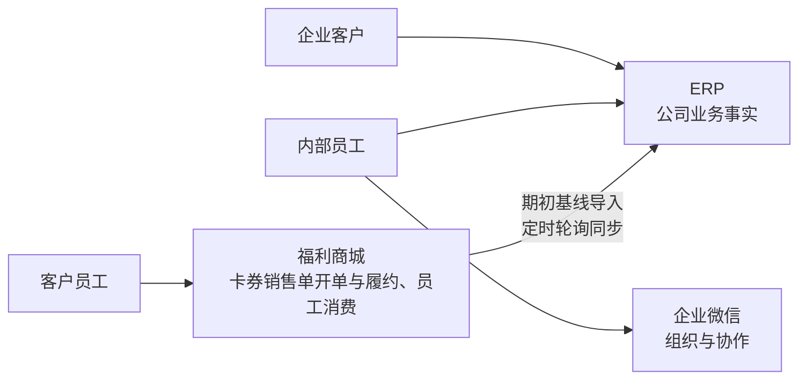

### 3.1 边界规则

- 客户、合同、供应商、正式商品、采购、库存、资金、实物与服务履约、成本费用、实际经营盈亏和客户经营质量事实以 ERP 为准；
- 第一期上线前已经存在以及第一期内新建的卡券销售单继续以商城为主责系统，ERP 同步数据；
- 第一期卡券销售单从开单、生效、卡券类目与玩法规则配置、卡号生产、卡密生成、实体卡印刷、绑定、激活、变更、作废到关闭的**完整闭环全部在商城完成**，ERP 不参与该流程的发起、审批或状态驱动，也不建设对应单据；
- 实物与服务销售单以 ERP 为主责系统，全程在 ERP 流转，不涉及商城；
- 两类销售单不得混单，判定规则见第 2.1 节；
- 每张销售单必须记录唯一主责系统；同一张销售单不得在 ERP 和商城同时作为可编辑正式单据；
- 第一期卡券商业事实的数据方向为商城 → ERP，查询调用由 ERP 主动发起，方案见第 8 章；
- 第一期工作台、预警和经营分析直接查询正式表或定时刷新投影，**不建设事件机制**；它不调用商城、供应商或其他外部系统；
- 第一期不建设外部 endpoint、webhook、外发商城/供应商 API、`inbox_message`、外部投递器、接口错误中心或通用接口对账；商城卡券销售单仍仅由 ERP 主动轮询读取；
- 卡券销售单在商城发生商业字段或卡券类目变更时，ERP 追加新的同步版本，保留原版本，不在 ERP 直接修改商城主责事实；
- 卡券销售单的应收、回款、销项发票和核销在 ERP 完成；商城不持有这些数据，也不向 ERP 同步收付款事实；
- 玩法规则由商城自行管理，不进入 ERP；ERP 只管理作为销售项的卡券类目，以及唯一明细的面额、数量、成交金额、配赠条件、电子卡或实体卡形态和销售单履约期限；
- 卡号和卡密由商城生成并保管，ERP 第一期不导入卡号，也不保存任何卡密；
- 企业微信不作为 ERP 的审批和业务台账；
- ERP 第一期不替代完整财务总账；
- 原始导入文件只在隔离临时区按批准期限保留，到期销毁；成功形成正式数据的白名单
  导入包、manifest、规则版本、成功结果和映射审计长期保留；失败合规包及行列明细保留
  30 天，失败批次元数据、汇总计数、脱敏错误码和审计长期保留；导出文件保留 7 天。
  原始文件审计关联只保存带密钥 HMAC 指纹及密钥版本，不保存普通摘要。

### 3.2 第一期商城改造边界

第一期必须遵守下列商城改造边界；禁止以任何形式突破。

| 阶段 | 卡券销售单开单方 | 商城能否编辑销售单 | ERP 的角色 |
| --- | --- | --- | --- |
| 第一期 | 福利商城 | 能 | 定时同步数据，负责应收、回款、发票和经营分析 |
| 第二期 | ERP | 不能，只读接收 | 销售提交后按 `VoucherSalesOrder` 已发布审批定义逐节点审批，生效后自动推送商城，商城按投影执行卡券 |

第一期商城侧义务与禁令：

- 商城**必须**对外提供只读查询接口（增量查询、全量清单、单据查询，见第 8.2 节）；
- 商城**禁止**改造销售单模型；
- 商城**禁止**建设单据版本号、发送队列、事件推送、失败重试和补发协议；
- 同步的发起方、进度维护、重试、幂等和一致性责任**全部由 ERP 承担**。

第二期生效后必须遵守：

- 开单入口迁入 ERP；商城销售单转为只读接收；
- 卡券销售单在 ERP 的生效顺序为：销售提交 → 按 `VoucherSalesOrder` 已发布审批定义逐节点审批 → 销售单生效。审批节点数量、顺序和审批人由流程管理员配置，不再由代码固定为「销售领导 → 运营」两级；
- 销售单生效后由 ERP 自动向商城发送执行投影；商城确认接收前，运营不得开始受该版本影响的玩法配置、制卡、绑定和激活；
- 完整规则见第二期第 8 章。

### 3.3 第 7 章的适用范围

第 7 章采购与履约流程**只适用于实物与服务销售单**。

卡券销售单第一期主责在商城，其全部履约在商城完成。ERP 只按第 8 章同步销售事实，不向商城下发任何处理指令，不触发采购、库存或履约流程，也不建设卡券生产、实体卡印刷、单卡库存和激活单据。

切换时点 T 起，商城停止创建 B2B 销售单，全部 B2B 销售单统一由 ERP 服务。卡券的 ERP 侧协同能力**不在第一期范围内**，见第二期文档。

---

## 4. 核心业务概念

### 4.1 销售单的两个维度

销售单用两个互相独立的维度描述。两个维度不得混用，也不得互相替代。

**维度一：业务性质。** 按**是否经过商城消费**划分，单据建立时确定，终身不变：

| 名称 | 判定依据 | 典型业务 | 履约方式 |
| --- | --- | --- | --- |
| **卡券销售单** | 销售标的是卡券，员工在商城消费 | 各类卡券、消费金 | 商城发卡、绑定、激活，员工自行消费 |
| **实物与服务销售单** | 不经过商城消费，直接交付客户 | 慰问品、年节礼包、举办活动 | 采购、入库、发货、电子交付或线下服务 |

**维度二：主责系统（第一期）。** 决定谁能发起正式商业变更。该机制只用于第一期商城主责期间，第二期由切换时点 T 取代：

| 单据 | 第一期主责系统 | 切换时点 T 起 | 说明 |
| --- | --- | --- | --- |
| 卡券销售单 | 福利商城 | ERP | 第一期 ERP 侧由商城同步形成正式单据；T 起商城停止创建 B2B 销售单，全部 B2B 销售单统一由 ERP 服务，在 ERP 审批生效后自动向商城发送执行投影 |
| 实物与服务销售单 | ERP | ERP | 全程 ERP 主责，走第 7 章完整流程 |

两个维度的区别必须清楚：**业务性质说的是卖什么、怎么履约，主责系统说的是谁能改。** 切换时点 T 起商城停止创建 B2B 销售单，全部 B2B 销售单统一由 ERP 服务，卡券销售单仍叫卡券销售单。每张销售单必须记录当前主责系统。

两类销售单共用同一套客户、合同、票款、核销和经营分析能力，第一期的差别在主责系统和履约路径。卡券销售单完成客户和卡券类目映射并通过校验后，形成 ERP 应收、收入和经营分析投影，但其商业字段在第一期始终由商城主责。ERP 经营台账统一展示两者。

### 4.2 卡券类目与玩法规则的职责划分

卡券类目在 ERP 中就是一个销售项。中国通和心意卡是两个不同的卡券类目，也就是两个不同的销售项。因此：

- 更换卡券类目等于更换销售的标的，属于销售单的商业变更；第一期该变更在商城发起，ERP 同步后追加新版本；
- 卡券类目和履约期限属于表头商业事实，全单一个值；面额、数量、成交金额、配赠条件和电子卡或实体卡形态属于唯一明细的商业事实，见第 4.3.2 节；
- 卡券在商城内如何被使用属于玩法规则，由商城自管，定义见第 2.1 节；
- ERP 不建设商城购买权限判断、支付校验、卡券余额扣减和余额计算。

第一期同步卡券类目、唯一明细的面额、数量、成交金额和电子卡或实体卡形态；ERP 根据面额、数量和成交金额计算配赠指标。玩法规则不同步。

### 4.3 合同与销售单

- ERP 不起草或新建合同正文。合同进入 ERP 的唯一方式是上传已签署电子档 PDF（合同中心页头或新建销售单合同选择框旁的加号，复用同一上传 Dialog）；新建销售单只能选择已有有效合同，不可随单内嵌上传。
- 上传成功同时形成合同档案、首个不可变版本与 PDF 关联；销售单仅引用已归档的合同当前修订。每个合同版本保存对应 PDF，历史销售单继续引用原版本。
- 一份合同对应一张或多张销售单；
- 卡券销售单恰好包含一条卡券明细；实物与服务销售单包含一种或多种非卡券销售标的；
- 非卡券销售标的包括实物商品、虚拟商品和线下服务，线下服务含举办活动；
- 实物与服务销售单的每条明细独立记录福利场景、销售标的、履约方式和履约期限；
- 卡券销售单的履约期限必须记在表头，全单卡券共享，明细不得单独设置（规则见第 4.3.1 节）；
- 福利场景包括年节礼包、餐补、慰问品、消费金和其他；
- 履约方式包括公司仓发、供应商直发、电子交付和线下服务；
- 对实物与服务业务，同一次客户采购的付款、开票和交付责任一致、且销售标的同属一类时，可以使用一张销售单；卡券业务另按下一条的单明细规则拆单；
- 付款主体、开票要求、交付时间或业务责任不同时，拆成多张销售单；
- 同时涉及卡券和非卡券时，必须拆成卡券销售单和实物与服务销售单两张；
- **一张卡券销售单的每个版本恰好包含一条卡券明细**。同一版本需要同时存在不同卡券类目、面额、配赠条件、电子卡或实体卡形态或履约期限时，必须拆成多张卡券销售单（规则见第 4.3.2 节）；

销售单表头统一记录客户、合同、结算主体、付款条件和开票要求。实物与服务销售单的明细分别进入采购、库存、电子交付或线下服务履约流程，明细履约结果汇总为销售单整体履约进度。

#### 4.3.1 履约期限

履约期限表示公司承担履约责任的截止时间。**两类销售单的记录粒度不同**：

| 销售单 | 记录粒度 | 含义 | 履约完成判定 |
| --- | --- | --- | --- |
| 卡券销售单 | **表头，全单一个值** | 卡券有效期 | 履约期限到期即履约完成 |
| 实物与服务销售单 | **明细，各条可不同** | 约定交付或服务完成截止日期 | 客户验收通过即履约完成，履约期限只用于超期预警 |

卡券销售单履约期限规则：

- 履约期限**必须**记在表头，全单卡券共享一个值（与商城卡券有效期粒度一致）；
- ERP **禁止**设置明细级卡券履约期限，**禁止**产生商城无法表达的数据；
- 客户需要不同有效期的卡券时，**必须**按第 4.3 节拆成多张卡券销售单；
- 卡券履约完成的**唯一条件**是履约期限到期；发货、验收或激活完成均不得作为履约完成条件；
- 发货、验收和激活仅表示商城侧履约进度，不表示 ERP 履约完成；
- 卡券销售单的履约期限一般为两年；ERP 必须同步该值，并据此判定履约进度和履约完成；
- 第一期**禁止**同步商城消费数据；第二期消费事实回流后，"已全部消费"仅可作为消费进度和经营分析指标，**禁止**作为卡券明细提前履约完成的条件。

#### 4.3.2 一张卡券销售单只含一条卡券明细

一张卡券销售单必须恰好只含一条卡券明细，对应一种卡券类目、一种面额、一套配赠条件、一种电子卡或实体卡形态和一个履约期限。**禁止**建设一张卡券销售单包含多条卡券明细的能力。

拆单规则：

- 客户同一次采购包含不同卡券类目、不同面额、不同配赠条件、不同卡形态或不同履约期限时，**必须**按差异拆成多张卡券销售单；
- 例如：同时采购 100 张中国通和 100 张心意卡时开两张销售单；同一类目同时采购 500 元和 1000 元面额时也开两张销售单；
- 数量只表示上述条件完全相同的卡张数；
- ERP **禁止**产生商城无法表达的数据；第二期 ERP 开单并向商城下发执行投影时，销售单与商城卡券执行关系必须保持一一对应，**禁止**在系统间拆分或合并明细。

字段归属：

- 卡券类目和履约期限必须保存在销售单表头；
- 唯一卡券明细必须保存面额、数量、成交金额、配赠指标和电子卡或实体卡标识；
- 更换卡券类目、面额、配赠条件、卡形态或履约期限均属于整张销售单的商业变更，按第二期第 8.3 节处理。

### 4.4 公司商品池（公司商品/SKU 销售视图）与采购二次确认

本节只适用于实物与服务销售单。

- 采购必须先在 W14 创建公司商品与 SKU，再从 SKU 行或 W21 为该稳定 `sku_id` 添加供给；
- 手工与 Excel 来源使用同一供给写入合同，不创建供应商商品/SPU/SKU 主档或映射；
- 每家供应商分别形成供给身份和商业条款修订，同时保存供应商订货编码、一件代发供给价（含税）、集采供给价（含税）、集采起订量、税率、费用、区域和有效期；供给不设置方式字段，默认同时支持一件代发与集采；
- 可供状态和数量独立保存在 `supplier_offering_availability`；新增供给时与首版商业条款同一事务创建，后续可高频更新且不增加条款修订号；
- 公司商品池仅是公司商品/SKU 的销售查询视图：销售可见价和市场价只写公司 `sku_revision`；
  启用 SKU 具有销售可见价且存在至少一条业务时点有效并当前可供的供给时，才在视图中具备销售资格。供应商、采购成本、进项税率、MOQ、供给区域和有效期仍只属于供给修订；
- 销售只从上述具备销售资格的公司 SKU 中选品并向客户报价；
- 销售查询和导出只返回具备销售资格的公司商品/SKU 与销售可见价，不返回供应商、采购成本、进项税率或 MOQ；
- 客户确认意向后，销售在 ERP 创建销售单并**提交**，提交即启动该类型已发布审批定义的审批实例，销售单进入审批中，尚未生效；
- 采购二次确认是该审批链中的一个节点，审批人是采购。采购在该节点核实需要外部采购的销售明细能否履约，并作出通过或驳回决定；
- 采购在该节点只提交决定和原因，**不选择供给、不录入成本、不录入交期**；这些事实在销售单生效后创建采购单时录入，见第 7.4 节；
- **最后一个审批节点通过后销售单生效**，采购据此创建采购单；
- **任一节点驳回时销售单不生效**，审批人必须填写驳回原因，常见原因包括无法履约、成本上涨、交期不满足和供应商资质失效。

采购二次确认是销售单生效的闸门：`SalesOrder` 已发布定义必须恰好包含一个 `node_purpose=SALES_ORDER_PROCUREMENT_CONFIRMATION` 的节点，且必须在该节点和其余节点全部通过后才允许销售单生效。流程管理员可以配置该节点的位置、名称和审批人，但不得删除或复制该用途。`services::approval` 只在发布时校验用途完整性；运行推进、决定 DTO、驳回和最终生效不得按该用途增加专用分支。

按 `approval-workflow-contract.md` §11，驳回不改变销售单内容、不改变 `subject_version`、不结束审批实例：审批实例轮次加一并回到第一个节点重新审批。因此销售单被驳回后由销售处理，只有三条出路：

| 出路 | 做法 |
| --- | --- |
| 改品或改价 | 撤回审批使销售单回到草稿，修改销售单并与客户重新确认，再次提交 |
| 照原条件承接 | 不撤回也不改单，在新一轮审批中说明理由，由各节点重新决定。**不需要销售上级确认**，低毛利上级确认已删除，毛利只以只读风险提示展示 |
| 不做 | 作废销售单 |

驳回发生在生效之前，**禁止**对驳回单使用变更单。销售单生效之后出现的成本变化或供应商问题，**必须**按第 6.3 节走采购变更单和销售变更单，**禁止**回到审批。

#### 4.4.1 毛利风险提示

销售单的毛利风险是**只读提示**，不是环节、不是任务、不阻断任何流程：

- 销售单详情与审批区展示毛利率估算值，低于阈值时展示「低毛利」风险标记；
- 估算成本由服务端按业务时点有效且当前可供的供给中最低供给价计算，页面不展示供应商身份和具体供给条款，也不写回单据字段；
- 风险标记不改变单据状态、不阻断提交、不阻断任何节点通过、不创建待办；
- 销售单生效并创建采购单后，实际成本与实际毛利以采购单事实为准，估算值不再作为结论展示。

### 4.5 供应商能力与资质

- 一家供应商维护一种或多种供应商能力，能力采用多选；
- 供应商能力包括实物商品、虚拟商品、线下服务、API 和印刷；
- 第一期只登记 API 能力，不建设 API 接口；
- 每项能力记录启用状态、服务区域、负责人、履约说明和有效期；
- 供应商资质独立保存，一家供应商维护多份资质；
- 每份资质记录资质类型、证书编号、发证机构、生效日期、失效日期、附件和适用能力；
- 资质失效后，对应供应商能力不得用于为公司 SKU 新建或延续有效供给，也不得用于采购单；
- 系统在资质到期前生成预警；
- 供应商能力、资质和附件的新增、变更、停用全部保留操作记录。

### 4.6 单据、状态和台账

| 类型         | 内容                                                                          |
| ------------ | ----------------------------------------------------------------------------- |
| **基础资料**   | 客户、供应商、供应商能力与资质、供应商供给、公司商品/SKU（含销售查询视图）、商品分类、品牌、卡券类目、仓库 |
| **正式单据** | 卡券销售单、实物与服务销售单、采购单、入库单、发货单、回款单、付款单、发票     |
| **操作记录** | 提交、审批通过、审批驳回、撤回、完成、作废                                    |
| **派生台账** | 应收、应付、库存、履约进度、成本费用、实际经营盈亏、客户经营质量              |

采购二次确认是销售单审批链中的一个节点，不产生业务单据，也不产生独立的确认记录：它的处理人、处理时间和结论作为节点执行事实保存在审批实例中。销售单关闭属于状态变化，不产生“关闭单”。

#### 4.6.1 卡券销售单是 ERP 的正式单据

**卡券销售单在 ERP 中是正式单据，不是商城单据的副本、影子或同步数据。** 它与实物与服务销售单共用同一个销售单实体、同一套字段、同一套应收票款和经营分析能力，区别只有两个字段：

| 字段 | 卡券销售单（第一期） | 实物与服务销售单 |
| --- | --- | --- |
| 创建入口 | 福利商城 | ERP |
| 主责系统 | 福利商城 | ERP |

第一期创建入口留在商城，商城改造边界见第 3.2 节。卡券销售单在 ERP 中的数据地位与实物与服务销售单相同，均为正式单据。

实现上必须遵守：

- 两类销售单**必须**使用同一实体和同一张主表，**禁止**建成两套模型或两张业务表；
- 主责系统是销售单上的一个字段，不是单据类型；
- ERP 侧**禁止**另立单号，必须与商城使用同一个销售单号，见第 2.1 节；
- 第一期"ERP 不可编辑卡券销售单"是**主责系统为商城时的状态约束**，不是该单据的固有属性；
- 切换时点 T 起：商城停止创建 B2B 销售单，全部 B2B 销售单统一由 ERP 服务；同一条记录**禁止**迁移数据、换单号或换实体。

客户、供应商、公司商品/SKU、商品分类、品牌、卡券类目和仓库每次修改均保留完整历史版本；销售可见价和市场价随 `sku_revision` 版本保存，正式单据另外保存生效时的业务快照。

#### 4.6.2 数据新鲜度

- 库存、票款和正式待办在业务事务内同步更新，提交后立即可见；
- 工作台和经营分析允许异步刷新，延迟不超过 1 分钟；
- 经营分析直接 SQL 聚合正式表或定时刷新投影，无需核对重建。

---

## 5. 第一期建设范围

### 5.1 第一期建设内容

1. 客户、供应商、供应商能力与资质、多供应商供给、合同、公司商品/SKU（含销售查询视图）和卡券类目基础资料；
2. 实物与服务销售单（含采购二次确认审批节点）、采购、入库、代发、仓发、电子交付、线下服务和验收；
3. 客户应收、回款和销项发票，含卡券销售单的应收派生、回款登记、销项发票和核销；
4. 供应商应付、付款和进项发票；
5. 自有商品库存数量；
6. 非卡券销售明细的预计成本、确认成本、实际成本费用和实际经营盈亏；
7. 卡券成交金额、面值和配赠指标，不录入卡券实际供货成本，不计算卡券实际经营盈亏；
8. ERP 内部角色权限、数据隔离和操作留痕；
9. 单据变更、作废、退货、退款、冲正和库存调整；
10. 卡券销售单的期初基线导入、定时轮询同步、基础资料映射、同步版本、映射差异、只读展示和每日全量核对；
11. 统一工作台与预警规则，覆盖单据审批、票款复核、资质到期、履约超期和同步失败。待办队列与个人工作台合并为唯一页面，全部任务创建即指定到具体用户，不存在团队任务和领取动作，见 `approval-workflow-contract.md` §16.4；
12. 期初数据迁移，含基础资料、仓库、期初库存、卡券销售单期初基线和卡券应收派生。
13. 工作台、预警和经营分析直接查询正式表或定时刷新投影，不建设事件机制。

### 5.2 第一期不建设

| 内容                         | 约定                               |
| ---------------------------- | ---------------------------------- |
| 卡券生产单和卡号导入           | 不建设，卡号生产和保管全部在商城闭环内 |
| 实体卡印刷采购和单卡号库存     | 不建设，商城闭环内完成；印刷费按第 7.5 节直接登记为卡券成本费用 |
| 卡券激活单和手机号绑定         | 不建设，商城闭环内完成                 |
| ERP 销售单向商城下发卡券类目变更 | 不在第一期范围内；切换时点 T 后见第二期 |
| 商城自动发卡和消费同步         | 不建设，第一期只同步销售单             |
| 玩法规则纳入 ERP               | 不建设，限额限购等规则始终由商城自管    |
| 商城收付款数据同步             | 不建设，商城不持有该数据，由财务在 ERP 登记 |
| 对外消息与回调治理             | 不在第一期范围内；外部投递、webhook、inbox、供应商 API、通用接口错误中心与对账见第二期 |
| 企业微信审批                   | 不建设，单据在 ERP 内流转              |
| 可配置审批流                   | **建设**。按固定 `DocumentType` 由管理员配置线性单人审批节点，流程结构来自已发布定义版本；不建设条件分支、并行网关、会签和 BPMN 设计器。权威合同见 `approval-workflow-contract.md`，政策矩阵见其 §4.3 |
| 完整财务总账                   | 不建设                                  |
| 按耗月结                       | 不建设                                  |
| 卡券实际供货成本和实际经营盈亏 | 不建设                                  |
| 完整生产制造和复杂 BOM         | 不建设                                  |

实物商品、虚拟商品和线下服务在同一期交付。

### 5.3 期初数据迁移

ERP 上线前必须完成期初数据迁移。迁移范围和责任如下：

| 迁移对象 | 来源 | 责任部门 | 迁移口径 |
| --- | --- | --- | --- |
| 客户、合同 | Excel 和商城 | 销售 | 全部有效客户；仍在执行或仍有应收的合同 |
| 供应商、供应商能力与资质 | Excel | 采购 | 全部在用供应商；资质导入含有效期和附件 |
| 公司商品与供应商供给 | Excel | 采购 | 先导入公司商品/SKU，再按稳定 `sku_id` 登记供应商订货编码、商业条款和初始可供情况 |
| 公司商品/SKU、卡券类目 | Excel | 采购、运营 | 导入全部启用项目；销售可见价和市场价写入公司 `sku_revision`，销售资格由启用 SKU、价格和有效供给派生，不导入参考供应商或参考成本 |
| 仓库 | Excel | 仓储 | 全部在用仓库 |
| 期初库存数量 | 仓库盘点 | 仓储 | 上线基准日实盘数量，按 SKU 和仓库 |
| 卡券销售单 | 商城只读接口 | 系统管理员 | 已生效及之后状态、且未作废的正式单据，按第 8 章形成期初基线；草稿不迁移 |
| 卡券销售单期初应收 | 商城卡券销售单和人工复核 | 财务 | ERP 按成交金额派生应收；期初已收和已开票先置 0，上线后按第 8.7 节逐单复核补录 |

迁移规则：

- 迁移必须指定统一的上线基准日，基础资料状态和期初库存均以该日为准；
- 期初库存必须以实盘为准，不允许按账面数据导入；
- 卡券销售单的期初已收金额和已开票金额统一初始化为 0，按第 8.7 节由财务上线后逐单复核补录；
- 不迁移历史实物与服务销售单、采购单、履约单及其期初应收或期初应付；卡券应收由导入的正式卡券销售单派生；期初库存只导入基准日实盘数量，不迁移历史出入库明细；
- 实体卡库存由商城和仓库自行管理，不导入 ERP；
- 迁移数据必须先导入验证环境完成校验和业务确认，再导入生产环境；
- 原始 SQL 或商城原始导出只在隔离临时区使用，完成安全清洗和审计关联后按批准期限
  销毁；成功形成正式数据的白名单导入包、manifest、规则版本、成功结果和映射审计
  长期保留；失败合规包及行列明细保留 30 天，失败批次元数据、汇总计数、脱敏错误码
  和审计长期保留。确需关联原始文件时只保存带密钥 HMAC 指纹及密钥版本，不保存普通摘要。

---

## 6. 第一期正式单据

### 6.1 通用单据

| 单据                   | 创建入口       | 作用                                         |
| ---------------------- | -------------- | -------------------------------------------- |
| **合同**               | ERP，销售      | 记录客户商务约定                             |
| **实物与服务销售单**   | ERP，销售      | 记录一次客户采购及成交明细                   |
| **卡券销售单**         | 福利商城，销售 | 记录一次客户卡券采购及其唯一卡券明细。第一期在商城开单，由 ERP 拉取商业事实并维护版本历史；主责期间 ERP 侧不可编辑 |
| **客户回款单**         | ERP，财务      | 记录客户实际付款                             |
| **销项发票**           | ERP，财务      | 记录向客户开具的发票                         |

两类销售单都是 ERP 正式单据，共用同一实体，只有创建入口和主责系统不同，见第 4.6.1 节。

### 6.2 采购与履约单据

本节单据只服务实物与服务销售单。

| 单据                | 创建部门 | 作用                                           |
| ------------------- | -------- | ---------------------------------------------- |
| **采购单**          | 采购     | 按供应商记录商品成本、物流费用、税率和付款条件 |
| **供应商付款单**    | 财务     | 记录向供应商实际付款                           |
| **进项发票**        | 财务     | 记录供应商发票                                 |
| **采购入库单**      | 仓储     | 记录采购商品进入自有仓库                       |
| **发货出库单·代发** | 采购     | 记录供应商直接向客户发货，不影响自有库存       |
| **发货出库单·仓发** | 仓储     | 记录公司仓库发货并扣减库存                     |
| **电子交付记录**    | 采购     | 记录虚拟商品交付对象、数量、时间、结果和凭证   |
| **服务履约记录**    | 采购     | 记录线下服务对象、时间、地点、完成结果和凭证   |
| **客户验收单**      | 销售     | 记录客户验收、短少、拒收或服务不通过结果       |

### 6.3 异常处理单据

| 异常                             | 处理单据              |
| -------------------------------- | --------------------- |
| 销售单生效后调整商品、数量或金额 | 销售变更单            |
| 采购单生效后调整商品、数量或金额 | 采购变更单            |
| 客户退货或拒收                   | 销售退货/拒收处理单   |
| 退回供应商                       | 采购退货单            |
| 客户退款                         | 客户退款单            |
| 供应商退款或错付款               | 供应商退款/付款冲正单 |
| 错回款                           | 回款冲正单            |
| 发票红冲                         | 红票记录，关联原发票  |
| 库存盘盈、盘亏或损坏             | 库存调整单            |

销售变更单和采购变更单只适用于实物与服务销售单。卡券销售单的商业变更在商城发起，ERP 同步后追加新版本；同步和映射类异常按第 8.6 节处理。

### 6.4 异常处理责任规则

- 发现部门登记异常事实、原单号、原因、影响范围和发现时间；
- 销售变更、采购变更和商品退货由原业务单据责任部门创建处理单；
- 客户与供应商资金、收付款和发票纠错由销售或采购确认业务依据，财务经办人创建处理单；
- 库存调整单由仓储经办人创建，并按 `StockAdjustment` 已发布审批定义逐节点审批；
- 仓储执行商品的收货、退货、出入库和库存调整；
- 涉及金额、税额、应收、应付、成本或发票时，必须由对应强类型单据形成可审计财务事实；是否包含财务审批节点及其顺序由该类型已发布定义决定；
- 财务异常由财务经办人创建；属于 `PROCESS_REQUIRED` 的退款、冲正等单据按已发布定义审批，岗位分离政策必须禁止经办人审批自己的提交；
- 执行部门完成纠正记录后，原单责任部门确认处理完成；
- 原单和已发生事实不得删除或改写，处理单与原单双向关联。

### 6.5 异常处理部门时序

每张时序图表达一类完整的异常处理场景。不同部门发现同类异常时，进入同一张图处理。

#### 6.5.1 销售变更

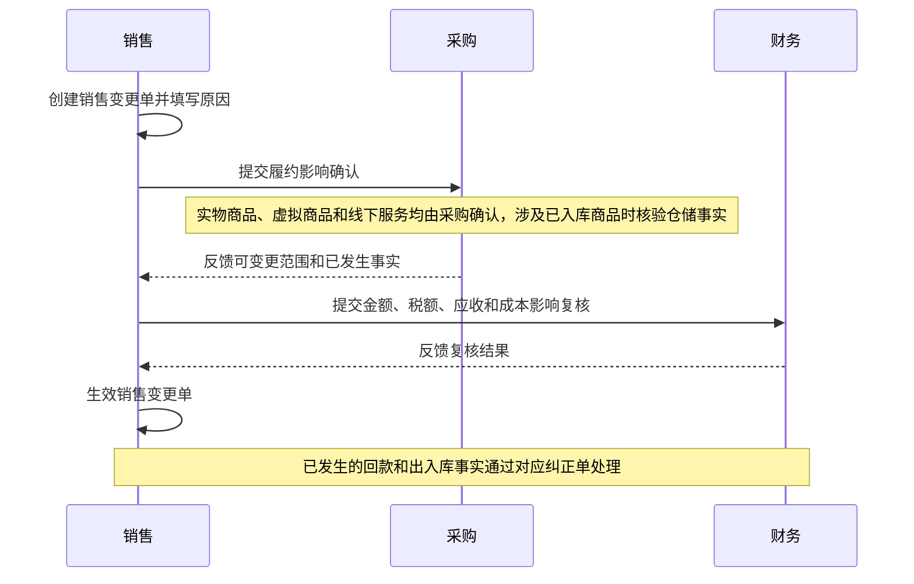

#### 6.5.2 采购变更

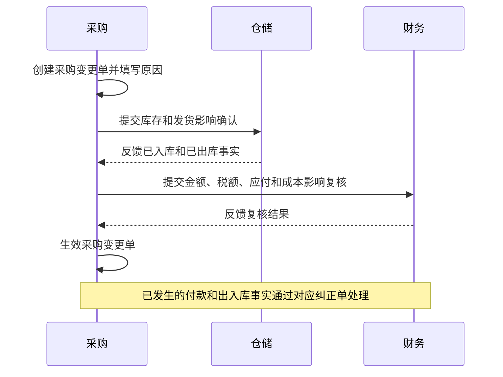

#### 6.5.3 商品退货与拒收

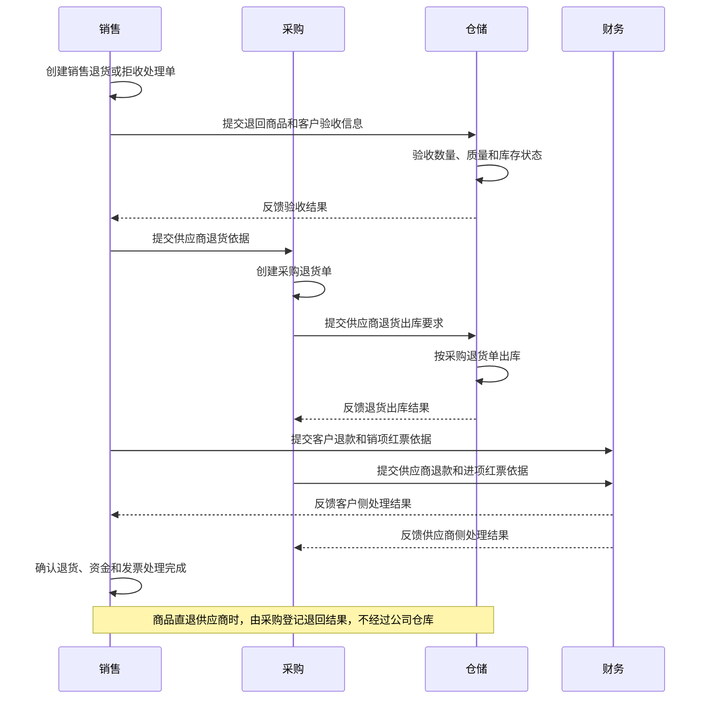

#### 6.5.4 资金与发票纠错

客户侧和供应商侧使用同一类纠错对象，但审批政策按单据类型固定：退款与收付款冲正属于 `PROCESS_REQUIRED`，红票 `Invoice` 属于 `NO_APPROVAL`，不得让红票进入审批实例。

| 场景 | 业务部门 | 往来主体 | 纠错单据 |
| --- | --- | --- | --- |
| 客户侧 | 销售 | 客户 | 客户退款单、回款冲正单、销项红票记录 |
| 供应商侧 | 采购 | 供应商 | 供应商退款记录、付款冲正单、进项红票记录 |

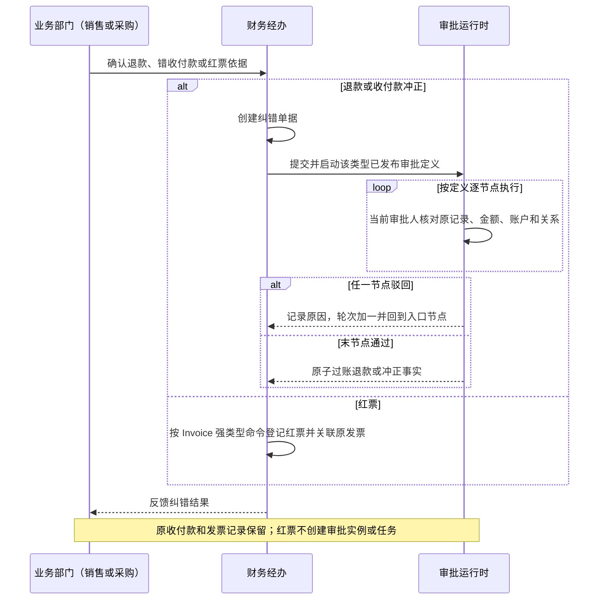

#### 6.5.5 库存调整

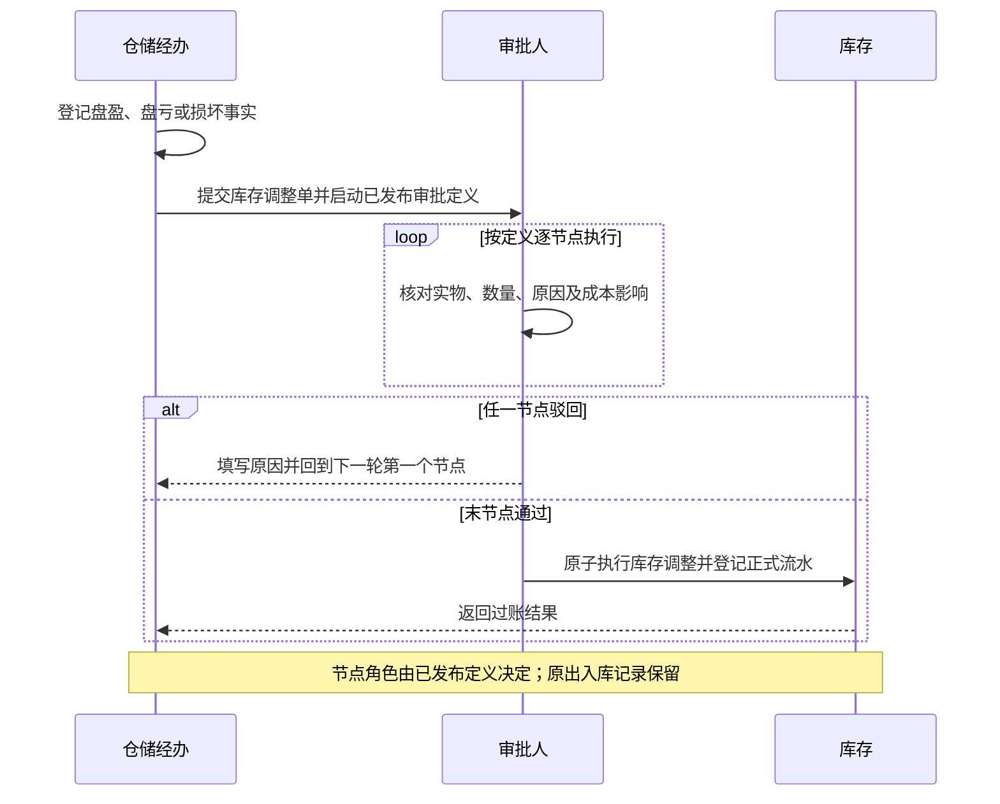

---

## 7. 采购与履约流程

适用范围见第 3.3 节：本章只适用于实物与服务销售单。

### 7.1 单据产生顺序

| 环节                               | 单据、行为或事实           | 责任部门 |
| ---------------------------------- | -------------------------- | -------- |
| 客户合同生效                       | 合同                       | 销售     |
| 销售从具备销售资格的公司 SKU 查询视图选品并对客户报价 | 线下报价行为               | 销售     |
| 客户确认意向，销售提交销售单       | 销售单进入审批中，启动审批实例 | 销售     |
| 采购确认节点核实可否履约           | 审批节点执行（通过或驳回） | 采购     |
| 全部审批节点通过                   | 销售单生效，随后创建采购单 | 采购     |
| 任一审批节点驳回                   | 填写驳回原因，审批回到第一个节点重新开始 | 对应节点审批人 |
| 采购提交采购单                     | 采购单进入审批中，启动已发布审批定义 | 采购     |
| 按定义逐节点审批                   | 当前节点通过或驳回         | 当前节点审批人 |
| 全部审批节点通过                   | 采购单生效并形成应付项目   | 系统     |
| 按付款条件付款                     | 供应商付款单，一张或多张   | 财务     |
| 实物商品进入公司仓库               | 采购入库单                 | 仓储     |
| 实物商品由供应商直接发客户         | 发货出库单·代发            | 采购     |
| 实物商品由公司仓库发客户           | 发货出库单·仓发            | 仓储     |
| 虚拟商品完成电子交付               | 电子交付记录               | 采购     |
| 线下服务完成                       | 服务履约记录               | 采购     |
| 客户验收商品、虚拟商品或服务       | 验收单                     | 销售     |
| 收到供应商发票                     | 进项发票                   | 财务     |
| 收到客户款项                       | 客户回款单，一张或多张     | 财务     |
| 向客户开票                         | 销项发票，一张或多张       | 财务     |

采购二次确认只形成一条审批任务和一条节点执行记录，不产生单据。销售单在全部审批节点通过后生效；任一节点驳回时销售单内容不变，审批实例轮次加一并回到第一个节点。销售单当前处于哪个节点、由谁负责，只存在于审批实例，不写入销售单状态。

### 7.2 采购主流程

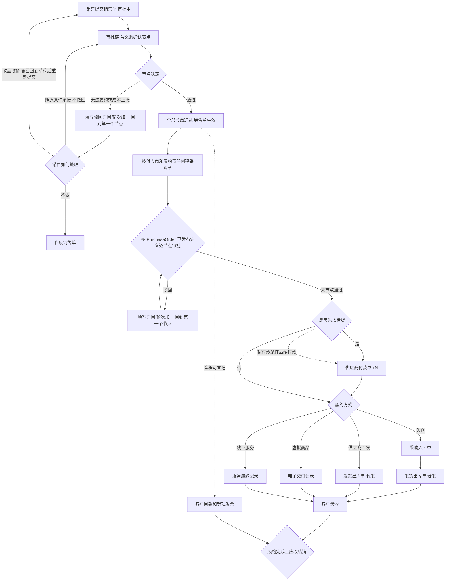

### 7.3 部门协作时序

三种履约方式**共用相同的前段和后段**，只有中间的履约段不同。因此第 7.3.1 节给出完整基准流程，第 7.3.2 和 7.3.3 节只画差异段。

三者共用的规则：

- 客户回款和销项发票在销售单生效后的任一环节登记；
- 全部明细履约完成且客户应收结清后销售单关闭。

#### 7.3.1 商品入仓后由公司仓库发货（完整基准流程）

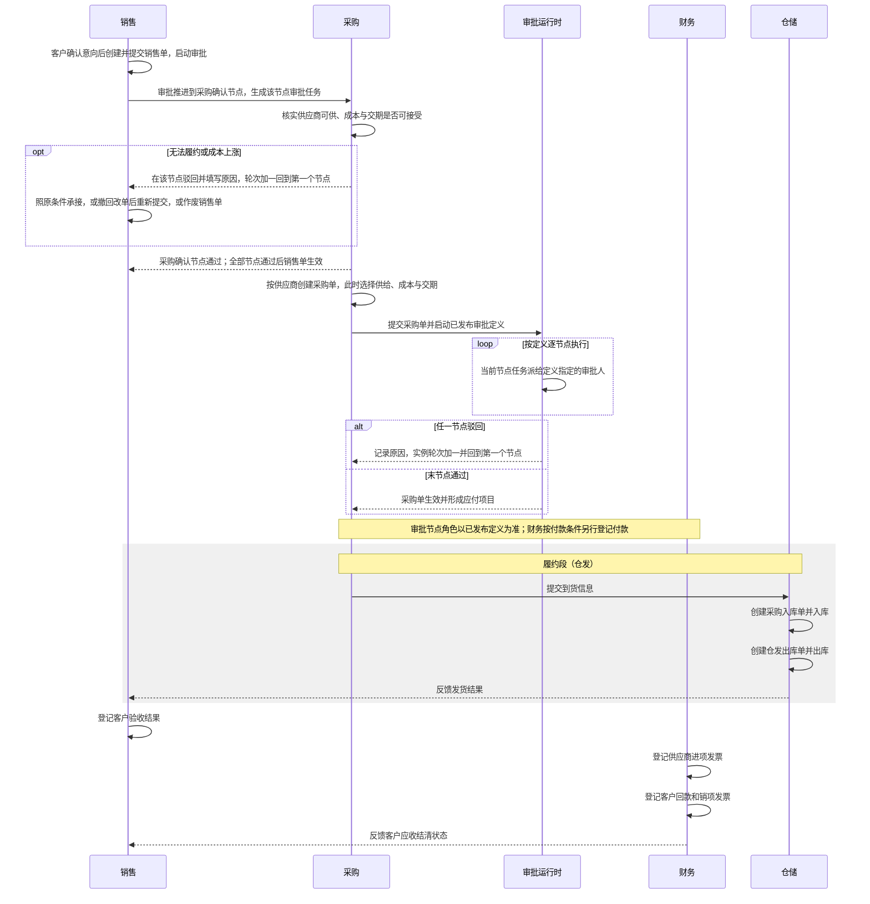

#### 7.3.2 供应商直接发客户（仅履约段不同）

前段和后段与第 7.3.1 节完全一致，无仓储参与。履约段替换为：

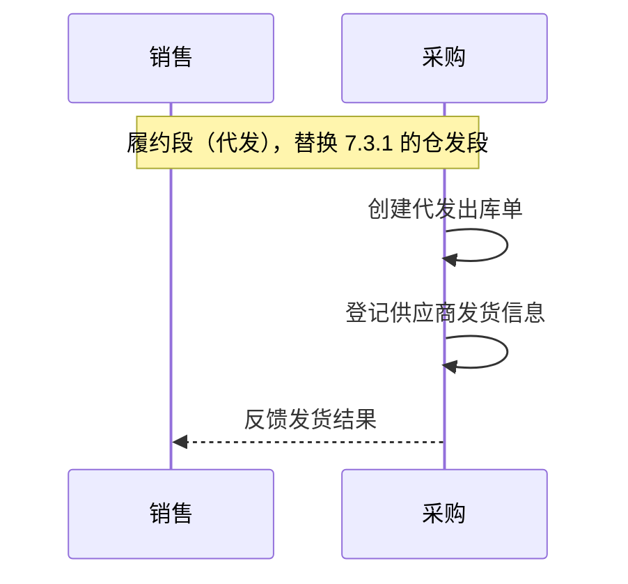

#### 7.3.3 虚拟商品和线下服务（仅履约段不同）

前段和后段与第 7.3.1 节完全一致，无仓储参与。履约段替换为：

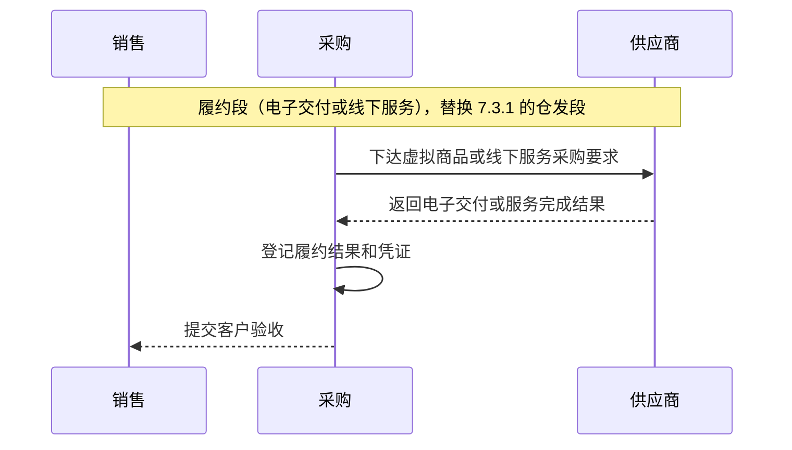

财务在本场景中另外登记实际履约费用，口径见第 7.5 节。

### 7.4 采购单规则

- **选源在本环节完成**：采购单创建时，采购从业务时点有效且当前可供的供应商供给中为每条需要外部采购的销售明细选择实际供给，并记录供应商供给修订、最新成本、供货数量、预计交期和履约方式。销售单审批期间不选源、不记录成本和交期（第 4.4 节）；
- 销售单生效前不存在已选定的供应商成本，因此生效前的毛利只能是第 4.4.1 节的估算值；采购单创建后以采购单事实为准；
- 选源结果与业务时点有效供给不一致（供给失效、停止可供、资质失效或成本高于销售单毛利底线）时，采购单不得创建，按第 6.3 节走销售变更单；
- 一张销售单对应一张或多张采购单；
- 同一销售单内，供应商、采购类型、付款条件和履约责任一致的采购明细合并为一张采购单；
- 供应商、采购类型、付款条件或履约责任任一不同，拆分采购单；
- 采购单同时承担采购申请、审批事实载体和供应商采购依据；
- 采购单记录实物商品、虚拟商品或线下服务成本、税率、付款条件和采购费用；
- 一件代发采购价包含发货、包装等全部费用，不重复登记物流费用；
- 实物商品采购另外发生物流费用时，在同一张采购单中增加物流费用明细；
- 商品成本和物流费用分别记录金额、税率、税额和不含税金额；
- 物流费用支付给同一采购供应商；
- 一张采购单对应一张或多张供应商付款单；
- 采购单审批与实际付款分开记录；
- 先款后货时，付款完成后发货；
- 账期、货到付款或到票付款时，采购单最终审批通过后先履约，后续按付款条件付款；
- 入仓履约的合格商品入库后自动预占给原采购单关联的销售单，其他销售单不得占用；
- 预占在仓库发货时消耗，只能通过审核生效的销售变更、销售单作废、采购退货或库存调整释放，不自动超时。

### 7.5 成本费用与实际经营盈亏

非卡券销售明细按不含税口径计算订单实际经营盈亏：

```text
订单实际经营盈亏
= 不含税销售收入
− 不含税实际采购成本
− 不含税实际履约费用
```

实际履约费用包括：

- 印刷费；
- 仓储费；
- 快递和配送费；
- 平台或技术服务费；
- 线下服务采购成本；
- 返点、退款和成本冲减；
- 其他能够直接归属于销售单或销售明细的履约费用。

每笔成本费用记录费用类别、成本阶段、含税金额、税率、税额、不含税金额、供应商、发生日期、关联销售单、关联销售明细和业务凭证。成本阶段固定为预计、已确认、实际发生或冲减。

实际经营盈亏只使用实际发生和冲减成本。预计成本和已确认成本用于执行过程中的预计盈亏，不进入实际经营盈亏。

卡券销售单允许直接登记已发生的印刷、仓储和配送费用，用于费用台账和经营事实留痕；这类费用不依赖 ERP 采购单，由财务按凭证录入。卡券实际供货成本不录入，全部卡券成本费用不进入实际经营盈亏。

经营分析分别展示：

- 成本完整的非卡券收入、实际成本费用和实际经营盈亏；
- 卡券收入、面值、配赠金额和配赠率；
- 成本覆盖收入、成本未覆盖收入和成本覆盖率。

**卡券成本未纳入统计，不得按零成本计算利润。**

销售合同、应收、应付和实际收付款使用含税金额；实际经营盈亏使用不含税金额。

金额计算统一按明细处理：

- 含税或不含税单价最多保留 4 位小数；
- 每条明细的含税金额、不含税金额和税额分别四舍五入到分；
- 单据合计为已经舍入的明细金额之和；
- 发票尾差独立记录，不修改原销售或采购单价。

---

## 8. 卡券销售单

第一期卡券销售单的完整业务闭环**必须**保留在商城。ERP 同步**必须**获取该销售单的商业事实并形成正式单据、应收和经营分析；**禁止**将卡券业务的执行控制权迁入 ERP。

### 8.0 两侧各取所需，明确一致性边界

两侧**必须**各自持有对方需要的那一层：第一期和第二期方向相反、结构对称。下表只概括核心业务字段；第一期完整快照范围以第 8.2 节为准，第二期身份、版本和控制字段以第二期第 8.2 节为准：

| 阶段 | 方向 | 传什么 | 不传什么 |
| --- | --- | --- | --- |
| 第一期 | 商城 → ERP，**商业事实投影** | 客户、合同、卡券类目、唯一明细的面额、数量、成交金额、电子卡或实体卡形态、履约期限；配赠指标由 ERP 计算 | 玩法规则、卡号、卡密、卡实例、绑定和消费执行细节 |
| 第二期 | ERP → 商城，**执行投影** | ERP 销售单身份和版本、客户、卡券类目、唯一明细的面额、数量、电子卡或实体卡形态、履约期限、生效时间 | 成交金额、配赠、税率、开票要求、应收 |

一致性边界：

- **允许不一致**：玩法规则、展示信息、执行过程数据。ERP **禁止**保存或校验这些字段；商城可随时修改，**不得**触发 ERP 版本；
- **不允许不一致**：第一期第 8.2 节完整快照范围内的状态、客户、合同、结算主体、卡券类目、唯一明细、金额、税率、开票要求和履约期限，以及由这些字段确定的配赠指标。这些字段共同决定 ERP 版本、应收和收入；出现偏差**必须**按第 8.6 节作为差异处理。第二期只要求执行投影所含字段一致，**禁止**要求商城保存 ERP 内部的成交金额和配赠指标。

同步版本和每日核对**只覆盖**第二类字段。

第一期同步方案必须遵守第 3.2 节商城改造边界：

- 商城第一期**必须**提供只读查询接口，**禁止**建设单据版本号、发送队列、事件推送、失败重试和补发协议；
- 同步的发起方、进度维护、重试、幂等和一致性责任**全部由 ERP 承担**。

第二期方向切换后：

- 执行投影**必须**由 ERP 卡券销售单按 `VoucherSalesOrder` 已发布审批定义完成全部节点审批并生效时自动发出，**禁止**由运营在商城重新录入销售单；
- 商城确认接收前，运营**不得**开始受该版本影响的玩法配置、制卡、绑定和激活。

### 8.1 唯一卡券明细与配赠指标

卡券销售单在商城开单，商城填写销售单级卡券类目，以及唯一卡券明细的面额、数量和最终成交金额。ERP 同步后计算配赠指标：

```text
卡券面值小计 = 面额 × 数量
卡券配赠金额 = 卡券面值小计 − 成交金额
卡券配赠率 = 卡券配赠金额 ÷ 成交金额
```

ERP 侧卡券销售单表头保存卡券类目和履约期限（即卡券有效期）；唯一卡券明细保存面额、数量、面值小计、成交金额、配赠金额、配赠率、电子卡或实体卡标识。

一张卡券销售单的每个版本都只含一条卡券明细，见第 4.3.2 节。同一版本需要同时存在不同卡券类目、面额、配赠条件、卡形态或履约期限时，商城和 ERP 均按不同销售单处理，不在一张销售单内拆成多条明细。

第一期不录入卡券实际供货成本，不计算卡券实际经营盈亏。卡券销售单在经营分析中标记为成本未覆盖。

### 8.2 同步范围和方式

同步分为两个阶段：

1. ERP 启用前，把商城已生效及之后状态、且未作废的正式卡券销售单导入 ERP，形成期初基线；商城草稿不导入；
2. 基线完成后，ERP 按固定周期轮询商城只读接口，获取发生变化的销售单完整快照。

正式单据基线**禁止**按关闭状态筛选：已生效及之后状态、且未作废的单据**必须**全部导入（卡券销售单履约期限一般为两年，关闭状态不作为基线过滤条件）。

商城需要提供的接口能力：

| 接口 | 用途 | 返回内容 |
| --- | --- | --- |
| 增量查询 | 按商城更新时间区间和分页返回发生变化的销售单 | 完整销售单快照列表 |
| 全量清单 | 返回全部曾达到已生效及之后状态的正式销售单，含后续已关闭或已作废单据；返回单号、当前状态、商城更新时间、金额合计 | 轻量清单，用于每日核对 |
| 单据查询 | 按单号返回单张销售单完整快照 | 完整销售单快照，用于差异修复和人工补拉 |

商城草稿不对外返回，不进入期初基线和增量同步；草稿只有在第一期内正式生效后才进入后续增量。已经进入正式状态的销售单后续关闭或作废时仍由接口返回最新快照。切换时点 T 起商城停止创建 B2B 销售单，仍存在的商城草稿统一作废，不迁移，也不在 ERP 补建。

商城需要承担的两项义务：

- **更新时间义务**：本节快照范围内任一字段发生变化，包括唯一明细字段变化、履约期限调整、状态变化和作废，商城必须刷新该销售单的更新时间。更新时间是 ERP 增量同步水位的唯一依据，不刷新即漏数据。快照出现零条或多条卡券明细属于来源数据异常，不作为普通明细增删处理。
- **四元组比对义务**：全量清单必须返回商城更新时间、单号、状态和金额合计；ERP **必须**按这四项与当前数据逐单比对，发现差异后按单号补拉完整快照或转人工处理。第一期**不建设、不启用内容指纹**；金额不变但内容变化（例如更换卡券类目、调整履约期限、面额与数量对调）**必须**依赖增量同步的更新时间刷新义务发现，差异由每日核对按单号补拉覆盖。

每次返回完整销售单快照，不返回变化字段。快照至少覆盖：

- 销售单号、商城当前状态、商城更新时间；
- 客户、合同和结算主体；
- 履约期限，即卡券有效期，销售单级一个值；
- 卡券类目，销售单级一个值；
- 唯一卡券明细，含面额、数量、单价、金额和电子卡或实体卡标识；
- 金额合计、税率、开票要求。

快照不包含卡号、卡密、玩法规则和收付款数据。商城不持有应收、回款、付款和发票信息，因此不在同步范围内。

#### 8.2.1 一期来源同步键与统一销售单身份

第一期商城来源单使用 **`来源商城 + 来源销售单号`** 映射到 ERP 销售单，称为一期来源同步键。来源销售单号在同一来源商城内必须唯一且不得复用。该键只用于商城来源单；第二期由 ERP 新建的卡券销售单没有一期来源同步键。

ERP 销售单内部稳定身份是两个阶段统一的业务身份。一张卡券销售单恰好只有一条卡券明细，因此唯一明细继承销售单身份，面额不再承担明细身份作用。卡券类目、面额、数量、成交金额、配赠指标和电子卡或实体卡标识都是销售单版本内容，不进入稳定身份。

用途有两个：

1. **一期同步匹配**：ERP 按一期来源同步键定位同一张销售单并追加同步版本，不按面额另建明细身份；
2. **第二期消费成本归集**：商城回流的卡实例携带稳定卡实例引用、原销售单身份和初始余额。第一期存量单按一期来源同步键解析原销售单，第二期新单按执行投影中的 ERP 销售单号解析，最终都归集到 ERP 销售单的唯一卡券明细。

因此有两条约束：

- 商城快照出现零条或多条卡券明细时视为来源数据异常，转人工处理；ERP 不自动合并、不静默丢弃，也不把一张来源单拆成多张 ERP 销售单；
- 第二期卡实例必须携带稳定卡实例引用、原销售单身份和初始余额，不要求商城回传 ERP 内部销售单版本号。

### 8.3 同步版本与幂等

第一期商城**禁止**新建单据版本号。同步版本**必须**由 ERP 侧生成：

- ERP **必须**按第 8.2 节列出的快照字段比对业务内容判断变化；第一期**禁止**使用内容指纹；
- 获取到的快照业务内容与当前数据一致时，判定为无变化，只更新最近同步时间，**禁止**产生新版本；
- 不一致时，ERP **必须**追加一个自增的同步版本，保留全部历史版本，并记录本次变化的字段；
- 幂等依据是"来源商城 + 来源销售单号 + 来源更新时间"；重复获取同一状态**禁止**产生重复版本；来源更新时间不同视为新的观测，同一来源单**必须**保留并追加新的同步版本；
- 迟到和乱序按商城更新时间判定：获取到的商城更新时间早于当前已记录的商城更新时间时，**必须**丢弃该快照；
- 商城作废和关闭通过快照中的状态字段体现，**禁止**要求独立事件类型。

第一期**不建设**来源版本缺口检测和补发协议。ERP 保存的是轮询实际观察到的完整快照版本：必须保证最终当前态收敛；**不保证**还原两个轮询周期之间在商城连续发生、又被后续修改覆盖的中间状态。第二期**必须**保留这些已观察版本，**禁止**将其表述为商城全部变更历史。

### 8.4 同步进度与失败处理

- ERP 保存同步水位，记录已处理完成的商城更新时间高水位；全部页面处理完成才前移水位；
- 默认轮询周期为 5 分钟，可按运行情况配置；
- 单次同步失败或商城不可用时，水位不前移，下一周期重试，不丢数据；
- ERP 不可用期间商城继续正常销售和卡券执行；ERP 恢复后按原水位继续同步，自动补齐停机期间的变化；
- 连续失败超过阈值时告警，由系统管理员处理，不需要商城介入；
- 期初基线和后续同步采用同一来源身份，避免基线订单在持续同步后重复生成；
- **期初基线完成后，水位初值必须取基线拉取的开始时间，禁止取结束时间**。取开始时间产生的重复拉取必须按"来源商城 + 来源销售单号 + 来源更新时间"幂等消化。

### 8.5 完整同步时序

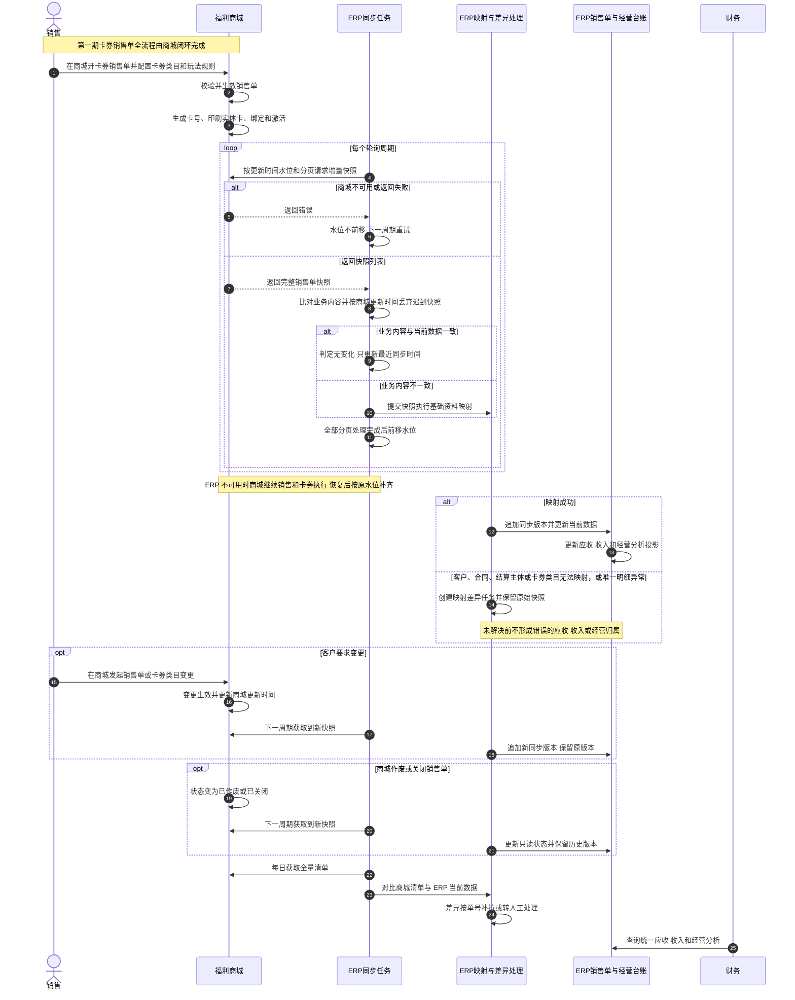

### 8.6 同步约束

第 8.2 至 8.4 节已经说明的机制不在此重复。以下是额外的业务约束：

- 基础资料映射和经营投影异步处理，不阻塞同步任务推进；
- 映射失败不要求商城回退销售单，也不阻塞商城发卡、绑定、激活、支付或关闭流程；
- 同步失败或映射失败时，销售不得为此在 ERP 手工补建另一张销售单；
- ERP 只保存商城已发生事实，不允许在 ERP 修改卡券销售单后回写商城；
- 每日必须获取全量清单，按商城更新时间、单号、状态和金额合计逐单核对商城当前商业事实与 ERP 当前数据；差异必须按单号补拉或转人工处理；第一期禁止使用内容指纹（规则见第 8.2 节）。

### 8.7 卡券销售单的票款处理

商城不持有应收、回款、付款和发票数据。卡券销售单票款规则：

- 卡券销售单完成客户、合同、结算主体和卡券类目映射，并通过唯一明细校验后，ERP **才得**按同步金额派生应收项目；映射或校验未通过前**禁止**派生应收；
- 期初基线导入的卡券销售单，已收金额和已开票金额**必须**统一初始化为 0；
- 上线后财务**必须**逐单人工复核实际收款和开票情况，在 ERP 登记客户回款单和销项发票，与实物与服务销售单使用同一套票款和核销能力；
- 复核未完成的卡券销售单在应收台账中**必须**显示为待复核，并进入财务待办清单；
- 客户经营质量的应收余额、逾期金额、账龄和平均回款周期，在卡券销售单票款复核完成前**禁止**作为有效参考指标使用，页面**必须**明确标注复核进度；
- 卡券销售单的历史收款**必须**由财务逐单复核确认；**禁止**估算或批量置为已结清。

---

## 9. 客户与供应商票款

### 9.1 客户侧

- 销售单生效后形成应收项目；
- 客户支持分多次付款；
- 每次实际到账先形成一张客户回款草稿，提交后按 `CustomerReceipt` 已发布定义审批；只有末节点通过并过账后才成为正式客户回款单并计入已收；
- 客户回款在履约前、履约中或履约后均允许登记；
- 销项发票支持分多次登记；
- 回款和销项发票分别记录和核销；
- 同一客户的一张回款单允许核销多张销售单应收，一张销售单应收允许由多张回款单核销，即同一往来主体内的多对多核销；
- 同一客户的一张销项发票允许核销多张销售单的可开票金额；
- 发票代码存在时按发票方向、代码和号码去重；数电票无代码时按发票方向和号码去重；
- 普通收据、银行回单和付款凭证只作为业务附件，不进入发票台账。

两类销售单使用同一套应收、回款、发票和核销能力。卡券销售单的应收按同步金额派生，回款单和销项发票由财务在 ERP 登记，详见第 8.7 节。卡券销售单发生同步版本变更导致金额变化时，应收金额按最新版本重算，已登记的回款和发票不受影响，差额进入财务待复核清单。

### 9.2 供应商侧

- 采购单最终审批通过后形成应付项目；
- 一张采购单支持分多次付款；
- 每次实际付款先形成一张供应商付款草稿，提交后按 `SupplierPayment` 已发布定义审批；只有末节点通过并过账后才成为正式供应商付款单并计入已付和付款门禁；
- 供应商进项发票支持分多次登记；
- 付款和进项发票分别记录和核销；
- 同一供应商的一张付款单允许核销多张采购单应付，一张采购单应付允许由多张付款单核销，即同一往来主体内的多对多核销；
- 同一供应商的一张进项发票允许核销多张商品、虚拟商品或线下服务采购单的可收票金额。

### 9.3 销售单关闭

销售单满足以下条件后关闭：

1. 全部销售明细履约完成；
2. 客户应收结清。

明细履约完成按第 4.3.1 节判定：非卡券明细以客户验收通过为准，卡券明细以履约期限到期为准。

开票完成不作为销售单关闭条件。

销售单关闭后，未完成的开票任务和财务对账继续保留，直至处理完成。

销售单同时展示：

| 进度     | 状态                                     |
| -------- | ---------------------------------------- |
| 履约进度 | 未开始 / 部分履约 / 已完成               |
| 回款进度 | 未收 / 部分回款 / 已结清                 |
| 开票进度 | 未开 / 部分开票 / 已完成                 |
| 主状态   | 草稿 / 审批中 / 已生效 / 已作废 |

**主状态与展示复合态分离**：正式状态机只保存上述 4 值主状态（对应
`commercial_status`）；`review_status` 已收敛为 `NOT_SUBMITTED` / `IN_APPROVAL` /
`APPROVED` 三值（页面显示为"未提交 / 审批中 / 已通过"），**禁止**再出现"待二次确认""待低毛利确认"
等逐环节状态；当前处于哪个审批节点、由谁负责只取审批实例投影。"履约中 / 已关闭"是页面综合展示状态，
由履约进度与 `close_status` 推导，**禁止**占用主状态枚举，**禁止**商城来源状态、履约和
票款互相覆盖。与 `erp-data-model.md` §7 口径一致，**禁止**在界面或服务端把复合态
写回主状态。

卡券销售单的履约期限一般为两年；长期处于"履约中"展示态为正常状态，**禁止**按积压处理。

#### 9.3.1 卡券销售单的进度口径

商城不向 ERP 同步发卡、绑定、激活和消费事实，因此卡券销售单的进度口径与实物与服务销售单不同：

| 进度 | 卡券销售单口径 |
| --- | --- |
| 履约进度 | 按履约期限判定。未到期为部分履约，到期为已完成，不展示明细级履约事实 |
| 回款进度 | 按财务在 ERP 登记的回款单核销结果判定，票款复核未完成时标注待复核 |
| 开票进度 | 按财务在 ERP 登记的销项发票判定，票款复核未完成时标注待复核 |
| 主状态 | 按商城快照状态映射，ERP 不自行推进或回退 |

卡券销售单的关闭条件同样是履约期限到期且应收结清。商城侧关闭该单不直接导致 ERP 侧关闭，ERP 仍需应收结清。

### 9.4 客户经营质量

客户经营质量按统计期间从销售、履约、票款、成本费用和异常事实派生，不接受人工直接修改。

客户经营质量同时展示：

- 成交金额、销售单数量和业务规模分层；
- 年节礼包、餐补、慰问品、消费金和其他福利场景构成；
- 卡券、实物商品、虚拟商品和线下服务销售构成；
- 成本完整的非卡券收入、实际采购成本、实际履约费用、实际经营盈亏和利润贡献；
- 成本覆盖收入、成本未覆盖收入和成本覆盖率；
- 应收余额、逾期金额、账龄和平均回款周期；
- 退款、退货、拒收和异常处理数量；
- 连续合作时间、最近业务时间和复购情况。

客户经营标签按固定规则生成：

- 业务规模标签：重点、正常、低规模；
- 利润贡献标签：高贡献、正常、低利润、亏损；
- 回款风险标签：正常、关注、逾期、高风险。

卡券收入进入业务规模和回款分析，不进入实际经营盈亏和利润贡献。**卡券成本未覆盖不得按零成本计算利润。**

客户经营质量必须同时展示卡券销售单的票款复核进度。按第 8.7 节，复核完成前该客户的应收类指标不具备参考意义，页面需明确标注并允许按"仅统计已复核数据"过滤。

---

## 10. 单据状态和纠错规则

单据的业务状态机固定，审批环节可配置：业务状态机只表达「草稿 / 审批中 / 生效或已过账 / 已作废」等业务事实，审批节点数量、顺序和审批人由管理员按 `DocumentType` 配置并发布，节点粒度事实只存在于 `approval_node_execution`。

因此业务状态机中**不得**出现「第几级审批」语义。`approval-workflow-contract.md` §4.4.2 规定的状态机收敛必须完成：逐节点审批态一律合并为唯一「审批中」状态；驳回不改变业务状态，只使审批实例进入下一轮。哪些 `DocumentType` 必须审批以唯一确定值记录在该合同 §4.3。

### 10.1 通用状态

| 状态         | 规则                                 |
| ------------ | ------------------------------------ |
| **草稿**     | 允许编辑和作废                       |
| **待处理**   | 已提交，等待下一责任部门。任务始终指定到具体用户，不存在团队待处理或可领取状态  |
| **审批中**   | 已按该类型已发布审批定义启动审批实例；当前节点、当前审批人和轮次只存在于审批实例，业务状态不区分第几级；节点驳回不改变该状态 |
| **已生效**   | 关键业务字段锁定                     |
| **部分执行** | 已产生部分业务事实，继续处理剩余部分 |
| **已完成**   | 本单据业务完成                       |
| **已作废**   | 终态，不进入正常业务统计             |

**映射说明**：本表是跨单据的抽象通用词，具体单据状态以 `erp-data-model.md` 为准。资金/库存类单据（回款、付款、库存调整等）的"已生效"对应数据模型 `POSTED`（界面表述为"已确认入账/已确认"），"已作废"对应 `REVERSED`（界面表述为"已冲正"）；销售单主状态"已生效/已作废"对应 `EFFECTIVE / VOIDED`。界面文案遵循 `ui-glossary.md`（G5 决议），不使用"过账"表述。

### 10.2 修改和纠错

- 草稿由制单人直接修改；12 个审批类型在最终通过前，仅原提交人或具备该类型运行管理权且填写原因的应急运行管理员，可在业务撤回规则和服务端 `allowed_actions` 同时允许时撤回到草稿；审批节点驳回不改变单据状态，也不自动回到草稿，见 `approval-workflow-contract.md` §4.4.2、§4.4.4；
- 已产生采购、付款、出入库事实后，不直接修改原单据；
- 生效后的金额、数量、商品和供应商变化通过变更单处理；
- 实物与服务销售单只允许在 ERP 按本节规则变更；卡券销售单只允许在商城变更后由 ERP 同步形成新版本；
- 商城主责期间的卡券销售单不得在 ERP 修改、作废或补写来源系统未发生的状态；其应收、回款和发票由财务在 ERP 登记，不属于修改销售单；
- 已付款、已回款、已入库和已出库事实不回退；
- 错误通过退货、退款、冲正或库存调整处理；
- 所有变更和纠错记录原单号、原因、申请人、处理人和时间。

“不可回退”表示不得删除或篡改已经发生的事实，所有错误均保留原记录并通过反向记录纠正。

---

## 11. 部门职责

| 部门     | ERP 主要职责                                                       |
| -------- | ------------------------------------------------------------------ |
| **销售** | 客户、合同、实物与服务销售单、卡券销售单的客户与合同映射及差异确认、客户验收、客户名单和催回款 |
| **采购** | 公司商品/SKU 销售视图、供应商能力与资质、销售单采购确认节点、采购单选源、电子交付、线下服务和代发 |
| **运营** | 卡券类目基础资料、卡券销售单的卡券类目映射与差异确认。卡号生产、实体卡印刷、绑定和激活在商城完成，ERP 不建单据 |
| **仓储** | 实物商品入库、仓发和库存调整                                       |
| **财务** | 采购单审核、客户回款、供应商付款、发票、核销、卡券销售单票款逐单复核、成本费用和实际经营盈亏 |
| **管理层** | 查看全部客户经营质量、实际经营盈亏、履约和票款汇总，不参与单据流转 |
| **系统管理员** | 卡券销售单同步任务监控、同步失败重试、按单号人工补拉和映射差异协同，不修改商城业务事实 |

### 11.1 权限

- 销售只查看自己负责的客户、合同、实物与服务销售单和卡券销售单；
- 客户负责人变更后，原负责人不再查看该客户的新增单据，已参与的历史单据保留查看权；
- 允许为同一客户配置协作销售，协作销售的可见范围与负责销售一致；
- 销售经理查看本团队全部销售的客户、销售单和回款进度；
- 采购维护公司商品/SKU 的销售价格和供给资格条件、供应商能力与资质，并查看采购履约相关单据；
- 运营查看卡券类目和卡券销售单映射所需信息；
- 仓储查看入库、出库和库存信息；
- 财务查看客户和供应商票款、税率、成本费用、实际经营盈亏和客户经营质量；
- 管理层查看全公司经营汇总和客户经营质量，不查看单据编辑入口；
- 系统管理员处理同步技术异常和人工补拉，但无权修改卡券销售单商业字段或替代业务部门完成基础资料映射；
- ERP 不保存卡号、卡密和卡实例绑定手机号及其可逆映射；员工的绑定和消费信息留在商城；供应商履约所需的收货人、手机号和地址仅作加密订单快照保存，见第二期 §9.4；
- 作废、变更、退款、冲正和库存调整记录操作人及操作时间。

角色和权限**必须**采用配置化实现，**禁止**把角色枚举硬编码到业务逻辑中。

---

## 12. 关键规则索引

本章是**导航索引，不是规则正文**。每条规则的完整表述以"出处"所列章节为准；本章与正文不一致时，以正文为准。

| 分类 | 规则 | 出处 |
| --- | --- | --- |
| 分类 | 卡券销售单卖卡券、经商城消费；实物与服务销售单不经商城，直接交付 | 2.1、4.1 |
| 分类 | 两类销售单不得混单，同时涉及时拆成两张 | 2.1、4.3 |
| 分类 | 业务性质终身不变；主责系统机制只用于第一期商城主责期间，第二期由切换时点 T 取代 | 4.1 |
| 分类 | 两类销售单统一进入 ERP 经营台账，但每张销售单只能有一个主责系统 | 3.1、4.1 |
| 销售 | 合同与销售单为一对多 | 4.3 |
| 分类 | 一张卡券销售单的每个版本只含一条卡券明细；同一版本需要同时存在不同卡券类目、面额、配赠条件、卡形态或履约期限时拆单 | 4.3、4.3.1、4.3.2 |
| 销售 | 卡券销售单的履约期限记在表头即卡券有效期，全单一个值，到期视为履约完成 | 4.3.1 |
| 销售 | 实物与服务销售单的履约期限记在明细，各条可不同，以客户验收通过为履约完成 | 4.3.1 |
| 销售 | 销售只从启用 SKU、销售可见价和有效供给共同派生的公司商品销售视图中选品 | 4.4 |
| 销售 | 销售单全部明细履约完成且应收结清后关闭；开票未完成不阻塞关闭，但开票任务继续保留 | 9.3 |
| 采购 | 供应商能力采用多选，供应商资质独立保存并控制能力有效性 | 4.5 |
| 采购 | 采购二次确认是销售单审批链中的一个节点，不是单据也不是独立状态，但它是销售单生效的闸门：通过则继续推进，驳回则回到第一个节点重审 | 4.4、7.1 |
| 采购 | 销售单生效后按供应商、采购类型、付款条件和履约责任拆分采购单，并在创建采购单时选择供给、成本、数量和交期 | 7.4 |
| 采购 | 低毛利上级确认已删除；毛利只是销售单上的只读风险提示，不阻断审批 | 4.4.1 |
| 采购 | 采购单同时承担采购申请、审批事实载体和采购依据，节点角色由已发布定义决定 | 7.4 |
| 采购 | 一张采购单支持分多次付款 | 7.4、9.2 |
| 采购 | 入仓商品入库后预占给原销售单，只能通过审核生效的变更、作废、退货或调整释放 | 7.4 |
| 卡券 | 卡券类目在 ERP 中就是一个销售项 | 4.2 |
| 卡券 | 玩法规则由商城自管，不进入 ERP | 2.1、3.1、4.2 |
| 卡券 | 第一期卡券生产、实体卡印刷、单卡库存和激活全部在商城闭环，ERP 不建单据 | 3.1、3.3、5.2 |
| 卡券 | ERP 不保存卡号和卡密 | 3.1、11.1 |
| 卡券 | 配赠金额和配赠率由 ERP 按同步到的面额、数量和成交金额计算 | 8.1 |
| 票款 | 客户回款、供应商付款和发票均支持多次登记 | 9.1、9.2 |
| 票款 | 回款、付款和发票通过核销明细支持同一往来主体内的多对多核销 | 9.1、9.2 |
| 核算 | 非卡券成本费用按预计、已确认、实际发生和冲减分别记录 | 7.5 |
| 核算 | 非卡券实际经营盈亏使用不含税收入减实际采购成本和实际履约费用 | 7.5 |
| 核算 | 卡券可直接登记印刷、仓储和配送费用；实际供货成本不录入，卡券成本费用不进入实际经营盈亏，**不得按零成本计算利润** | 7.5、9.4 |
| 核算 | 客户经营质量从正式业务事实派生，不接受人工修改 | 9.4 |
| 同步 | 第一期卡券销售单继续由商城开单和主责，ERP 同步商业事实 | 3.1、4.1 |
| 同步 | 卡券销售单是 ERP 正式单据，与实物与服务销售单共用同一实体，只有创建入口和主责系统不同 | 4.6.1 |
| 同步 | ERP 与商城处理同一张销售单，ERP 侧不是副本，不另立单号 | 2.1 |
| 同步 | 两侧各取所需：玩法与执行细节允许不一致，商业事实必须一致 | 8.0 |
| 同步 | 一期来源同步键为来源商城加来源销售单号；二期新单没有该键。两阶段最终都按 ERP 销售单稳定身份及其唯一明细归集 | 8.2.1 |
| 同步 | 商城须承担更新时间刷新义务和全量清单四元组比对义务；第一期不建设、不启用内容指纹 | 8.2 |
| 同步 | 第一期商城只提供只读查询接口；禁止改造销售单模型及建设事件推送、版本号与补发协议 | 3.2 |
| 同步 | 同步由 ERP 主动发起，商城只需提供只读查询接口 | 8.0、8.2 |
| 同步 | 先导入已生效及之后状态、且未作废的正式单据形成期初基线；草稿不迁移，之后定时轮询获取完整快照 | 8.2 |
| 同步 | 同步版本由 ERP 生成，幂等依据是来源商城加来源销售单号加来源更新时间，迟到快照按商城更新时间丢弃 | 8.3 |
| 同步 | 映射失败时进入差异处理，不自动归属客户、应收或经营结果 | 8.5、8.6 |
| 同步 | ERP 不可用或映射失败不得阻塞商城销售和卡券执行 | 8.4、8.6 |
| 同步 | 商城不持有收付款数据，卡券销售单应收由 ERP 派生，回款和发票由财务登记 | 3 章、8.7 |
| 同步 | 期初已收和已开票金额初始化为 0，由财务上线后逐单复核补录 | 5.3、8.7 |
| 状态 | 已发生的付款、回款、入库和出库事实不直接回退 | 10.2 |
| 状态 | 错误通过变更、退货、退款、冲正或调整记录纠正 | 6.3、10.2 |
| 状态 | 业务状态机固定且不含逐节点审批态；审批定义由管理员按 `DocumentType` 配置、发布并版本化，已发布版本不可修改；单据创建时冻结绑定的定义版本；角色和权限配置化 | 5.2、10、11.1、`approval-workflow-contract.md` §4.3、§4.4 |
| 状态 | 库存、票款和正式待办同步更新，工作台和经营分析异步刷新不超过 1 分钟，经营分析直接 SQL 聚合或定时刷新 | 4.6.2 |

---

## 13. 文档关系

| 文档                         | 用途                                                          |
| ---------------------------- | ------------------------------------------------------------- |
| **本文**                     | 约定第一期 ERP 范围、单据、系统边界和部门协作                 |
| **第二期** `erp-phase-2.md`  | 在第一期基础上约定切换时点 T（商城停止创建 B2B 销售单、全部 B2B 销售单统一由 ERP 服务）、商城商品与消费协同、API 供应商接入和卡券经营核算 |
| **审批与待办合同** `approval-workflow-contract.md` | 统一约定审批定义、运行实例、节点分派、待办责任（全系统只有指定到人一种）、多级推进、统一工作台和 BPM 接入边界 |
| **两期数据模型** `erp-data-model.md` | 按本文和第二期规则统一定义实体、字段、关系、版本、约束和索引 |
| **商城数据映射** `erp-mall-data-mapping.md` | 定义商城旧表、一期同步接口和迁移数据到规范模型的兼容规则 |
| **页面布局与交互设计** `erp-ui-design.md` | 定义应用壳、工作面、七种页面模式、导航与组件约定（UI 事实源） |
| **关键流程交互说明** `erp-ui-flows.md` | 定义销售、采购、履约、票款等主路径如何在工作面内连续完成 |

第二期**不得**隐式改变本文已经确认的第一期商业单据和履约事实。卡券销售单恰好只有一条卡券明细为两期共同规则。下列能力**不在第一期范围内**，由第二期显式约定：切换时点 T（商城停止创建 B2B 销售单、全部 B2B 销售单统一由 ERP 服务）、稳定卡实例与关键事实回流、卡券实际成本和经营盈亏口径，以及供应商结算单对第一期应付和进项发票核销对象的扩展。

本文和第二期文档是业务事实源。数据模型、商城映射和 UI 设计文档**必须**实现这些规则，**禁止**为兼容旧商城表或简化页面而改变本文的业务边界。

Mermaid 图粘贴到 Outline 时，代码块语言选择 `mermaid`。
