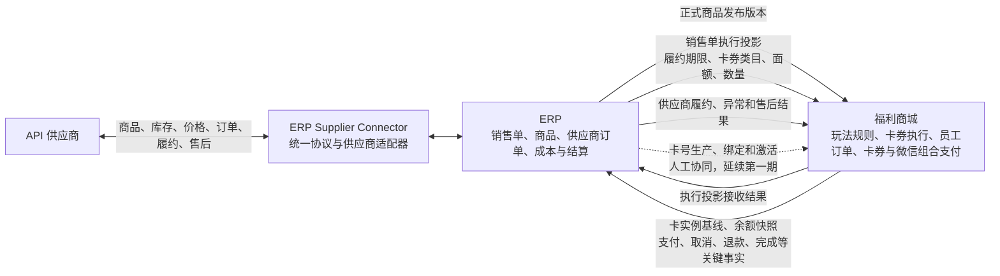
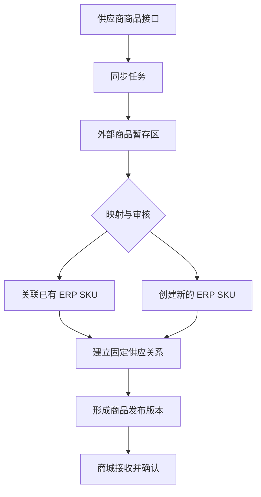
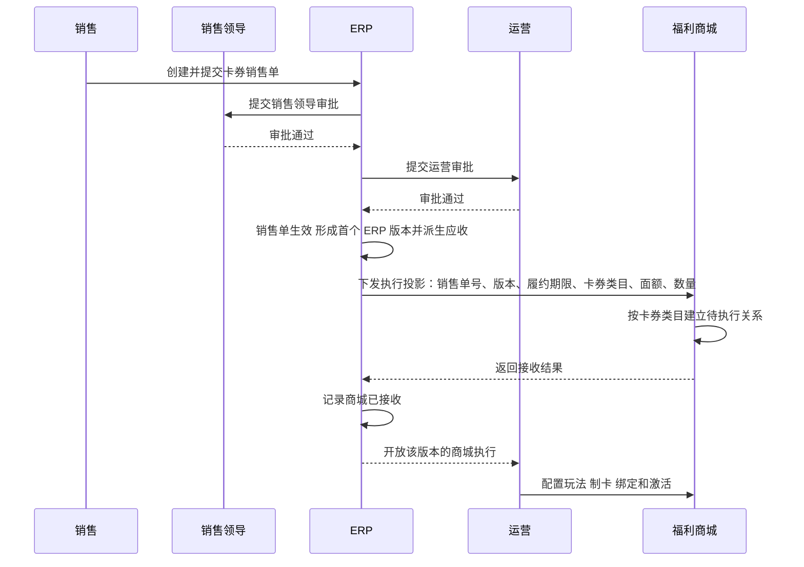
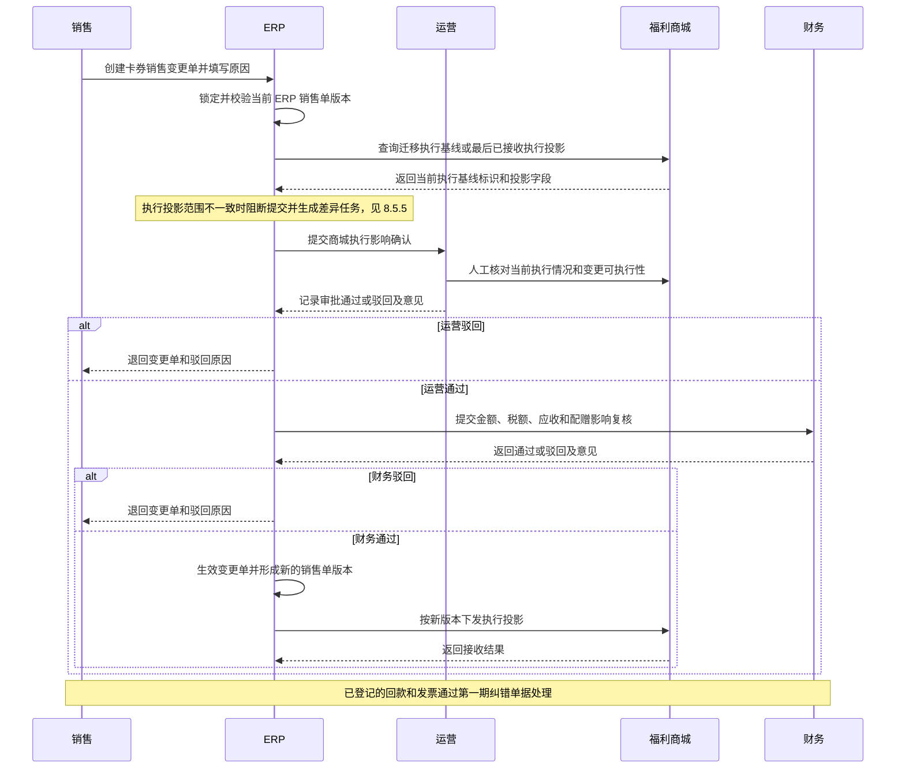
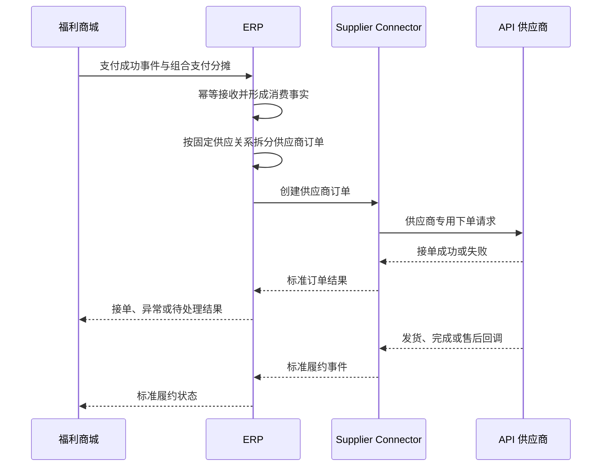

# 员工福利 ERP 第二期建设方案

本文在 ERP 第一期业务闭环已经确定的基础上，说明第二期仍需补齐的功能、系统边界、核心流程、逻辑数据扩展、接口契约、页面范围和验收标准。

除第 21 章明确列出的衔接修订外，第二期不重新设计第一期的合同、销售、采购、卡券、库存和结算单据；第二期在其上补齐 ERP、福利商城及 API 供应商之间的自动协同，完成正式存量卡券销售单的主责迁移，使全部 B2B 销售单统一由 ERP 主责，并使商城消费、实际成本和经营结果能够完整追溯。

---

## 1. 第二期建设结论

ERP 第一期已经覆盖：

- 客户、合同和实物与服务销售单管理，以及商城卡券销售单向 ERP 的同步；
- 实物商品、虚拟商品、卡券和线下服务；
- 采购、入库、发货、验收和库存；
- 客户应收、供应商应付、收付款、发票和核销，含卡券销售单票款；
- 非卡券成本费用、实际经营盈亏和客户经营质量；
- 固定状态机、配置化权限、审计、待办、预警和经营分析。

第二期的核心缺口不在公司内部单据流转，而在以下六个方面：

1. ERP 商品仍需人工传递到商城，无法保证商品、价格和状态一致；
2. 卡券销售单仍在商城创建和变更，ERP 只能被动同步，无法承接客户变更；
3. 商城订单、组合支付、卡券消费和退款明细没有自动回流 ERP；
4. API 供应商商品、订单、履约和售后没有统一接入能力；
5. 卡券业务缺少消费侧实际采购成本、未消费余额和完整经营结果；
6. 跨系统消息缺少统一的幂等、重试、差异核对和人工补偿机制。

因此第二期定位为：

> **完成正式存量卡券销售单的主责迁移，使全部 B2B 销售单统一由 ERP 主责，建设 ERP、福利商城和 API 供应商之间的标准化业务协同，并形成卡券业务从企业销售、员工消费、供应商履约到实际成本和经营结果的闭环。**

卡券生产、印刷、绑定和激活不在第二期缺口内，继续留在商城闭环，理由见第 8.4 节。

### 1.1 第二期新增术语

第一期术语沿用第一期第 2.1 节，本文不再重复。第二期新增术语如下，正文直接使用术语名。

| 术语 | 定义 |
| --- | --- |
| **执行投影** | ERP 卡券销售单生效后自动向商城下发的执行指令，含销售单级卡券类目与履约期限，以及唯一卡券明细的面额、数量和电子卡或实体卡标识，不含金额、税率和应收。商城据此建立或调整卡券执行关系；商城确认接收后运营才能执行受该版本影响的玩法配置、制卡、绑定和激活 |
| **主责迁移** | 第二期上线时把已生效及之后状态、且未作废的正式存量卡券销售单的主责系统标记从福利商城改为 ERP 的一次性动作。商城草稿不迁移。迁移动作只改标记，不产生新单号 |
| **人工最终基线确认** | 维护窗口冻结相关写入后，由上线负责人确认商城最终商业事实已完整同步为 ERP 当前版本，并记录确认时间、确认人和最后同步水位。它是人工切换动作，不产生新的销售单版本，也不建设自动化验收门槛 |
| **玩法规则** | 定义见第一期第 2.1 节。第二期仍由商城自管，ERP 不建模、不保存、不校验，也不要求商城回报 |
| **Supplier Connector** | ERP 内部的供应商接入层，把各供应商协议转换为统一内部命令和事件，隔离签名、鉴权、字段映射和供应商专用错误 |
| **供应商供给关系** | 一条"ERP SKU ↔ 供应商外部商品"的供货绑定，独立保存价格、库存、区域、能力和有效期 |
| **固定供应关系** | 同一个商城商品发布版本只绑定一条供应商供给关系，不做动态比价和路由 |
| **组合支付** | 员工一笔商城订单同时使用一张或多张卡券和微信支付付款。商城不存在福利账户 |
| **分摊** | 把每个支付来源的金额落到具体商品明细上的结果矩阵，用于把消费和成本归属到卡券、客户和原销售单 |
| **卡实例引用** | 商城为每张卡生成且终身不变的不透明稳定标识，不能用于反推出卡号或卡密。ERP 保存该引用、原销售单身份和初始余额，不接收卡号、卡密或卡实例绑定手机号 |
| **业务事实键** | 标识一项支付、取消、退款、订单完成或卡券余额恢复事实的稳定身份。实时事件和历史回填使用同一业务事实键去重，不以商城订单号单独作为幂等键 |
| **商城售后请求 ID** | 商城为每次取消或退款售后案件生成的稳定标识。取消、退款和余额恢复结果事实始终携带该标识；需要 ERP 调用供应商时，动作请求使用同一标识。它只用于串联和审计，不表示同步商城处理中状态 |
| **成本口径** | 单笔消费的成本可信级别，取 `ACTUAL`、`STANDARD` 或 `NONE`，按消费记录逐笔标记。定义见第 12.3.1 节 |
| **成本覆盖率** | 已取得成本的消费金额 ÷ 总消费金额。按销售单、客户、卡券类目或期间计算，用于说明经营结果的可信范围 |
| **消费回流启用日** | P0、P1 同批上线并完成主责迁移后，ERP 开始实时接收商城关键业务事实的系统级时间点，记为 `T`。以支付成功事实的发生时间划分履约归属：`T` 之前支付成功的订单沿用原人工履约链，历史回填只记账、不触发供应商下单；`T` 及之后支付成功的订单进入 ERP 自动履约链。切换维护窗口内不产生本次切换范围内的新业务事实 |

---

## 2. 功能缺口分析

| 业务领域 | 第一期现状 | 功能缺口 | 第二期处理 |
| --- | --- | --- | --- |
| 卡券销售单 | 商城主责，ERP 定时同步数据 | 卡券与实物服务销售入口分离，ERP 无法承接客户变更 | 商城停止建单，已生效及之后状态、且未作废的正式存量单主责迁入 ERP；草稿作废且不迁移 |
| 卡券销售单审批 | 商城内部完成生效处理，ERP 不参与 | 主责迁入 ERP 后缺少线上销售单提交、生效和责任衔接 | 销售提交后依次由销售领导和运营审批，运营审批通过后销售单生效并自动同步商城 |
| 卡券类目变更 | 只能在商城改，ERP 被动拉取 | 客户要求变更没有 ERP 侧的商业单据、审批和金额影响记录 | 变更走 ERP 销售变更单，生效后向商城下发执行投影 |
| 商城玩法规则 | 商城自管，不进入 ERP | 无缺口 | 保持商城自管，ERP 不建模、不校验、不版本化 |
| 卡券生产与激活 | 商城闭环内完成，ERP 不建单据 | 无控制能力缺口 | 保持商城执行，不建设生产、绑定和激活控制接口；只同步稳定卡实例与余额事实，理由见 §8.4 |
| ERP 商品与商城商品 | 采用人工协同 | 商品、价格、状态可能不一致 | ERP 发布正式商品版本，商城自动接收 |
| API 供应商商品 | 只登记供应商 API 能力 | 无商品同步、映射和变更处理 | 建设供应商商品同步暂存、映射和审核 |
| 商城消费 | 不进入 ERP 主流程 | 无法追溯卡券实际消费和商品构成 | 商城只同步已支付、已取消、已退款、已完成和余额已恢复等不可变关键事实，不同步处理中间态；并回填历史事实 |
| 组合支付 | 未建模 | 无法把一笔消费准确归属到卡券、客户和销售单 | 同步支付来源及商品分摊明细 |
| API 供应商订单 | 无自动接口 | 支付后仍需人工向供应商确认 | ERP 按固定供应关系自动创建供应商订单 |
| API 供应商履约 | 无统一状态 | 发货、完成、取消和退款无法自动追踪 | 统一订单、履约、售后和错误契约 |
| 卡券实际成本 | 第一期明确不建设 | 卡券利润贡献无法计算 | 按消费商品和供应商结算成本归集 |
| 未消费余额 | 商城掌握 | ERP 无法判断剩余履约责任 | 同步稳定卡实例引用、原销售单身份、初始余额和周期余额快照 |
| 供应商结算 | 主要基于第一期采购单 | API 小额订单难以逐单人工采购 | 按供应商和结算周期汇总对账并形成应付 |
| 接口运维 | 只有 ERP 单向拉取商城的轮询同步任务，无对外发送能力 | 缺少 outbox、业务接口任务、重试和差异中心 | 建设 outbox、接口任务、错误中心和对账任务 |
| 卡券经营分析 | 只分析成交、面值和配赠 | 缺少消费率、实际成本和最终盈亏 | 增加消费、成本覆盖和卡券经营分析 |

### 2.1 不属于第二期缺口的事项

以下事项经过业务确认，不进入第二期：

- 销售商机、投标、客户拜访、续签和 CRM；
- 采购询价、比价、报价单和供应商在线报价；
- H5 供应商商城、H5 单点登录及回跳支付；
- 多供应商动态比价和智能路由；
- 财务软件接口、银行流水接口和会计凭证；
- 仓库调拨、盘点任务、商品批次和保质期；
- 完整员工档案和员工画像；
- 完整财务总账、法定财务报表、生产制造和复杂 BOM。

采购询价继续由采购部门在线下完成。ERP 第二期接收采购确定后的供应商商品和接口数据，不把线下沟通过程改造成 ERP 询价单。

---

## 3. 第二期建设原则

### 3.1 按业务对象确定主责系统

第二期不再使用“所有数据只能有一个全局事实源”的绝对表述，而是按业务对象明确主责系统。

| 业务对象 | 主责系统 | 其他系统的责任 |
| --- | --- | --- |
| 企业客户、合同和全部 B2B 销售单 | ERP | 商城只接收销售单执行投影，商业字段只读 |
| 卡券类目、面额、数量、金额和履约期限 | ERP | 属于销售单商业事实，变更走 ERP 销售变更单 |
| 卡券玩法规则 | 福利商城 | ERP 不建模、不保存、不校验 |
| 供应商原始商品目录 | API 供应商 | ERP 同步、暂存和保留来源版本 |
| ERP 正式商品及供应关系 | ERP | 商城只接收已发布版本 |
| 商城陈列、排序和员工端交互 | 福利商城 | 不修改 ERP 商品身份、价格和供应关系 |
| 员工订单、卡券余额扣减、微信支付和支付结果 | 福利商城 | ERP 只接收已支付、已取消、已退款、已完成和余额已恢复等不可变关键事实，不接收处理中间态 |
| 卡实例、卡号生产、绑定和激活执行 | 福利商城 | 商城闭环内执行；ERP 不建生产或激活单据，不接收卡号和卡密，但接收稳定卡实例引用、原销售单身份和初始余额 |
| 供应商订单及内部履约跟踪 | ERP | 供应商回传其外部履约结果 |
| 供应商外部履约结果 | API 供应商 | ERP 标准化后同步商城 |
| 卡券实际成本、供应商应付和经营结果 | ERP | 商城和供应商提供原始消费及结算事实 |
| 卡券实时余额 | 福利商城 | ERP 保存周期快照并核对差异 |

同一事实可以在多个系统中保存，但只能由主责系统发起正式变更。其他系统保存的是缓存、同步数据、快照或派生结果。

第二期上线后，全部 B2B 销售单的主责系统统一为 ERP。已生效及之后状态、且未作废的正式存量卡券销售单在上线时按第 8.5 节完成主责迁移；商城草稿统一作废，不进入 ERP。迁移后不再由商城发起商业变更，销售单主责系统在生命周期内不得再次切换。

销售单的"业务来源"和"主责系统"是两个独立维度，定义见第一期第 4.1 节。**卡券销售单**指企业客户的线上福利业务，这一分类终身不变；第二期迁移改变的只是它的主责系统，不改变它仍然是卡券销售单。因此第二期文档中不再出现"商城渠道销售单""ERP 原生销售单"等按创建系统命名的旧称谓。

### 3.2 商城只对接统一 ERP 契约

- 商城不为每个供应商开发专用接口；
- 商城商品统一使用 ERP `product_id`、`sku_id` 和发布版本；
- ERP 卡券销售单统一向商城下发执行投影，含销售单级卡券类目与履约期限，以及唯一卡券明细的面额、数量和卡形态；
- 商城订单统一向 ERP 发送已经发生的关键业务事实，不发送待支付、退款处理中、履约处理中等中间状态；
- 商城按照 ERP 返回的统一状态、能力标识和错误码进行兼容；
- 新增 API 供应商时，只新增 ERP 供应商适配器和业务配置。

### 3.3 ERP 管销售项，商城管玩法

卡券类目、面额、数量、金额和履约期限属于 ERP 销售单商业事实，变更走 ERP 销售变更单；玩法规则由商城自管。完整职责划分和不建设权益方案对象的理由见第 8.1 节，变更流程见第 8.3 节。

### 3.4 供应商协议统一抽象

ERP 对供应商能力统一抽象，但不要求所有供应商实现全部能力。

供应商未提供某项能力时：

1. ERP 返回统一的“不支持”或“执行失败”错误；
2. 商城按商品能力标识隐藏、禁用或降级相关操作；
3. 已发生业务需要继续处理时，ERP 创建人工异常任务；
4. 不在商城或 ERP 业务模块中增加供应商专用判断。

### 3.5 固定供应关系，不建设动态路由

- 每个商城在售商品发布版本绑定一个确定的供应商供给关系；
- 同一个 ERP 商品允许维护多个供应商供给，但同一发布版本只使用其中一个；
- 供应商切换由采购或运营在 ERP 人工完成；
- 切换后形成新的商品发布版本并同步商城；
- 已支付订单继续使用下单时保存的供应商和商品快照；
- ERP 不在结算时执行多供应商动态比价、评分或拆量。

### 3.6 商城支付不依赖供应商实时接口

商城负责卡券余额扣减和微信支付。支付成功后，商城把订单和消费事实可靠发送给 ERP，ERP再向固定供应商提交订单。

供应商下单失败时不得删除商城支付事实，而应：

1. 保存失败原因和供应商响应；
2. 按幂等规则重试或查询原订单；
3. 无法恢复时创建异常任务；
4. 通知商城进入微信退款、恢复卡券余额或人工处理流程。

---

## 4. 系统边界与总体架构



### 4.1 ERP 负责

- API 供应商连接和能力登记；
- 供应商原始商品同步和版本留痕；
- 外部商品与 ERP 商品、SKU 的映射；
- 商品分类、定价、固定供应关系和上架审核；
- ERP 商品向商城发布、更新和停止销售；
- 全部 B2B 销售单创建，含原线上业务；
- 卡券销售单的销售提交、销售领导审批、运营审批和生效；
- 正式存量卡券销售单的主责迁移和迁移清单审计；
- 销售单执行投影下发、销售变更单下发和商城接收结果跟踪；
- 商城订单已支付、已取消、已退款、已完成、余额已恢复等关键事实接收；
- 稳定卡实例引用、原销售单身份、初始余额和周期余额快照接收；
- 供应商订单创建、查询、履约和售后跟踪；
- 供应商订单成本、结算对账和应付形成；
- 卡券未消费余额快照、消费成本和经营结果；
- 接口重试、异常、差异核对和审计。

### 4.2 福利商城负责

- 商品展示、搜索、推荐、排序和员工端交互；
- 玩法规则的配置与执行；
- 接收 ERP 正式商品发布版本；
- 接收 ERP 卡券销售单执行投影，按销售单级卡券类目与履约期限，以及唯一卡券明细的面额、数量和卡形态建立或调整卡券执行关系；
- 返回执行投影接收结果；
- 卡号生产、卡密生成、实体卡印刷、手机号绑定和卡券激活的实际执行，按商城自有流程完成，见第 8.4 节；
- 为每张卡生成稳定卡实例引用，并同步原销售单身份、初始余额和周期余额快照；卡实例基线不得向 ERP 发送卡号、卡密和绑定手机号；
- 购物车、商城主订单和商城订单明细；
- 一张或多张卡券及微信支付的组合支付；
- 卡券余额扣减、恢复和实时余额；
- 在支付、取消、退款、订单完成或卡券余额恢复已经发生后可靠发送不可变关键事实，不发送处理中间状态；
- 接收 ERP 供应商履约、异常和售后结果；
- 根据商品能力标识和标准错误码兼容供应商能力差异。

第二期上线并完成主责迁移后，商城不得自行创建 B2B 销售单或与 ERP 无关的正式在售商品，不得直接修改 ERP 管理的销售商业事实、卡券类目、面额、数量、履约期限、商品身份、销售价格、供应关系和上下架状态。

该禁令不覆盖玩法规则。玩法规则始终由商城运营自行管理，第二期不收归 ERP。

### 4.3 API 供应商负责

- 提供其实际具备的商品、价格、库存和订单接口；
- 返回外部商品和订单的稳定标识；
- 接收 ERP 提交的供应商订单；
- 返回接单、发货、完成、取消和退款结果；
- 保证同一幂等键不重复创建订单；
- 按约定提供结算价、运费、服务费和其他成本；
- 对不支持的能力返回可识别结果。

---

## 5. 第二期功能范围

第二期新增能力编号仅用于本文件组织范围，不替代第一期功能模块编号。

| 编号 | 能力域 | 主要内容 | 主要使用部门 |
| --- | --- | --- | --- |
| P2-C01 | API 供应商接入 | 连接配置、能力声明、适配器、回调和接口测试 | 采购、系统管理员、研发运维 |
| P2-C02 | 外部商品治理 | 商品同步、暂存、映射、变更审核和固定供应关系 | 采购、运营 |
| P2-C03 | 商品发布协同 | ERP 商品版本发布、商城接收确认、暂停和重新发布 | 采购、运营 |
| P2-C04 | 卡券销售审批、主责迁移与商城执行同步 | 销售提交、销售领导审批、运营审批、人工最终基线确认、正式存量单主责迁移、执行投影下发、销售变更单下发和接收确认 | 销售、销售领导、运营、系统管理员 |
| P2-C05 | 商城消费协同 | 稳定卡实例基线，以及支付、取消、退款、订单完成和余额恢复等已发生关键事实回流 | 运营、财务、客服 |
| P2-C06 | 供应商订单履约 | 自动下单、查询、发货、完成，接收商城售后动作请求并执行供应商取消、退款和异常补偿 | 采购、运营、客服 |
| P2-C07 | API 供应商结算 | 订单成本、周期对账、差异和供应商应付 | 财务、采购 |
| P2-C08 | 卡券经营核算 | 消费率、未消费余额、实际成本和经营结果 | 财务、销售、管理层 |
| P2-C09 | 接口治理 | 幂等、重试、错误中心、差异核对、监控和审计 | 系统管理员、研发运维 |

---

## 6. API 供应商接入

### 6.1 统一能力模型

每个供应商连接声明其实际支持的能力：

| 能力代码 | 业务含义 |
| --- | --- |
| `CATALOG_SYNC` | 同步商品目录 |
| `PRICE_SYNC` | 同步供货价格 |
| `STOCK_SYNC` | 同步可售库存或可供状态 |
| `ORDER_CREATE` | 创建供应商订单 |
| `ORDER_QUERY` | 查询订单状态 |
| `ORDER_CANCEL` | 取消未履约订单 |
| `REFUND_APPLY` | 申请退款 |
| `REFUND_QUERY` | 查询退款状态 |
| `LOGISTICS_QUERY` | 查询物流信息 |
| `STATUS_CALLBACK` | 主动推送订单或售后状态 |
| `SETTLEMENT_SYNC` | 同步结算明细或账单 |

能力声明只表示供应商接口具备该操作，不表示每个商品都必然可用。商品发布版本还需保存商品级能力标识。

### 6.2 Supplier Connector

`Supplier Connector` 是 ERP 内部独立的逻辑接入层，负责：

- 把不同供应商协议转换为统一内部命令和事件；
- 隔离签名、鉴权、字段映射和供应商专用错误；
- 生成统一错误码和能力不足结果；
- 处理请求幂等、超时、重试和回调验签；
- 保留脱敏后的请求摘要、响应摘要和关联业务单号；
- 禁止在业务日志中记录密钥、完整手机号、完整地址或其他敏感信息。

ERP 商品、采购、结算和分析模块不得直接调用供应商专用 API。

### 6.3 统一错误分类

| 错误类型 | 处理规则 |
| --- | --- |
| 能力不支持 | 返回统一错误，商城隐藏、禁用或转人工 |
| 参数或商品映射错误 | 不重试，进入数据修复队列 |
| 供应商业务拒绝 | 保存拒绝原因，通知商城和业务人员 |
| 网络超时或临时不可用 | 自动重试，重试前先按幂等键查询 |
| 结果未知 | 不直接再次创建订单，先查询原请求结果 |
| 鉴权或签名失败 | 停止自动重试并立即告警 |
| 限流 | 按供应商规则退避重试 |
| 回调重复 | 按外部事件 ID 幂等忽略 |
| 回调乱序 | 按状态版本和发生时间校验，不允许状态倒退 |

---

## 7. 外部商品同步与 ERP 商品发布

### 7.1 商品同步流程



### 7.2 外部商品暂存

供应商同步数据先进入暂存区，不得直接写入 ERP 正式商品和商城商品。

暂存数据至少包括：

- 供应商和连接；
- 外部商品 ID、外部 SKU ID；
- 商品名称、规格、分类、图片和说明；
- 供货价、建议零售价、运费和其他费用；
- 可供区域、库存或可供状态；
- 预计发货时间和售后说明；
- 供应商商品版本、更新时间和原始数据摘要；
- 支持的商品级接口能力。

同一次同步必须区分新增、变化、无变化、停止供应和异常数据。

### 7.3 商品映射与审核

- 新外部商品必须人工关联已有 ERP SKU 或创建新 SKU；
- 一个 ERP SKU 可以关联多个供应商外部商品；
- 每条供应商供给关系独立保存价格、库存、区域、能力和有效期；
- 同一个商城商品发布版本只能绑定一条供应商供给关系；
- 商品名称、规格、供货价和可供范围变化进入待处理队列；
- 新商品及关键字段变化确认前不得自动发布商城；
- 供应商外部商品停止供应后，相关发布版本立即变为不可下单并生成待办。

### 7.4 价格和库存变更

- 库存或可供状态允许按供应商接口自动同步；
- 供应商库存为零、不可供或数据过期时，ERP通知商城暂停下单；
- 供应商供货价变化不得直接修改商城销售价；
- 供货价变化进入采购或运营审核队列；
- 在成本变化未确认前，相关商品默认暂停新订单，避免按失效成本继续销售；
- 审核通过后形成新的供应关系版本和商品发布版本；
- 已支付订单继续使用下单时的商品、销售价和供应商成本快照。

### 7.5 ERP 向商城发布

商品发布数据至少包括：

- ERP 商品 ID、SKU ID；
- 发布版本和数据版本；
- 名称、规格、图片、分类和销售说明；
- 含税销售价、税率和计量单位；
- 可销售区域和上下架状态；
- 固定供应关系标识；
- 支持取消、退款、物流查询等商品级能力；
- 生效时间、失效时间和更新时间。

商城接收后必须返回成功或失败结果。ERP 只有收到商城成功确认后，才把该版本标记为“商城已生效”。

商城可以维护推荐位、排序、频道和员工端展示配置，但不得覆盖 ERP 发布的商品身份、规格、销售价、供应关系和可销售状态。

---

## 8. 销售单主责迁移与商城执行同步

### 8.1 职责划分：ERP 管销售项，商城管玩法

卡券类目在 ERP 中就是一个销售项。中国通和心意卡是两个不同的卡券类目，也就是两个不同的销售项，100 张中国通就是 100 张卡。商城侧，卡券类目代表该卡对应的权益范围。

由此划定职责：

| 内容 | 主责系统 | 说明 |
| --- | --- | --- |
| 卡券类目与履约期限（表头）、面额、数量、成交金额、配赠和卡形态（唯一明细） | ERP | 一张卡券销售单恰好只有一条卡券明细，变更即销售单变更 |
| 客户、合同、税率、开票要求、应收 | ERP | 第一期已确定 |
| 玩法规则 | 福利商城 | ERP 既不保存也不校验 |
| 卡实例、余额、消费和支付执行 | 福利商城 | ERP 接收稳定卡实例引用、原销售单身份、初始余额、周期余额快照和已发生的关键事实 |

第二期不建设"卡券权益方案"这一独立对象，也不建设商城权益配置选项目录、ERP 权益方案版本发布和全卡一致的原子版本切换。原因是：客户确认的权益内容在 ERP 侧就是销售项本身，已经由卡券销售单的唯一卡券明细完整表达；玩法规则不属于 ERP 管理范围，不需要在 ERP 建模、版本化和校验，也不要求商城回报。

ERP 不实现商城购买权限判断、支付校验、卡券余额扣减和余额计算。

#### 8.1.1 卡券销售单审批与生效

第二期由 ERP 承接卡券销售单的创建和审批，固定顺序为：

```text
销售提交
→ 销售领导审批
→ 运营审批
→ 销售单生效
→ ERP 自动向商城发送执行投影
→ 商城确认接收
→ 运营在商城配置玩法、制卡、绑定和激活
```

各环节责任如下：

- 销售依据有效客户、合同和结算约定创建卡券销售单并提交；
- 销售领导审批客户商务条件、销售内容及合同一致性；
- 销售领导通过后进入运营审批，运营确认卡券类目及商城执行条件；
- 运营审批通过后销售单生效，ERP 形成首个不可变销售单版本并派生应收；
- 销售领导或运营驳回后，销售单退回销售处理；只要销售修改卡券类目、面额、数量、成交金额、履约期限或其他销售单内容，必须重新从销售领导审批开始，原审批结果不再有效；
- 销售单生效前不形成应收，不向商城发送执行投影；
- 销售单生效后商业字段锁定，后续调整按第 8.3 节通过销售变更单处理，不直接修改原单。

运营审批决定销售单是否具备商城执行条件，但运营不得在审批时修改销售商业字段。销售单生效与商城执行是两个连续但独立的阶段：商城接收失败不回退已经生效的销售事实和应收，但会阻断受影响的商城执行。

### 8.2 销售单向商城下发执行投影

卡券销售单生效后，向商城下发执行投影，供商城建立或调整对应的卡券执行关系。卡券销售单的每个版本必须恰好包含一条卡券明细；同一版本需要同时存在不同卡券类目、面额、配赠条件、电子卡或实体卡形态或履约期限时，拆成不同销售单。

执行投影至少包括：

- ERP 销售单号和 ERP 销售单版本；
- 客户标识；
- 履约期限，即卡券有效期，销售单级一个值，见第一期第 4.3.1 节；
- 卡券类目，销售单级一个值，见第一期第 4.3.2 节；
- 唯一卡券明细的面额和数量；
- 电子卡或实体卡标识；
- 生效时间。

执行投影不包含玩法规则、成交金额、配赠金额、税率、开票要求和应收信息。这些属于 ERP 内部商业事实，商城不需要也不应当接收。



商城未确认接收前：

- ERP 销售单商业事实保持已生效，不因接口失败被删除或回退；
- ERP 将该销售单的卡券执行进度显示为"待商城接收"或"商城接收失败"；
- 自动重试超过上限后进入人工错误中心；
- 新销售单不得开始玩法配置、制卡、绑定和激活；
- 销售变更单产生的新版本，只阻断该版本影响的新增或变更部分；商城已经按旧版本完成的存量执行事实继续保留，不回退、不重复执行。

商城确认接收后，ERP 将该版本的卡券执行进度更新为"商城已接收"，运营才可以按第 8.4 节进入商城继续执行。

### 8.3 卡券类目变更走销售变更单

更换卡券类目等于更换销售的标的，属于销售单的商业变更。因此：

- 卡券类目、面额、数量和金额的变更只能由负责销售在 ERP 发起销售变更单；
- ERP 创建卡券销售单时**校验恰好只有一条卡券明细**；同一版本需要同时存在不同卡券类目、面额、配赠条件、电子卡或实体卡形态或履约期限时，必须拆成不同销售单，见第一期第 4.3.2 节。该校验保证 ERP 不产生商城无法执行的投影；
- 变更生效后 ERP 形成新的销售单版本，原版本保留；
- ERP 按新版本向商城下发执行投影，商城调整对应的卡券执行关系并返回结果；
- 商城玩法规则的调整不需要 ERP 变更单，由商城运营直接完成，ERP 不感知；
- 商城运营不得自行修改卡券类目、面额、数量和履约期限，这些字段在商城侧只读。

#### 8.3.1 卡券销售变更单的部门时序

卡券销售变更单**不走**第一期第 6.5.1 节的时序。第一期第 6.3 节已明确该时序只适用于实物与服务销售单，第 6.5.1 节的履约影响确认方是采购；卡券的履约在商城执行，采购无从判断。卡券侧的对口部门是运营，见第 16 章。



运营或财务驳回后，销售修改并重新提交会形成新的不可变提交版本；原运营确认和财务复核
全部失效并保留审计，新提交必须从运营确认重新开始。财务只能复核运营已通过的同一提交
版本和内容指纹；生效时必须重新校验基准销售版本仍为当前版本且两级结果均属于当前提交。

#### 8.3.2 运营人工判断商城执行影响

存量单和已下发执行投影的新单可能已经完成部分商城执行。ERP 不接收独立的发卡数、激活数作为销售变更依据，也不根据可由卡实例基线汇总出的数量自动判断销售变更是否允许。

销售变更涉及卡券类目、唯一明细的面额、数量、配赠条件、卡形态、履约期限或成交金额时：

- 运营在审批环节自行进入商城核对当前执行情况，判断商城能否按变更后的内容继续执行；
- ERP 只保存运营审批结论、审批意见、审批人和审批时间；卡实例基线仅用于追溯和余额核对，不作为销售变更的执行数量依据；
- 运营确认无法执行时驳回变更单，由销售与客户重新协商；
- 运营审批通过表示已确认商城可以承接新版本，之后再完成财务影响复核并使变更单生效；
- ERP 从商城订单同步得到的已消费金额只用于消费台账和经营分析，不参与销售变更的自动阻断判断；
- 销售变更单生效后，ERP 按新版本向商城发送执行投影；商城未确认接收前，仍按第 8.2 节阻断该版本影响的商城执行。

ERP 不建设基于发卡数、激活数或消费金额的卡券销售变更规则矩阵，也不要求商城另行提供这些汇总数量作为销售变更接口字段。

销售变更可以在新版本中整体替换原单的唯一卡券明细，但新版本仍必须恰好只有一条明细，不得在原单新增第二条明细。只有原条件和新条件需要在同一生效结果中同时存在时，才另开卡券销售单。

变更下发的幂等依据是"ERP 销售单号 + ERP 销售单版本 + 目标商城"。重复下发同一版本不产生重复调整。

技术失败可以使用原版本和原幂等键重试。业务内容发生变化时必须先在 ERP 走新的销售变更单，不允许直接改写下发内容。

对账发现 ERP 销售单当前版本与商城执行关系不一致时，只生成差异任务，不直接修改任一系统的正式事实。

### 8.4 卡券生产、印刷、绑定和激活继续留在商城

第二期不把卡号生产、实体卡印刷、手机号绑定和卡券激活收归 ERP，也不建设这些环节的控制接口。它们继续留在商城闭环内，按商城自有流程执行，见第一期第 3.1 节和第 3.3 节：

| 环节 | 第二期做法 | ERP 侧 |
| --- | --- | --- |
| 卡号生产和卡密生成 | 商城按销售单执行投影生成 | 不建生产单据，不接收卡号和卡密；只接收稳定卡实例基线 |
| 实体卡印刷 | 商城闭环内完成，印刷费按第一期第 7.5 节直接登记为卡券成本费用 | 只登记费用，不建印刷采购单 |
| 实体卡出入库 | 商城和仓库自行管理 | 不建单卡号库存 |
| 手机号绑定 | 商城执行 | 不建激活单 |
| 卡券激活 | 商城执行 | 不建激活单 |

商城为每张卡生成终身不变、不能用于反推出卡号或卡密的卡实例引用。卡实例建立后，商城向 ERP 同步该引用、原销售单身份和初始余额，不要求商城回传 ERP 内部销售单版本号。第一期存量单以“来源商城 + 来源销售单号”解析原销售单，第二期新单以执行投影中的 ERP 销售单号解析原销售单。

凡是会被实时或历史关键事实引用的卡实例，无论当前是否有效、已耗尽或已到期，都必须按上述字段形成基线；当前有效卡继续提供周期余额快照。卡实例基线和余额快照是非敏感追溯事实，不表示 ERP 参与制卡、绑定、激活或实时余额扣减，也不允许 ERP 反向控制这些过程。

卡实例基线首次成功写入后不可覆盖。相同卡实例引用重复同步且原销售单身份、初始余额完全一致时只确认接收；任一字段不一致时保留既有基线并进入差异任务，经业务确认后用追加纠错记录修正，不自动改写原记录。

消费只归集到原销售单及继承其稳定身份的唯一卡券明细，不按发卡时的 ERP 销售单版本拆分。销售变更前后的卡实例共用同一归集身份；版本差异只在销售单版本历史中追溯，不用于卡实例匹配。

对于二期 ERP 新建的卡券销售单，以及销售变更单形成的新版本，商城必须先成功接收对应执行投影，运营才能开始该版本影响的玩法配置、制卡、绑定和激活。执行投影接收失败时，商城既有卡券和旧版本已经完成的执行事实不回退，但不得按未确认的新版本继续执行。

这样安排的原因是：卡券生产和激活是低频、批量、需要人工核对的操作，且已经在商城稳定运行，收归 ERP 的收益低于接口和对账的建设成本；而第二期真正的缺口在商品协同、消费回流、供应商接入和成本核算，这些才是商城和人工无法承担的部分。

第二期改变的是**开单权和非敏感事实回流**：销售单由 ERP 开出并下发执行投影；商城继续执行卡券，同时回流卡实例基线、余额快照和关键业务事实。卡券的生产与激活方式本身不变。

因此第 2 节的功能缺口表不包含卡券生产和激活控制，只包含卡实例和余额事实同步。第二期一旦发现商城侧执行链路成为瓶颈，再单独立项。

### 8.5 存量卡券销售单主责迁移

第二期上线时，商城停止创建新的 B2B 销售单，同时把正式存量卡券销售单的主责系统迁入 ERP。商城草稿不迁移。之后全部线上和线下 B2B 销售单统一由 ERP 主责。

#### 8.5.1 迁移范围

迁移范围只包括已生效及之后状态、且未作废的正式存量卡券销售单。

商城草稿不进入迁移清单，不在 ERP 生成销售单或主责迁移记录；第二期进入维护窗口并关闭商城 B2B 建单入口后，现存草稿统一作废，不在 ERP 补建。

不按"已关闭"筛选。线上卡券销售单的履约期限一般为两年，履约完成的实际条件只有履约期限到期，因此绝大多数存量单在第二期上线时仍处于履约中，必须迁移才能承接后续变更。

#### 8.5.2 迁移不涉及"转为可编辑单据"

ERP 的正式销售单本身就不允许直接编辑。销售单生效后的任何商业变更都要走销售变更单，由 ERP 形成新版本。因此正式存量单迁移不存在"从只读数据升级为可编辑正式单据"的问题。

迁移动作只有一件事：把该销售单的主责系统标记从福利商城改为 ERP。

迁移前后对比：

| 项目 | 迁移前（第一期） | 迁移后（第二期） |
| --- | --- | --- |
| 主责系统 | 福利商城 | ERP |
| 商业变更来源 | 商城变更后由 ERP 同步形成新版本 | ERP 销售变更单形成 ERP 版本 |
| ERP 侧可否发起变更 | 不可 | 可，通过销售变更单 |
| 是否可直接编辑单据 | 不可 | 不可 |
| 历史版本 | 第一期轮询实际观察并形成的版本 | 完整保留已观察版本，作为迁移前的来源版本 |
| ERP 轮询同步 | 持续同步商业字段 | 停止同步商业字段 |
| 应收、回款、发票 | ERP 派生和登记 | 不变 |

迁移后该单由第一期轮询实际观察并形成的版本完整保留，与迁移后产生的 ERP 版本在同一条版本序列上按时间顺序展示，并标注版本来源是商城同步还是 ERP 变更单；不把轮询间隔内未被观察到的中间状态表述为已保存版本。

#### 8.5.3 迁移后商城侧的权限

| 内容 | 商城侧权限 |
| --- | --- |
| 客户、合同、卡券类目、面额、数量、金额、履约期限 | 只读，不允许人工修改 |
| 玩法规则 | 商城运营自行管理，ERP 不感知 |
| 卡号生产、印刷、绑定、激活 | 保留，按第 8.4 节在商城执行 |
| 员工消费、组合支付、卡券余额扣减 | 保留，按第 9 章向 ERP 回流事实 |
| 创建新的 B2B 销售单 | 永久关闭 |

商城不得自行修改已迁移销售单的商业字段。需要修改时由销售在 ERP 发起销售变更单，ERP 下发后商城执行。

#### 8.5.4 切换准备与安排

第二期切换按以下条件组织：

1. P0 与 P1 的生产能力使用同一发布批次上线；卡券销售、供应商下单、取消、退款、余额恢复、人工异常和对账能力在切换开放前全部可用；
2. ERP 向商城下发执行投影的接口双向联调通过；
3. 全部已生效及之后状态、且未作废的正式存量卡券销售单在 ERP 侧存在当前版本，客户、合同和卡券类目映射完成，并且来源快照恰好只有一条卡券明细；
4. 商城侧已完成商业字段只读化改造，B2B 销售单创建入口可在维护窗口开始时关闭并在切换后保持永久关闭；入口关闭后可统一作废现存草稿；
5. 商城已具备稳定卡实例引用、原销售单身份、初始余额和周期余额快照同步能力；
6. 迁移清单已由销售和财务确认；
7. 切换使用夜间维护窗口；窗口内 ERP 和商城都不产生本次切换范围内的销售单新建或变更、制卡、卡实例生成、初始余额登记、支付、取消、退款、订单完成和卡券余额恢复等新业务事实；
8. 冻结写入后，由上线负责人人工确保第 8.5.5 节的最终权威基线已经形成，为每张迁移单登记迁移执行基线，并确认所有会被实时或历史关键事实引用的卡实例均已完成稳定引用、原销售单身份和初始余额基线同步。

以上是本次人工切换的操作条件，不另建设自动化阶段退出指标或切换验收门槛。

#### 8.5.5 人工确认最终权威基线

进入维护窗口并冻结相关写入后，ERP 完成最后一次第一期增量同步。上线负责人使用商城全量清单和单据查询结果，人工确认全部迁移单的商城最终商业事实已经形成 ERP 当前版本，且客户、合同、卡券类目映射和唯一明细约束没有未处理差异。

人工确认记录确认时间、确认人、最后同步水位和确认结果，并把 ERP 当前销售单版本及第 8.2 节执行投影字段登记为该存量单的**迁移执行基线**。该基线只用于迁移后的商城执行一致性校验，不直接修改销售单，不产生新的销售单版本，也不要求建设额外的自动化切换平台。迁移不核对历史发卡、激活、消费和玩法执行过程；卡实例引用、原销售单身份和初始余额按第 8.4 节形成事实基线，并由上线负责人确认同步完成。

迁移后对存量单发起第一次销售变更时，ERP 以迁移执行基线校验商城执行关系；后续变更以商城最后确认接收的执行投影版本校验。校验只覆盖第 8.2 节执行投影字段，不再通过第一期单据查询接口比较完整商业快照；成交金额、配赠、税率、开票要求和应收等 ERP 内部字段只以 ERP 当前版本为变更基线。执行投影范围不一致时阻断该次变更并生成差异任务，不直接覆盖任一侧正式事实。

#### 8.5.6 迁移执行与失败处理

- 二期采用夜间人工控制上线；第一期五分钟轮询只用于形成最终权威基线；
- 进入维护窗口后，先关闭商城 B2B 销售单创建入口并启用商业字段只读，同时暂停本次切换范围内的制卡、卡实例生成、初始余额登记，以及新支付、取消、退款、订单完成和余额恢复事实产生；
- 确认建单入口已经关闭且不会产生新草稿后，把商城现存 B2B 销售单草稿全部作废，不迁移、不在 ERP 补建；
- ERP 侧在维护窗口内同样不开放卡券销售单新建和变更；
- 完成最后一次第一期同步和人工最终基线确认后，按客户分批迁移；每批记录单号、迁移时间、执行人和迁移前主责系统；
- 单批执行失败时，不提交该批迁移结果，不开放商城或 ERP 写入口；人工修复后使用原迁移批次幂等续跑，不把已经迁移的销售单回退为商城主责，也不恢复第一期轮询；
- 全部批次完成后停止第一期轮询，启用 P0、P1 联合发布的完整链路，把开放时点记为 `T`，再开放 ERP 卡券销售单和商城员工业务；
- 商城 B2B 销售单创建入口在切换后保持永久关闭，不设计应急重开或主责回退路径。

---

## 9. 商城订单、组合支付与消费回流

### 9.1 商城主责范围

商城继续负责：

- 创建员工订单；
- 计算员工实际应付金额；
- 使用一张或多张卡券和微信支付组合付款；
- 扣减及恢复卡券余额；
- 保存实时支付状态和卡券余额；
- 向员工展示订单、履约和售后进度。

ERP 不建设卡券实时余额引擎，不进入卡券余额扣减事务。

商城支付来源只有卡券和微信支付，不存在福利账户；第二期不建设福利账户余额、资金批次或归集模型。

商城保留完整的可变订单状态；只在支付、取消、退款、订单完成或卡券余额恢复已经成功发生后向 ERP 发送不可变关键事实。待支付、支付中、退款处理中、履约处理中等中间状态不进入 ERP。

### 9.2 关键业务事实事件

商城向 ERP 发送的事实类型限定为：

- `PAYMENT_SUCCEEDED`：支付已经成功；
- `ORDER_CANCELED`：订单已经取消；
- `REFUND_SUCCEEDED`：退款已经成功；
- `ORDER_COMPLETED`：商城员工订单已经完成；
- `CARD_BALANCE_RESTORED`：原卡余额已经恢复。

商城不得发送与这些结果相对应的申请中、处理中或待确认事件。ERP 如需展示“退款处理中”等进度，只能根据 ERP 发起的供应商售后动作和已经收到的结果事实派生，不把商城中间状态保存为正式业务事实。

五类关键事实使用共同事件信封，至少包含来源商城、事件 ID、事实类型、商城订单号、事实发生时间、该类结果的业务单号与版本，以及数据签名。取消、退款、订单完成和余额恢复还必须关联原支付事实；取消、退款和余额恢复必须携带商城售后请求 ID，同一售后案件的动作请求和后续结果事实使用同一请求 ID。

各结果事实的专有字段为：

- 支付成功：订单版本及下列商品、支付与履约快照；
- 订单取消：商城售后请求 ID、取消版本、取消范围、实际取消数量或金额和原因；
- 退款成功：商城售后请求 ID、退款单号、退款版本、原商品明细、原支付来源及实际退款金额；
- 订单完成：完成版本和实际完成时间；
- 卡券余额恢复：商城售后请求 ID、关联退款事实、恢复单号、恢复版本、稳定卡实例引用及实际恢复金额。

支付成功事实除共同事件信封外，至少包括：

- 商城用户标识和所属客户；
- 下单时间和支付成功时间；
- ERP 商品 ID、SKU ID 和商品发布版本；
- 每个卡券支付来源对应的稳定卡实例引用。ERP 通过卡实例基线取得原销售单身份，再定位该销售单的唯一卡券明细；商城不需要重复发送卡券商业属性，也不需要知道 ERP 的内部明细 ID；
- 该商品明细的商品成本快照，以及**成本含税标识和成本税率**，用于第 12.1 节第 5 项的成本取值，字段要求见第 12.1.1 节；
- 商品名称、规格、数量、销售单价和明细实付金额快照；
- 优惠、运费及订单总金额；
- 每种支付来源及实际支付金额；
- 支付来源到商品明细的分摊结果；
- 收货和履约所需的订单地址快照。

取消、退款、订单完成和余额恢复事实必须关联原商城订单及原支付事实；退款还要关联原商品明细和原支付来源，余额恢复还要关联稳定卡实例引用和实际恢复金额。每次部分退款和每次余额恢复分别形成自己的不可变事实。

金额作用边界固定如下：`REFUND_SUCCEEDED` 是商城侧冲减原消费金额和原支付来源分摊的唯一结果事实；`CARD_BALANCE_RESTORED` 只记录卡券余额实际回补并证明卡券退款已入账，不再次冲减消费、供应商成本或应付；供应商退款成功事实是冲减供应商成本和应付的唯一依据。`ORDER_CANCELED` 只记录订单取消结果，发生资金退回时仍须另发退款成功事实。三类结果通过商城售后请求 ID 和原业务单据关联，分别幂等记账。

ERP 以商城事件 ID 幂等接收。重复发送不得重复形成消费、成本或供应商订单。只有支付成功事实发生时间不早于 `T` 时，才进入 ERP 自动供应商下单链路；`T` 以前的支付事实即使在 `T` 以后回填或重放，也只补充台账，不创建供应商订单。旧订单在 `T` 以后发生的退款、完成或余额恢复仍按事实回流，但不改变原订单的履约链归属。

消费事实接收与成本归集分开处理：

- 商城支付事实通过签名和基本完整性校验后，ERP 先保存不可变原始事实；
- 商品尚未映射、支付来源暂时无法定位或成本数据尚未准备好时，不拒收、不丢弃消费事实，而是标记为待归集并生成差异任务；
- 待主数据或成本条件补齐后重新归集，仍引用原业务事实键，不生成第二份消费事实；
- 只有商品发布版本和固定供应关系完整时才创建供应商订单；缺少下单条件时进入业务异常，不影响原支付事实留存。

### 9.3 组合支付分摊

商城必须提供“支付来源到商品明细”的实际分摊矩阵：

| 商品明细 | 卡券 A | 卡券 B | 微信支付 | 明细实付 |
| --- | ---: | ---: | ---: | ---: |
| 商品 1 | 80.00 | 20.00 | 0.00 | 100.00 |
| 商品 2 | 0.00 | 50.00 | 30.00 | 80.00 |

分摊必须满足：

1. 每条商品明细的来源分摊合计等于明细实付金额；
2. 每个支付来源的明细分摊合计等于该来源实际支付金额；
3. 每个卡券来源能够追溯到客户和原销售单；
4. 微信支付部分单独记录，不混入客户卡券资金；
5. 商城退款成功事实按原支付来源和原商品明细形成消费反向记录；卡券余额恢复另记余额变动。

ERP 不按订单总额推测商品明细的支付来源，也不保留订单级比例分摊的兼容路径。

每条商品明细的供应商实际成本按该明细的支付来源金额比例分摊：

```text
某支付来源分摊成本
= 商品明细实际成本 × 该支付来源在本明细的支付金额 ÷ 本明细实付金额
```

- 一条明细使用多张卡券时，每张卡券分别按其实际支付金额分摊成本；
- 微信支付按该明细的微信实际支付金额分摊成本；
- 成本金额按分摊结果四舍五入到分，尾差计入该商品明细的最后一个支付来源；
- 供应商最终成本与下单成本不一致时，差额仍按原支付来源比例追加成本调整，不覆盖原成本；
- 商城退款事实按原商品明细和原支付来源追加消费反向记录；供应商退款事实按原成本分摊结果追加成本反向记录。

### 9.4 员工信息边界

ERP 不建设员工主档和员工画像。

ERP 消费事实只保存：

- 商城用户稳定标识；
- 所属客户；
- 卡券来源和微信支付标识；
- 原销售单；
- 商品、金额、支付来源和消费时间。

收货人、手机号和地址仅在供应商履约需要时保存订单快照，完整值加密存储，按数据权限查看，操作日志和接口日志不记录完整值。

卡实例基线不包含卡实例绑定手机号；供应商履约所需的收货手机号属于订单地址快照，两者不是同一数据用途。

---

## 10. 固定供应关系与供应商订单

### 10.1 供应商确定规则

- 每条商城订单明细使用商品发布版本绑定的固定供应商供给；
- ERP 不比较其他供应商价格，不计算供应商评分；
- 同一商城订单包含多个供应商商品时，ERP按供应商拆成多张供应商子订单；
- 一条商城订单明细不得拆量给多个供应商；
- 供应商子订单保存商城订单、商品发布版本、外部商品、供应商和成本快照；
- 后续修改供应关系不影响已经支付的订单。

### 10.2 订单主流程



### 10.3 供应商订单状态

| 状态 | 含义 |
| --- | --- |
| `RECEIVED` | 已接收商城支付事件 |
| `SUBMITTING` | 正在向供应商提交 |
| `ACCEPTED` | 供应商已接单 |
| `REJECTED` | 供应商明确拒绝 |
| `RESULT_UNKNOWN` | 请求超时，结果待查询 |
| `FULFILLING` | 供应商履约中 |
| `SHIPPED` | 已发货 |
| `COMPLETED` | 已完成 |
| `CANCEL_PENDING` | 取消处理中 |
| `CANCELED` | 已取消 |
| `REFUND_PENDING` | 退款处理中 |
| `REFUNDED` | 已退款 |
| `EXCEPTION` | 需要人工处理 |

状态只允许向前迁移。供应商重复或乱序回调不得使已完成、已取消或已退款订单回到处理中。

### 10.4 失败与补偿

- 网络超时后必须先查询供应商订单，不得直接重复下单；
- 供应商明确拒绝时，ERP通知商城进入退款或恢复额度流程；
- 供应商不支持查询时，结果未知订单进入人工异常队列；
- 供应商缺少取消或退款能力时，ERP返回统一能力不足错误并创建人工任务；
- 人工处理不得修改原支付和消费事实，只能追加取消、退款、冲正或补偿记录；
- 商城恢复额度后必须向 ERP 回传余额恢复结果；该结果只更新余额回补记录，消费金额仍以 `REFUND_SUCCEEDED` 冲正，不得重复冲减。

---

## 11. 取消、退款与售后

### 11.1 售后责任

| 环节 | 主责系统 |
| --- | --- |
| 员工发起取消、退款或售后申请 | 福利商城 |
| 判断商品是否具备接口能力 | 商城读取 ERP 商品能力标识 |
| 把取消或退款动作请求提交 ERP | 福利商城 |
| 向供应商提交取消或退款 | ERP Supplier Connector |
| 供应商处理结果 | API 供应商 |
| 卡券余额恢复或微信退款 | 福利商城 |
| 消费、成本和应付冲减 | ERP |

商城向 ERP 提交的取消或退款是**业务动作请求**，不是商城订单状态同步，也不是取消或退款已经成功的结果事实。请求至少包含商城售后请求 ID、原订单和商品明细、动作类型、数量或金额及原因；ERP 按“商城 + 商城售后请求 ID”幂等接收，同一请求不得重复调用供应商。

ERP 根据该请求驱动 Supplier Connector，并把供应商接受、拒绝或待人工处理结果返回商城。只有商城侧取消或退款实际完成后，商城才发送 `ORDER_CANCELED` 或 `REFUND_SUCCEEDED`；卡券余额实际恢复时再发送 `CARD_BALANCE_RESTORED`。申请中、处理中等商城状态仍不作为关键事实同步。

原支付事实发生在 `T` 以前的订单继续沿用原人工售后链，商城不向 ERP 提交供应商售后动作请求；实际取消、退款或余额恢复完成后仍按第 9.2 节回流结果事实。只有 `T` 及之后支付且已形成 ERP 供应商订单的业务，才由上述动作请求驱动 Supplier Connector。

### 11.2 退款规则

- 退款必须关联原商城订单、原商品明细和原支付来源；
- 多支付方式退款按商城实际恢复结果分别记录；
- 卡券恢复金额回到原卡券；
- 微信支付退款单独记录；
- 供应商成本退款关联原供应商订单明细；
- ERP 以商城退款事实和供应商退款事实分别记账。供应商退款只在已经形成需退回的供应商
  成本、应付或付款时适用；`T` 前原人工链、供应商拒单且未计费或未形成应付等情况按
  正式事实判定为不适用。所有适用的商城退款、卡券余额恢复和供应商退款轨道未全部完成
  时状态为“退款处理中”，不适用不得由人工随意选择；
- 商城退款事实按实际商品数量、支付金额和原支付来源追加消费反向记录；供应商退款事实按实际成本金额追加成本和应付反向记录；
- 卡券余额恢复事实只追加余额变动记录，不再次冲减消费、成本或应付；
- 原消费、供应商订单、成本和应付记录不得删除或覆盖。

---

## 12. API 供应商结算与卡券实际成本

### 12.0 本章的前置依赖

卡券消费能算出成本，依赖两件事同时成立：**消费事实回流**，以及 **ERP 侧存在该商品的成本**。后者由第 7 章的外部商品治理和商品发布（`P2-C02`、`P2-C03`）提供，其中的供应商供给版本携带供货价和有效期，是消费成本的取值来源。

因此本章不是一个可以独立交付的模块。商品主数据和供应商供给关系未建成时，消费数据同步过来只有金额没有成本。第 18.1 节的实施顺序已经体现该依赖，本节显式声明以免被误读为"第二期只剩消费同步"。

### 12.1 成本来源

成本来源按业务阶段选择，不是一次性“取到即停”。第二期 ERP 下单的消费先记录下单确认价；履约最终价、供应商结算账单或人工确认金额后续到达时，按更晚且更权威的来源追加成本调整。历史消费则按第 5、6 项依次取值。

| 序号 | 成本来源 | 记录方式 | 成本口径 | 适用消费 |
| --- | --- | --- | --- | --- |
| 1 | 供应商订单确认时返回的结算价 | 形成初始成本，后续可调整 | `ACTUAL` | 第二期 ERP 下单的消费 |
| 2 | 供应商履约完成时返回的最终结算价 | 相对当前累计成本追加差额 | `ACTUAL` | 同上 |
| 3 | 供应商结算账单中的确认金额 | 结算确认后相对当前累计成本追加差额 | `ACTUAL` | 同上 |
| 4 | 无结算接口时，由财务或采购导入、登记的确认金额 | 作为人工确认的最终来源，追加差额 | `ACTUAL` | 非 API 供应商 |
| 5 | **商城订单快照中记录的商品成本** | 作为历史实际成本 | `ACTUAL` | 历史消费，商城已记录成本 |
| 6 | 消费发生时点该 ERP SKU 生效的供应商供给版本（`supplier_offering_revision`）的供货价 | 作为历史标准成本 | `STANDARD` | 历史消费无商城成本，但商品已映射到 ERP SKU 且存在有效供给版本 |
| — | 以上均取不到 | 不记录成本金额 | `NONE` | 商城无成本，且商品无法映射到有效 ERP 供给版本 |

四条取值规则：

- **第 1 至第 4 项是成本逐步确认链，不是互斥优先级。** 已记录下单成本后，履约最终价或结算确认金额仍可成为更权威的当前累计成本；差额通过追加记录调整，不覆盖原成本；
- **第 5 项优先于第 6 项。** 商城订单快照里的成本是交易发生当时逐笔记录的真实成本，比 ERP 按时间反查供给版本更准，也不依赖 ERP 商品映射是否覆盖到该历史商品。历史消费应尽可能落在第 5 项；
- **第 6 项必须按消费发生时间匹配供给版本的有效期**，不得取当前最新版本。供货价随时间变化，用今天的价格计算两年前的消费会系统性失真。消费时点无有效供给版本时直接落到 `NONE`，不向前或向后就近取值；
- 第 5 项与第 6 项都取不到时才是 `NONE`。由于第 5 项不依赖商品映射，`NONE` 的实际占比预期远低于只靠 ERP 商品主数据的情形。

每笔成本保存**取值来源、成本口径、取值时间和关联单据**（供应商订单号或商城订单号）。成本口径的三级定义见第 12.3.1 节。成本发生变化时保存原值、新值和变化来源，不覆盖历史成本。

第 5 项的口径已与商城确认：商城订单中记录的成本字段就是**供应商供货成本**，不是商城内部结算价、平台分成价或含服务费的转移价。该字段在商城全部历史区间内语义一致，不需要按区间降级。

#### 12.1.1 商城成本字段的税额标识要求

该字段**含税与不含税混存**：部分订单记录的是含税供货成本，部分是不含税，字段本身不携带区分标识。ERP 的利润指标一律使用不含税金额（第一期第 7.5 节、本文第 12.5.1 节），因此无法直接采用。

商城必须为成本字段补充两个字段，实时消费事件和历史回填数据都要提供：

| 字段 | 要求 |
| --- | --- |
| 成本含税标识 | 取"含税"或"不含税"，必填 |
| 成本税率 | 含税标识为"含税"时必填，用于换算不含税成本 |

**成本税率是进项税率，不得用商品销售税率替代。** 两者经常不同：同一件商品可能按 13% 销售，而供应商开具的是 6% 的服务费发票。用销项税率换算进项成本会系统性算错毛差，且金额越大偏差越大。

历史数据无法补齐这两个字段时，按以下顺序降级，不允许猜测或按经验值统一假定：

1. 该商品在消费时点存在有效供应商供给版本时，落到第 12.1 节第 6 项取 `STANDARD` 标准成本；
2. 否则标记为 `NONE`，只计消费金额，按第 12.5.1 节不进入利润类指标。

降级的笔数、金额和原因在回填报告中单独列出。

### 12.2 供应商周期结算

ERP 按供应商和结算周期汇总已完成、已取消和已退款订单，形成供应商结算单。

供应商结算单至少包括：

- 结算供应商和结算期间；
- 供应商订单数量和商品明细；
- 订单结算价、运费、服务费和退款；
- ERP 计算金额、供应商账单金额和差异；
- 差异原因、处理结果和确认人；
- 已形成应付金额和核销状态。

供应商结算确认后，按第一期应付模型形成应付项目。供应商付款、进项发票、退款和核销继续复用第一期结算能力。

复用需要对第一期模型做一处扩展。第一期第 9.2 节规定"一张进项发票允许核销多张商品、虚拟商品、线下服务采购单的可收票金额"，核销对象只枚举了采购单。第二期必须把供应商结算单加入应付和进项发票的可核销对象类型：

- 应付项目的来源类型扩展为采购单和供应商结算单；
- 供应商付款单和进项发票的核销明细允许指向供应商结算单；
- 同一供应商的一张付款单或进项发票允许同时核销采购单应付和结算单应付；
- 结算单应付的账龄、逾期和对账口径与采购单应付一致。

这是对第一期数据模型的扩展，不是对第一期已发生业务事实的修改。

### 12.3 对第一期卡券盈亏口径的修订

第一期第 7.5 节规定：卡券实际供货成本不录入，全部卡券成本费用不进入实际经营盈亏。

第二期通过商城消费事实和供应商结算成本获得了卡券的实际消费成本，因此显式修订该口径：

- 第二期起，卡券实际消费成本进入卡券经营核算，第一期"卡券成本费用不进入实际经营盈亏"的规则在卡券消费成本上不再适用；
- 修订只影响经营分析口径，不改变第一期任何已发生的销售、履约、票款和费用事实；
- 第一期的印刷费、仓储费和配送费继续按第一期规则记录，作为卡券直接履约费用并入卡券经营结果，口径见第 12.5 节。

#### 12.3.1 按消费记录标记成本口径，不按卡券售出时间分组

卡券的成本可信度不是整张卡的属性，而是**每一笔消费**的属性：同一张卡的两笔消费，可能一笔买到有 ERP 商品主数据的商品、一笔买到早已下架且从未映射的商品。因此成本口径按消费记录逐笔标记：

| 成本口径 | 含义 | 成本来源（第 12.1 节序号） | 是否进入利润指标 |
| --- | --- | --- | --- |
| `ACTUAL` | 逐笔真实成本 | 第 1 至第 5 项：供应商结算价、人工登记确认金额、商城订单成本快照 | 是 |
| `STANDARD` | 按消费时点推算的标准成本 | 第 6 项：ERP 供应商供给版本价 | 是，指标上标注含标准成本 |
| `NONE` | 无成本 | 商城无成本记录且商品未映射到 ERP 供给关系 | 否，只计消费金额 |

`ACTUAL` 不区分成本由 ERP 供应商结算得来还是由商城订单快照得来，两者都是交易发生时逐笔记录的真实成本。区别只体现在**取值来源**字段上，用于审计和溯源，不影响指标计算。

由此：

- 卡券经营指标的分母口径统一用**成本覆盖率**表达，不再按"成本完整卡券 / 成本不完整卡券"对卡分组；
- 消费率、消费毛差、经营贡献和最终盈亏对全部卡券计算，但必须同时展示该口径下的成本覆盖率；
- 成本覆盖率低于阈值时，页面标注"成本不完整，利润仅供参考"，阈值由财务确认；
- `NONE` 口径的消费只计入消费金额和消费率，不计入任何成本和利润指标，也**不得按零成本参与计算**，该约束沿用第一期第 7.5 节。

按卡分组的做法被替换，原因是它把一张卡上可算的消费和不可算的消费一起排除，导致存量卡在有效期内（一般两年）完全没有经营数据；而存量卡恰恰是第二期上线后一到两年内的绝大多数。

#### 12.3.2 历史消费数据回填

第二期**建设**商城历史消费数据回填。商城消费明细可提供"订单 → 商品 → 支付来源 → 销售单 → 卡券"的完整追溯链，具备回填条件。

回填规则：

- 以消费回流启用时间点 `T` 为边界，在 P0、P1 联合链路开放后回填 `T` 以前的全部历史员工关键事实，含支付、取消、退款、订单完成和卡券余额恢复；
- 商城订单中记录的**商品成本、成本含税标识和成本税率**必须一并回填，它是历史消费成本的首要来源，见第 12.1 节第 5 项和第 12.1.1 节；
- 回填数据与实时回流的消费事实进入同一套实体，按第 14.3 节建模，只在来源上标记为回填；
- 维护窗口内不产生新的关键业务事实；`T` 附近实时与回填的重叠只可能来自同一既有事实的重复投递，两者按第 13.1 节的业务事实键去重，同一支付、取消、退款、订单完成或卡券余额恢复事实只形成一份正式记录；
- 商城订单号不能单独作为幂等键，同一订单的支付、取消、完成、多次部分退款和多次卡券余额恢复必须分别保留；
- 归集路径为：支付来源 → 稳定卡实例引用 → 原销售单身份 → 该销售单的唯一卡券明细；销售单版本保留商业变更历史，但不参与卡实例匹配；
- 商品、支付来源或成本暂时无法归集时，先保存原始消费事实并标记为待归集；稳定卡实例引用无法定位原销售单身份或该销售单的唯一卡券明细时，进入差异队列，不按比例摊派到其他明细；
- 成本按第 12.3.1 节逐笔标记口径。商城订单已记录成本的历史消费为 `ACTUAL`，其余按供给版本取 `STANDARD` 或落 `NONE`；
- 回填完成后生成可审计报告，含回填时间范围、总笔数、金额、各成本口径占比、重叠去重数量和未归集明细清单。

历史事实入库不以商品主数据和供应商供给关系全部建成为前置条件；完成成本归集仍依赖第 12.0 节所述商品主数据和供应商供给关系。

### 12.4 卡券消费与经营结果

卡券销售与消费分层核算：

- 卡券销售单记录客户合同收入、应收、回款、面值和配赠；
- 商城消费事实记录员工实际使用金额和商品构成；
- 供应商订单记录消费对应的商品实际成本；
- 商城明细级支付分摊把消费归属到具体卡券和微信支付，ERP 再按支付金额比例把商品实际成本分摊到相同支付来源；
- 卡券部分继续归属到客户及原销售单，微信支付部分单独记录；
- 退款成功事实追加消费反向记录；卡券余额恢复事实只追加余额变动记录，不重复冲减消费或成本；
- 未消费余额单独反映尚未完成的福利履约责任。

### 12.5 经营指标

第二期至少提供：

| 指标 | 计算口径 | 适用范围 |
| --- | --- | --- |
| 卡券销售金额 | 第一期正式卡券销售明细 | 全部卡券 |
| 卡券面值 | 卡券面值及配赠金额 | 全部卡券 |
| 累计消费金额 | 商品明细中由卡券实际支付的金额减卡券退款，含回填的历史消费，不含微信支付 | 全部卡券 |
| 实际消费成本 | 按商品明细卡券支付比例分摊的 `ACTUAL` 与 `STANDARD` 成本之和，减卡券对应成本退款 | 全部卡券 |
| 成本覆盖率 | 已取得成本的卡券消费金额 ÷ 累计卡券消费金额 | 全部卡券 |
| 未消费余额 | 商城有效余额快照 | 全部卡券 |
| 消费率 | 累计消费金额 ÷ 可消费总额度 | 全部卡券 |
| 消费毛差 | 累计卡券消费金额减分摊到卡券的实际消费成本 | 全部卡券，须同时展示成本覆盖率 |
| 当前经营贡献 | 卡券销售收入减分摊到卡券的已发生消费成本及直接履约费用 | 全部卡券，须同时展示成本覆盖率和未履约余额 |
| 未履约余额 | 尚未消费且仍承担履约责任的额度 | 全部卡券 |
| 最终经营盈亏 | 卡券履约期限到期后，收入减全部实际成本及费用 | 全部卡券，须同时展示成本覆盖率 |

直接履约费用指第一期第 7.5 节登记的卡券印刷费、仓储费和配送费，计入"当前经营贡献"和"最终经营盈亏"，不计入"消费毛差"。

**任何利润类指标都必须与成本覆盖率同屏展示。** 消费毛差、当前经营贡献和最终经营盈亏在成本覆盖率不足 100% 时都是偏乐观的——`NONE` 口径的消费只贡献了金额没有贡献成本。这是第一期"卡券成本未覆盖不得按零成本计算利润"在第二期的延续形式：不再是整体拒绝计算，而是计算并标明可信范围。

"当前经营贡献"必须同时展示未履约余额，不能作为卡券最终利润使用。

卡券全部消费只更新消费进度和未消费余额，不使卡券销售明细提前履约完成，也不使销售单提前关闭。卡券履约完成仍以履约期限到期为唯一条件。

卡券的最终经营盈亏在履约期限到期后计算。履约期限即卡券有效期，一般为两年，见第一期第 4.3.1 节。

卡券到期未消费金额不退款、不延期、不转入其他卡券，也不形成其他余额，作为公司留存。卡券销售收入已经在企业客户销售单中完整记录，因此到期留存不再追加一笔收入；最终经营盈亏继续按完整卡券销售收入减全部实际消费成本和直接履约费用计算，未消费金额通过未发生对应消费成本自然体现，禁止重复计入收入。

#### 12.5.1 含税与不含税口径

第一期第 7.5 节已定：销售合同、应收、应付和实际收付款用含税金额，实际经营盈亏用不含税金额。卡券指标同时涉及两类，必须逐项声明，不得混算。

| 口径 | 指标 | 理由 |
| --- | --- | --- |
| **含税** | 卡券销售金额、卡券面值、配赠金额、累计卡券消费金额、未消费余额、未履约余额、消费率、成本覆盖率 | 对应卡券面值和卡券实际支付，本身就是含税金额；消费率和成本覆盖率是同口径比值，含税不含税结果一致 |
| **不含税** | 实际消费成本、直接履约费用、消费毛差、当前经营贡献、最终经营盈亏 | 利润类指标，沿用第一期第 7.5 节 |

由此：

- **消费毛差 = 不含税卡券消费金额 − 不含税卡券分摊成本**，两侧都换算到不含税，不得用含税的累计卡券消费金额直接减成本；
- 不含税卡券消费金额按**销项税率**换算，税率取该商城订单明细对应的商品发布版本；
- 不含税卡券分摊成本按**进项税率**换算，税率取商城随成本字段提供的成本税率，见第 12.1.1 节。**销项与进项税率不得互相替代**；
- 页面上每个金额指标标注含税或不含税，含税与不含税指标不得出现在同一个加减算式中。

卡券支付部分缺少可用销项税率、或其分摊成本缺少含税标识与进项税率且无法降级取标准成本时，该笔卡券消费仍计入累计消费金额（含税口径），但**不进入消费毛差和利润类指标**，按 `NONE` 同等处理并计入成本覆盖率的分母。回填报告需单独列出这类消费的笔数和金额。

### 12.6 微信支付部分

组合支付中的微信支付部分：

- 作为商城订单支付事实保存；
- 按第 9.3 节的商品明细级支付比例分摊对应商品成本；
- 不归入企业客户的卡券消费金额；
- 与卡券支付部分按商品明细分开归集；
- 是否进入其他零售业务收入或法定会计处理，不在第二期 ERP 业务核算中自动推断。

微信支付部分会形成对供应商的成本和应付，但在 ERP 中没有对应的企业客户收入主体。为避免污染卡券经营结果：

- 微信支付对应的商品成本单独归集到"微信支付成本"，不进入卡券实际消费成本；
- 卡券经营分析的全部指标只使用卡券支付来源的消费与成本；
- 微信支付成本和应付在供应商结算和应付台账中正常体现，在经营分析中单列，不参与任何卡券利润指标计算。

---

## 13. 接口治理、对账和异常处理

### 13.1 幂等要求

接口消息重试和业务事实落库使用两层幂等，不得混用。

#### 13.1.1 消息层幂等

| 接口动作 | 幂等依据 |
| --- | --- |
| 供应商商品同步 | 供应商 + 外部商品 ID + 外部版本 |
| ERP 商品发布 | ERP 商品 + 发布版本 + 目标商城 |
| ERP 销售单执行投影下发 | ERP 销售单号 + ERP 销售单版本 + 目标商城 |
| 商城执行投影接收确认 | 商城 + ERP 销售单号 + ERP 销售单版本 |
| 正式存量卡券销售单主责迁移 | 来源商城 + 来源销售单号 + 迁移批次 |
| 迁移前的卡券销售单同步 | 来源商城 + 来源销售单号 + 内容指纹 |
| 卡实例基线同步 | 商城 + 卡实例引用 |
| 卡券余额快照同步 | 商城 + 卡实例引用 + 快照时间 |
| 商城取消或退款动作请求 | 商城 + 商城售后请求 ID |
| 商城支付、取消、退款、订单完成和卡券余额恢复事件 | 商城 + 事件 ID |
| 供应商下单 | ERP 供应商订单号 |
| ERP 向供应商提交取消或退款 | ERP 供应商订单号 + 动作类型 + 商城售后请求 ID |
| 供应商状态回调 | 供应商 + 外部事件 ID |
| 供应商退款结果 | 供应商 + 外部退款单号 |
| 结算账单同步 | 供应商 + 账单号 + 账单版本 |

消息层幂等用于消除接口重试和重复投递。同一幂等依据的消息重复到达时只确认接收，不重复执行任何业务动作。

#### 13.1.2 业务事实层幂等

实时事件和历史回填可能用不同的消息批次传输同一业务事实，因此必须使用独立于消息事件 ID 的业务事实键：

| 业务事实 | 业务事实键 |
| --- | --- |
| 支付成功 | 商城 + `PAYMENT_SUCCEEDED` + 商城订单号 + 订单版本 |
| 订单取消 | 商城 + `ORDER_CANCELED` + 商城订单号 + 取消版本 |
| 退款 | 商城 + `REFUND_SUCCEEDED` + 退款单号 + 退款版本 |
| 订单完成 | 商城 + `ORDER_COMPLETED` + 商城订单号 + 完成版本 |
| 卡券余额恢复 | 商城 + `CARD_BALANCE_RESTORED` + 恢复单号 + 恢复版本 |

同一业务事实无论来自实时事件还是历史回填，都使用相同的业务事实键，只形成一份正式记录。商城订单号不能单独作为业务事实键；同一订单的支付、取消、完成、多次部分退款和多次卡券余额恢复必须分别保存。商城不发送 `PAYMENT_PENDING`、`REFUND_PENDING` 或其他处理中间态，因此这些中间态不定义商城来源的业务事实键。

### 13.2 消息可靠性

- 正式业务事务和待发送消息使用同事务 outbox；
- 消费者先按消息事件 ID 消除重复投递，再按业务事实键消除实时与回填重叠；
- 失败任务记录重试次数、下次重试时间和最终结果；
- 重试采用有限次数和退避策略；
- 结果未知的下单、取消和退款不得盲目重复调用；
- 超过自动处理上限后进入人工错误中心；
- 人工重放仍使用原幂等键。

### 13.3 周期对账

系统至少执行以下对账：

1. ERP 商品发布版本与商城生效版本；
2. ERP 销售单当前版本与商城已接收的执行投影版本；
3. 已迁移销售单的主责标记与商城侧只读状态；
4. 商城支付、取消、退款、订单完成和余额恢复关键事实与 ERP 对应事实；
5. 商城支付来源合计与商品分摊合计；
6. 商城卡券余额快照与 ERP 按“初始余额 − 累计成功支付 + 累计成功恢复 − 到期失效”推导的余额；
7. ERP 供应商订单与供应商订单状态；
8. 供应商完成订单与结算账单；
9. 商城退款与 ERP 消费冲正、卡券余额恢复与 ERP 余额变动记录；
10. 供应商退款与 ERP 成本、应付冲减。

差异只生成差异记录和处理任务，不由对账任务直接修改正式业务事实。

### 13.4 监控指标

- 商品同步成功率和数据新鲜度；
- 商城商品发布成功率和版本差异；
- 销售单执行投影下发成功率、接收延迟和版本差异；
- 主责迁移进度、未迁移单数量和迁移失败数量；
- 商城消费事件延迟和积压数量；
- 消费待归集数量、最长等待时间、历史回填进度和重叠去重数量；
- 供应商下单成功率、平均响应时间和结果未知数量；
- 供应商回调延迟、重复和乱序数量；
- 自动重试、人工异常和未解决差异数量；
- 供应商订单完成率、取消率和退款率；
- 结算差异金额和未确认账单数量。

---

## 14. 逻辑数据模型扩展

第二期逻辑实体应复用第一期稳定身份、不可变版本、结构化快照和追加式纠错原则。

本章只列第二期业务增量实体。覆盖第一期和第二期的完整实体、字段、关系、约束、索引及阶段启用规则统一见 `erp-data-model.md`；本章与该文档不一致时，以本文的业务规则为依据修正数据模型。

### 14.1 供应商接入与商品

| 实体 | 作用 | 关键关系 |
| --- | --- | --- |
| `supplier_api_connection` | 供应商 API 连接配置 | 供应商、环境、状态、密钥引用 |
| `supplier_api_capability` | 连接能力声明 | 连接、能力代码、状态、约束 |
| `supplier_external_product` | 外部商品稳定身份 | 供应商、外部商品 ID |
| `supplier_external_product_revision` | 外部商品同步版本 | 名称、规格、价格、库存、区域、能力、原始摘要 |
| `supplier_product_mapping` | 外部商品到 ERP SKU 的映射 | 外部商品、ERP SKU、状态 |
| `supplier_offering_revision` | 供应商供给版本扩展 | ERP SKU、外部商品、供货价、能力、有效期 |
| `catalog_sync_job` | 商品同步任务 | 供应商连接、开始结束时间、结果 |
| `catalog_sync_item` | 同步结果明细 | 外部商品、变化类型、处理结果 |
| `product_publication` | 商品向商城发布的稳定身份 | ERP SKU、目标商城 |
| `product_publication_revision` | 不可变发布版本 | 销售价、状态、固定供应关系、商品级能力 |
| `product_publication_delivery` | 商城接收结果 | 发布版本、发送时间、商城确认结果 |

连接密钥只保存密钥管理系统引用，不得在业务表和操作日志保存明文。

### 14.2 销售单主责迁移与执行投影

| 实体 | 作用 | 关键关系 |
| --- | --- | --- |
| `sales_order_ownership` | 销售单主责系统标记 | ERP 销售单、当前主责系统、来源商城、来源销售单号 |
| `sales_order_ownership_migration` | 单向主责迁移记录 | 销售单、迁移批次、迁移前后主责系统、执行人、时间、结果、人工最终基线确认人、确认时间、最后同步水位和迁移执行基线 |
| `sales_order_projection` | 销售单向商城下发的执行投影稳定身份 | ERP 销售单、目标商城 |
| `sales_order_projection_revision` | 不可变执行投影版本 | 来源（迁移基线或 ERP 版本）、ERP 销售单版本、销售单级卡券类目与履约期限、唯一明细的面额、数量和卡形态 |
| `sales_order_projection_delivery` | 执行投影发送与商城接收结果 | 投影版本、发送时间、商城接收结果 |

主责标记只在第二期上线迁移时变化一次，迁移后生命周期内不再切换。

执行投影版本与 ERP 销售单版本一一对应。销售单版本由销售单生效和后续销售变更单生效产生，不单独建模。

迁移范围内每张正式存量单都为 ERP 当前销售单版本登记一份迁移执行基线，作为第一份执行投影版本；该动作不产生新的销售单版本。之后每个 ERP 销售单版本仍只对应一份新的执行投影版本。

第一期通过轮询实际观察并形成的版本历史完整保留，与迁移后的 ERP 销售单版本在同一条版本序列上按时间顺序展示，并标注版本来源是商城同步还是 ERP 变更单。

ERP 不建设权益方案实体。卡券类目、面额和数量由第一期销售单卡券明细承载，履约期限由销售单表头承载；玩法规则不进入 ERP，因此没有对应实体。

### 14.3 商城消费

| 实体 | 作用 | 关键关系 |
| --- | --- | --- |
| `mall_order` | 由关键事实形成的商城订单追溯对象 | 商城、订单号、订单版本、商城用户、客户；不作为商城可变订单状态的实时副本 |
| `mall_order_item` | 商城商品明细 | 订单、ERP SKU、商品发布版本、数量、实付金额、销项税率、成本快照、成本含税标识、成本税率 |
| `mall_card_instance` | 稳定卡实例基线 | 商城、稳定卡实例引用、原销售单身份、初始余额；不保存卡号、卡密、绑定手机号或其可逆映射 |
| `mall_after_sales_request` | 商城向 ERP 提交的取消或退款动作请求 | 商城、商城售后请求 ID、动作类型、原订单及商品明细、数量或金额、原因和处理结果；不作为商城成功结果事实 |
| `mall_order_fact` | 商城不可变关键事实 | 业务事实键、事实类型、原订单、适用时的商城售后请求 ID、事实发生时间、数据来源（实时或回填） |
| `mall_payment_source` | 组合支付来源 | 订单、来源类型（卡券或微信）、金额；卡券来源必须关联 `mall_card_instance`，微信来源记录微信支付标识且不得挂接卡实例引用 |
| `mall_item_funding_allocation` | 支付来源到商品的分摊 | 商品明细、支付来源、实际支付金额、成本分摊金额、尾差归属 |
| `mall_consumption_fact` | 支付成功形成的有效消费事实 | 业务事实键、商品明细、支付来源、分摊成本、客户、原销售单、唯一卡券明细、归集状态、成本口径、数据来源（实时或回填） |
| `mall_consumption_backfill_job` | 历史消费回填批次 | 商城、截止时间 `T`、数据区间、总笔数、金额、重叠去重数量、各成本口径占比、未归集清单 |
| `mall_refund` | 商城退款成功事实 | 业务事实键、商城售后请求 ID、原订单、退款单号、退款版本、成功金额；负责消费和支付来源冲正 |
| `mall_refund_allocation` | 退款来源分配 | 原消费、原支付来源、退款金额 |
| `mall_balance_restoration` | 卡券余额恢复成功事实 | 业务事实键、商城售后请求 ID、关联退款事实、卡实例、恢复金额；只记录余额变动 |
| `mall_balance_snapshot` | 卡券余额快照 | `mall_card_instance`、快照时间、余额 |

商城订单同步数据不得反向替代商城员工订单主数据。

### 14.4 供应商订单与结算

| 实体 | 作用 | 关键关系 |
| --- | --- | --- |
| `supplier_fulfillment_order` | ERP 供应商子订单 | 商城订单、供应商、连接、状态 |
| `supplier_fulfillment_item` | 供应商订单明细 | 商城明细、外部商品、数量、成本快照 |
| `supplier_order_action` | 下单、查询、取消和退款动作 | 供应商订单、动作类型、适用时的商城售后请求 ID、幂等键、结果 |
| `supplier_order_status_history` | 状态历史 | 供应商订单、原状态、新状态、来源 |
| `supplier_settlement_statement` | 周期结算单 | 供应商、期间、ERP 金额、供应商金额 |
| `supplier_settlement_item` | 结算订单明细 | 结算单、供应商订单、成本、退款 |
| `supplier_settlement_difference` | 结算差异 | 结算明细、差异类型、金额、结果 |

### 14.5 接口治理

| 实体 | 作用 | 关键关系 |
| --- | --- | --- |
| `integration_message` | 待发送或已接收消息 | 业务类型、业务 ID、事件 ID、关联业务事实键、状态 |
| `integration_attempt` | 每次接口尝试 | 消息、次数、响应分类、时间 |
| `integration_error_task` | 人工异常任务 | 消息、错误分类、责任人、处理结果 |
| `integration_reconciliation_job` | 对账任务 | 对账类型、数据边界、结果 |
| `integration_reconciliation_difference` | 对账差异 | 对账任务、业务对象、差异内容、状态 |

接口请求和响应只保存业务排障所需的脱敏摘要。原始报文如需保留，必须加密、限制权限并设置保留期限。

---

## 15. 页面与操作范围

卡券销售单创建、详情和版本历史复用第一期统一销售单页面，并在第二期增加销售领导审批、运营审批、驳回原因和审批记录。新增的跨系统页面如下：

下表只保留第二期增量页面索引。两期统一菜单、稳定页面编号、角色入口和路由见 `erp-page-map.md`，页面布局、快捷操作、批量处理和异常恢复见 `erp-interaction-spec.md`。

| 页面编号 | 页面 | 主要功能 |
| --- | --- | --- |
| P2-P01 | API 供应商连接列表 | 查看连接状态、能力、最近同步和异常 |
| P2-P02 | API 供应商连接详情 | 配置连接引用、能力、限流和回调状态 |
| P2-P03 | 外部商品同步任务 | 查看同步批次、新增、变化、停止供应和失败 |
| P2-P04 | 外部商品映射队列 | 关联 ERP SKU、创建 SKU、审核关键变更 |
| P2-P05 | 供应商供给详情 | 查看价格、库存、区域、能力和历史版本 |
| P2-P06 | 商品发布列表 | 创建发布版本、固定供应关系、暂停和重新发布 |
| P2-P07 | 商品发布详情 | 查看 ERP 与商城版本、发送和确认结果 |
| P2-P08 | 销售单执行投影列表 | 按客户、销售单、ERP 版本、商城接收状态和失败原因查询 |
| P2-P09 | 销售单执行投影详情 | 查看下发内容、商城接收结果、重试和版本历史 |
| P2-P10 | 主责迁移批次 | 创建正式存量单迁移批次、查看迁移清单、人工最终基线确认记录、执行进度、失败原因和幂等续跑 |
| P2-P11 | 未迁移卡券销售单 | 查询待迁移正式单号、映射差异、唯一明细异常、人工基线确认结果和阻塞原因；不展示草稿 |
| P2-P12 | 商城消费订单列表 | 按关键事实查询商城订单、客户、支付来源、原销售单和供应商履约 |
| P2-P13 | 商城消费订单详情 | 查看商品、组合支付分摊、卡实例引用、原销售单、消费和退款事实 |
| P2-P14 | 供应商订单列表 | 查询接单、履约、取消、退款和异常状态 |
| P2-P15 | 供应商订单详情 | 查看外部订单号、动作、响应摘要和状态历史 |
| P2-P16 | API 供应商结算单 | 汇总订单成本、账单、差异和应付形成 |
| P2-P17 | 卡券消费台账 | 按客户、销售单、卡券类目、稳定卡实例引用和商品查看消费，展示每笔成本口径 |
| P2-P18 | 卡券经营分析 | 查看消费率、实际成本、未消费余额和经营结果，利润指标与成本覆盖率同屏 |
| P2-P19 | 接口错误中心 | 重试、查询、转人工、关闭和查看处理记录 |
| P2-P20 | 接口对账中心 | 查看商品、执行投影、订单、余额、退款和结算差异 |
| P2-P21 | 历史消费回填批次 | 按时间点 `T` 执行回填，查看总笔数、金额、重叠去重数量、各成本口径占比和未归集明细清单 |
| P2-P22 | 卡券销售审批待办 | 销售领导和运营分别查看待审批销售单、审批内容、驳回原因和历史记录 |

---

## 16. 权限和职责

| 角色或部门 | 第二期职责 |
| --- | --- |
| 采购 | 供应商连接业务资料、外部商品映射、供给关系和成本变更确认 |
| 运营 | 卡券销售单运营审批、销售变更执行可行性审批、ERP 商品发布、执行投影接收协同、商城玩法规则配置、卡号生产与激活执行、消费异常和订单协同 |
| 客服 | 员工取消、退款、售后和异常沟通 |
| 财务 | 供应商结算、差异确认、应付形成和卡券经营核算 |
| 销售 | 创建并提交销售单和销售变更单，处理审批驳回，查看商城接收结果、卡券消费及经营结果 |
| 销售领导 | 审批卡券销售单的客户商务条件、销售内容及合同一致性 |
| 系统管理员 | 接口权限、能力配置、人工最终基线确认记录、主责迁移批次执行、错误中心和运行监控 |
| 上线负责人（项目指定） | 组织维护窗口、人工最终基线确认和切换协同，不替代销售、财务和系统管理员的业务职责 |
| 研发运维 | 供应商适配器、技术连接、告警和故障排查 |
| 管理层 | 查看整体消费、成本、供应商履约和经营分析 |

权限约束：

- 采购和运营不得查看无业务需要的完整员工收货信息；
- 销售只查看其负责客户的汇总和授权明细；
- 卡券销售单必须依次经过销售领导和运营审批，运营审批通过后才生效；
- 销售领导和运营只能审批或驳回，不得在审批时直接修改销售单内容；
- 审批驳回后只要销售修改销售单内容，必须重新从销售领导审批开始；
- 只有负责销售可以创建销售变更单以调整卡券类目、面额、数量、配赠条件、卡形态和履约期限；运营人工进入商城判断变更可执行性并在 ERP 审批通过或驳回，但不得修改这些字段；
- 商城玩法规则由商城运营在商城维护，不需要 ERP 权限，也不在 ERP 展示；
- 主责迁移批次由系统管理员执行；上线负责人完成最终权威基线的人工确认并留痕，销售和财务确认迁移清单；
- 财务可以查看成本、结算和经营结果；
- 连接密钥不通过普通业务页面展示；
- 人工重试、关闭异常和确认对账差异全部保留操作审计；
- 同一结算单的经办和复核继续遵守第一期财务岗位分离。

---

## 17. 核心验收场景

### 17.1 商品同步和发布

1. API 供应商新增商品后，ERP 同步任务能够识别新增商品；
2. 新商品未经映射和审核不得进入 ERP 正式商品及商城；
3. 审核发布后，商城收到唯一发布版本并返回确认；
4. 重复发送同一发布版本不会创建重复商城商品；
5. 供应商库存为零时，商城商品自动变为不可下单；
6. 供应商供货价变化时进入审核队列，商品按规则暂停新订单；
7. 切换固定供应商后形成新发布版本，历史订单仍显示原供应商。

### 17.2 销售单主责迁移与执行同步

1. P0、P1 使用同一生产发布批次上线；完成迁移后，商城无法创建 B2B 销售单，全部新单在 ERP 创建；
2. 销售提交卡券销售单后先进入销售领导审批，销售领导通过后才进入运营审批；
3. 运营审批通过后销售单生效，ERP 形成首个正式版本、派生应收并自动发送执行投影；
4. 销售领导或运营驳回后，只要销售修改销售单内容，再次提交时必须重新从销售领导审批开始；
5. 销售单生效前不形成应收，也不向商城发送执行投影；
6. 夜间维护窗口内，ERP 和商城都不产生本次切换范围内的销售单新建或变更、制卡、卡实例生成、初始余额登记、支付、取消、退款、订单完成和卡券余额恢复等新业务事实；
7. 全部已生效及之后状态、且未作废的正式存量卡券销售单的主责标记迁为 ERP；商城草稿已在建单入口关闭后、主责迁移前统一作废，不迁移、不在 ERP 补建；
8. 迁移前完成最后一次第一期同步并人工确认最终权威基线；全部迁移单均有 ERP 当前版本、完整映射、恰好一条卡券明细及对应的迁移执行基线；
9. 迁移只改变主责标记，不产生新单号，不改变已登记的应收、回款和发票；
10. 迁移后第一期轮询实际观察并形成的版本历史完整保留，并标注版本来源；
11. 单批执行失败时不提交该批结果，保持双方写入口关闭，人工修复后用原迁移批次幂等续跑；不回退已迁移单主责，不恢复第一期轮询；
12. 全部迁移批次完成后停止一期五分钟轮询，启用 P0、P1 完整链路并记录 `T`，再开放 ERP 卡券销售和商城员工业务；商城 B2B 建单入口永久关闭；
13. 恰好包含一条卡券明细的销售单生效后向商城下发执行投影，商城返回接收结果；零条或多条卡券明细不能生效；
14. 商城接收失败时 ERP 销售单商业事实和应收保持生效，执行进度显示接收失败并进入错误中心；
15. 商城确认接收前，新销售单不得开始玩法配置、制卡、绑定和激活；变更版本只阻断其影响的新增或变更部分，已经完成的存量执行事实不回退；
16. 每个销售单版本必须恰好只有一条卡券明细；销售变更可以在新版本中整体替换该明细，只有原条件和新条件需要在同一生效结果中同时存在时才拆单；
17. 更换卡券类目等商业事实必须走 ERP 销售变更单，变更生效后按新版本下发执行投影；
18. 商城运营无法在商城修改已迁移销售单的卡券类目、面额、数量、配赠条件、卡形态和履约期限；
19. 商城运营可以自行调整玩法规则，ERP 不接收、不校验、不告警；
20. 重复下发同一 ERP 销售单版本不产生重复调整；
21. 对已迁移存量单发起第一次销售变更时校验迁移执行基线，后续校验商城最后已接收执行投影；只比较执行投影字段，不用商城旧快照校验 ERP 内部金额、税率、开票和应收字段；
22. 卡券销售变更单走运营确认商城执行影响的时序，不进入采购二次确认；
23. 运营自行进入商城核对变更可执行性并审批通过或驳回；ERP 只保存审批结论和意见，卡实例基线不作为自动变更判断依据，也不按发卡数或激活数自动阻断变更；
24. ERP 从商城关键事实归集的消费金额进入消费台账和经营分析，不作为销售变更自动判断条件。

#### 17.2.1 卡券生产与激活继续留在商城

1. 卡号生产和卡密生成仍在商城完成，ERP 不接收卡号和卡密；
2. 实体卡印刷、入库和出库仍在商城和仓库侧完成，ERP 不建对应单据；
3. 手机号绑定和卡券激活仍由商城执行，ERP 不建激活单；
4. 第二期不提供卡号生产、卡号回传和激活控制接口，但提供稳定卡实例基线与余额事实接口；
5. 每张卡同步稳定卡实例引用、原销售单身份和初始余额；所有会被实时或历史关键事实引用的卡实例都按相同结构形成基线；
6. 卡实例引用重复同步不创建第二个实例，且 ERP 无法从该引用反推出卡号、卡密或手机号；
7. 对新销售单或销售变更版本，只有商城确认接收对应执行投影后，运营才能开始该版本影响的玩法配置、制卡、绑定和激活；
8. 实体卡印刷费仍可按第一期第 7.5 节在 ERP 登记为卡券成本费用；
9. 相同卡实例引用再次同步但原销售单身份或初始余额不一致时，不覆盖既有基线，进入差异任务。

### 17.3 组合支付和消费

1. 一张订单使用一张或多张卡券和微信支付时，支付合计与订单实付一致；
2. 商城提供每条商品明细的实际支付来源分摊，每条商品的来源分摊合计与明细实付一致；
3. 每个卡券支付来源能够按稳定卡实例引用追溯到客户、原销售单和该销售单的唯一卡券明细；无法定位时进入差异队列；
4. 同一商城支付事件重复发送时只形成一组消费事实；
5. 无法识别卡券来源时进入差异队列，不错误归属客户利润；
6. ERP 不因消费同步而创建员工主档；
7. 商城只同步支付成功、取消成功、退款成功、订单完成和余额恢复成功等不可变关键事实，不同步处理中间态；
8. 以时间点 `T` 开启实时事件接收，`T` 以前的历史关键事实在链路开放后后台回填；
9. `T` 以前的支付事实即使在 `T` 后回填也不创建供应商订单；`T` 及之后的支付事实才进入自动履约链；
10. 实时与回填重复投递同一事实时只形成一份正式事实；
11. 同一订单的支付、取消、完成、多次部分退款和多次卡券余额恢复分别保留，不因订单号相同而被错误合并；
12. 商品、支付来源或成本暂时无法归集时，原始消费事实仍被保存并进入待归集状态；
13. 每条商品实际成本按该明细的卡券和微信支付金额比例分摊，金额到分，尾差落在最后一个支付来源；
14. 商城退款事实按原商品和原支付来源形成消费反向记录；供应商退款事实按原成本分摊结果形成成本反向记录，余额恢复事实不重复冲减。

### 17.4 供应商订单

1. `T` 及之后发生的商城支付成功事实被 ERP 接收后，ERP 按固定供应关系创建供应商订单；
2. 一张商城订单含多个供应商商品时正确拆分子订单；
3. 供应商接口超时后先查询原订单，不重复创建；
4. 供应商不支持取消或退款时返回标准错误并转人工；
5. 重复、乱序回调不会导致订单状态回退；
6. 供应商拒绝订单后，商城能够进入微信退款或卡券余额恢复流程。

### 17.5 退款和结算

1. 商城能够使用独立的商城售后请求 ID 向 ERP 提交取消或退款动作请求；同一请求重复提交不重复调用供应商；
2. 动作请求只驱动 ERP 供应商售后流程，不被保存为商城取消或退款成功事实，也不要求商城同步申请中、处理中状态；
3. 只有商城取消或退款实际完成后才发送对应成功事实，卡券余额实际恢复后另发余额恢复事实；这些结果携带原商城售后请求 ID；
4. `T` 以前支付的订单继续走原人工售后链，不因结果事实回流而创建 ERP 供应商售后动作；
5. 部分退款能够按原商品和原支付来源恢复；
6. 退款成功事实只冲减消费和支付来源，余额恢复事实只记录卡余额回补，供应商退款事实只冲减供应商成本和应付，三者不会重复冲减；
7. 供应商结算账单能够与已完成订单逐笔核对；
8. 结算差异未经确认不得直接修改订单成本；
9. 结算确认后正确形成第一期供应商应付；
10. 退款后应付、成本和卡券经营结果同步冲减。

### 17.6 卡券经营结果

1. 能按客户、销售单、卡券类目、稳定卡实例引用和期间查询消费金额；
2. 能区分每张卡券和微信支付；
3. 能计算实际消费成本、消费率和未消费余额；
4. 当前经营贡献必须同时展示未履约余额；
5. 卡券履约期限到期前不得展示为最终利润；
6. 卡券到期未消费金额不退款、不延期、不转入其他卡券，也不形成其他余额，作为公司留存；最终经营盈亏不得再次追加该金额为收入；
7. 每笔消费按 `ACTUAL`、`STANDARD`、`NONE` 标记成本口径并记录取值来源；商城订单已记录成本时优先取该值，取不到才按消费时点的供给版本推算，任何情况下不取当前最新供货价；
8. 任何利润类指标与成本覆盖率同屏展示，覆盖率不足阈值时标注"利润仅供参考"；
9. 含税指标与不含税指标不出现在同一加减算式中，消费毛差按不含税口径计算，页面标注每项口径；
10. 成本换算使用商城提供的进项税率，不使用商品销项税率；缺少含税标识或进项税率时按 12.1.1 节降级，不按经验值假定；
11. `NONE` 口径消费、以及缺少可用税率的消费，只计入消费金额和消费率，不按零成本参与任何利润指标；
12. 历史消费回填后，能按客户、销售单和唯一卡券明细查到回填的消费与成本，回填报告可审计；
13. 回填与实时关键事实按相同业务事实键去重，不产生重复事实，也不合并同一订单下的不同支付、取消、完成、退款或卡券余额恢复事实；
14. 微信支付对应的成本按商品明细支付比例分摊后单列，不进入卡券实际消费成本和任何卡券利润指标；
15. 卡券全部消费只更新消费进度，不导致销售明细提前履约完成或销售单提前关闭。

### 17.7 安全和接口治理

1. 接口日志不出现密钥、完整手机号、完整地址和完整银行账号；
2. 回调必须通过签名、时间窗口和重复事件校验；
3. 失败消息能够自动重试并进入人工错误中心；
4. 人工重放使用原幂等键，不产生重复订单；
5. 商品、消费、供应商订单和结算差异能够周期核对；
6. 查询模型或接口任务失败不修改正式业务事实。

---

## 18. 实施优先级与顺序

P0、P1 表示研发和联调的先后优先级，不表示可以分成两个生产上线批次。**P0 与 P1 必须同批上线；P1 所列补偿、结算、对账和异常能力未就绪前，不执行主责迁移，也不开放 P0 自动下单链路。**

### 18.1 P0：打通商品和订单主链路

P0 分两个子阶段。契约先行，迁移在后。

**P0-A 契约与能力建设**

1. 统一供应商能力、错误码和 Supplier Connector 契约；
2. ERP 卡券销售单创建、销售领导审批、运营审批、生效和销售变更单能力；
3. ERP 销售单生效后自动发送执行投影、商城接收确认及未确认时的运营执行门禁；
4. 商城侧销售单商业字段只读化改造和 B2B 建单入口永久关闭能力；
5. API 供应商连接、商品同步暂存和商品映射；
6. ERP 商品发布版本和商城接收确认；
7. 消息层与业务事实层两层幂等、重试、错误中心和基础监控。

**P0-B 主责迁移与消费回流**

8. 正式存量卡券销售单映射差异处理、唯一明细校验、卡实例引用及初始余额基线准备；商城草稿统一作废且不进入迁移清单；
9. 在夜间维护窗口冻结切换范围内的新业务事实，完成最后一次第一期同步和人工最终基线确认，再按客户分批执行主责迁移；
10. 全部迁移完成后停止第一期轮询，以时间点 `T` 开启支付、取消、退款、订单完成和余额恢复等不可变关键事实回流；
11. 固定供应关系下的供应商订单创建和状态同步。

P0-B 第 9 项必须在 P0 第 2 至第 4 项、第 8 项以及 P1 全部能力完成后执行，操作条件见第 8.5.4 节。切换失败时保持冻结并修复续跑，不重开商城建单入口。

### 18.2 P1：售后和成本结算能力（与 P0 同批上线）

1. 商城取消或退款动作请求、结果事实、卡券余额恢复和人工异常；
2. 供应商订单最终成本和周期结算单；
3. 结算差异和第一期供应商应付衔接；
4. ERP 销售单版本与商城执行投影版本对账；
5. 商城消费、余额、退款和供应商订单对账；
6. **商城历史消费数据回填**，在实时回流启用后回填 `T` 以前的数据；原始事实可以先入库，成本归集依赖商品映射与供给关系，见第 12.0 节；
7. 卡券消费成本、未消费余额和经营结果。

第 6 项的回填能力与 P0 同批上线，实际回填任务在实时回流启用后执行，范围截止 `T`。实时与回填若重复投递同一既有事实，按业务事实键去重。历史消费优先按第 12.1 节第 5 项取商城订单成本快照；取不到时再按第 12.1 节第 6 项取消费时点的供给版本价。因此商品映射覆盖得越全，回填后的成本覆盖率越高；商品映射范围应把商城历史在售商品一并纳入，不只覆盖当前在售商品。

### 18.3 P2：完善分析和运营治理

1. 卡券消费及经营分析；
2. 销售变更、执行投影下发延迟和版本差异分析；
3. API 供应商履约质量分析；
4. 商品同步和发布质量分析；
5. 接口趋势、差异和异常处理效率分析；
6. 经营分析下钻到销售单、商城订单、供应商订单和结算单。

P0、P1 和 P2 均属于第二期范围。P0、P1 可以按优先级先后研发，但必须同批生产上线；P2 可按运营分析需要后续完善。

---

## 19. 三期及未来候选范围

### 19.1 已明确放入三期

- 财务软件接口；
- 银行流水及自动认领；
- 发票自动获取、识别和财务凭证衔接；
- 仓库调拨；
- 盘点计划、盘点差异和复核；
- 商品批次、生产日期、保质期和临期预警。

### 19.2 未来单独讨论

- H5 供应商商城；
- H5 单点登录、待支付订单回跳和支付后确认；
- 多供应商动态比价和智能路由；
- 同一商品数量拆分给多个供应商；
- 更复杂的供应商能力编排和统一接入平台。

### 19.3 当前继续在线下或外部系统完成

- 销售商机、投标、拜访和续签；
- 采购询价、比价及供应商报价沟通；
- 完整员工档案和员工画像；
- 完整财务总账和法定财务报表。

---

## 20. 已确认的第二期决策

本章是**决策台账与导航索引，不是规则正文**。结论一栏只记录决策要点，完整口径以"出处"所列章节为准；本章与正文不一致时，以正文为准。

| 编号 | 决策事项 | 结论 | 出处 |
| --- | --- | --- | --- |
| P2-D01 | 销售前端 | 不建设 CRM、商机、投标、拜访和续签 | 2.1、19.3 |
| P2-D02 | 采购询价 | 保持采购内部线下完成，不进入 ERP | 2.1 |
| P2-D03 | ERP 与商城商品协同 | ERP 正式商品同步商城，商城不独立创建正式在售商品 | 4.2、7.5 |
| P2-D04 | 商城关键事实 | 商城只把支付、取消、退款、订单完成和余额恢复等已发生结果事实同步 ERP，不同步处理中间态 | 9.1、9.2 |
| P2-D05 | 组合支付 | 商城不存在福利账户；支持一张或多张卡券和微信支付组合，并同步商品明细级实际支付分摊 | 1.1、9.1、9.3 |
| P2-D06 | 卡券经营核算 | 按卡券销售、消费、实际成本和未消费余额分层核算 | 12.4、12.5 |
| P2-D25 | 成本口径 | 按消费记录逐笔标记 `ACTUAL`/`STANDARD`/`NONE`，不按卡券售出时间分组；利润指标与成本覆盖率同屏 | 12.3.1、12.5 |
| P2-D26 | 历史消费回填 | **建设**商城历史消费回填，替代原"不回填加分组展示"的取舍 | 12.3.2 |
| P2-D27 | 历史成本取值 | 优先取商城订单快照中的商品成本（已确认为供应商供货成本）；取不到再按消费时点的供给版本价推算；均无则记 `NONE` | 12.1 |
| P2-D33 | 卡券指标税额口径 | 面值与消费类指标用含税，成本与利润类指标用不含税；消费毛差两侧统一换算到不含税 | 12.5.1 |
| P2-D34 | 商城成本税额标识 | 商城成本字段含税不含税混存，须补充成本含税标识和成本税率；进项税率不得用销项税率替代 | 12.1.1、12.5.1 |
| P2-D28 | 消费归集连接键 | 用稳定卡实例引用追溯原销售单稳定身份，再定位该销售单的唯一卡券明细；销售单版本不参与卡实例匹配 | 9.2、一期 8.2.1 |
| P2-D29 | 最终权威基线 | 维护窗口冻结写入并完成最后一次同步后，由上线负责人人工确认最终商业基线并登记迁移执行基线；不建设自动化阶段退出或切换验收门槛 | 8.5.4、8.5.5 |
| P2-D30 | 卡券变更时序 | 走运营确认商城执行影响，不复用第一期 6.5.1 的采购确认时序 | 8.3.1 |
| P2-D31 | 卡券变更执行判断 | 运营人工进入商城判断变更可执行性；ERP 只记录审批结论，卡实例基线不作为自动变更判断依据，也不按发卡或激活数量自动阻断 | 8.3.2 |
| P2-D32 | 卡券销售单明细粒度 | 每个销售单版本恰好只有一条卡券明细；同一版本需要多种条件同时存在时拆单，新版本整体替换唯一明细仍走销售变更单 | 一期 4.3.2；本文 8.2、8.3 |
| P2-D07 | API 供应商 | 第二期建设标准 API 供应商商品、订单、履约和售后接入 | 6、7、10、11 章 |
| P2-D08 | H5 供应商 | 第二期不建设，未来单独讨论 | 2.1、19.2 |
| P2-D09 | 供应商能力差异 | 统一抽象，缺失能力允许返回错误，由商城按统一契约兼容 | 3.4、6.1、6.3 |
| P2-D10 | 商品变更 | 新商品和关键变更经 ERP 审核后再发布商城 | 7.3、7.4 |
| P2-D11 | 售后闭环 | 商城受理并向 ERP 提交幂等动作请求，ERP 调用供应商；商城实际完成后同步结果事实，商城退款事实冲减消费，供应商退款事实冲减成本和应付，余额恢复事实只记余额变动 | 11 章 |
| P2-D12 | 动态路由 | 第二期不建设，商品发布版本绑定固定供应关系 | 3.5、10.1 |
| P2-D13 | 员工信息 | 不建设员工主档，只保存消费追溯及必要履约快照 | 9.4 |
| P2-D14 | 财务软件 | 不进入第二期，放入三期 | 2.1、19.1 |
| P2-D15 | 库存精细化 | 调拨、盘点、批次和保质期不进入第二期，放入三期 | 2.1、19.1 |
| P2-D16 | 卡券销售单开单入口 | 第二期上线后全部 B2B 销售单由 ERP 创建，商城建单入口永久关闭，不设计应急重开 | 8.5、8.5.6 |
| P2-D17 | 存量卡券销售单 | 已生效及之后状态、且未作废的正式存量单全部迁入 ERP 主责；商城草稿统一作废，不迁移、不补建；迁移只改主责标记，不产生新单号 | 8.5.1、8.5.2 |
| P2-D18 | 销售单可编辑性 | ERP 正式销售单不允许直接编辑，商业变更一律走销售变更单并形成 ERP 版本 | 8.5.2、8.3 |
| P2-D19 | 卡券类目 | 卡券类目在 ERP 中就是一个销售项，更换类目属于销售单商业变更 | 8.1、8.3 |
| P2-D20 | 卡券类目变更发起 | 只能由负责销售在 ERP 发起销售变更单，商城运营不得修改该字段 | 8.3、16 章 |
| P2-D21 | 商城玩法规则 | 玩法规则由商城自管，不进入 ERP | 1.1、3.1、8.1 |
| P2-D22 | 权益方案对象 | 不建设 benefit_plan 权益方案实体、商城选项目录和全卡一致原子版本切换 | 8.1、14.2 |
| P2-D23 | 卡券生产与激活 | 继续留在商城闭环，ERP 不建控制单据或控制接口；商城同步稳定卡实例引用、原销售单身份、初始余额和周期余额快照 | 8.4 |
| P2-D24 | 迁移数据准备 | 正式存量销售单具备 ERP 当前版本、完整映射和唯一明细；草稿不进入迁移准备；所有会被实时或历史关键事实引用的卡实例具备稳定引用、原销售单身份和初始余额基线 | 8.4、8.5.4 |
| P2-D35 | 卡券销售单审批 | 销售提交后依次由销售领导和运营审批；运营通过后销售单生效，修改驳回单内容后必须重新从销售领导审批开始 | 8.1.1、16 章 |
| P2-D36 | 商城执行门禁 | 销售事实和应收不因投影失败而回退，但商城确认接收前不得执行受该版本影响的玩法配置、制卡、绑定和激活 | 8.2、8.4 |
| P2-D37 | 二期上线切换 | P0、P1 同批上线；夜间维护窗口内不产生切换范围内的新业务事实，迁移完成后停止一期轮询；失败保持冻结并续跑，不重开商城或回退主责 | 8.5.4、8.5.6、18 章 |
| P2-D38 | 实时回流与历史回填 | 以时间点 `T` 开启关键事实回流并后台回填 `T` 以前的历史事实；`T` 前支付只补台账、不触发供应商下单，重复投递按业务事实键去重 | 9.2、12.3.2、18.1、18.2 |
| P2-D39 | 关键事实幂等 | 支付、取消、退款、订单完成和余额恢复消息按商城加事件 ID 去重，业务事实按事实类型、业务单号和版本形成稳定键；订单号不得单独作为幂等键 | 13.1 |
| P2-D40 | 明细级成本分摊 | 商城提供商品明细级卡券与微信支付分摊，ERP 按支付金额比例分摊该明细实际成本，尾差归最后一个支付来源；商城退款反向冲减原支付分摊，供应商退款反向冲减原成本分摊 | 9.3、12.4 |
| P2-D41 | 卡券履约完成 | 全部消费只表示消费进度，不导致提前履约完成；卡券仍以履约期限到期为唯一完成条件 | 一期 4.3.1；本文 12.5 |
| P2-D42 | 到期未消费金额 | 不退款、不延期、不转入其他卡券，也不形成其他余额，作为公司留存；销售收入已完整记录，不重复追加收入 | 12.5 |
| P2-D43 | 商城支付对象 | 商城只有卡券和微信支付，不建设福利账户及其余额、资金批次和归集模型 | 1.1、9.1、9.3 |

---

## 21. 文档关系

| 文档 | 用途 |
| --- | --- |
| `erp-phase-1.md` | 第一期系统边界、商业单据、卡券销售单同步和跨部门流程 |
| **本文** | 第二期缺口、销售单主责迁移、商城消费、供应商协同、数据扩展和验收基线 |
| `erp-data-model.md` | 覆盖两期的规范实体、字段、关系、版本、约束和索引 |
| `erp-mall-data-mapping.md` | 商城旧表、历史数据和接口到规范模型的兼容与迁移规则 |
| `erp-page-map.md` | 两期统一菜单、页面编号、角色入口和阶段启用范围 |
| `erp-interaction-spec.md` | ERP 工作台、列表、单据、核销、异常和分析页面的布局与交互规则 |

本次确认后，两期文档在以下五处形成显式衔接：

1. 卡券销售单的主责系统由福利商城迁入 ERP，见第 8.5 节；
2. 卡券实际消费成本进入经营核算，第一期"卡券成本不进入实际经营盈亏"的口径按第 12.3 节修订。第一期的"成本未覆盖"整体排除机制，被第 12.3.1 节的逐笔成本口径加成本覆盖率替代；
3. 应付和进项发票的可核销对象由采购单扩展到供应商结算单，见第 12.2 节；
4. 一张卡券销售单恰好只有一条卡券明细，不再保留一单多面额或多明细兼容，见第一期第 4.3.2 节和本文第 8.2 节；
5. 第一期不接收卡实例与消费数据，第二期新增稳定卡实例基线、余额快照和不可变关键事实回流，见第 8.4 节和第 9 章。

除以上明确衔接外，第二期不改变第一期已经确认的商业单据和履约事实。

第二期依赖第一期的两处设计，第一期若未落实，第二期对应能力无法实现：

| 依赖 | 第一期出处 | 第二期用途 |
| --- | --- | --- |
| 卡券销售单与实物与服务销售单共用同一实体，主责系统是字段而非单据类型 | 一期 4.6.1 | 主责迁移只改标记，不迁数据、不换单号，见 8.5.2 |
| ERP 销售单稳定身份统一，且一张卡券销售单恰好只有一条明细；一期来源同步键只用于商城来源单 | 一期 4.3.2、8.2.1 | 卡实例按原销售单身份归集到唯一明细，见 9.2、12.3.2 |

第二期物理表字段和索引统一承载在 `erp-data-model.md`。接口 OpenAPI、消息 Schema 和状态枚举可以在本文件确认后继续拆分，但不得改变本文件已经明确的系统主责、固定供应关系、组合支付分摊、追加式纠错和三期边界。
