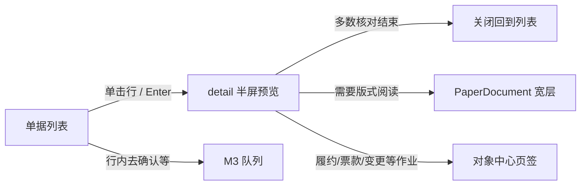
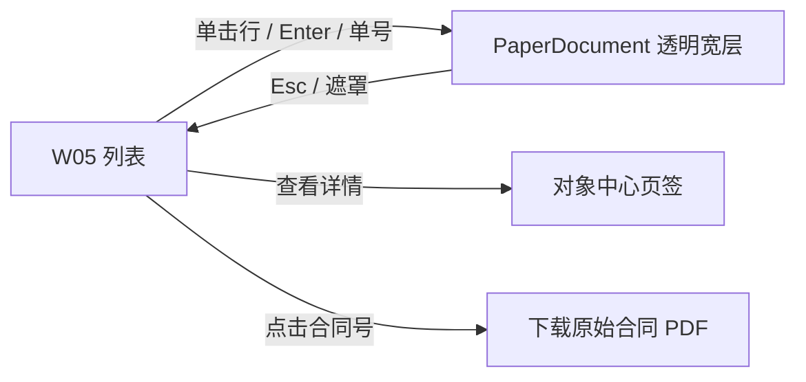
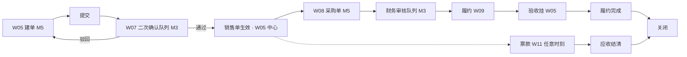
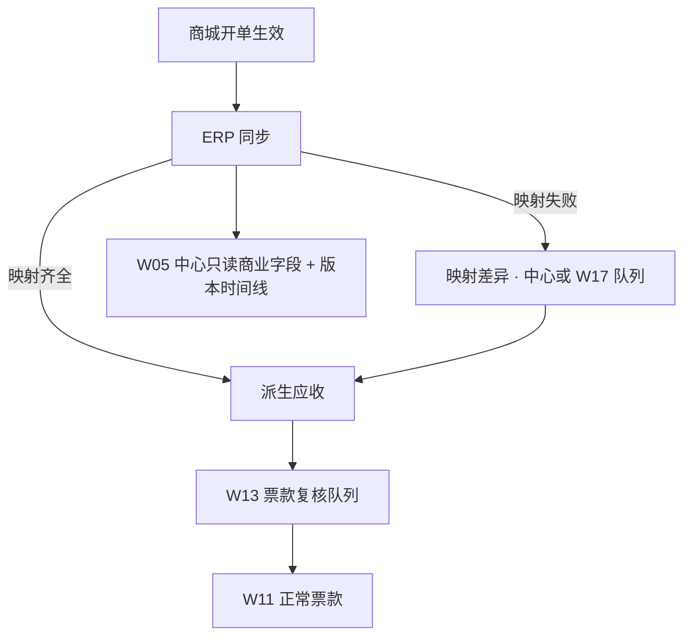
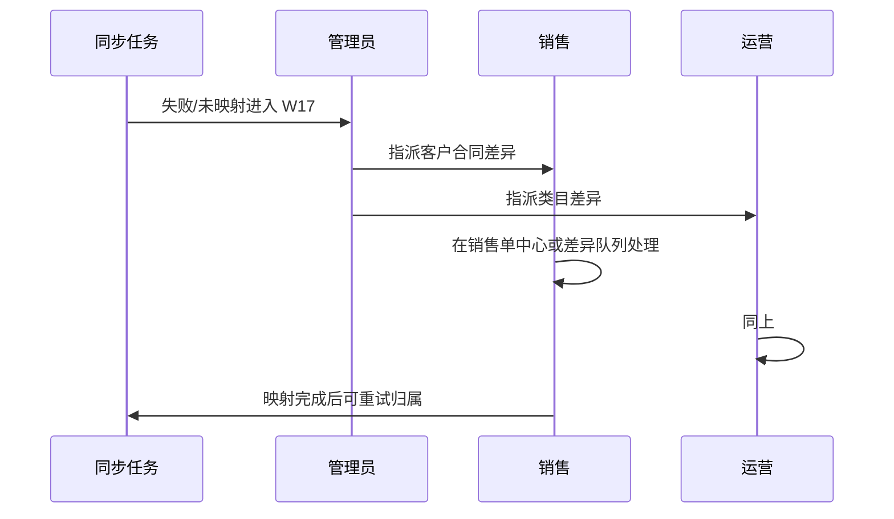

# ERP 关键流程交互说明

> 配合 `erp-ui-design.md` 使用。本文只描述**高频完整业务**在界面上如何一次做完，便于产品/业务复核「是否还在跨页拼流程」。  
> 业务对错以 phase 文档为准；此处不重定义状态机。  
> 列表预览两档（preview / detail）、`PaperDocument` 分工见主设计 §4.3.1 / §4.3.2。  
> **W05 销售单列表**已采纳「行点即纸质投影」变体，见 §1.1.1；其它单据列表仍可走 detail 半屏。

---

## 1. 阅读约定

| 符号 | 含义 |
| --- | --- |
| **Wxx** | `erp-ui-design.md` 中的工作面 |
| **M x** | 页面模式 |
| **页签** | 应用内 TaskTabs，不是浏览器 Tab |
| **队列** | M3 连续处理，默认「完成后自动下一项」 |
| **detail 预览** | `QuickPreviewSheet` `size="detail"` 半屏双栏，列表内读主事实 |
| **纸质投影** | `PaperDocument`；容器为**透明宽层**（弱化 Dialog 壳）或打印页，默认**不提供**页脚打印钮 |

每条流程给出：角色、入口、步骤、界面落点、失败分支、禁止的割裂做法。

---

## 1.1 列表看单：通用交互（正式单据列表）

适用于采购单、回款/付款/发票等仍使用半屏 detail 的 M2 单据工作面。



| 步骤 | 界面 | 完成标准 |
| --- | --- | --- |
| 扫列表 | M2 表格 | 主状态 + 多轨 + 金额可见 |
| 读主事实 | **detail 半屏**（左：进度/商务/关联；右：明细/汇总） | 明细与金额读完，无需再点中心 |
| 纸质阅读 | **PaperDocument** 透明宽层 | 双方、明细、汇总、签章位可读 |
| 作业 | 对象中心或队列 | 登记、核销、审批等写操作完成 |

**禁止**：预览只有摘要字段、用户必须再点「打开中心」才能看明细；把完整 `PaperDocument` 塞进 400px preview。

### 1.1.1 W05 销售单列表（已落地变体）

实现：`erp-client/features/sales-orders/sales-orders-list-page.tsx` + `sales-order-paper-dialog.tsx`。



| 约定 | 说明 |
| --- | --- |
| 行点击 | **直接**打开 `PaperDocument frame="bare"`，**不**开 `QuickPreviewSheet` |
| 操作列 | 仅 **查看详情** → 对象中心；**禁止**「预览」「打印」按钮 |
| 列表列 | 不展示「创建来源」；来源在高级筛选与对象中心可选/可见 |
| 合同列 | 点击合同号 = **下载原始合同 PDF**（非打开合同中心） |
| 纸质壳 | 无标题栏、无底栏、无打印钮；角上关闭 + Esc + 遮罩 |

演示对照：`/sales/orders`。

---

## 2. 实物与服务销售：从建单到关闭

### 2.1 参与角色

销售 → 采购 → 财务 → 仓储（若仓发）→ 销售（验收）→ 财务（票款）

### 2.2 主路径（应在任务页签内可追溯）



### 2.3 分步界面

| 步 | 谁 | 在哪做 | 怎样算「做完」 |
| --- | --- | --- | --- |
| 扫单 / 核对 | 销售等 | W05 列表 → **行点纸质投影**（§1.1.1） | 明细、金额、双方与汇总已读完 |
| 下载合同 | 销售等 | 列表点合同号 | 原始 PDF 开始下载 |
| 进中心作业 | 销售等 | 行内 **查看详情** → 对象中心 | 页签聚焦该销售单 |
| 建单 | 销售 | W05 新建页（`sales-order-create-page`）：合同仅 `ContractCombobox` 选择，旁加号复用 `ContractUploadDialog` 原地归档并刷新列表；商品池 `ProductCombobox`；单位随 SKU 只读；**不选**仓发/直发，只填交付日期；主栏一体合计 footer | 草稿保存或提交成功结果面板；无合同时可先上传再选 |
| 二次确认 | 采购 | W07 队列；表单写供应商成本交期**正式履约方式**（仓发/直发等，建单页未选） | 通过/驳回后自动下一项 |
| 看结果 | 销售 | 列表纸质投影或原销售单中心 | 状态=已生效；下一步提示「待采购建单」 |
| 采购单 | 采购 | 从销售单中心「履约/采购」子区「去建单」或 W08 | 提交审核 |
| 审核 | 财务 | 审核队列（待办同源） | 通过后应付可见 |
| 履约 | 采购/仓储 | W09 作业队列；上下文带齐销售/采购 | 出库/交付记录生效 |
| 验收 | 销售 | **W05 中心履约子区**登记，不先找菜单 | 明细验收完成 |
| 回款开票 | 财务 | W11 会话；也可从 W05 中心票款子区「登记」跳进同一会话模式 | 核销提交 |
| 关闭 | 系统 | 条件满足后状态变更；中心只读展示 | 开票未完不阻塞，任务保留 |

### 2.4 明确禁止

- 采购二次确认只做站内信，点进普通详情后再找按钮。  
- 验收单独做一个与销售单无关的大海捞针列表作为**唯一**入口。  
- 回款保存成功后要求用户「请到核销菜单继续」。  
- 列表预览只有摘要，核对必须再进中心（见 §1.1）。

### 2.5 先款后货

采购单中心与履约处理均使用 `PrepaymentGate`，展示密度不同：

- **W08 采购单中心**：完整 `panel` 卡片，展示门槛、有效已付、差额与结论。
- **W09 履约处理**（收货与发货 / 交付与代发）：`presentation="badge"` 挂在连续处理条状态区；顶栏只显示结果徽章（可收货 / 暂时不能收货 / 无先款要求），悬停展开详情。

未满足付款条件时禁用履约动作，并提供「去登记付款」进入 W12 会话（返回仍回到采购单/作业页签）。

---

## 3. 卡券销售单（T 前：商城开单同步）

### 3.1 用户目标

- 销售：映射客户/合同，看版本与应收，催款。  
- 运营：映射卡券类目差异。  
- 财务：票款复核、回款开票。  
- 管理员：同步失败与补拉。

### 3.2 路径



### 3.3 界面要点

| 点 | 设计 |
| --- | --- |
| 统一列表 | 与实物单同一 W05 列表；筛「业务性质=卡券」 |
| 中心 | 商业字段只读；显式「来源：福利商城」 |
| 版本 | `RevisionTimeline`；diff 用 `BusinessDiffPanel` |
| 配赠 | 只展示计算指标，不提供「改配赠」 |
| 履约子区 | 说明卡券履约在商城；ERP 按履约期限展示进度口径，不伪造发卡明细 |
| 同步失败 | 管理员 W17；业务单上显示失败条与「已通知管理员」 |

### 3.4 二期变化（同一中心）

- T 起商城停止建单、全部 B2B 销售单由 ERP 服务（来源保持商城）；出现提交与双审批条。  
- 协同子区：执行投影状态、商城接收、消费汇总入口。  
- **不**换菜单名、不换「另一套卡券 ERP」。

---

## 4. 采购二次确认（行为，非单据）

### 4.1 为什么用队列

二次确认是生效闸门，峰值时批量处理。列表点进详情再返回是最大浪费。

### 4.2 队列屏信息架构

1. **只读**：销售明细、客户交期、附件。  
2. **可写（确认结论）**：供应商、成本、数量核对、交期、履约方式。  
3. **决策**：通过 | 驳回（原因必填）| 暂挂。  
4. **链出**：打开销售单中心（新页签），队列页签保留。

### 4.3 通过后

- 销售单状态更新（同步域）。  
- 生成「待建采购单」任务（可按供应商拆分提示）。  
- 可选：直接「通过并创建采购单草稿」若权限与规则允许（实现阶段与后端确认）；若不可，则待办进采购员工作台。

---

## 5. 财务：回款登记 + 多对多核销

### 5.1 同一会话

用户目标：「客户打来一笔钱，分摊到多张销售单」。

```
入口 A：W11 客户往来 → 选择客户 → 登记回款
入口 B：W05 销售单票款 → 登记回款（预选当前应收）
      ↓
  同一 Allocation 会话（任务页签标题：核销 · 客户名）
      ↓
  确认 → FormalActionResult → 停留会话或返回来源页签
```

### 5.2 校验

- 未分配余额展示；提交规则按财务后端（通常需分配完毕）。  
- 超额分配前端拦截 + 后端再校验。  
- 附件（回单）在会话内上传，不先去附件中心。

### 5.3 销项发票

与回款分 Tab 或分会话类型，但**同一客户往来工作面**；禁止发票去另一顶级菜单才核销。

供应商付款 / 进项发票：W12 对称。

---

## 6. 卡券票款复核（一期上线后集中）

### 6.1 背景

期初已收/已开票为 0，需财务逐单复核补录。

### 6.2 交互

- W13 = M3 队列，按客户或账龄排序。  
- 单屏：同步成交额、当前应收、已收、已开票、录入区、备注。  
- 支持「无历史票款，确认从 0 起」一键确认。  
- 复核完成标记后，客户经营质量才允许计入可靠应收指标（分析页过滤）。

### 6.3 禁止

用 Excel 导出改完再导回作为主路径（导入能力仅作辅助，主路径是队列）。

---

## 7. 履约处理（多类型合一，岗位分入口）

侧栏按岗位两个入口 —— 仓储「收货与发货」（入库 + 仓发）、采购「交付与代发」
（直发 + 电子 + 服务）—— 底层同一队列与五类表单，不拆五套页面。详见 W09 工作面文档。

### 7.1 队列视图维度

| 维度 | 用途 |
| --- | --- |
| 待作业 | 默认 |
| 类型 | 入库 / 仓发 / 代发 / 电子 / 服务 |
| 仓库 | 仓储过滤 |
| 超期 | 预警 |

### 7.2 单次作业

打开作业抽屉或全页简表（字段少则 Sheet，多则页签）：

- 只读上下文：销售单、采购单、SKU、应收数量。  
- 可写：实收/实发数量、仓位、物流单号、凭证附件、完成时间。  
- 提交后返回队列下一项。

### 7.3 与销售单中心

销售单履约子区展示同一批作业单据只读时间线；「去处理」若当前用户是执行人则进队列定位该项。

---

## 8. 异常：变更 / 退货 / 冲正

### 8.1 创建

必须从**原单中心**「变更与异常」发起，预填原单号与影响范围。

### 8.2 处理

处理单自身也是 M4；完成后原单时间线追加事件。  
全局可查「我的异常单」Saved View，但是创建不从空列表开始。

### 8.3 库存调整

仓储从 W10 选余额 → 调整；复核人走队列。盘点大单可用导入（M7），仍在库存上下文下展示结果。

---

## 9. 映射差异（跨角色协同）



界面：差异项展示左右字段；保存映射后可选「重试归属」；未完成前中心与台账打「未归属」标记。

---

## 10. 第二期：审批与执行投影

### 10.1 审批链（卡券销售单）

```
销售提交 → 销售领导审批队列 → 运营审批队列 → 生效 → 自动下发投影
```

- 审批人中心只读 + `ApprovalDecisionPanel`。  
- 驳回原因结构化；销售改单后进度条重置到领导节点。  
- 审批人**无**字段编辑器。

### 10.2 执行投影

- 销售单协同子区：当前投影版本、商城接收状态、失败原因、重试（权限）。  
- 运维：W23 列表处理批量失败。  
- 用户不需要「先打开投影列表再找销售单」才能看懂一张单的协同状态。

### 10.3 T 切换（商城停单、ERP 全面服务）

- 切换时点 T 起商城停止创建 B2B 销售单，全部 B2B 销售单统一由 ERP 服务；不设计存量单迁移动作。
- 创建来源由 `sales_order.origin_system` 表达（MALL/ERP，恒不变），来源信息在 W05 销售单对象中心展示；T 前商城开单的卡券商业字段在 ERP 只读。

---

## 11. 第二期：消费回流与供应商订单

### 11.1 消费订单中心 W25

一屏看清：

- 商城订单身份、关键事实类型、时间  
- 组合支付与分摊矩阵  
- 卡实例引用（非卡号）  
- 原销售单（钻取 W05）  
- 供应商订单状态（钻取 W26）  
- 成本口径标记  

### 11.2 异常补偿

供应商下单失败：错误进入 W29；客服/采购在供应商订单详情处理重试/转人工；**商城支付事实不在此删除**——UI 文案明确「支付已发生，处理履约异常」。

### 11.3 结算 W27

周期结算单：汇总 → 差异确认 → 形成应付 → 进入 W12 核销链路（复用一期付款能力）。

---

## 12. 经营分析下钻

| 分析页 | 点击指标 | 落到 |
| --- | --- | --- |
| 客户经营质量 | 某客户 | W03 / 客户票款 |
| 客户经营质量 | 逾期应收 | W11 过滤 |
| 实际盈亏 | 某销售单 | W05 |
| 卡券经营（二期） | 消费明细 | W28 / W25 |
| 卡券经营（二期） | 成本覆盖不足 | 带 CostCoverageNotice 的列表 |

下钻一律任务页签打开，保留分析页页签以便返回。
