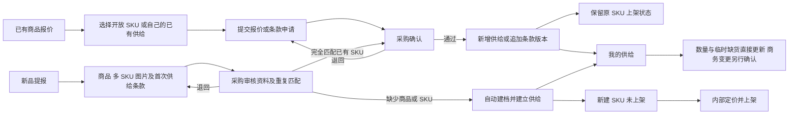

# 供应商门户建设与执行合同

版本：1.2

修订日期：2026-10-03

状态：方案已确认，待实现

本合同约定供应商门户同时支持“已有商品报价”和“新品提报”两条业务线的第一版建设范围、操作责任、生效规则、数据边界和验收要求，供产品、研发、采购和验收人员执行。已有商品报价经采购确认后建立或修订供给；新品经审核后自动建立公司商品、SKU 和供给关系，新建 SKU 保持未上架。商务变更必须由内部采购确认后生效；可供数量和临时缺货由供应商直接更新。

本文描述目标能力，不代表功能已经实现或通过运行验收。

## 1 适用范围与现有合同关系

1. 门户与内部 ERP 使用同一套公司商品、供应商、供给关系、商业条款版本和可供事实，不复制第二套正式业务数据。
2. 公司 SKU 是唯一商品主数据。供给关系直接关联公司 SKU 与供应商，保存供应商订货编码。新品提报单承载待审核资料及提交历史，不作为第二套正式商品主档。
3. 供给价格、税率、费用、起订量、区域和有效期执行不可变条款修订；可供状态和数量独立更新，不增加条款修订号。
4. 供应商门户新增外部登录身份、供应商归属授权、已有商品报价、新品提报、变更申请和采购审核流程。内部人员的 RBAC、DataScope、对象维护责任和任务处理资格继续按各自合同执行。
5. 本合同中的门户开放不授予供应商内部后台权限，不改变现有正式单据的冻结和纠错规则。

关联合同：

| 文档 | 对接内容 |
| --- | --- |
| [第一期业务基线](erp-phase-1.md) | 公司商品、供给关系、采购选源、正式单据及部门职责 |
| [第二期业务方案](erp-phase-2.md) | API 供给来源、商城发布及后续协同边界 |
| [供应商供给批量配置合同](supplier-offering-batch-contract.md) | 批量限制、金额数量口径、逐行事务、幂等及中断恢复 |
| [人员开通与访问配置执行合同](identity-access-workflow-contract.md) | 内部人员操作资格、范围配置和身份失效 |
| [数据授权边界与改造执行合同](authorization-boundary-contract.md) | 供给自身责任、对象访问和任务授权 |
| [审批工作流合同](approval-workflow-contract.md) | 具体处理人、任务转交、任务版本和完成约束 |
| [列表筛选候选独立查询执行合同](query-selector-decoupling-contract.md) | 字典候选独立读取、目录可见与业务访问分别授权 |

批量合同中直接修订正式条款的规则仅适用于内部管理端。门户批量调价必须先生成申请，按本合同确认后才能形成正式条款。实施时须同步相关接口、权限和任务合同；发现其他冲突必须显式修订，不得静默改变既有业务规则。

第一期业务基线中“采购先建商品再添加供给”的要求扩展为内部建档和供应商提报审核建档两种入口；普通供给导入仍不得隐式建商品。商品池资格合同必须明确 SKU 上架状态，将“商品审核入库”和“销售上架”分开。上述基线对齐属于对应功能实施的必要交付。

## 2 第一版交付范围

第一版必须同时完成以下两条业务线，并提供统一的账号、申请查询、供给查看和后续维护能力。两条入口必须在门户中直接可见，不得仅交付其中一条或要求供应商通过另一条绕行。

| 业务线 | 供应商入口与操作 | 采购审核内容 | 完成结果 | 销售上架规则 |
| --- | --- | --- | --- | --- |
| 已有商品报价 | 选择开放的公司商品及精确 SKU，填写订货编码和供货条款；已有本供应商供给的可申请调价 | 目标 SKU、供货资格、订货编码、报价及条款 | 没有供给时新增供给；已有同一供给时追加条款版本 | 不改变目标 SKU 原上架状态 |
| 新品提报 | 上传公司尚未建档的商品资料、多个 SKU、图片及各 SKU 供货条款 | 资料完整性、重复匹配、商品规范及首次供给条款 | 自动新建缺少的商品或 SKU，并建立供给；可复用已有身份 | 本次新建 SKU 明确未上架，由内部后续定价并上架 |

| 门户页面 | 必须展示的内容 | 可执行操作 |
| --- | --- | --- |
| 我的供给 | 商品图片、名称、规格、供应商订货编码、当前供货价、可供数量、关系状态、更新时间 | 查看详情、更新可供、申请调价、批量维护 |
| 供给详情 | 当前生效条款、实时可供情况、待确认变更、条款历史 | 修订条款、临时缺货、恢复有货、申请停止供应 |
| 已有商品报价 | 内部开放给该供应商的商品和 SKU、该供应商自己的供给状态 | 选择精确 SKU，提交首次报价或进入已有供给条款修订 |
| 新品提报 | 商品公共资料、多个 SKU、图片、各 SKU 报价及完整性检查结果 | 在线填写、表格粘贴、文件导入、保存草稿并提交审核 |
| 我的申请 | 已有商品报价、新品提报、条款变更、停止供应、合作条款变更及处理结果 | 保存草稿、提交、撤回、按退回意见修改、查看建档及供给结果 |
| 合作资料 | 本供应商基础资料、当前付款条件、内部采购联系人 | 查看资料、申请调整付款条件 |
| 账号设置 | 当前登录人的基本资料及安全设置 | 修改密码、退出登录 |

内部后台必须提供供应商账号开通与停用、SKU 定向开放、报价确认、新品审核、基础资料匹配、重复匹配、任务转交和变更记录查询入口。审核任务接入现有工作台；商品库提供待上架视图，支持内部集中定价及上架。

第一版不建设供应商自主注册、供应商自行管理子账号、跨供应商切换、独立供应商正式商品库、预约未来调价、订单接单、发货、对账、开票和结算。上述能力后续扩展时须另行明确范围及业务合同。

## 3 账号与职责

### 3.1 供应商账号

1. 账号由有权内部人员开通，绑定已存在且启用的供应商。
2. 一家供应商允许多个实名使用账号；第一版每个账号仅绑定一家供应商，不得多人共用同一账号。
3. 提供“供给维护员”和“只读人员”两类门户权限。只读人员不得提交申请或更新可供事实。
4. 账号开通、停用、供应商绑定及权限配置由内部管理；供应商人员只能维护允许自助修改的个人账号信息。
5. 账号停用、供应商停用或绑定撤销后，后续请求必须拒绝，不能仅隐藏菜单或等待原登录凭证自然过期。
6. 内部身份与供应商门户身份必须可明确区分。供应商不得通过内部登录或管理接口取得后台权限。

### 3.2 内部责任

| 业务 | 默认处理人 | 责任 |
| --- | --- | --- |
| 已有供给的条款变更和停止供应 | 该供给当前内部维护人 | 确认条款、核对影响、决定通过或退回 |
| 已有商品首次报价 | 该供应商当前内部维护人 | 核对公司 SKU、订货编码、资格及报价，明确新供给维护人 |
| 新品提报 | 该供应商当前内部维护人 | 核对商品资料、重复匹配及首次供给条款，明确新商品及供给维护责任 |
| 品牌分类及单位补建 | 具备相应基础数据维护权限的内部人员 | 核对已有字典、处理重复并创建必要正式值；将结果关联回新品提报 |
| 账期和付款条件变更 | 该供应商当前内部维护人 | 确认合作条款及后续采购影响 |
| 账号与门户权限管理 | 具备对应管理权限的内部人员 | 开通、停用及绑定管理 |

每条待确认申请必须指定具体处理人。默认处理人缺失、停用或缺少处理资格时，不得创建无人负责的待确认任务；必须先完成责任配置或合法转交。任务转交必须留痕。

新品审核处理人还必须具备本次建档或关联动作所需的商品及供给处理资格。拥有供应商维护权或接到审核任务，不自动获得任意公司商品的修改权限；具体对象访问必须按动作或专项任务授权合同校验。

商品审核资格不自动授予品牌、分类或单位创建权限。审核人有权时可在审核页完成补建；无权时转交具体内部维护人员处理，保留原申请及供应商输入，不得要求供应商为内部字典缺失重复填报。

供给原有的内部维护人和业务组织必须保留。供应商提交人、操作人单独记录，不得写入内部维护人或内部组织字段。

## 4 可维护内容与生效规则

| 内容 | 供应商操作 | 生效条件 |
| --- | --- | --- |
| 可供数量 | 单条或批量直接更新 | 身份、归属、版本及输入校验通过后立即更新 |
| 临时缺货与恢复有货 | 直接更新 | 立即更新可供事实，不自动解除内部管控 |
| 代发价、集采价、税率、运费、服务费 | 提交条款变更申请 | 采购确认后追加正式版本 |
| 起订量、供货区域、有效期及其他供货条件 | 提交条款变更申请 | 采购确认后生效 |
| 新增供给关系 | 对定向开放的公司 SKU 提交报价 | 采购确认后创建正式供给及首版条款 |
| 未建档商品及 SKU | 提报商品、图片、规格和首次供给条款 | 采购一次审核通过后自动建档并建立供给，新建 SKU 未上架 |
| 新品所需品牌分类及单位 | 选择允许的现有值；未匹配时提交原始名称及说明 | 内部完成有效字典匹配或补建后，才可通过新品审核 |
| 永久停止供应 | 提交停止申请；可同时单独标记临时缺货 | 采购核对影响后停止关系 |
| 账期与付款条件 | 提交合作条款变更申请 | 采购确认后更新供应商商务档案 |
| 已建档公司商品名称、规格 | 仅查看定向开放或本供应商供给所需资料 | 由内部维护，门户不提供直接修改入口 |
| 公司销售价格 | 不开放查看或修改 | 由内部维护 |
| 供应商资格、合作启停、供给维护人、业务组织 | 查看必要结果和可对外原因 | 由内部维护 |

供应商不得在普通条款申请中改换所属供应商、公司 SKU 或既有供给订货编码。身份纠错须由内部按对应规则处理。

## 5 可供数量与关系状态

1. 页面统一使用“可供数量”。该值是供应商报送的可供事实，不计入公司仓库库存，不代表为任何订单锁定库存。
2. 数量空白表示未提供数量；`0` 表示明确无货。空白不得转换为零或展示成无限库存；明确为零时不得作为当前有货参与选源。
3. 供应商可直接报告临时缺货及恢复有货。关系状态、条款有效性、供应商资格与可供事实必须分别判断。
4. 恢复有货不得解除内部采购设置的暂停或停止关系，不得绕过资质失效、条款过期等限制。
5. 页面必须区分“供给关系暂停或停止”“供应商当前缺货”和“申请待确认”，不得合并成一个上下架开关。
6. 可供信息必须显示最近更新时间。自动过期仅按明确配置的规则执行；不得把长期未更新的信息解释为已确认仍有货，也不得擅自设置过期阈值。
7. 可供更新必须携带读取时的版本。并发冲突时保留输入并要求重新核对，不得静默覆盖。
8. 每次可供修改记录真实操作人、渠道、时间、变更前后值及命令标识。永久停止申请的提交或撤回不得隐式改变可供数量。

## 6 已有商品报价与新品提报

### 6.1 已有商品报价

1. 内部将已建档的指定 SKU 开放给指定供应商报价。可报价目录不等于销售商品池，允许包含内部尚未上架的 SKU；是否允许报价由目录开放、商品状态及供货资格判断。
2. 开放目录只展示报价所需的图片、名称、规格、单位及 SKU 标识，不展示公司销售价格、其他供应商或内部经营信息。一个商品存在多个 SKU 时必须明确选择，不得默认关联首项。
3. 供应商填写自己的订货编码、代发价、集采价、税率、起订量、区域、有效期及必要费用；不得根据商品名称、条码或公司 SKU 自动猜测订货编码。
4. 按当前供应商与其订货编码确定供给身份，不得仅凭公司 SKU 或商品名称判重。该供给尚不存在时提交首次报价申请；已存在且关联当前 SKU 时进入条款修订流程，带入当前供给及条款版本，不得重复新增。
5. 同一供应商订货编码已关联其他 SKU 时必须提示冲突，不得改绑已有关系。暂停或停止供给按原状态规则处理，不得通过再次报价绕过。
6. 采购确认时必须重新校验目录开放状态、SKU 状态、供应商资格、订货编码唯一性、申请版本及条款合法性。已有供给的修订继续按自身归属和版本规则授权，不要求重复取得首次报价目录授权。
7. 首次报价通过后自动建立供给、首版条款和初始可供事实；修订通过后仅追加条款版本。供给内部维护人和业务组织必须明确。
8. 此流程不得创建公司商品或 SKU，不得修改目标 SKU 的销售价格、启停或上架状态。未上架 SKU 仍未上架；已上架 SKU 在满足最新供给及其他销售资格时可参与销售业务。
9. 品牌、分类、商品类型、规格和基础单位直接读取目标公司商品及 SKU，供应商只读。报价、起订量及可供数量按该 SKU 基础单位填写，不得通过报价申请改换单位或商品归属。

### 6.2 新品提报

1. 供应商可以提报公司尚未建档的商品及 SKU，不以公司预先创建对应商品或开放对应 SKU 为前置。
2. 一张提报单包含一个商品的公共资料和一个或多个 SKU。公共资料包含名称、品牌型号、描述及图片；每个 SKU 分别提供规格属性、单位、必要包装信息、条码、供应商订货编码和首次供给条款。
3. 表单按商品类型明确必填项，提交前检查资料完整性、规格重复、单位与报价一致性、订货编码、价格及税率。输入错误须定位字段或 SKU，并由供应商修正。正式品牌、分类或单位尚未匹配，但已提供必要原始值和说明的，允许提交待审核，执行第 6.6 至 6.8 节。
4. 提报单及附件在审核前独立保存，不进入正式商品库和销售商品池。退回或撤回保留提交历史，不得产生正式商品、SKU 或供给。
5. 采购一次审核同时确认商品资料、SKU 匹配和首次供给条款。通过后自动落地所需对象，不要求采购再次手工新建商品或添加供给。
6. 采购可确认分类、品牌、标准单位映射和名称格式，形成独立的内部建档快照；供应商原始提交必须保留。涉及规格、单位含义、包装数量、价格等实质变化时必须退回供应商确认，不得静默改写。
7. 公司商品编号和 SKU 编号按内部规则生成；供应商编码仅用于其自身供给身份，不得直接占用公司编号体系。
8. 第一版按一张提报单整体通过或退回，商品公共资料与所含 SKU 一起核对；批次内不同商品分别审核，不因一张申请退回而阻断其他申请。
9. 一张申请确认产生的商品、SKU、首版供给条款、初始可供记录、内部责任、审核结果和审计必须原子落地。已有对象只按明确的匹配结果复用，不得覆盖其现行资料。
10. 初始可供数量为空时保留未提供语义；保留供应商实际填报时间，不得把审核时间当作供应商最新报送时间。审核时按明确的时效规则核对可供信息。
11. 建档完成后供应商可继续维护自己的供给，不能直接修改已成为公司主数据的商品和 SKU。正式商品资料纠错交由内部处理，供给调价仍走原条款申请。

### 6.3 重复识别与流程衔接

| 审核时核对结果 | 执行动作 |
| --- | --- |
| 公司没有该商品 | 新建公司商品及所需 SKU，并建立本供应商供给 |
| 公司已有商品，但缺少本次规格 | 复用公司商品，仅新增缺少的 SKU，再建立供给 |
| 公司已有完全一致的 SKU，本供应商尚无供给 | 复用 SKU，转入已有商品首次报价确认语义，仅建立供给 |
| 本供应商已有相同供给 | 返回已有供给，条款有变化时进入修订流程；不得重复建档或覆盖条款 |
| 订货编码冲突或匹配存在歧义 | 阻断通过，由采购核对或退回供应商修正 |

1. 系统根据品牌、型号、条码、规格、单位及包装信息提示候选，采购确认最终匹配。名称或条码相同不能单独成为自动合并依据。
2. 重复候选只向有权内部审核人展示。新品提报不授予供应商整个公司商品库、其他供给或其他供应商资料读取权限。
3. 新品审核匹配到已有 SKU 时，采购必须显式确认供给绑定，并按该 SKU 的内部访问及处理资格校验。审核结果仅向供应商开放本次供给所需的商品资料；不得通过匹配绕过被停用的身份、商品或供货资格。
4. 事务提交前重新核对目标版本及唯一性，防止其他审核已完成相同建档。冲突后必须重新核对，不得把旧申请静默改为另一个目标。
5. 新品转已有商品报价时保留原提报单、匹配决定和最终供给结果的关联。供应商无需重新录入已提交资料，但处理页面必须说明实际结果是新建商品、新增 SKU、新增供给还是转条款修订。

### 6.4 商品入库与销售上架

1. 新品审核入库与销售上架是两个独立动作。本次新建的每个 SKU 必须显式写入 `listing_status=Unlisted`，不得省略字段或沿用旧数据“缺字段视为已上架”的兼容行为。
2. 供应商报价写入供给条款，不得自动转换成公司销售参考价。内部人员后续维护销售价格、核对销售资格并执行上架。
3. 商品库提供待上架视图，允许内部集中定价和上架。审核完成页展示“已入库，待上架”，不得把建档完成展示为已对销售开放。
4. 未上架 SKU 不进入销售商品池，不得作为销售开单、选品册及销售方案的新增候选，相关查询和导出必须采用一致条件；销售写命令必须在服务端校验资格，不能只隐藏前端选项。
5. 给已有商品新增 SKU 时，仅新建 SKU 未上架，已有 SKU 状态保持原值。复用已有在售 SKU 时，不得因本次提报将其下架。
6. 已上架 SKU 新增有效供给后可能参与或恢复采购选源及销售资格。审核页必须提示该影响；“审核后暂不开放销售”的强制约束作用于本次新建 SKU。
7. 建档审核状态、供给关系状态、可供状态及销售上架状态分别保存，不得合并为一个审批或上下架字段。

### 6.5 图片与文件

1. 新品主图、SKU 图和资料附件必须关联当前供应商及提报单，上传和下载均校验访问权，并校验格式、大小及必要内容完整性。
2. 图片上传及必要处理在数据库事务之外完成；确认事务只绑定已经准备好的文件记录，不得在事务内执行 S3 或外部下载。
3. 审核通过后建立正式商品素材引用，保持供应商原始提交可追溯；不得因清理临时上传导致正式商品图片失效。
4. 被撤回、退回或废弃的上传按明确保留规则清理，禁止删除仍被有效申请、历史证据或正式商品引用的文件。

### 6.6 基础数据选择与审核映射

公司维护正式字典；供应商选择现有值或提交未匹配资料；内部审核完成映射或补建。正式字典尚未匹配不阻断资料充分的新品提交，但必须阻断审核通过和正式建档。

| 数据 | 供应商填写规则 | 未匹配处理 | 正式落库条件 |
| --- | --- | --- | --- |
| 品牌 | 搜索选择允许的已有品牌 | 填写品牌建议名称及必要说明，可附 Logo 或商品资料 | 内部关联有效品牌，或由有权限人员创建后关联 |
| 分类 | 从允许选择的分类树中选择，展示完整路径 | 标记暂未匹配，填写原始类目路径或商品用途 | 内部确定有效分类，校验商品类型兼容性 |
| 计量单位 | 选择标准单位，填写必要包装信息 | 提交原始单位、含义及包装数量说明 | 确认有效单位、数量精度和报价口径 |
| 规格属性和值 | 在商品内结构化填写颜色、容量、尺寸等 | 允许提报新属性及值，不要求先创建全局字典 | 规范化后组合不重复，单位及商品身份明确 |
| 商品类型 | 从允许的固定类型中选择 | 不允许自由新增类型；缺失或非法值须修正 | 类型与分类、必填资料和供给能力兼容 |
| 税率与供货区域 | 按供给领域现行结构和允许值填写 | 输入错误须修正，业务疑问交内部核对 | 通过供给条款及资格校验，不得由门户任意扩展规则 |

品牌处理要求：

1. 搜索无结果允许保存品牌建议，提交时不得自动创建正式品牌。系统可提示名称变体或疑似重复，由内部确认；名称相近不等于同一品牌。
2. 内部可关联已有品牌或创建必要的新品牌。创建前核对重复，正式代码按内部规则生成，提交和重试须防止并发重复创建。
3. 未匹配、未知、确实无品牌及不适用品牌必须区分。无品牌或不适用场景使用内部明确维护的标准项，不得把未核实品牌统一写成“其他品牌”。
4. 选择或创建品牌不代表供应商通过相应供货资格；资格按供给规则另行校验。供应商不得改名、停用或替换正式品牌 Logo。

分类处理要求：

1. 供应商原始分类与公司分类分别保存。公司分类展示完整路径，供应商不得创建节点、改变父子关系或修改公司分类树。
2. 内部按商品用途和公司分类体系确定归属；新分类由有权限人员创建，明确父级、商品类型及状态。不得仅凭供应商文本自动创建根分类。
3. 相同名称在不同父级下不视为同一分类。确认时必须使用稳定分类 ID，并核对完整路径、启停状态和商品类型。
4. 可复用的供应商类目映射必须经内部确认，并区分供应商、原始完整路径和商品类型。不同供应商的同名类目不得直接共用匹配结论。
5. 已保存映射用于后续建议和预填；原始含义、目标状态或分类层级变化后必须重新核对，不得静默改变历史已建档商品的归属。

### 6.7 单位包装与规格规范

1. 第一版正式供给的单价、起订量和可供数量统一按目标公司 SKU 的基础单位表达。已有 SKU 的基础单位不可通过报价申请更改；新品基础单位在建档前确认。
2. 单位名称映射与实际换算必须区分。“pcs”对应“件”可作为确认后的同义映射；“箱”对应“瓶”涉及包装数量，不得按同义词处理。
3. 原始报价为“120 元每箱，每箱 12 瓶”而目标单位为瓶时，必须显示原始单位、包装数量和换算依据；单位、价格、起订量及数量变化须经供应商确认后形成新的提交快照。不得把每箱价格直接保存为每瓶价格，也不得由审核人静默换算后通过。
4. 未提供可靠包装关系时阻断换算和建档。单位未匹配不得默认填为“件”，数量精度不得超过所选单位允许值。
5. 单位补建须明确代码、名称、符号、数量小数位及启停状态，由有权限内部人员完成；正式单位尚未确定时保留原始输入。
6. 规格按当前商品内部的属性名和值表达。新的颜色、尺寸等可直接提报，无需逐值建立全局字典；分类模板可提供填写建议，不得替代最终规格校验。
7. 审核须确认属性名含义一致、规格组合不重复、必要型号及包装信息完整。规范化后与已有 SKU 相同的，按第 6.3 节复用或处理冲突。
8. 格式整理不得改变规格含义。基础单位、规格签名及包装含义决定 SKU 身份，建档后不能借名称整理将其改成另一种商品。

### 6.8 匹配界面与审批前置条件

1. 新品审核页设置“基础资料匹配”区域，集中展示供应商原始值、系统建议、内部最终值和处理状态。处理状态区分已匹配、待内部补建、待供应商补充，不替代申请的主状态。
2. 同一批次可由审核人明确勾选，将已确认映射应用于原始内容和适用条件一致的行。不同单位含义、分类路径或商品类型不得批量强行覆盖；每张申请仍独立重验。
3. 供应商提交快照保留所选字典 ID、提交时展示名称、原始文本、分类路径、包装及报价单位等实际填写内容。内部匹配记录另存正式目标 ID、核对时版本或校验依据、确认人、时间和理由，不能覆盖原始快照。
4. 供应商重新提交影响匹配的字段后，原匹配结论必须重新核对。仅内部字典缺失且供应商资料充分时，原申请保持待确认，由内部完成处理；不得伪装为供应商填写错误或审核已通过。
5. 创建品牌、分类或单位是独立的授权字典维护动作，必须留审计并将结果关联回申请。补建成功不代表商品通过审核；正式字典齐备后才执行商品与供给的原子入库事务。
6. 最终确认须重新校验所有字典引用存在、启用且适用，分类与商品类型兼容，单位及数量精度一致，SKU 规格不重复。字典停用、目标含义或关键版本变化时阻断通过并要求重新核对。
7. 门户使用专门授权的最小字典候选投影，只展示选择所需的标识、名称、分类路径和必要单位信息。候选从允许的字典目录独立读取，不得从当前商品列表提取；有效但尚无商品使用的字典值仍可按开放规则选择。
8. 字典可见只授予选择资格，不授予关联商品、其他供应商或内部字典维护权限。无候选权限、加载失败、搜索无结果和需要内部补建必须分别提示。
9. 门户导入必须先形成提报和匹配记录，不得复用内部导入中“按名称直接新建品牌分类、固定采用件单位”的落库行为。自动匹配只能提出建议，不能自动扩展公司字典或跳过审核。

## 7 商务申请与采购确认

### 7.1 申请状态

| 状态 | 含义 | 允许后续动作 |
| --- | --- | --- |
| 草稿 | 尚未送交采购 | 编辑、提交 |
| 待确认 | 提交内容已冻结，已指定采购处理人 | 采购通过、采购退回、供应商撤回 |
| 已退回 | 采购不接受本次提交，已填写原因 | 供应商修改后重新提交，并保留前次提交记录 |
| 已撤回 | 供应商撤回尚未完成的提交 | 修改后重新提交，并保留撤回记录 |
| 已生效 | 正式业务写入和任务完成均已提交；新品场景显示已入库及实际建档结果 | 查看；后续变更另行申请 |

申请状态与供给关系状态、可供状态、销售上架状态分别保存和展示。新品申请已生效不表示销售已上架。已生效申请不得回退为草稿或删除历史。

### 7.2 执行流程

1. 已有条款修订同时展示“当前生效内容”和“本次申请内容”；首次报价和新品提报明确展示为尚无正式结果。待确认内容不得被销售、采购、结算或其他正式业务当作生效事实使用。
2. 提交时冻结申请快照，记录申请人、提交时间、变更原因和所依据的已有对象版本。新建对象不伪造正式版本；审核匹配时另行记录所选目标及其版本。待确认期间不得原地修改提交快照。
3. 采购确认页必须逐字段展示变更前后差异、供应商、商品、影响对象及申请原因。
4. 采购作出通过或退回决定，退回必须填写供应商可见的原因。新品审核允许按第 6 节明确匹配目标和内部建档快照；供应商提交快照不得改写，报价或商品实质内容变化必须退回确认。
5. 通过前必须在写入事务中重验处理人及任务资格、供应商状态、对象授权、业务资格、申请版本、任务版本和已存在目标的正式版本；新建对象重验唯一性及创建资格。
6. 待确认期间如内部人员或其他申请已改变正式版本，本次确认必须拒绝。供应商重新核对并提交，采购不得只替换版本号后沿用未经核对的旧申请。
7. 正式业务写入、申请结果、任务完成及审计记录必须使用同一事务。任一步失败不得出现“申请已生效但正式版本未更新”。
8. 提交、通过、退回、撤回和重试必须具有幂等及并发保护。撤回与通过并发时仅允许一个有效结果；结果未知时使用原命令确认，不得自动生成新命令重复执行。
9. 审计必须分别保留供应商提交人和内部确认人，不得把供应商申请伪装成内部人员直接录入。

### 7.3 生效时间

第一版采用“确认成功即形成正式业务事实”，不提供预约未来调价或未来自动切换。新品形成商品、SKU 及供给，销售上架另行执行；已有供给修订切换当前条款版本。申请中的条款有效期仍必须符合现有业务校验；不得通过提前切换到未来版本使现行报价失效。已过有效期的申请不得确认成当前可用供给。

例如当前代发价为 100 元，供应商申请调整为 105 元：确认前正式报价仍为 100 元，门户显示“105 元，待采购确认”；确认成功后生成 105 元的新正式版本。历史版本继续保留。

### 7.4 账期与付款条件

1. 账期和付款条件属于供应商商务档案，必须使用合作条款申请，不得写入某个商品的供给价格修订。
2. 合作条款申请与供给申请可共用“我的申请”页面，但必须具有明确类型、独立目标版本和对应写入规则。
3. 确认页必须说明该变更影响后续采用该商务档案的采购业务，而非仅影响单个商品。
4. 通过后生成供应商商务档案新版本，不得覆盖已冻结采购单的付款条件。

## 8 数据与接口授权

每次门户访问必须同时满足：登录身份有效、账号绑定有效、具备操作权限、目标在当前供应商授权范围内、对象状态允许操作。申请和供给按供应商归属判断；共享公司商品及 SKU 按目录开放或本供应商供给所需资料判断，不得把供应商当作公司商品的所有者。写命令还必须满足相应的版本、资格和任务条件。

1. 当前供应商由服务端从已验证的账号绑定解析。不得信任客户端传入的 `supplier_id` 或通过更改 URL、请求体取得其他供应商权限。
2. 列表、详情、历史、数量统计、候选目录、批量操作、导出和附件下载必须采用一致的供应商归属边界。未知对象和范围外对象不得泄露差异信息。
3. 门户只返回必要的外部展示字段。其他供应商报价、公司销售价格、毛利、客户信息、内部评价和内部任务备注不得进入门户响应。
4. SKU 定向开放只授予相应资料查看和报价资格，不授予整个公司商品目录、既有其他供给或商品维护权限。
5. 门户字段必须使用允许列表。可供接口不得夹带价格、账期或关系启停修改，申请接口不得夹带采购确认结果。
6. 供应商身份不得访问内部 `/admin/*` 接口。接口授权必须由服务端执行，前端菜单、路由和按钮隐藏不能替代校验。
7. 内部 RBAC、DataScope、对象责任与任务资格必须分别检查。不得通过给予供应商全公司范围、内部组织身份或管理员身份解决门户访问问题。
8. 复用现有领域规则时必须提供明确的供应商授权路径，禁止跳过原用例授权或伪造内部操作人。
9. 新品匹配候选、内部规范化结果及正式商品写入仅由有权内部审核流程处理。供应商不能通过提报一个已有商品名取得全库查询或覆盖共享资料的能力。
10. 品牌、分类和单位的门户只读候选、内部维护、商品审核是独立操作资格。客户端提交字典 ID 不构成授权或有效性证明，正式入库时必须再次校验。

## 9 批量维护

1. 第一版分别提供已有商品批量报价、已有供给批量调价、新品批量提报和批量更新可供，支持表格粘贴以及 Excel、CSV 文件导入。各类提交不得混成一个可直接写正式业务的命令。
2. 每批最多 100 条 SKU 或供给数据行，表格文件不超过 5 MB；新品按商品分组，共用公共资料。金额、税率、费用和数量使用十进制字符串。其余文件读取、文本编码及导出公式防护沿用批量配置合同，图片按独立上传规则处理。
3. 所有申请属于当前供应商。已有商品报价匹配其有权访问的目录，已有供给更新校验自身供给归属；新品只进入提报暂存，不要求预先具有公司 SKU，不得借导入开放全库搜索。客户端匹配结果不得替代服务端授权。
4. 批量更新可供直接更新正式可供事实；报价、调价及新品导入只创建待确认申请，不得直接生成商品、供给或正式条款。
5. 提交前执行整批预检；存在预检失败行时不得开始新的写入。可供及已有商品报价按供给行处理，新品按商品和所含 SKU 组处理；执行阶段各处理单元独立事务，保留部分成功结果，不提供整批回滚语义。
6. 每个处理单元记录稳定标识、命令标识及结果，逐行定位输入问题。已成功单元锁定；失败单元保留输入；后续重试只处理未完成单元，不能把同一新品的部分 SKU 标成完整建档成功。
7. 网络中断或结果未知时必须保留原内容和原命令标识，先查询或恢复原结果；不得当作未提交直接重建申请或重复更新。
8. 文件导入的“提交成功”仅表示申请已创建时，页面必须展示“待采购确认”，不得展示为新价格已生效或商品已入库。新品确认成功后须返回实际商品、SKU 及供给结果，新建 SKU 展示未上架。
9. 门户可供状态输入仅开放本合同允许的有货和临时缺货操作，不得沿用内部模板开放永久停止关系或手工伪造数据过期状态。
10. 新品导入允许记录尚未匹配的品牌、分类和单位原始值。预检须区分可进入审核的待匹配资料与不允许提交的缺失或非法输入；未匹配记录不得被当作已完成商品建档。

## 10 对现有业务的影响

| 场景 | 必须执行的规则 |
| --- | --- |
| 供应商提交调价或账期申请 | 确认前继续使用当前正式版本 |
| 新条款确认生效 | 后续业务按业务时点和当前资格采用正式版本 |
| 新品审核建档 | 自动建立缺少的商品或 SKU 及供给，新建 SKU 保持未上架，不进入销售商品池 |
| 已有商品首次报价通过 | 仅建立供给，保留目标 SKU 上架状态；满足条件时可能参与或恢复销售及采购选源 |
| 已有商品追加新规格 | 原 SKU 状态不变，仅新增 SKU 未上架；不得覆盖原商品及原规格资料 |
| 已冻结采购单 | 保留原价格、供给版本和付款条件；调整须走相应业务变更流程 |
| 尚未完成确认的采购操作 | 提交时重验供给版本和可供状态，变化后要求重新确认 |
| 供应商报告缺货 | 新选源按最新可供状态判断；对未完成履约的关联业务提示具体采购负责人核对 |
| 供应商恢复有货 | 仅更新可供事实，其他资格和内部管控继续独立生效 |
| 永久停止供应 | 采购核对关联影响后停止关系，不自动取消已有采购单或改写履约事实 |

供给变更不得自动调整公司库存、应付、已发生财务事实或历史单据快照。关联业务需要改价、改源、取消或其他纠正时，必须通过对应业务命令执行。

## 11 技术归属与事务

第一版沿用当前单仓、后端和数据库。前端在 `erp-client` 内增加独立门户入口、布局和登录状态；供应商接口使用 `/supplier-portal/*`，与内部 `/admin/*` 分别鉴权。

| 模块 | 建设职责 |
| --- | --- |
| `erp-identity` | 外部账号身份、供应商绑定、门户权限、会话及失效检查 |
| `erp-catalog` | 新品提报快照、品牌分类单位及审核映射、商品规范及重复匹配规则、正式商品和 SKU 建档、销售上架规则 |
| `erp-supply` | 供给新增与变更申请、供给归属规则、可供维护及正式条款规则 |
| `erp-supplier` | 合作条款申请、商务档案修订和供应商资格 |
| `erp-processes` | 账号开通、申请提交、报价确认、新品审核建档并建立供给的跨域事务 |
| `erp-read-models` | 门户业务目录、列表、详情、重复候选、变更差异及审核结果的跨域投影；单域字典候选留在商品领域 |
| `erp-workflow` | 具体确认任务、处理人、转交和完成记录 |
| `web-api` | 门户路由、身份解析、协议适配及组合根装配 |
| `erp-client` | 两条业务入口、独立会话上下文、内部开通与审核、待上架视图 |

实施必须遵守以下约束：

1. 业务领域之间不得直接依赖；跨域事实通过消费方窄 Port 获取，由组合层装配。
2. 单域规则保留在拥有领域；跨域写入由命名 Process 编排，跨域读取由 ReadModel 组装。
3. 申请与正式业务事实分开保存；提交快照及历次决定必须可追溯，未确认内容不得进入正式读模型。
4. 多集合原子写入使用同一 `Executor`；最终授权、版本及唯一性检查必须在决定写入的事务内执行。
5. 采购确认任务采用单人确认，第一版不扩展为多级可配置审批链。接入任务时必须登记任务类型、处理资格和完成合同，禁止借用无关审批类型。
6. HTTP 返回沿用统一 `ApiResponse` 和错误语义。具体接口清单、请求结构、权限代码及任务类型须在对应功能开发前补齐，未经实现不得将路径前缀当作可调用接口清单。
7. 原始登记来源与本次操作渠道分别记录。Excel 导入的供给经门户更新后，不得改写原始登记来源。
8. API 自动同步供给在第一版门户中只读；字段写入责任和冲突规则明确前，禁止门户覆盖 API 管理的事实。
9. 审计与命令回执必须能关联账号、供应商、目标供给或商务档案、申请、版本和内部确认人。
10. 新品申请由商品领域保存商品及 SKU 提报快照，所含供给条款通过窄 Port 交由供给领域校验，组合层编排最终落地。不得在商品领域复制供给金额、税率和资格规则，或让两个业务领域直接依赖。
11. 新品建档与供给建立必须复用接收调用方 `Executor` 的业务步骤，禁止串行调用各自提交事务的现有 HTTP 入口来冒充原子操作。

## 12 实施顺序

| 阶段 | 必须交付 | 阶段完成条件 |
| --- | --- | --- |
| 1 身份与读取 | 开通、登录、停用、供应商归属、我的供给及详情 | 不同供应商互相不可见，供应商不能访问内部接口，停用后旧会话失效 |
| 2 可供维护 | 单条和批量可供更新、缺货与恢复、版本冲突、审计 | 更新即时可见，不增加条款版本，不解除内部暂停，不覆盖并发修改 |
| 3 已有商品报价 | SKU 定向开放、首次报价、已有供给修订、停止及合作条款申请、采购任务 | 同一 SKU 可追加供应商供给，已有供给只修订，原上架状态不变 |
| 4 新品提报与建档 | 多 SKU 及图片提报、基础资料匹配与补建、重复匹配、一次审核自动建档和供给、待上架视图 | 未匹配可提报但不能通过，字典齐备后原子入库，新建 SKU 未上架，已有身份不重复创建 |
| 5 批量与影响 | 两条业务线批量申请、中断恢复、处理结果、关联业务影响提示 | 两线均可完成且可安全重试，已冻结单据不被反向改写 |

阶段顺序用于组织实现，不得将前一阶段完成表述为第一版整体交付。第一版完成以全部范围及验收项通过为准。

## 13 验收标准

| 编号 | 场景 | 通过标准 |
| --- | --- | --- |
| SP01 | 两家供应商访问隔离 | 列表、详情、历史、统计、导出和附件均不能访问对方数据；修改请求中的目标标识仍被拒绝 |
| SP02 | 内外身份隔离 | 供应商凭证不能访问内部管理接口，内部角色或组织配置不能意外授予门户越权 |
| SP03 | 权限和绑定失效 | 只读人员不能写入；账号或供应商停用、绑定撤销后，旧会话后续请求被拒绝 |
| SP04 | 目录定向开放 | 已有商品报价只看到本供应商被开放的 SKU；撤销开放后，首次报价确认必须重新校验并拒绝失效资格 |
| SP05 | 可供更新 | 数量和临时缺货及时可见；零、空白语义准确；不增加条款版本或修改公司库存 |
| SP06 | 内部管控保持有效 | 恢复有货不能解除暂停、停止、资格失效或条款过期限制 |
| SP07 | 报价待确认 | 待确认报价单独展示，正式选源仍使用当前有效条款 |
| SP08 | 确认及并发 | 重复确认只产生一个结果；版本过期、通过与撤回并发时不覆盖或重复写入 |
| SP09 | 申请事务 | 正式事实、申请结果、任务及审计同时成功或回滚，不出现部分完成 |
| SP10 | 已有商品报价 | 首次报价只能关联合法开放的已有 SKU；已有同一供给转修订；重复订货编码不重复创建，内部责任必填，原上架状态不变 |
| SP11 | 账期归属 | 合作条款更新供应商商务档案，不写入商品价格修订，不回改已冻结采购单 |
| SP12 | 批量及重试 | 预检失败阻断新写入；执行失败保留成功行；网络中断使用原命令恢复，不重复创建申请 |
| SP13 | 缺货与停供影响 | 新选源使用最新状态；未完成履约影响提示到具体采购负责人，不自动取消单据 |
| SP14 | 对外字段与来源 | 响应不包含其他报价或内部经营信息；原始来源保持可追溯；API 来源写入被拒绝 |
| SP15 | 审计与历史 | 可区分供应商提交人、内部确认人、当前正式版本、历史版本和实时可供事实 |
| SP16 | 两条入口完整 | 已有商品报价和新品提报均可直接进入并完成审核，不要求新品先由内部手工建档，不要求已有 SKU 重新提报商品资料 |
| SP17 | 新品暂存 | 草稿、待审核、退回和撤回的提报不产生正式商品或供给，供应商提交与附件保持归属隔离 |
| SP18 | 新品原子落地 | 一次审核自动产生所需商品、全部本次 SKU、供给及审计；失败不部分建档，重试不重复创建 |
| SP19 | 新增与复用 | 支持新建商品、已有商品新增 SKU、已有 SKU 新增供给及已有供给转修订，不重复建档或覆盖共享资料 |
| SP20 | 未上架控制 | 所有新建 SKU 显式为未上架，商品库可见；销售商品池、开单和选品新增候选、相关导出及服务端销售资格检查均阻断 |
| SP21 | 原上架状态 | 新品匹配已有在售 SKU 或已有商品新增规格时，原 SKU 不被下架；仅本次新建 SKU 未上架 |
| SP22 | 资料与价格边界 | 内部规范化快照与供应商原稿分别留存，实质变更须退回；供应商供货价不自动变成公司销售价，供应商不能修改正式商品 |
| SP23 | 素材与可供时效 | 正式商品图片不被临时文件清理删除，附件下载不越权；初始可供保留实际填报时间，审核不伪造更新时间 |
| SP24 | 未匹配资料提报 | 品牌分类单位未匹配但原始资料充分时可提交审核；正式映射未完成不得通过或建档，缺失及非法输入仍被拒绝 |
| SP25 | 品牌复用与补建 | 品牌建议不自动生成字典；疑似重复经内部确认复用；补建及重试不重复创建，未知与无品牌不混用 |
| SP26 | 分类路径与映射 | 同名不同路径不误关联，分类与商品类型兼容；供应商类目映射按供应商及原始路径隔离，不自动改变历史归属 |
| SP27 | 单位与报价口径 | 现有 SKU 单位只读；箱瓶等包装换算必须由供应商确认；缺少依据或超出数量精度时阻断，不默认填件 |
| SP28 | 规格规范化 | 新规格值可提报；规范化后重复组合被发现；不得把单位或规格含义变化作为格式修正直接通过 |
| SP29 | 字典资格与变更 | 无字典维护权的审核人不能补建；字典停用或关键引用变化后拒绝通过；内部补建不迫使供应商重复录入 |
| SP30 | 候选与快照 | 候选独立于当前商品结果且不泄露关联业务；原始输入和最终映射分别可追溯，批量应用只覆盖明确选择且适用的记录 |

验证执行要求：

1. 后端仅新增和执行仓库允许的库单元测试，不新增、修改或执行集成测试以及真实 MongoDB、S3 测试命令；完成适用的格式、编译、Clippy、边界和权限漂移门禁。
2. 前端完成 lint、格式、类型、构建及相关单元验证；页面检查必须覆盖申请差异、保存反馈、只读状态、批量逐行结果及冲突输入保留。
3. 实际账号隔离、旧会话失效、真实事务写入与采购影响须取得独立运行验收证据。执行必须遵守当次环境授权和仓库测试边界，不得将本合同视为启动服务、清库或写入真实数据的授权。
4. 验收报告必须分别列出静态与构建、库单元测试、页面检查、真实接口与跨账号验证的结果；尚未执行的项目标记为未验证，不得互相替代。
